# Pipeline Execution Flow

```mermaid
flowchart TB
    %% ========== INITIALIZATION PHASE ==========
    Start([🚀 Start]) --> LoadConfig["📄 Load Configuration<br/>(config.yml)"]
    LoadConfig --> InitContext["🔧 Initialize Context<br/>(empty pipes dict)"]
    InitContext --> BootInjector["⚙️ Boot Dependency Injector<br/>& PipeFactory"]
    
    BootInjector --> EnterOrchestrator["🎯 Enter Orchestrator Loop"]
    
    %% ========== ORCHESTRATOR LOOP ==========
    EnterOrchestrator --> PipelineLoop{📋 More pipeline<br/>entries?}
    
    %% ========== PIPE PROCESSING ==========
    PipelineLoop -->|Yes| Normalize["📐 Parse to<br/>RegisterableConfig<br/>(id, use, if, depends_on)"]
    
    Normalize --> RenderConfig["🎨 Render Config with<br/>TemplateRenderer<br/>(Jinja templating)"]
    
    RenderConfig --> CreatePipe["🏭 PipeFactory.create_pipe()<br/>Instantiate Pipe class"]
    
    CreatePipe --> CheckRunnable{"✅ Should run?<br/>(if=true &<br/>dependencies met)"}
    
    %% ========== SKIP PATH ==========
    CheckRunnable -->|❌ No| SkipPipe["⏭️ Skip Pipe<br/>(no result saved)"]
    
    %% ========== EXECUTION PATH ==========
    CheckRunnable -->|✅ Yes| Composite{"🔀 Is Composite<br/>Pipe?"}
    
    %% ========== COMPOSITE PIPE LOGIC ==========
    Composite -->|Yes| StepLoop{"📚 For each<br/>step config"}
    
    StepLoop -->|Has steps| ResolveStep["🔍 Resolve parent config<br/>+ step config"]
    ResolveStep --> BuildChild["🏗️ PipeFactory builds<br/>child pipe"]
    BuildChild --> RunChild["▶️ child.process(context)"]
    RunChild --> CollectResult["📥 Collect child<br/>PipeResult"]
    CollectResult --> UpdateChildContext["🔄 Update context<br/>with child result"]
    UpdateChildContext --> StepLoop
    
    StepLoop -->|✅ All steps done| UnionResults["🔗 PipeResult.union()<br/>(merge all child results)"]
    
    %% ========== SIMPLE PIPE LOGIC ==========
    Composite -->|No| ExecutePipe["⚡ Execute<br/>pipe._process()"]
    ExecutePipe --> WrapResult["📦 Wrap output<br/>as PipeResult"]
    
    %% ========== RESULT PERSISTENCE ==========
    UnionResults --> PersistResult["💾 Save to Context<br/>context.pipes[pipe_id]"]
    WrapResult --> PersistResult
    SkipPipe --> NextIteration
    
    PersistResult --> LogResult["📝 Log execution result"]
    LogResult --> NextIteration["➡️ Next iteration"]
    
    %% ========== LOOP CONTINUATION ==========
    NextIteration --> PipelineLoop
    
    %% ========== COMPLETION ==========
    PipelineLoop -->|❌ No more| FinalContext["✨ Final Context<br/>(all results available)"]
    FinalContext --> End([🏁 End])
    
    %% ========== STYLING ==========
    classDef startEnd fill:#4caf50,stroke:#2e7d32,stroke-width:3px,color:#fff
    classDef config fill:#e1f5fe,stroke:#01579b,stroke-width:2px
    classDef process fill:#f3e5f5,stroke:#4a148c,stroke-width:2px
    classDef context fill:#e8f5e9,stroke:#1b5e20,stroke-width:2px
    classDef decision fill:#fff3e0,stroke:#e65100,stroke-width:2px
    classDef composite fill:#fce4ec,stroke:#880e4f,stroke-width:2px
    classDef skip fill:#eceff1,stroke:#37474f,stroke-width:2px
    
    class Start,End startEnd
    class LoadConfig,RenderConfig,Normalize config
    class ExecutePipe,RunChild,WrapResult,BuildChild,ResolveStep process
    class InitContext,UpdateChildContext,FinalContext,PersistResult context
    class CheckRunnable,Composite,StepLoop,PipelineLoop decision
    class UnionResults,CollectResult composite
    class SkipPipe,NextIteration skip
```

## Key Components

- **RegisterableConfig** – normalises every pipeline entry with consistent control
  fields (`uid`, `id`, `use`, `injects`) while preserving custom parameters for
  individual pipes.
- **RenderedPipeConfig** – the fully materialised configuration that results from
  rendering templates against the current execution scope.
- **PipeFactory** – central factory that renders configs, resolves `injects`, and
  instantiates both top-level pipes and nested step pipes.
- **Pipe & CompositePipe** – base execution units. `Pipe` implements dependency
  gating and `_process`, while `CompositePipe` orchestrates child pipes declared
  in its `steps` list.
- **PipeResult** – canonical result object persisted in the context after every
  pipe run, enabling downstream reuse and aggregation.
- **Context** – shared state that maps pipe identifiers to their `PipeResult`
  values alongside optional pipeline-wide configuration.

## Pipeline Architecture Concepts

### Configuration Layers

- **Root configuration**: `RawOpenTicketAIConfig` parses the YAML input into
  top-level groups such as `plugins`, `infrastructure`, reusable definition
  `defs`, and the `orchestrator` pipeline plan.
- **RegisterableConfig normalisation**: Each pipeline entry is wrapped in a
  `RegisterableConfig` so execution logic can rely on the presence of control
  fields while still honouring any additional user-defined keys.

### Pipe Construction

- **Template rendering**: The `TemplateRenderer` resolves environment variables,
  shared services, and previous pipe results when producing a
  `RenderedPipeConfig`. Rendering happens recursively for nested lists and
  dictionaries.
- **PipeFactory instantiation**: `PipeFactory` reuses the rendered config to
  create the requested Python class referenced in the `use` field, resolving any
  declared `injects` before the object is returned.

### Execution Flow

- **Dependency gating**: Each pipe evaluates its `_if` flag and `depends_on`
  requirements. Pipes that do not pass these checks are skipped without mutating
  the context.
- **Composite orchestration**: `CompositePipe` loops over rendered `steps`, builds
  child pipes through the shared factory, awaits their `process` calls, and
  merges the resulting `PipeResult` instances.
- **Atomic pipes**: Pipes that do not declare steps implement `_process` and have
  their raw output wrapped in a `PipeResult` for consistent storage.

### Context & Results

- **Shared context**: The `Context` model keeps a dictionary of `PipeResult`
  instances keyed by pipe identifier plus any global `config` state required by
  subsequent steps.
- **Result persistence**: After a pipe (or composite) finishes, the resulting
  `PipeResult` is written to `context.pipes[config.id]`, making it available to
  later templates or pipes within the same run.

### Dependency Integration

- **Injector bootstrapping**: Application start-up binds the raw configuration,
  `UnifiedRegistry`, and `PipeFactory` into the dependency-injection container so
  they can be reused throughout orchestration.
- **Service lookup**: Pipes resolve shared adapters from the `UnifiedRegistry`,
  ensuring integrations like ticket-system clients are created once and reused
  across multiple pipeline steps.
