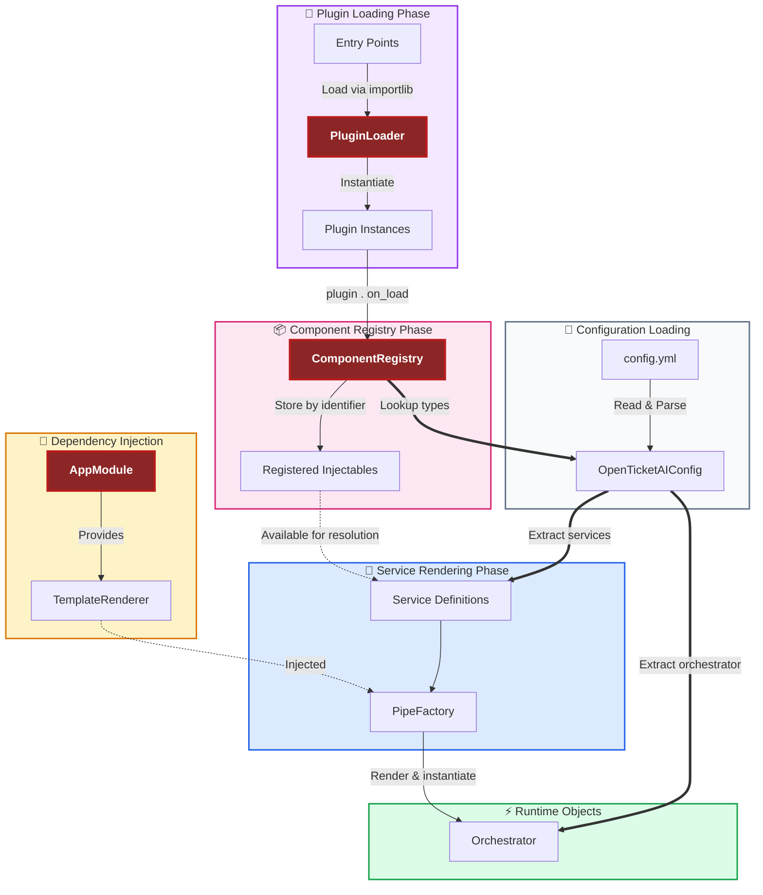

```mermaid
flowchart TB
%% ===================== PLUGIN LOADING =====================
    subgraph PLUGIN["🔌 Plugin Loading Phase"]
        direction TB
        EntryPoints["Entry Points"]
        PluginLoader["PluginLoader"]:::critical
        Plugins["Plugin Instances"]
        EntryPoints -->|Load via importlib| PluginLoader
        PluginLoader -->|Instantiate| Plugins
    end

%% ===================== COMPONENT REGISTRY =====================
    subgraph REGISTRY["📦 Component Registry Phase"]
        direction TB
        ComponentRegistry["ComponentRegistry"]:::critical
        Injectables["Registered Injectables"]
        Plugins -->|plugin . on_load| ComponentRegistry
        ComponentRegistry -->|Store by identifier| Injectables
    end

%% ===================== CONFIGURATION LOADING =====================
    subgraph LOAD["📁 Configuration Loading"]
        direction TB
        YAML["config.yml"]
        RawConfig["OpenTicketAIConfig"]
        YAML -->|Read & Parse| RawConfig
    end

%% ===================== DEPENDENCY INJECTION =====================
    subgraph DI["🔧 Dependency Injection"]
        direction TB
        AppModule["AppModule"]:::critical
        TemplateRenderer["TemplateRenderer"]
        AppModule -->|Provides| TemplateRenderer
    end

%% ===================== SERVICE RENDERING PHASE =====================
    subgraph RENDER["🎨 Service Rendering Phase"]
        direction TB
        Factory["PipeFactory"]
        ServiceDefs["Service Definitions"]
        TemplateRenderer -.->|Injected| Factory
        ServiceDefs --> Factory
    end

%% ===================== RUNTIME OBJECTS =====================
    subgraph RUNTIME["⚡ Runtime Objects"]
        direction TB
        Orchestrator["Orchestrator"]
        Factory -->|Render & instantiate| Orchestrator
    end

%% ===================== MAIN FLOW =====================
    ComponentRegistry ==>|Lookup types| RawConfig
    Injectables -.->|Available for resolution| ServiceDefs
    RawConfig ==>|Extract services| ServiceDefs
    RawConfig ==>|Extract orchestrator| Orchestrator
%% ===================== STYLES =====================
    classDef critical fill: #8c2626, stroke: #b91c1c, stroke-width: 3px, color: #fff, font-weight: bold
%% ===================== SUBGRAPH STYLES =====================
    style PLUGIN fill: #f3e8ff, stroke: #9333ea, stroke-width: 2px
    style REGISTRY fill: #fce7f3, stroke: #db2777, stroke-width: 2px
    style LOAD fill: #f8fafc, stroke: #64748b, stroke-width: 2px
    style DI fill: #fef3c7, stroke: #d97706, stroke-width: 2px
    style RENDER fill: #dbeafe, stroke: #2563eb, stroke-width: 2px
    style RUNTIME fill: #dcfce7, stroke: #16a34a, stroke-width: 2px

```
