# Pipeline Code Development

This guide explains how to implement custom pipes using the current parameter validation pattern.

## Pipe Types

### Simple Pipes

Atomic processing units that implement specific business logic:

```yaml
- id: fetch_tickets
  use: open_ticket_ai.base:FetchTicketsPipe
  injects:
    ticket_system: "otobo_znuny"
  params:
    search_criteria:
      queue:
        name: "Support"
      limit: 10
```

**Characteristics:**

- Runs specific logic
- No child pipes

### Composite Pipes

Orchestrators that contain and execute child pipes:


:::details Composite Pipe Example

```yaml
- id: ticket_workflow
  use: open_ticket_ai.base:CompositePipe
  params:
    threshold: 0.8
  steps:
    - id: fetch
      use: open_ticket_ai.base:FetchTicketsPipe
      injects: { ticket_system: "otobo_znuny" }
      params:
        search_criteria:
          queue: { name: "Incoming" }
          limit: 10

    - id: classify
      use: otai_hf_local:HFLocalTextClassificationPipe
      params:
        model: "bert-base-german-cased"
        text: "{{ get_pipe_result('fetch').data.fetched_tickets[0].subject }}"
      depends_on: [ fetch ]

    - id: update
      use: open_ticket_ai.base:UpdateTicketPipe
      injects: { ticket_system: "otobo_znuny" }
      params:
        ticket_id: "{{ get_pipe_result('fetch').data.fetched_tickets[0].id }}"
        updated_ticket:
          queue:
            name: "{{ get_pipe_result('classify').data.predicted_queue }}"
      depends_on: [ classify ]
```

:::

**Characteristics:**

- Contains `steps` list of child pipe configs
- Uses `PipeFactory` to build child pipes
- Executes children sequentially
- Merges results via `PipeResult.union()`
- Children can access parent params via `parent.params`

**Composite Execution:**

1. **Initialization**: Prepare to iterate through `steps` list
2. **For Each Step**:
    - **Merge**: Combine parent params with step params (step overrides)
    - **Build**: Use factory to create child pipe instance
    - **Execute**: Call `child.process(context)` → updates context
    - **Collect**: Child result stored in `context.pipes[child_id]`
    - **Loop**: Continue to next step
3. **Finalization**:
    - **Union**: Merge all child results using `PipeResult.union()`
    - **Save**: Store composite result in context
    - **Return**: Return final updated context

**Field Details:**

- **`pipes`**: Contains results from all previously executed pipes, keyed by pipe ID
    - Accumulated as each pipe completes
    - In CompositePipe: merged results from all child steps
    - Access via `pipe_result('pipe_id')` in templates

- **`params`**: Current pipe's parameters
    - Set when the pipe is created
    - Accessible via `params.*` in templates
    - For nested pipes, can reference parent via `parent.params`

- **`parent`**: Reference to parent context (if inside a CompositePipe)
    - Allows access to parent scope variables
    - Creates hierarchical context chain
    - Can traverse multiple levels (`parent.parent...`)

## Pipe Types (Simple Guide)

### Simple Pipes

Small, focused steps. Examples:

* **AddNotePipe** — `registryKey: base:AddNotePipe`
* **FetchTicketsPipe** — `registryKey: base:FetchTicketsPipe`
* **UpdateTicketPipe** — `registryKey: base:UpdateTicketPipe`

```yaml
- id: fetch_tickets
  use: "base:FetchTicketsPipe"
  injects: { ticket_system: "otobo_znuny" }
  params:
    ticket_search_criteria:
      queue: { name: "Support" }
      limit: 10
```

---

### Expression Pipe (special)

Renders an expression and returns that value. If it renders to a FailMarker, the pipe fails.
`registryKey: base:ExpressionPipe`

```yaml
- id: check_any_tickets
  use: "base:ExpressionPipe"
  params:
    expression: >
      {{ fail() if (get_pipe_result('fetch_tickets','fetched_tickets')|length)==0 else 'ok' }}
```

---

### Composite Pipes

Run several child pipes in order and return the **union** of their results.
`registryKey: base:CompositePipe`

```mermaid
flowchart LR
    A["Pipe #1"] --> B["Pipe #2"] --> C["Pipe #3"]
    classDef node fill: #111827, stroke: #374151, color: #e6e7ea
class A, B, C node
```

```yaml
- id: ticket_flow
  use: "base:CompositePipe"
  params:
    steps:
      - id: fetch
        use: "base:FetchTicketsPipe"
        injects: { ticket_system: "otobo_znuny" }
        params:
          ticket_search_criteria: { queue: { name: "Incoming" }, limit: 10 }

      - id: pick_first
        use: "base:ExpressionPipe"
        params:
          expression: "{{ get_pipe_result('fetch','fetched_tickets')[0] }}"

      - id: classify
        use: "base:ClassificationPipe"
        injects: { classification_service: "hf_local" }
        params:
          text: "{{ get_pipe_result('pick_first')['subject'] }} {{ get_pipe_result('pick_first')['body'] }}"
          model_name: "softoft/otai-queue-de-bert-v1"

      - id: update
        use: "base:UpdateTicketPipe"
        injects: { ticket_system: "otobo_znuny" }
        params:
          ticket_id: "{{ get_pipe_result('pick_first')['id'] }}"
          updated_ticket:
            queue:
              name: "{{ get_pipe_result('classify','label') if get_pipe_result('classify','confidence') >= 0.8 else 'OpenTicketAI::Unclassified' }}"
```

**How it behaves (non-technical):**

* Runs children one by one
* Stops on first failure
* Returns a merged result of everything that succeeded
  Here you go — tiny + simple.


---

### SimpleSequentialOrchestrator (special)

Runs its `steps` **in an endless loop**. It’s for background-style cycles. It does **not** expose
the child pipes’ results as a single pipe result. `registryKey: base:SimpleSequentialOrchestrator`

```yaml
- id: orchestrator
  use: "base:SimpleSequentialOrchestrator"
  params:
    orchestrator_sleep: "PT0.5S"
    exception_sleep: "PT5S"
    always_retry: true
    steps:
      - id: tick
        use: "base:IntervalTrigger"
        params: { interval: "PT5S" }
      - id: fetch
        use: "base:FetchTicketsPipe"
        injects: { ticket_system: "otobo_znuny" }
        params:
          ticket_search_criteria: { queue: { name: "Incoming" }, limit: 1 }
```

---

### SimpleSequentialRunner (special)

Has two params: `on` and `run` (both are pipe configs). If `on` **succeeds**, it executes `run`;
otherwise it skips. `registryKey: base:SimpleSequentialRunner`

```yaml
- id: run-when-triggered
  use: "base:SimpleSequentialRunner"
  params:
    on:
      id: gate
      use: "base:IntervalTrigger"
      params: { interval: "PT60S" }
    run:
      id: do-something
      use: "base:ExpressionPipe"
      params: { expression: "Triggered run" }
```

---

## Short Notes

* **registryKey** = what you put into `use`, e.g. `use: "base:FetchTicketsPipe"`.
* **Accessing parent params:** Use `parent` for the **direct** parent’s params only (no multi-level
  chains).

If you want, I’ll convert this into a VitePress page with the same structure.

## Pipe Execution Flow

```mermaid
%%{init:{
  "flowchart":{"defaultRenderer":"elk","htmlLabels":true,"curve":"linear"},
  "themeVariables":{"fontSize":"14px","fontFamily":"system-ui","lineColor":"#718096"},
}}%%
flowchart TB

%% ===================== PIPE ENTRY =====================
    subgraph ENTRY["📥 Pipe.process(context)"]
        direction TB
        Start([pipe.process]):::start
        CheckShould{"should_run?<br/>(if_ condition)"}:::dec
        CheckDeps{"Dependencies met?<br/>(depends_on)"}:::dec
        Skip["⏭️ Skip → return context"]:::skip
        Start --> CheckShould
        CheckShould -- ✓ --> CheckDeps
        CheckShould -- ✗ --> Skip
        CheckDeps -- ✗ --> Skip
    end

%% ===================== EXECUTION =====================
    subgraph EXEC["⚙️ Execution"]
        direction TB
        ProcessAndSave["__process_and_save()"]:::proc
        TryCatch["try-catch wrapper"]:::proc
        RunProcess["await _process()"]:::proc
        CreateResult["Create PipeResult"]:::proc
        ProcessAndSave --> TryCatch --> RunProcess --> CreateResult
    end

%% ===================== ERROR HANDLING =====================
    subgraph ERROR["❌ Error Handling"]
        direction TB
        CatchEx["Catch Exception"]:::error
        LogError["Logger.error + traceback"]:::log
        CreateFailed["Create failed PipeResult"]:::error
        CatchEx --> LogError --> CreateFailed
    end

%% ===================== PERSISTENCE =====================
    subgraph PERSIST["💾 Persistence"]
        direction TB
        SaveResult["context.pipes[pipe_id] = result"]:::ctx
        LogResult["Logger.info/warning"]:::log
        Return["Return updated context"]:::ctx
        SaveResult --> LogResult --> Return
    end

%% ===================== CONNECTIONS =====================
    CheckDeps -- ✓ --> ProcessAndSave
    TryCatch --> CatchEx
    CreateResult --> SaveResult
    CreateFailed --> SaveResult
%% ===================== STYLES =====================
    classDef start fill: #2d6a4f, stroke: #1b4332, stroke-width: 3px, color: #fff, font-weight: bold
    classDef dec fill: #d97706, stroke: #b45309, stroke-width: 2px, color: #fff, font-weight: bold
    classDef skip fill: #374151, stroke: #1f2937, stroke-width: 2px, color: #9ca3af
    classDef proc fill: #2b2d42, stroke: #14213d, stroke-width: 2px, color: #e0e0e0
    classDef error fill: #dc2626, stroke: #991b1b, stroke-width: 2px, color: #fff
    classDef log fill: #0891b2, stroke: #0e7490, stroke-width: 2px, color: #fff
    classDef ctx fill: #165b33, stroke: #0d3b24, stroke-width: 2px, color: #e0e0e0
```



---



```mermaid
flowchart TB

%% ===================== PIPE ENTRY =====================
    subgraph ENTRY["📥 Pipe.process()"]
        direction TB
        Start([pipe.process]):::start
        CheckShould{"should_run?"}:::dec
        CheckDeps{"Dependencies met?"}:::dec
        Skip["⏭️ Skip execution"]:::skip
        Start --> CheckShould
        CheckShould -- ✓ True --> CheckDeps
        CheckShould -- ✗ False --> Skip
        CheckDeps -- ✗ Missing --> Skip
    end

%% ===================== EXECUTION =====================
    subgraph EXEC["⚙️ Execution"]
        direction TB
        ProcessAndSave["__process_and_save()"]:::proc
        TryCatch["try-catch wrapper"]:::proc
        RunProcess["await _process()<br/>(subclass implementation)"]:::proc
        CreateResult["Create PipeResult<br/>with data"]:::proc
        ProcessAndSave --> TryCatch --> RunProcess --> CreateResult
    end

%% ===================== ERROR HANDLING =====================
    subgraph ERROR["❌ Error Handling"]
        direction TB
        CatchEx["Catch Exception"]:::error
        LogError["Logger.error<br/>+ traceback"]:::log
        CreateFailed["Create failed<br/>PipeResult"]:::error
        CatchEx --> LogError --> CreateFailed
    end

%% ===================== PERSISTENCE =====================
    subgraph PERSIST["💾 Context Update"]
        direction TB
        SaveResult["context.pipes[pipe_id]<br/>= result"]:::ctx
        LogResult["Log result<br/>(info/warning)"]:::log
        Return["Return updated<br/>context"]:::ctx
        SaveResult --> LogResult --> Return
    end

%% ===================== CONNECTIONS =====================
    CheckDeps -- ✓ Met --> ProcessAndSave
    TryCatch --> CatchEx
    CreateResult --> SaveResult
    CreateFailed --> SaveResult
%% ===================== STYLES =====================
    classDef start fill: #2d6a4f, stroke: #1b4332, stroke-width: 3px, color: #fff, font-weight: bold
    classDef dec fill: #d97706, stroke: #b45309, stroke-width: 2px, color: #fff, font-weight: bold
    classDef skip fill: #374151, stroke: #1f2937, stroke-width: 2px, color: #9ca3af
    classDef proc fill: #2b2d42, stroke: #14213d, stroke-width: 2px, color: #e0e0e0
    classDef error fill: #dc2626, stroke: #991b1b, stroke-width: 2px, color: #fff
    classDef log fill: #0891b2, stroke: #0e7490, stroke-width: 2px, color: #fff
    classDef ctx fill: #165b33, stroke: #0d3b24, stroke-width: 2px, color: #e0e0e0
```

## Implementing a Custom Pipe

### Step 1: Define Parameters Model

Create a Pydantic model for your pipe's parameters:

```python
from pydantic import BaseModel


class MyPipeParams(BaseModel):
    input_field: str
    threshold: float = 0.5
    max_items: int = 100
```

### Step 2: Define Result Data Model

Create a model for your pipe's output:

```python
class MyPipeResultData(BaseModel):
    processed_items: list[str]
    count: int
```

### Step 3: Implement the Pipe Class

```python
from typing import Any
from open_ticket_ai.core.pipes.pipe import Pipe
from open_ticket_ai.core.pipes.pipe_models import PipeConfig, PipeResult
from open_ticket_ai.core.logging.logging_iface import LoggerFactory


class MyPipe(Pipe[MyPipeParams]):
    params_class = MyPipeParams  # Required class attribute

    def __init__(
            self,
            pipe_config: PipeConfig[MyPipeParams],
            logger_factory: LoggerFactory,
            # Add injected services here
            *args: Any,
            **kwargs: Any,
    ) -> None:
        super().__init__(pipe_config, logger_factory)
        # self.params is now a validated MyPipeParams instance

    async def _process(self) -> PipeResult[MyPipeResultData]:
        # Access validated parameters
        input_val = self.params.input_field
        threshold = self.params.threshold

        # Your processing logic here
        items = self._do_processing(input_val, threshold)

        # Return result
        return PipeResult[MyPipeResultData](
            success=True,
            failed=False,
            data=MyPipeResultData(
                processed_items=items,
                count=len(items)
            )
        )

    def _do_processing(self, input_val: str, threshold: float) -> list[str]:
        # Implementation details
        return []
```

## Parameter Validation Pattern

### How It Works

The parameter validation happens automatically in the `Pipe` base class:

```python
# In Pipe.__init__ (src/open_ticket_ai/core/pipes/pipe.py:27-30)
if isinstance(pipe_params._config, dict):
    self._config: ParamsT = self.params_class.model_validate(pipe_params._config)
else:
    self._config: ParamsT = pipe_params._config
```

**Flow:**

1. YAML config loaded and templates rendered → produces `dict[str, Any]`
2. Dict passed to Pipe constructor as `pipe_config.params`
3. Base class checks if params is a dict
4. If dict: validates using `params_class.model_validate()`
5. If already typed: uses as-is
6. Result: `self.params` is always the validated Pydantic model

### YAML Configuration Example

Users write YAML with templates:

```yaml
- id: my_custom_pipe
  use: "mypackage:MyPipe"
  params:
    input_field: "{{ pipe_result('previous_step').data.output }}"
    threshold: "{{ env('THRESHOLD', '0.5') }}"
    max_items: 50
```

**What happens:**

1. Templates rendered: `input_field` gets value from previous pipe, `threshold` from env
2. Results in dict: `{"input_field": "some_value", "threshold": "0.5", "max_items": 50}`
3. Passed to `MyPipe.__init__`
4. Validated to `MyPipeParams`: types coerced (threshold: str → float)
5. Available as `self.params.threshold` (float 0.5)

## Dependency Injection

Add service dependencies in the `__init__` signature:

```python
from packages.base.src.otai_base.ticket_system_integration import TicketSystemService


class FetchTicketsPipe(Pipe[FetchTicketsParams]):
    params_class = FetchTicketsParams

    def __init__(
            self,
            ticket_system: TicketSystemService,  # Injected automatically
            pipe_config: PipeConfig[FetchTicketsParams],
            logger_factory: LoggerFactory,
            *args: Any,
            **kwargs: Any,
    ) -> None:
        super().__init__(pipe_config, logger_factory)
        self.ticket_system = ticket_system

    async def _process(self) -> PipeResult[FetchTicketsPipeResultData]:
        # Use injected service
        tickets = await self.ticket_system.find_tickets(...)
        return PipeResult[FetchTicketsPipeResultData](...)
```

**YAML config for service injection:**

```yaml
- id: fetch_tickets
  use: "mypackage:FetchTicketsPipe"
  injects:
    ticket_system: "otobo_system"  # References a service by ID
  params:
    limit: 100
```

## Error Handling

The base `Pipe` class handles errors automatically, but you can also handle specific cases:

```python
async def _process(self) -> PipeResult[MyPipeResultData]:
    try:
        result = await self._risky_operation()
        return PipeResult[MyPipeResultData](
            success=True,
            failed=False,
            data=MyPipeResultData(...)
        )
    except SpecificError as e:
        self._logger.warning(f"Handled specific error: {e}")
        return PipeResult[MyPipeResultData](
            success=False,
            failed=True,
            message=f"Operation failed: {e}",
            data=MyPipeResultData(processed_items=[], count=0)
        )
```

**Note:** Unhandled exceptions are caught by the base class and result in a failed PipeResult.

## Testing Custom Pipes

```python
import pytest
from open_ticket_ai.core.pipes.pipe_context_model import PipeContext
from open_ticket_ai.core.pipes.pipe_models import PipeConfig


@pytest.mark.asyncio
async def test_my_pipe_processes_correctly(logger_factory):
    # Create params as dict (simulates YAML rendering)
    params = {
        "input_field": "test_value",
        "threshold": 0.7,
        "max_items": 10
    }

    # Create pipe config
    config = PipeConfig[MyPipeParams](
        id="test_pipe",
        params=params
    )

    # Instantiate pipe
    pipe = MyPipe(pipe_config=config, logger_factory=logger_factory)

    # Execute
    context = PipeContext()
    result_context = await pipe.process(context)

    # Assert
    assert "test_pipe" in result_context.pipe_results
    assert result_context.pipe_results["test_pipe"].succeeded
    assert result_context.pipe_results["test_pipe"].data.count > 0
```

## Common Patterns

### Accessing Previous Pipe Results

```python
async def _process(self) -> PipeResult[MyPipeResultData]:
    # Access via pipe_config context (if needed)
    # Usually accessed via templates in YAML, but can also be done in code

    # Use self.params which were set from templates
    input_data = self._config.input_field  # Already resolved from template
    return PipeResult[MyPipeResultData](...)
```

### Conditional Execution

Use the `if` field in YAML config:

```yaml
- id: conditional_pipe
  use: "mypackage:MyPipe"
  if: "{{ pipe_result('classifier').data.category == 'urgent' }}"
  params:
  # ...
```

### Dependent Pipes

Use the `depends_on` field:

```yaml
- id: step2
  use: "mypackage:Step2Pipe"
  depends_on:
    - step1
  params:
    input: "{{ pipe_result('step1').data.output }}"
```

## Best Practices

**DO:**

- ✅ Always define `params_class` as a class attribute
- ✅ Let parent `__init__` handle parameter validation
- ✅ Use descriptive parameter names
- ✅ Provide sensible defaults in params model
- ✅ Return clear error messages in PipeResult
- ✅ Log important steps and decisions
- ✅ Keep `_process()` focused and testable

**DON'T:**

- ❌ Don't manually call `model_validate()` in your `__init__`
- ❌ Don't bypass the params_class mechanism
- ❌ Don't put heavy logic in `__init__`
- ❌ Don't catch and hide all exceptions
- ❌ Don't access unvalidated `pipe_config.params` directly
- ❌ Don't forget to call `super().__init__()`

## Related Documentation

- [Configuration and Template Rendering](../users/config_rendering.md) - Understanding the rendering
  flow
- [Configuration Reference](../details/_config_reference.md) - YAML configuration syntax
- [Testing Guide](./testing.md) - Testing strategies for pipes
- [Dependency Injection](./dependency_injection.md) - Service injection patterns