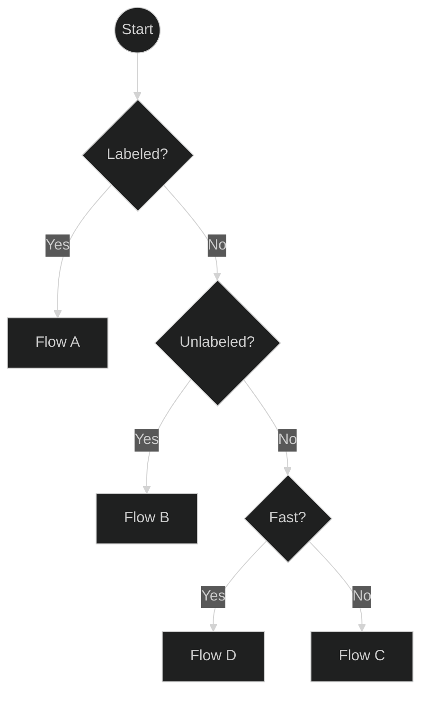
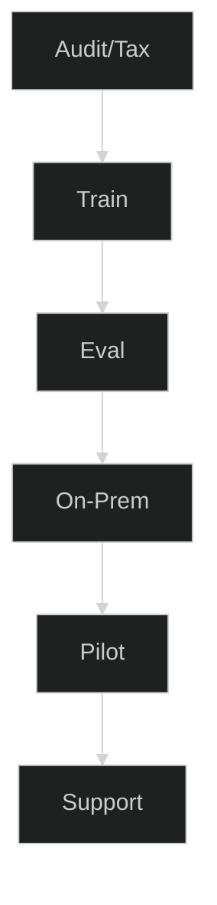
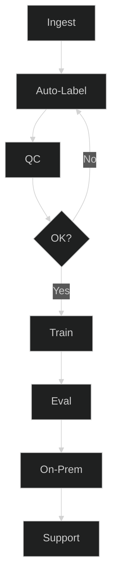
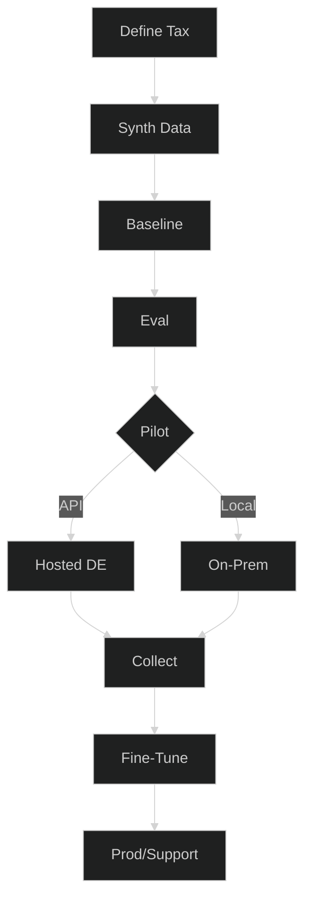
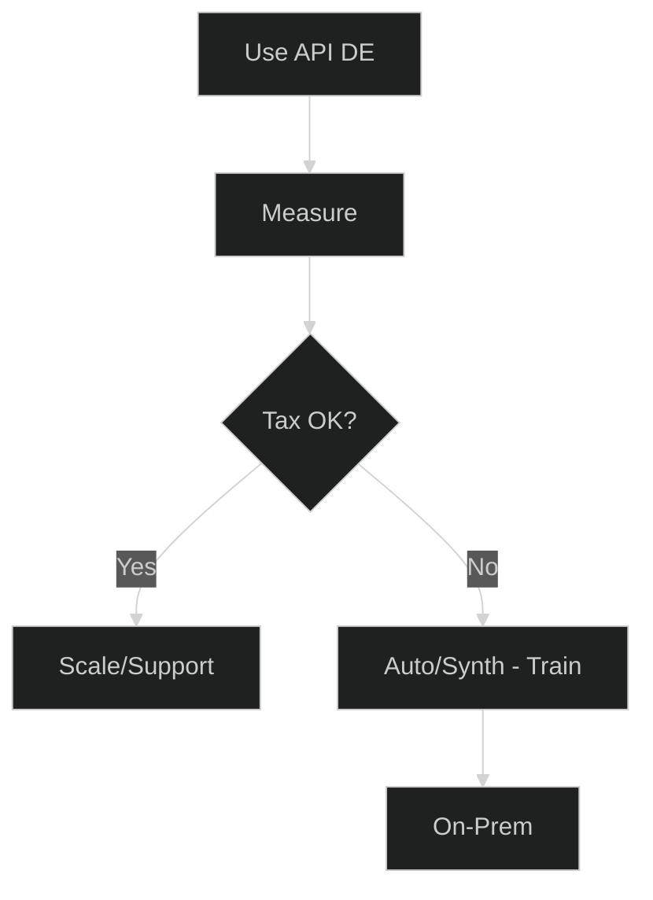
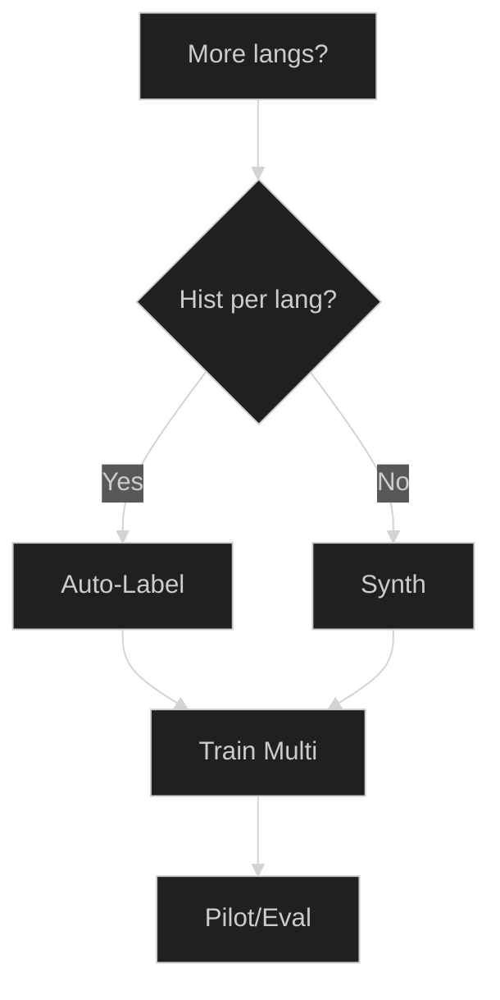
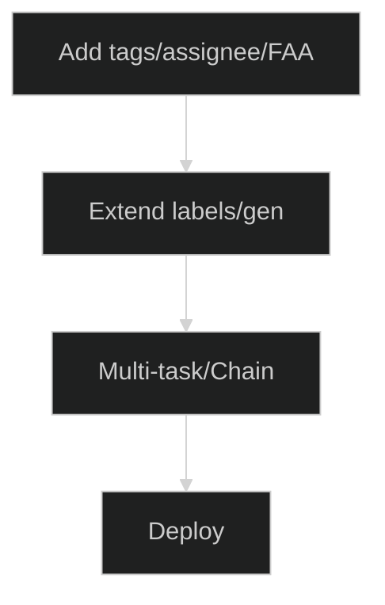

# Ticket Automation Planner — Pick Your Best Path

Modernize ticket routing fast—no matter where you start. This planner helps you choose the right
path based on your data reality: lots of labeled tickets, lots of unlabeled tickets, or almost no
data. Each path ends in a concrete service package with clear deliverables and KPIs, so you can move
from idea → pilot → production without guesswork.

**Who this is for:** IT/service teams on Znuny/OTRS/OTOBO (or similar) who want reliable
queue/priority/tag predictions, either on-prem or via a hosted API.

**What you’ll get:** short decision flow, 4 actionable paths (A–D), add-ons (multilingual, extra
attributes), gates/metrics to know when you’re ready, and a data-readiness checklist.

**How to use this page**

* Start with the one-screen overview and answer three questions: **Labeled? → Unlabeled? → Fast?**
* Click the box for **Flow A/B/C/D** to jump to its steps, deliverables, and KPIs.
* Use the **add-ons** if you need multiple languages or more outputs (tags, assignee, first answer).
* Keep the **gates** tight (per-class F1 + business KPIs) so pilots translate to production
  confidence.

Now continue with the overview diagram and the detailed flows below.
Nice—here’s a fuller write-up you can drop under your diagrams. I kept it skimmable but added real
guidance and thresholds so readers can confidently pick a flow.

Got it — I’ll keep your new short diagrams and add clear, concise explanatory text for each section
so the article feels complete while still being easy to scan.

---

## 0) One-screen overview

**How to use this overview:**
Start at the top, answer the questions, and follow the branch to your matching flow. Click a flow to
see its details.

---

##  Flow A — Many labeled tickets

**When to choose this:**

* You already have **thousands of tickets with queue, priority, or tag labels**.
* You want a **custom-trained** model for maximum accuracy.

**What happens in this flow:**

1. **Audit/Tax** — Check label quality, class balance, and naming.
2. **Train** — Fine-tune the classification model with your data.
3. **Eval** — Measure per-class precision/recall/F1.
4. **On-Prem** — Deploy inside your own infrastructure.
5. **Pilot** — Test in production with monitoring.
6. **Support** — Iterate and retrain as needed.

**Recommended package:** Fine-Tune + On-Prem Install.

---

##  Flow B — Many unlabeled tickets

**When to choose this:**

* You have **large historical ticket archives** but no labels.
* You can allocate some human review time for quality checks.

**What happens in this flow:**

1. **Ingest** — Collect tickets from your system.
2. **Auto-Label** — Use LLM-assisted auto-labeling.
3. **QC** — Spot-check & correct samples.
4. **OK?** — Loop until quality meets threshold.
5. **Train** — Fine-tune with the curated set.
6. **Eval / On-Prem / Support** — Same as Flow A.

**Recommended package:** Auto-Label + Fine-Tune.

---

##  Flow C — Few or no tickets

**When to choose this:**

* You're starting **from scratch** or have too few tickets to train on.
* You want a **cold-start** solution to go live quickly.

**What happens in this flow:**

1. **Define Tax** — Decide queues, priorities, tone.
2. **Synth Data** — Generate realistic tickets (DE/EN).
3. **Baseline** — Train initial model on synthetic data.
4. **Eval** — Check performance before rollout.
5. **Pilot** — Choose Hosted API for speed or On-Prem for control.
6. **Collect** — Gather real tickets during pilot.
7. **Fine-Tune** — Merge real + synthetic data.
8. **Prod/Support** — Go live with ongoing iteration.

**Recommended package:** Synthetic Cold-Start.

---

##  Flow D — Quick start via Hosted API

**When to choose this:**

* You need **results immediately**.
* You want to try automation without training first.

**What happens in this flow:**

1. **Use API DE** — Instant classification via hosted German model.
2. **Measure** — Track routing, SLA, backlog impact.
3. **Tax OK?** — If satisfied, scale usage; if not, go to Flow B or C for training.

**Recommended package:** Hosted API Pilot → Fine-Tune (optional).

---

## Optional add-ons

### Multilingual expansion

Add support for additional languages via multilingual auto-labeling or synthetic generation, then
train and evaluate per locale.

---

### Extra attributes

Predict more than queues/priorities — e.g., tags, assignee, or first answer time — by extending
labeling and training a multi-task model.
