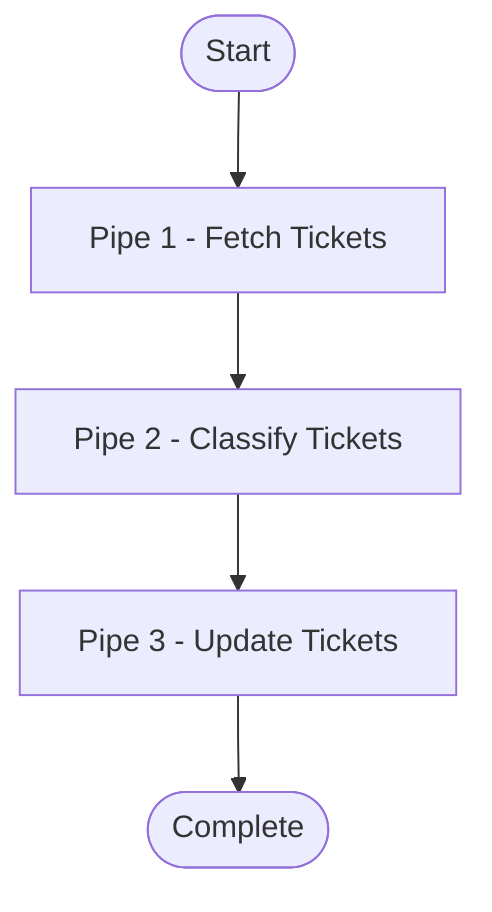
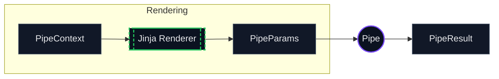
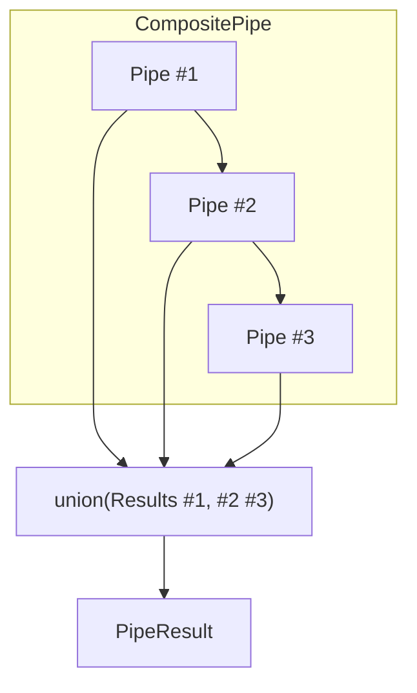
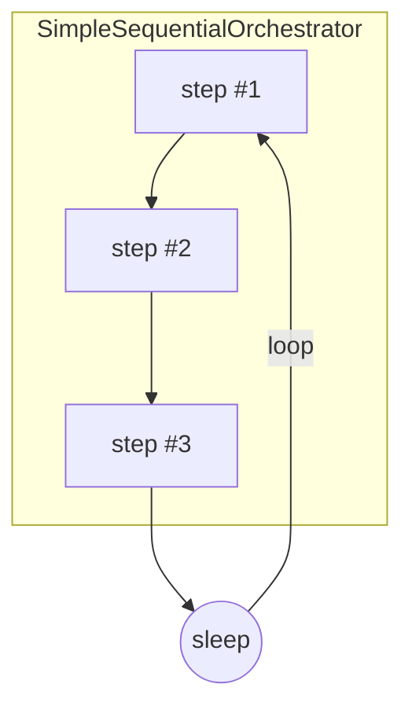
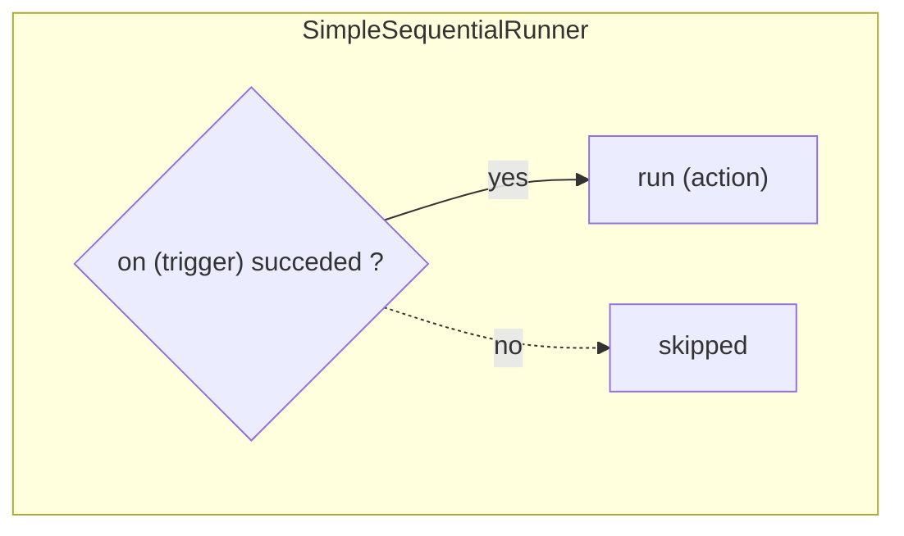

# Pipe System

Pipes are the fundamental processing units in Open Ticket AI. Each pipe performs a specific task,
receives context from
previous pipes, executes its logic, and passes updated context forward.

## Basic Pipeline Flow

A pipeline is a sequence of pipes that execute one after another:

<InlineExample slug="basics-minimal" />



Each pipe:

1. Receives the `PipeContext` (containing results from previous pipes)
2. Executes its specific task
3. Creates a `PipeResult` with output data

## What is a Pipe?

A **pipe** is a self-contained processing unit that:

- Implements specific business logic (fetch data, classify, update, etc.)
- Receives input via `PipeContext`
- Produces output as `PipeResult`



## Pipe Types

### Simple Pipes

Atomic processing units that implement specific business logic:

#### Yaml Example

```yaml
- id: fetch_tickets
  use: open_ticket_ai.base:FetchTicketsPipe
  injects:
    ticket_system: "otobo_znuny"
  params:
    search_criteria:
      queue:
        name: "Support"
      limit: 10
```

#### Characteristics:

- Runs specific logic
- No child pipes

#### Specific Simple Pipes:

- AddNotePipe — registryKey: base:AddNotePipe
- FetchTicketsPipe — registryKey: base:FetchTicketsPipe
- UpdateTicketPipe — registryKey: base:UpdateTicketPipe

### Expression Pipe (special)

Renders an expression and returns that value. If it renders to a FailMarker, the pipe fails.
`registryKey: base:ExpressionPipe`

#### Yaml Example

```yaml
- id: check_any_tickets
  use: "base:ExpressionPipe"
  params:
    expression: >
      {{ fail() if (get_pipe_result('fetch_tickets','fetched_tickets')|length)==0 else 'ok' }}
```

---

### Composite Pipes

Orchestrators that contain and execute child pipes:

#### Flowchart



#### Yaml Example

:::details Composite Pipe Example

```yaml
- id: ticket_workflow
  use: open_ticket_ai.base:CompositePipe
  params:
    threshold: 0.8
  steps:
    - id: fetch
      use: open_ticket_ai.base:FetchTicketsPipe
      injects: { ticket_system: "otobo_znuny" }
      params:
        search_criteria:
          queue: { name: "Incoming" }
          limit: 10

    - id: classify
      use: otai_hf_local:HFLocalTextClassificationPipe
      params:
        model: "bert-base-german-cased"
        text: "{{ get_pipe_result('fetch').data.fetched_tickets[0].subject }}"

    - id: update
      use: open_ticket_ai.base:UpdateTicketPipe
      injects: { ticket_system: "otobo_znuny" }
      params:
        ticket_id: "{{ get_pipe_result('fetch').data.fetched_tickets[0].id }}"
        updated_ticket:
          queue:
            name: "{{ get_pipe_result('classify', 'predicted_queue') }}"
```

:::

#### Characteristics

- Contains `steps` list of child pipe configs
- Executes children sequentially
- Merges results
- Children can access parent params via `parent.params`

**Composite Execution:**

1. **For Each Step**:
    - **Render**: Renders Params with Jinja2 using current context
    - **Execute**: Execute next child pipe with rendered params
    - **Loop**: Continue to next step
2. **Finalization**:
    - **Union**: Merge all child results using
    - **Return**: Return final updated context

### SimpleSequentialOrchestrator (special)

Runs its `steps` **in an endless loop**. It’s for background-style cycles. It does **not** expose
the child pipes’ results as a single pipe result. `registryKey: base:SimpleSequentialOrchestrator`

#### Flowchart



#### Yaml Example

:::details SimpleSequentialOrchestrator Example

```yaml
- id: orchestrator
  use: "base:SimpleSequentialOrchestrator"
  params:
    orchestrator_sleep: "PT0.5S"
    exception_sleep: "PT5S"
    always_retry: true
    steps:
      - id: tick
        use: "base:IntervalTrigger"
        params: { interval: "PT5S" }
      - id: fetch
        use: "base:FetchTicketsPipe"
        injects: { ticket_system: "otobo_znuny" }
        params:
          ticket_search_criteria: { queue: { name: "Incoming" }, limit: 1 }
```

:::

---

### SimpleSequentialRunner (special)

Has two params: `on` and `run` (both are pipe configs). If `on` **succeeds**, it executes `run`;
otherwise it skips. `registryKey: base:SimpleSequentialRunner`

#### Flowchart



#### Yaml Example

```yaml
- id: run-when-triggered
  use: "base:SimpleSequentialRunner"
  params:
    on:
      id: gate
      use: "base:IntervalTrigger"
      params: { interval: "PT60S" }
    run:
      id: do-something
      use: "base:ExpressionPipe"
      params: { expression: "Triggered run" }
```

## Context Passing Between Pipes

**Field Details:**

- **`pipes`**: Contains results from all previously executed pipes, keyed by pipe ID
    - **Access via `pipe_result('pipe_id')` in templates**
    - Accumulated as each pipe completes
    - In CompositePipe: merged results from all child steps

- **`params`**: Current pipe's parameters
    - Set when the pipe is created
    - Accessible via `params.*` in templates
    - For nested pipes, can reference parent via `parent`

- **`parent`**: Reference to parent params

## PipeResult Structure

Each pipe produces a `PipeResult` containing execution outcome and data:

| Attribute     | Data Type        | Description                                                                      |
|---------------|------------------|----------------------------------------------------------------------------------|
| **succeeded** | true/false       | Whether the pipe completed successfully without errors                           |
| **data**      | name:value pairs | Output data produced by the pipe for use by following pipes or external systems  |
| *was_skipped* | true/false       | Whether the pipe was skipped due to failed dependencies or conditional execution |
| *message*     | TEXT             | Human-readable message describing the result or any issues                       |

you access those results in the params of another pipe with those functions. Currenly there is no
way to read was_skipped or message;

| Function          | Parameters                                         | Returns                                                      | Errors if…          |
|-------------------|----------------------------------------------------|--------------------------------------------------------------|---------------------|
| `has_failed`      | `pipe_id: text`                                    | `True` if the given pipe result is  marked failed            | Unknown pipe ID     |
| `get_pipe_result` | `pipe_id: text`, `data_key: text; default = value` | Value stored in previous pipe  result under given `data_key` | Pipe or key missing |

So for example if piperesult is

````yaml
- id: ticket_fetcher
  result:
    succeeded: true
    data:
      fetched_tickets:
        - id: 123
          subject: "Help me!"
        - id: 124
          subject: "Another ticket"
````

To access the fetched tickets you would use:

```yaml
{ { get_pipe_result('ticket_fetcher', 'fetched_tickets') } }
```

Returning:

```yaml
- id: 123
  subject: "Help me!"
- id: 124
  subject: "Another ticket"
```

To access the subject of the first ticket you would use:

```yaml
{ { (get_pipe_result('ticket_fetcher', 'fetched_tickets') | first)[ 'subject' ] }
```

Returning:

```
Help me!
```

To check if the ticket_fetcher pipe failed you would use:

```yaml
{ { has_failed('ticket_fetcher') } }
```

Returning:

```
false
```

Checking the success can be used in combination with fail() to create guards:

```yaml
- id: fail_no_tickets
  use: "base:ExpressionPipe"
  params:
    expression: >
      {{ fail() if has_failed('ticket_fetcher' else 'ok' }}
```

The Pipeline/FLow would stop executing at this point if the ticket_fetcher pipe failed.

## Pipe Registry Overview

| Name                         | registryKey                         | Params (names, comma-separated)                          |
|------------------------------|-------------------------------------|----------------------------------------------------------|
| AddNotePipe                  | `base:AddNotePipe`                  | ticket_id, note                                          |
| FetchTicketsPipe             | `base:FetchTicketsPipe`             | ticket_search_criteria                                   |
| UpdateTicketPipe             | `base:UpdateTicketPipe`             | ticket_id, updated_ticket                                |
| ClassificationPipe           | `base:ClassificationPipe`           | text, model_name, api_token                              |
| ExpressionPipe               | `base:ExpressionPipe`               | expression                                               |
| IntervalTrigger              | `base:IntervalTrigger`              | interval                                                 |
| SimpleSequentialRunner       | `base:SimpleSequentialRunner`       | on, run                                                  |
| SimpleSequentialOrchestrator | `base:SimpleSequentialOrchestrator` | orchestrator_sleep, exception_sleep, always_retry, steps |
| CompositePipe                | `base:CompositePipe`                | steps                                                    |

> Use these values in your YAML as: `use: "<registryKey>"`.

---

## Pipe Details

### AddNotePipe

The Pipe `AddNotePipe` adds a structured note (subject/body) to a given ticket in the ticket system.
It logs a short preview of the note and writes it via the ticket system service.

**registryKey:** `base:AddNotePipe`
So to “use” it set `use` to this registryKey.

```yaml
- id: "my-add_note_pipe"
  use: "base:AddNotePipe"
  params:
    ticket_id: "<ticket id>"
    note:
      subject: "<subject>"
      body: "<body>"
```

---

### FetchTicketsPipe

The Pipe `FetchTicketsPipe` queries tickets from the ticket system using a unified
`TicketSearchCriteria` (queue, limit, offset, etc.) and returns them as `fetched_tickets`.

**registryKey:** `base:FetchTicketsPipe`

```yaml
- id: "my-fetch_tickets"
  use: "base:FetchTicketsPipe"
  params:
    ticket_search_criteria:
      queue:
        name: "<QueueName>"
      limit: 10
```

---

### UpdateTicketPipe

The Pipe `UpdateTicketPipe` updates an existing ticket by ID using a unified `UnifiedTicket`
payload (e.g., queue, priority, fields). Returns success state from the ticket system.

**registryKey:** `base:UpdateTicketPipe`

```yaml
- id: "my-update_ticket"
  use: "base:UpdateTicketPipe"
  params:
    ticket_id: "<ticket id>"
    updated_ticket:
      queue:
        name: "<QueueName>"
```

---

### ClassificationPipe

The Pipe `ClassificationPipe` classifies input text using a configured `ClassificationService` and
model, returning label, confidence, and scores (if available).

**registryKey:** `base:ClassificationPipe`

```yaml
- id: "my-classify"
  use: "base:ClassificationPipe"
  injects: { classification_service: "hf_local" }
  params:
    text: "{{ some_text }}"
    model_name: "softoft/otai-queue-de-bert-v1"
    api_token: "{{ env.HF_TOKEN | default(None) }}"
```

---

### ExpressionPipe

The Pipe `ExpressionPipe` returns the value of `expression`; if it evaluates to a `FailMarker`, the
pipe fails (useful for control-flow/guards).

**registryKey:** `base:ExpressionPipe`

```yaml
- id: "my-expression"
  use: "base:ExpressionPipe"
  params:
    expression: "{{ fail() if condition else 'ok' }}"
```

---

### IntervalTrigger

The Pipe `IntervalTrigger` gates downstream execution based on a time interval; it succeeds once the
interval has passed since the last trigger, otherwise fails.

**registryKey:** `base:IntervalTrigger`

```yaml
- id: "my-interval"
  use: "base:IntervalTrigger"
  params:
    interval: "PT60S"
```

---

### SimpleSequentialRunner

The Pipe `SimpleSequentialRunner` runs `on` and, only if it succeeds, runs `run`. It’s a minimal
two-step control runner.

**registryKey:** `base:SimpleSequentialRunner`

```yaml
- id: "my-simple_runner"
  use: "base:SimpleSequentialRunner"
  params:
    on:
      id: "interval"
      use: "base:IntervalTrigger"
      params: { interval: "PT5M" }
    run:
      id: "do-something"
      use: "base:ExpressionPipe"
      params: { expression: "go!" }
```

---

### SimpleSequentialOrchestrator

The Pipe `SimpleSequentialOrchestrator` loops forever, executing `steps` in order each cycle; it
optionally sleeps between cycles and on exceptions, and can auto-retry.

**registryKey:** `base:SimpleSequentialOrchestrator`
For `SimpleSequentialOrchestrator` you don’t need to set params, since all attributes are optional.

```yaml
- id: "my-orchestrator"
  use: "base:SimpleSequentialOrchestrator"
  params:
    orchestrator_sleep: "PT0.5S"
    exception_sleep: "PT5S"
    always_retry: true
    steps:
      - id: "step-1"
        use: "base:ExpressionPipe"
        params: { expression: "ok" }
```

---

### CompositePipe

The Pipe `CompositePipe` executes its `steps` sequentially, stops on the first failure, and returns
a union of prior results. It’s the base building block for multi-step flows.

**registryKey:** `base:CompositePipe`
For `CompositePipe` you don’t need to set params, since all attributes are optional.

```yaml
- id: "my-composite"
  use: "base:CompositePipe"
  params:
    steps:
      - id: "one"
        use: "base:ExpressionPipe"
        params: { expression: "first" }
      - id: "two"
        use: "base:ExpressionPipe"
        params: { expression: "second" }
```
