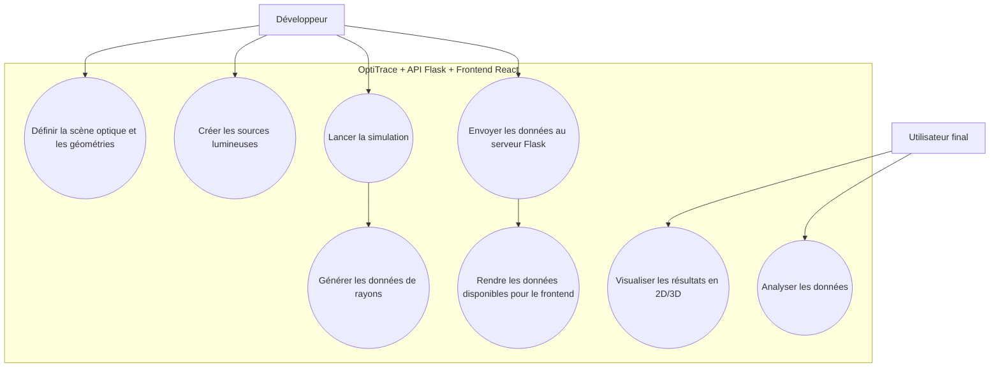

# Optical Ray Collector ORaC

**Optical Ray Collector** est un package Python dédié au **calcul optique avancé**, à la **simulation de la propagation des rayons lumineux** dans des scènes complexes et de leur analyse (optique, thermique, thermodinamique ou météorlogique).
Il fournit un moteur de traçage performant permettant de définir des géométries variées, de générer des sources lumineuses, de projeter les rayons et d’exporter les résultats sous une forme exploitable pour des visualisations 2D, 3D ou tout autre type de représentation interactive.

---

## Présentation

OptiTrace est conçu pour les ingénieurs, chercheurs opticiens et développeurs travaillant sur la modélisation optique, la visualisation scientifique et l'analyse.
Le package permet de :

* **Construire des scènes optiques** avec différentes géométries (cylindriques, paraboliques, réseaux annulaires, géométries définies par équation, etc.).
* **Définir des sources lumineuses** (ponctuelles ou larges) et simuler l’émission de rayons.
* **Tracer la propagation des rayons** dans l’espace, en prenant en compte leur origine, direction et interactions avec les objets définis.
* **Analyse des données ou analyse via une API météo** Une fois les tracé fait on peut lancer des analyses qu'elles soient thermiques, thermodynamiques, météorlogique ou encore optiques.

---

## Utilisation générale

1. Définir la scène optique et les géométries souhaitées.
2. Créer les sources lumineuses nécessaires.
3. Lancer la simulation pour générer les rayons et récupérer les données.
4. Envoyer ces données à un serveur Flask pour les rendre disponibles à un frontend React.
5. Visualiser les résultats en 2D ou 3D selon les besoins.
6. Analyser les données.

### Représentation simplifiée du diagramme de cas d'utilisations.

---

## Contribution
Votre contribution au projet nous fera énormement plaisir afin de perfectionner cet outil open-source.
