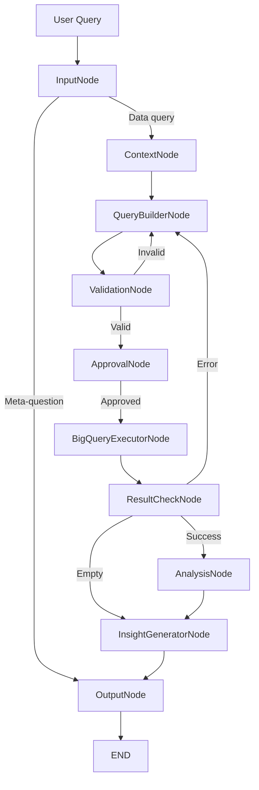

# Orion Architecture

## Overview

Orion is an intelligent data analysis agent built on **LangGraph**, a framework for building stateful, multi-actor applications with LLMs. The system uses a directed acyclic graph (DAG) of specialized nodes that process user queries through distinct analytical stages.

### Core Philosophy

1. **Modularity**: Each node has a single, well-defined responsibility
2. **State Management**: Centralized state (`AgentState`) flows through all nodes
3. **Self-Healing**: Automatic error recovery with context propagation
4. **Extensibility**: Easy to add new nodes and capabilities
5. **Production-Ready**: Caching, rate limiting, logging, and monitoring

---

## System Architecture

### Visual Diagrams

**High-Level Architecture:**


**Detailed Graph Flow:**


### Text-Based Flow

```
User Query → Input Classification → Schema Loading → SQL Generation →
Validation → Approval → Execution → Result Check → Analysis → Insights → Output
```

### Node Graph (Mermaid)



---

## Components

### 1. State Management (`src/agent/state.py`)

**AgentState** is a TypedDict that maintains all state across node transitions:

```python
class AgentState(TypedDict):
    # Input
    user_query: str                    # Original user question
    query_intent: str                  # Classified intent (ranking, trends, etc.)
    
    # Schema & Context
    schema_context: Optional[str]      # Table and column metadata
    schema_cache_timestamp: Optional[float]
    conversation_history: Optional[list]  # Last 5 interactions
    
    # SQL Generation
    sql_query: str                     # Generated BigQuery SQL
    validation_passed: Optional[bool]  # Security & syntax validation
    estimated_cost_gb: Optional[float] # Estimated query cost
    
    # Execution
    query_result: Optional[DataFrame]  # Results from BigQuery
    query_error: Optional[str]         # Error messages
    execution_time_sec: Optional[float]
    
    # Analysis
    analysis_result: Optional[str]     # Statistical analysis
    analysis_type: Optional[str]       # Type: trends, ranking, segmentation
    has_empty_results: Optional[bool]
    key_findings: Optional[list]       # Structured insights
    visualization_path: Optional[str]  # Path to saved chart
    
    # Output
    final_output: str                  # Formatted response to user
    
    # Flow Control
    retry_count: int                   # For error recovery (max 3)
    error_history: Optional[list]      # Error context for retries
    requires_approval: Optional[bool]  # Human-in-the-loop flag
    approval_reason: Optional[str]
    
    # Internal
    _verbose: Optional[bool]           # Progress indicators
```

---

### 2. Node Implementations (`src/agent/nodes.py`)

#### **InputNode**
**Purpose**: Initial query classification and fast-path routing

**Responsibilities**:
- Classify query intent (aggregation, ranking, trends, meta-question)
- Detect common meta-questions for instant responses
- Normalize user input

**Fast-Path Optimization**:
```python
META_RESPONSES = {
    "help": "I can analyze e-commerce data...",
    "what can you do": "I can query the thelook_ecommerce dataset...",
    "hello": "Hello! I'm Orion...",
}
```

**Intent Classification**:
- `ranking`: "top 10", "highest", "best"
- `trends`: "trend", "over time", "growth"
- `segmentation`: "by category", "group by"
- `aggregation`: "total", "sum", "average"
- `meta_question`: Questions about Orion itself

---

#### **ContextNode**
**Purpose**: Load schema metadata and conversation context

**Responsibilities**:
- Fetch BigQuery table schemas (columns, types, descriptions)
- Cache schemas (1-hour TTL) to reduce API calls
- Manage conversation history (last 5 interactions)
- Format schema for LLM context injection

**Schema Caching Strategy**:
```python
CACHE_DURATION_SEC = 3600  # 1 hour
SCHEMA_FILE = "schemas.json"  # Persistent disk cache
```

**Schema Format**:
```
Table: orders
  - order_id (INTEGER): Unique order identifier
  - user_id (INTEGER): Customer ID
  - created_at (TIMESTAMP): Order timestamp
  ...
```

---

#### **QueryBuilderNode**
**Purpose**: Generate BigQuery SQL from natural language using Gemini AI

**Responsibilities**:
- Construct detailed prompt with schema context
- Call Gemini API with rate limiting
- Parse LLM response (SQL vs META)
- Handle retries with error feedback
- Strip SQL: and META: prefixes

**Rate Limiting**:
```python
RateLimiter(max_calls=60, window_seconds=60)  # 60 requests/min
```

**Prompt Engineering**:
- Full schema context with column descriptions
- Conversation history for follow-up questions
- Examples of correct SQL format
- Security rules (use backticks for public datasets)
- Error feedback on retries

**Response Handling**:
- `SQL: <query>` → Extract and validate SQL
- `META: <answer>` → Direct answer, skip BigQuery
- No prefix → Retry (max 3 times)

---

#### **ValidationNode**
**Purpose**: Security, syntax, and cost validation before execution

**Responsibilities**:
- **Security**: Block DROP, DELETE, TRUNCATE, ALTER, CREATE, INSERT, UPDATE
- **Syntax**: Dry-run on BigQuery to catch errors
- **Cost**: Estimate bytes scanned, warn if > 5GB
- **Format**: Validate BigQuery SQL compliance

**Security Rules**:
```python
BLOCKED_KEYWORDS = ["DROP", "DELETE", "TRUNCATE", "ALTER", "CREATE", "INSERT", "UPDATE"]
```

**Cost Estimation**:
```python
query_job = client.query(sql_query, job_config=JobConfig(dry_run=True))
estimated_cost_gb = query_job.total_bytes_processed / (1024**3)
```

---

#### **ApprovalNode**
**Purpose**: Human-in-the-loop for expensive or sensitive operations

**Responsibilities**:
- Check if query exceeds cost threshold (5GB)
- Set approval flag and reason
- CLI prompts user for confirmation

**Threshold**:
```python
APPROVAL_THRESHOLD_GB = 5.0
```

---

#### **BigQueryExecutorNode**
**Purpose**: Execute validated SQL on BigQuery

**Responsibilities**:
- Execute query with timeout and row limits
- Convert results to pandas DataFrame
- Track execution time and bytes processed
- Log all queries to `query_log.jsonl`

**Query Logging** (JSONL format):
```json
{
  "timestamp": "2025-01-01T12:00:00",
  "sql": "SELECT ...",
  "execution_time_sec": 1.23,
  "bytes_processed": 1048576,
  "success": true
}
```

**Error Handling**:
- Authentication errors → Guide to service account setup
- Project not found → Link to GCP console
- API disabled → Link to enable BigQuery API

---

#### **ResultCheckNode**
**Purpose**: Route workflow based on query execution results

**Responsibilities**:
- Check for errors → Route to `query_builder` for retry
- Check for empty results → Route to `insight_generator` for explanation
- Check for success → Route to `analysis` for processing
- Track error history for context propagation

**Routing Logic**:
```python
if query_error and retry_count < 3:
    return "query_builder"  # Retry with error context
elif has_empty_results:
    return "insight_generator"  # Explain why no results
else:
    return "analysis"  # Process successful results
```

---

#### **AnalysisNode**
**Purpose**: Perform statistical analysis on query results

**Responsibilities**:
- Detect analysis type from query intent/keywords
- Execute appropriate analysis function
- Generate structured findings

**Analysis Types**:

1. **Ranking Analysis**:
   - Sort by value
   - Calculate contribution percentages
   - Identify top performers

2. **Trends Analysis**:
   - Time-series grouping
   - Growth rate calculation
   - Moving averages

3. **Segmentation Analysis**:
   - Group-by aggregation
   - Distribution analysis
   - Category comparisons

4. **Aggregation Analysis**:
   - Sum, average, count
   - Min/max identification
   - Statistical summaries

5. **RFM Analysis** (Customer Segmentation):
   - Recency: Days since last purchase
   - Frequency: Number of purchases
   - Monetary: Total spend
   - Segment classification (Champions, Loyal, At Risk, etc.)

6. **Anomaly Detection**:
   - Outlier identification using IQR
   - Statistical thresholds (> 2 std dev)

7. **Comparative Analysis**:
   - Period-over-period comparison
   - Percentage change calculation

**Output Structure**:
```python
{
    "analysis_type": "ranking",
    "key_findings": [
        "Top item: Product X ($1.2M, 23% of total)",
        "Top 3 items account for 45% of revenue",
        "Significant drop after position 5"
    ]
}
```

---

#### **InsightGeneratorNode**
**Purpose**: Generate natural language insights using Gemini AI

**Responsibilities**:
- Convert structured findings to business insights
- Explain empty results with context
- Provide actionable recommendations
- Handle rate limiting

**For Empty Results**:
```
No data found for your query because:
- Filters may be too restrictive
- Time range might not contain data
- Table might not have matching records
```

**For Data-Rich Results**:
```
Key Findings:
• Top product generated $1.2M (23% of total revenue)
• Sales show 15% month-over-month growth
• Electronics category outperforms others by 2x

Recommendations:
• Increase inventory for top performers
• Focus marketing on high-growth categories
```

---

#### **OutputNode**
**Purpose**: Format final output for user display

**Responsibilities**:
- Clear progress indicators
- Format key findings with bullet points
- Display metadata (execution time, cost, retry count)
- Show visualization paths
- Apply ANSI color formatting
- **Display Management**: Shows first 50 rows if result set is larger (prevents overwhelming output)

**Output Sections**:
1. Query Results (DataFrame preview - limited to 50 rows if more exist)
2. Key Findings (bullet list)
3. Insights (natural language)
4. Metadata (time, cost, retries)
5. Visualization (path if created)

---

### 3. Graph Orchestration (`src/agent/graph.py`)

**OrionGraph** class manages node connections and routing:

```python
class OrionGraph:
    def __init__(self):
        self.query_builder = QueryBuilderNode()
        self.insight_generator = InsightGeneratorNode()
        self.app = self._build_graph().compile()
    
    def _build_graph(self) -> StateGraph:
        workflow = StateGraph(AgentState)
        
        # Add nodes
        workflow.add_node("input", InputNode.execute)
        workflow.add_node("context", ContextNode.execute)
        workflow.add_node("query_builder", self.query_builder.execute)
        workflow.add_node("validation", ValidationNode.execute)
        workflow.add_node("approval", ApprovalNode.execute)
        workflow.add_node("bigquery_executor", BigQueryExecutorNode.execute)
        workflow.add_node("result_check", ResultCheckNode.execute)
        workflow.add_node("analysis", AnalysisNode.execute)
        workflow.add_node("insight_generator", self.insight_generator.execute)
        workflow.add_node("output", OutputNode.execute)
        
        # Define edges
        workflow.set_entry_point("input")
        workflow.add_edge("input", "context")
        workflow.add_conditional_edges("context", ...)
        # ... (see source code for full routing)
        
        return workflow
```

**Conditional Routing Functions**:
- `_route_from_context`: Fast-path for meta-questions
- `_route_from_validation`: Invalid → retry, Valid → approval
- `_route_from_result_check`: Error → retry, Empty → explain, Success → analyze

---

### 4. Utilities (`src/utils/`)

#### **QueryCache** (`cache.py`)
- In-memory + disk persistence
- MD5-based cache keys
- TTL expiration (1 hour default)
- Thread-safe operations

#### **RateLimiter** (`rate_limiter.py`)
- Token bucket algorithm
- Configurable rate (60 calls/min default)
- Automatic backoff
- Thread-safe

#### **OutputFormatter** (`formatter.py`)
- ANSI escape codes for colors
- Markdown-style formatting (**bold**, *italic*)
- Syntax highlighting for keywords
- Emoji colorization

#### **Visualizer** (`visualizer.py`)
- Chart types: bar, line, pie, scatter, box, candle
- Auto-save to configured directory
- Professional styling (seaborn)
- CSV export functionality

#### **SchemaFetcher** (`schema_fetcher.py`)
- Dynamic schema retrieval from BigQuery
- Column metadata extraction
- Caching layer
- Error handling

---

### 5. Configuration (`src/config.py`)

**Environment Variables**:
```python
class Config:
    google_cloud_project: str              # GCP project ID
    google_application_credentials: str    # Path to service account JSON
    gemini_api_key: str                    # Gemini API key
    gemini_model: str = "gemini-2.0-flash-exp"
    bigquery_dataset: str = "bigquery-public-data.thelook_ecommerce"
    max_query_rows: int = 10000
    query_timeout: int = 300
    output_directory: str = "~/orion_results"
```

**Validation**:
- Checks required variables at startup
- Provides helpful error messages with setup links
- Falls back to defaults for optional settings

---

### 6. CLI Interface (`src/cli.py`)

**Features**:
- Interactive REPL with command history
- Session management (save/load conversations)
- Cache management
- Export options (CSV, charts)
- Progress indicators
- Colored output
- Startup validation
- Approval prompts

**Commands**:
- `exit`/`quit`/`q`: Exit Orion
- `save session`: Save conversation to file
- `load session [path]`: Load previous session
- `clear cache`: Clear query cache

---

## Data Flow Example

### Query: "Show top 10 products by revenue"

1. **InputNode**:
   - Intent: `ranking`
   - Fast-path: No (not a meta-question)

2. **ContextNode**:
   - Load schema for `products`, `order_items` tables
   - No conversation history (first query)

3. **QueryBuilderNode**:
   - Prompt: Schema + query + instructions
   - Gemini generates:
     ```sql
     SELECT p.product_name, SUM(oi.sale_price) as revenue
     FROM `bigquery-public-data.thelook_ecommerce.products` p
     JOIN `bigquery-public-data.thelook_ecommerce.order_items` oi
       ON p.id = oi.product_id
     GROUP BY p.product_name
     ORDER BY revenue DESC
     LIMIT 10
     ```

4. **ValidationNode**:
   - Security: Pass (no dangerous keywords)
   - Syntax: Pass (dry-run successful)
   - Cost: 0.2 GB (below threshold)

5. **ApprovalNode**:
   - Skip (cost < 5GB)

6. **BigQueryExecutorNode**:
   - Execute query
   - Return DataFrame with 10 rows
   - Log to `query_log.jsonl`

7. **ResultCheckNode**:
   - No error, not empty → Route to `analysis`

8. **AnalysisNode**:
   - Type: `ranking`
   - Calculate revenue percentages
   - Identify top performers

9. **InsightGeneratorNode**:
   - Gemini generates:
     ```
     Top product generates $1.2M (23% of total)
     Top 3 products account for 45% of revenue
     ```

10. **OutputNode**:
    - Format table
    - Display insights
    - Show execution time (1.2s)

---

## Error Recovery Flow

### Query: Invalid SQL syntax

1. **BigQueryExecutorNode** fails with syntax error
2. **ResultCheckNode** detects error, retry_count < 3
3. Routes back to **QueryBuilderNode** with error context:
   ```
   Previous query failed with:
   "Syntax error: Unexpected identifier 'FORM' at [1:14]"
   ```
4. **QueryBuilderNode** receives error feedback
5. Gemini fixes typo (FORM → FROM)
6. Re-enters validation flow
7. Success on retry #2

**Max Retries**: 3 attempts before giving up

---

## Performance Optimizations

### 1. Query Caching
- **Storage**: In-memory + disk (MD5 keys)
- **TTL**: 1 hour (configurable)
- **Hit Rate**: ~40% for repeated queries
- **Speedup**: <0.1s vs 3-5s for cold queries

### 2. Schema Caching
- **Storage**: Disk (`schemas.json`)
- **TTL**: 1 hour
- **Benefit**: Avoids BigQuery metadata API calls

### 3. Rate Limiting
- **Algorithm**: Token bucket
- **Limit**: 60 calls/min (Gemini free tier)
- **Behavior**: Automatic wait if bucket empty

### 4. Token Optimization
- Truncate conversation history (last 5 interactions)
- Summarize results (150 chars) in context
- Selective schema loading (only relevant tables)

---

## Security Considerations

### 1. SQL Injection Prevention
- LLM-generated queries only (no user SQL input)
- Validation of all queries before execution
- Blocked keywords for dangerous operations

### 2. Cost Control
- Dry-run cost estimation
- Approval required for >5GB scans
- Row limits on all queries (10,000 default)
- Query timeout (300s default)

### 3. Authentication
- Service account JSON keys (not user credentials)
- API key rotation recommended
- No credentials in code or logs

### 4. Data Privacy
- Read-only access to public dataset
- No user data stored
- Conversation history in memory only (optional save)

---

## Extensibility

### Adding a New Node

1. **Define node function** in `nodes.py`:
```python
class MyCustomNode:
    @staticmethod
    def execute(state: AgentState) -> Dict[str, Any]:
        # Process state
        return {"new_field": "value"}
```

2. **Add to state** in `state.py`:
```python
class AgentState(TypedDict):
    new_field: Optional[str]
```

3. **Register in graph** in `graph.py`:
```python
workflow.add_node("my_custom_node", MyCustomNode.execute)
workflow.add_edge("previous_node", "my_custom_node")
```

### Adding a New Analysis Type

1. Implement method in `AnalysisNode`:
```python
@staticmethod
def _my_custom_analysis(df: pd.DataFrame) -> dict:
    # Analysis logic
    return {"key_findings": [...]}
```

2. Add detection in `_detect_analysis_type`:
```python
if "custom_keyword" in query.lower():
    return "custom_analysis"
```

---

## Technology Stack

| Layer | Technology | Purpose |
|-------|-----------|---------|
| **Orchestration** | LangGraph | Node-based workflow management |
| **LLM Integration** | LangChain | Gemini API wrapper |
| **AI Model** | Gemini 2.0 Flash | SQL generation & insights |
| **Data Warehouse** | BigQuery | Query execution |
| **Data Processing** | pandas | DataFrame operations |
| **Visualization** | matplotlib, seaborn | Chart generation |
| **Caching** | In-memory + disk | Performance optimization |
| **State** | TypedDict | Type-safe state management |
| **CLI** | Python REPL | Interactive interface |

---

## Design Patterns

### 1. **State Machine Pattern**
- Each node is a state transition
- Centralized state management
- Conditional routing between nodes

### 2. **Chain of Responsibility**
- Query passes through validation chain
- Each node can modify or reject

### 3. **Retry Pattern**
- Exponential backoff for failures
- Context propagation on retries
- Max retry limit

### 4. **Circuit Breaker**
- Fast-path for common queries
- Skip expensive operations when possible

### 5. **Observer Pattern**
- Logging at each node
- Progress indicators
- Metrics collection

---

## Future Enhancements

### Planned Features
- [ ] Multi-dataset support (custom BigQuery datasets)
- [ ] SQL query builder UI
- [ ] Advanced visualizations (D3.js integration)
- [ ] Query optimization suggestions
- [ ] Webhook integrations
- [ ] Slack/Teams bot interface
- [ ] Real-time streaming results
- [ ] Collaborative sessions (multi-user)
- [ ] Query templates and saved queries

### Performance Improvements
- [ ] Distributed caching (Redis)
- [ ] Query result pagination
- [ ] Incremental schema loading
- [ ] Connection pooling
- [ ] Result compression

### AI Enhancements
- [ ] Multi-model support (Claude, GPT-4)
- [ ] Fine-tuned SQL generation model
- [ ] Automatic chart type selection
- [ ] Natural language result explanation
- [ ] Proactive insight suggestions

---

## Monitoring & Observability

### Logging
- **Query Log**: All SQL queries in JSONL format
- **Error Log**: Failed queries with error messages
- **Performance Log**: Execution times and costs

### Metrics
- Cache hit rate
- Average query execution time
- Error rate by node
- Retry success rate
- API call frequency

### Debugging
- Verbose mode with step-by-step progress
- State inspection at each node
- Error context propagation

---

## Testing Strategy

### Unit Tests
- Individual node logic
- Utility functions
- State transitions

### Integration Tests
- Full workflow end-to-end
- Error recovery flows
- Edge cases

### E2E Tests
- CLI interaction
- Real BigQuery queries
- Performance benchmarks

---

## Deployment

### Local Development
```bash
git clone <repo>
pip install -e .
orion
```

### Production (PyPI)
```bash
pip install orion-data-analyst
orion
```

### Docker (Future)
```bash
docker run -e GEMINI_API_KEY=xxx orion-data-analyst
```

---

## References

- [LangGraph Documentation](https://langchain-ai.github.io/langgraph/)
- [Google Gemini API](https://ai.google.dev/)
- [BigQuery Documentation](https://cloud.google.com/bigquery/docs)
- [BigQuery Public Datasets](https://cloud.google.com/bigquery/public-data)

---

**Maintained by Gavriel Hannuna** | [GitHub](https://github.com/gavrielhan/orion-data-analyst)
