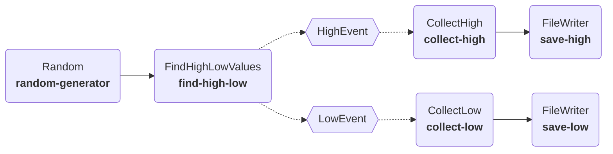

---
tags:
  - events
---
So far everything we have built in Plugboard has been a **discrete-time model**. This means that the whole model advances step-wise, i.e. `step` gets called on each [`Component`][plugboard.component.Component], calculating all of their outputs before advancing the simulation on.

In this tutorial we're going to introduce an **event-driven model**, where data can be passed around between components based on triggers that you can define. Event-based models can be useful in a variety of scenarios, for example when modelling parts moving around a production line, or to trigger expensive computation only when certain conditions are met in the model.

## Event-based model

Here's the model that we're going to build. Given a stream of random numbers, we'll trigger `HighEvent` whenever the value is above `0.8` and `LowEvent` whenever the value is below `0.2`. This allows us to funnel data into different parts of the model: in this case we'll just save the latest high/low values to a file at each step. In the diagram the _dotted lines_ represent the flow of event data: `FindHighLowValues` will publish events, while `CollectHigh` and `CollectLow` will subscribe to receive high and low events respectively.



## Defining events

First we need to define the events that are going to get used in the model. Each event needs a name, in this case `"high_event"` and `"low_event"` and a `data` type associated with it. Use a [Pydantic](https://docs.pydantic.dev/latest/) model to define the format of this `data` field.

```python
--8<-- "examples/tutorials/005_events/hello_events.py:events"
```

## Building components to create and consume events

So far all of our process models have run step-by-step until completion. When a model contains event-driven components, we need a way to tell them to stop at the end of the simulation, otherwise they will stay running and listening for events forever.

In this example, our `Random` component will drive the process by generating input random values. When it has completed `iters` iterations, we call `self.io.close()` to stop the model, causing other components in the model to shutdown.

```python
--8<-- "examples/tutorials/005_events/hello_events.py:source-component"
```

Next, we will define `FindHighLowValues` to identify high and low values in the stream of random numbers and publish `HighEvent` and `LowEvent` respectively.

```python
--8<-- "examples/tutorials/005_events/hello_events.py:event-publisher"
```

1.  See how we use the [`IOController`][plugboard.component.IOController] to declare that this [`Component`][plugboard.component.Component] will publish events.
2.  Use `self.io.queue_event` to send an event from a [`Component`][plugboard.component.Component]. Here we are senging the `HighEvent` or `LowEvent` depending on the input value.

Finally, we need components to subscribe to these events and process them. Use the `Event.handler` decorator to identify the method on each [`Component`][plugboard.component.Component] that will do this processing.

```python
--8<-- "examples/tutorials/005_events/hello_events.py:event-consumers"
```

1.  Specify the events that this [`Component`][plugboard.component.Component] will subscribe to.
2.  Use this decorator to indicate that we handle `HighEvent` here...
3.  ...and we handle `LowEvent` here.

!!! note
    In a real model you could define whatever logic you need inside your event handler, e.g. create a file, publish another event, etc. Here we just store the event on an attribute so that its value can be output via the `step()` method.

## Putting it all together

Now we can create a [`Process`][plugboard.process.Process] from all these components. The outputs from `CollectLow` and `CollectHigh` are connected to separate [`FileWriter`][plugboard.library.FileWriter] components so that we'll get a CSV file containing the latest high and low values at each step of the simulation.

!!! info
    We need a few extra lines of code to create connectors for the event-based parts of the model. If you define your process in YAML this will be done automatically for you, but if you are defining the process in code then you will need to use the [`EventConnectorBuilder`][plugboard.events.EventConnectorBuilder] to do this.

```python hl_lines="15-17"
--8<-- "examples/tutorials/005_events/hello_events.py:main"
```

1.  These connectors are for the normal, non-event driven parts of the model and connect [`Component`][plugboard.component.Component]` inputs and outputs.
2.  These lines will set up connectors for the events in the model.

Take a look at the `high.csv` and `low.csv` files: the first few rows will usually be empty, and then as soon as high or low values are identified they will start to appear in the CSVs. As usual, you can run this model from the CLI using `plugboard process run model.yaml`.