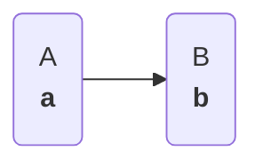

Plugboard is built to help you with two things: **defining process models**, and **executing those models**. There are two main ways to interact with Plugboard: via the Python API; or, via the CLI using model definitions saved in yaml format. In this introductory tutorial we'll do both, before building up to more complex models in later tutorials.

## Building models with the Python API

First we start by defining each [`Component`][plugboard.component.Component] we want in our model. Components can have only inputs, only outputs, or both. To keep it simple we just have two components here, showing the most basic functionality. Each component has several methods which are called at different stages during model execution: `init` for optional initialisation actions; `step` to take a single step forward through time; `run` to execute all steps; and `destroy` for optional teardown actions.

!!! info
    A model is made up of one or more components, though Plugboard really shines when you have many!

### Defining components

Let's define two components, `A` and `B`. `A` puts data into the model by generating numbers from a sequence. `B` takes input from `A`, doubles it, then saves it to a file. We build each component as a reusable Python class, implementing the main logic in a `step` method.
```python
--8<-- "examples/tutorials/001_hello_world/hello_world.py:components"
```

1. This is where we configure the inputs and outputs for each [`Component`][plugboard.component.Component].
2. `init` gets called **before** we run the model. It is optional, and used for any setup required on the [`Component`][plugboard.component.Component].
3. `step` gets called at each step forward throughout the model execution. This is where the main business logic must be defined.
4. `destroy` is optional, and can be used to clean up any resources used by the [`Component`][plugboard.component.Component].
5. `A` is responsible for stopping the model when it is complete, which we can do by calling `self.io.close()`.

!!! note
    * Each component has an `io` attribute in its definition, where we specify the names of the inputs and outputs. In this simple example, `A` has a single output, while `B` has a single input.
    * During the `step` method, the inputs and outputs are available as attributes: so assigning to `self.out_1` lets us set the output of `A`, and reading `self.in_1` allows us to read the input of `B`.
    * Notice how each component can have additional parameters in the `__init__` constructor, allowing us to give our components configurable settings like the output file path.

### Setting up a `Process`

Now we take these components, connect them up as a [`Process`][plugboard.process.Process], and fire off the model. When instantiating each component we must provide a `name`, which we can use to help define the connections between them. Using a [`ConnectorSpec`][plugboard.schemas.ConnectorSpec] object, we tell Plugboard to connect the `out_1` output of the `a` component to the `in_1` input of `b`. Visually, the model will look like this:



The rest of the code is boilerplate: calling `run()` on the [`Process`][plugboard.process.Process] object triggers all the components to start iterating through all their inputs until a termination condition is reached. We're using [`LocalProcess`][plugboard.process.LocalProcess] here, because we are running this model locally with no parallel computation (will explore this in a later tutorial).

Simulations proceed in an event-driven manner: when inputs arrive, the components are triggered to step forward in time. The framework handles the details of the inter-component communication, you just need to specify the logic of your components, and the connections between them.
```python
--8<-- "examples/tutorials/001_hello_world/hello_world.py:main"
```

## Executing pre-defined models on the CLI

In many cases, we want to define components once, with suitable parameters, and then use them repeatedly in different simulations. Plugboard enables this workflow with model specification files yaml format. Once the components have been defined, the simple model above can be represented with a yaml file like this:
```yaml
--8<-- "examples/tutorials/001_hello_world/model.yaml"
```

1. This identifies the `A` class within the `hello_world` module.
2. The `iters` parameter is required for the component - try adjusting to change how long the model runs for.


!!! note
    Notice how we use `type` to tell Plugboard where our components are defined within Python code (within the `hello_world` module). Creating models in yaml format like this also makes it easy to track and adjust their configurable parameters: try editing the file path or `iters` parameter to change the behaviour of the model.

!!! tip
    If you have already defined a model in code, you can export it to YAML by calling the [`dump`][plugboard.process.Process.dump] method on your [`Process`][plugboard.process.Process] object.

We can now run this model using the plugboard CLI with the command:
```shell
plugboard process run model.yaml
```

You should see that an output `.txt` file has been created, showing the the model as run successfully. Congratulations - you have built and run your first Plugboard model!

In the following tutorials we will build up some more complex components and processes to demonstrate the power of the framework.
