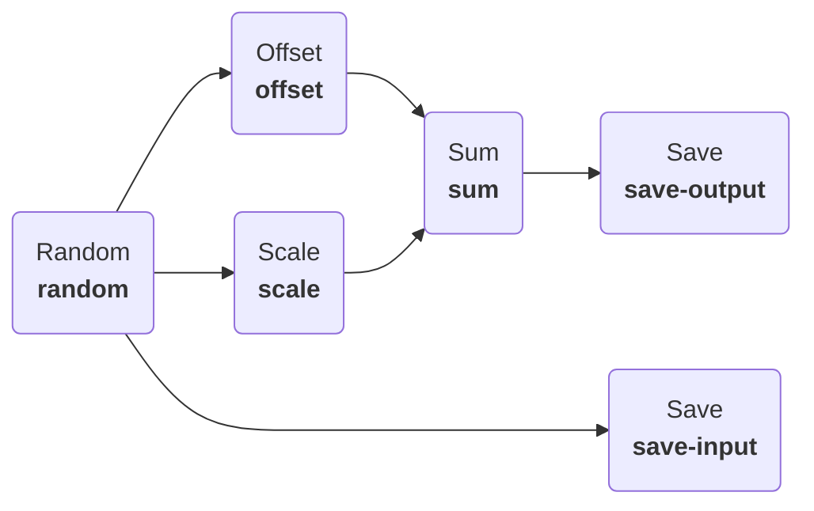
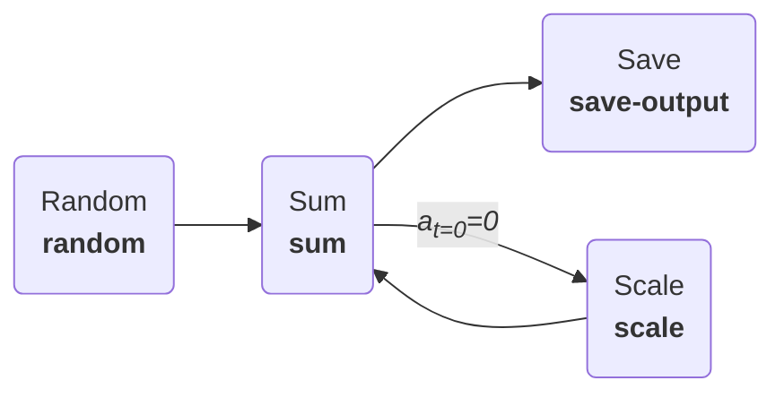

In the last example our [`Process`][plugboard.process.Process] consisted of just two components. Usually we use many more components, allowing you to break down your model into separate parts that you can build/test individually. Plugboard allows for **branching** and **looping** connections between your components.

In this tutorial we'll also demonstrate how to make components reusable between different processes.

## Define some components

First of all, let's define five different components:

* `Random` will generate random numbers to feed into our model;
* `Offset` adds a fixed offset to its inputs;
* `Scale` will multiple its input by a fixed scale factor;
* `Sum` will take in two inputs and add them together;
* `Save` will write its input to a text file.

We can put the code for each of these in `components.py`.
```python
--8<-- "examples/tutorials/002_complex_processes/components.py:components"
```

1. The [`Component`][plugboard.component.Component] needs three different parameters: `iters` to control how many iterations the model runs for, `low` and `high` to control the range of the random number generator.
2. A [`Component`][plugboard.component.Component] with both inputs and outputs.
3. Here we have multiple inputs.

## Create branching connections in a `Process`

Next, we'll connect the components together to form this model:



!!! note
    See how we branch the output of the `Random` component into three different places: a `Save` component (so that we can record our model input), `Offset` and `Scale`.

Now in `branching.py` we import these components, connect them together and run the model.
```python
--8<-- "examples/tutorials/002_complex_processes/branching.py:main"
```

1. We'll use this lambda to abbreviate the connectors below.
2. Instantiate each of the components here with any necessary parameters.
3. Here is where we define all of the connections in our model: `source` and `target` are of the form `component_name.io_name`. So the first item connects the `x` output on the `random` component to the `value_to_save` input on `save-input`.
4. As in the previous tutorial, this is equivalent to calling `await process.init()`, followed by `await process.run()` and then `await process.destroy()`.

Now run `python branching.py` and you will see the `input.txt` and `output.txt` files generated showing that the model has run.

## Create a loop connection

In some cases you might want to create a loop in your model. This is commonly the case where you need to include feedback: for example you might have a component modelling the temperature of a heated hot-water tank and another one representing an automatic controller that turns the heating element on and off.

To make models like this work in Plugboard you will need to specify `initial_values` somewhere in the loop: this ensures that each of the [`Component`][plugboard.component.Component] objects can get all their inputs at the first call to `process.step()`, allowing the model to start running.

Consider this model in which the `Sum` component will accumulate a scaled part of its value at every iteration:



!!! tip
    The diagrams in these tutorials are created in [Mermaid](https://mermaid.js.org/) syntax. You can make them directly in Plugboard using the [`markdown_diagram`][plugboard.diagram.markdown_diagram] function. Alternatively if you have a YAML config file you can run `plugboard process diagram your-yaml-file.yaml` on the command line.

    Creating diagrams can be a useful way to keep track of the different parts of your model as you build it out, and also helps to you to document how the model works.

We'll provide an initial input value of `a = 0` to the `Scale` component, allowing the model to run. Implementing this in `loop.py` we have:
```python
--8<-- "examples/tutorials/002_complex_processes/loop.py:main"
```

1. We specify our initial value for the `Scale` input here.

!!! note
    Initial values are specified as lists in Plugboard, allowing you to specify a sequence of them. The component will read the first element in the initial value at the first call to `step()` and so on until there are no more initial values left to consume. Usually you won't need more than one initial value, so the list typically contains a single element as in this example.
    
    Setting `initial_values = {"a": [0]}` means that we want the `a` input to be set to `0` on the first step and then revert to reading its input as usual.

## Next steps

You've now learned how to build up complex model layouts in Plugboard. In the next tutorial we'll show how powerful a Plugboard model can be as we start to include different types of [`Component`][plugboard.component.Component].
