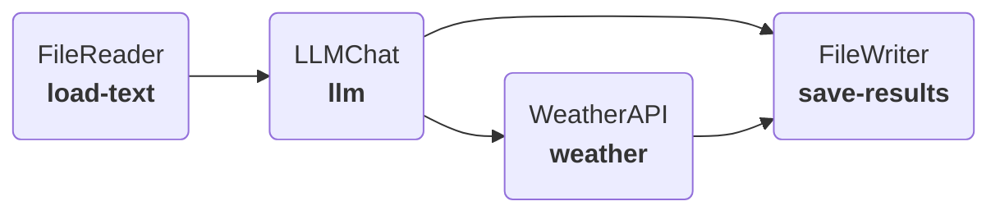

---
tags:
  - logging
  - llm
  - io
---
Plugboard's [`Component`][plugboard.component.Component] objects can run anything you can code in Python. This includes:

* Using your own or third-party Python packages;
* External calls to APIs, e.g. data sources or hosted models;
* Shell commands on your own machine, for example to execute third-party binaries that you want to integrate with.

It even ships with some pre-built components in [`plugboard.library`][plugboard.library] to help you with common tasks.

!!! info
    Plugboard was originally built to help data scientists working on industrial process simulations. Python provides a familar environment to integrate different parts of a simulation, for example combining the output of a traditional process control simulation with a machine-learning model.

In this tutorial we'll build a model to process data through an LLM and showcase some different components along the way.

## Using an LLM in Plugboard

We're going to build a model that loads rows of data from a CSV and then uses an LLM to extract information about the geographical place referred to in each row. We'll then query an API to get the latest weather for each location.



### Loading and saving data

In previous tutorials we wrote our own components for reading/writing files. Here we are going to use the built-in [`FileReader`][plugboard.library.FileReader] and [`FileWriter`][plugboard.library.FileWriter] components. These are much more useful for building practical models, as they can access a variety of file formats both locally and in cloud storage.
```python
--8<-- "examples/tutorials/003_more_components/hello_llm.py:load-save"
```

### Sending the data to an LLM

We're going to use the [`LLMChat`][plugboard.library.LLMChat] to access OpenAI:
```python
--8<-- "examples/tutorials/003_more_components/hello_llm.py:llm"
```

1. `LLMChat` can use [structured output](https://docs.llamaindex.ai/en/stable/understanding/extraction/structured_llms/) to process the LLM response into a known format. Here we define a Pydantic model that specifies everything we're expecting back.
2. Setting `expand_response = True` will unpack `location`, `latitude` and `longitude` into separate outputs on the component.

!!! info
    To run this tutorial you'll need an API key for [OpenAI](https://platform.openai.com/docs/quickstart). Set the `OPENAI_API_KEY` environment variable to provide it to the model.

    Since `LLMChat` is based on [LlamaIndex](https://www.llamaindex.ai/) you can even try reconfiguring `LLMChat` to use a different LLM.

### Querying a weather API

We can now define a component to query a weather API and get temperature and wind speed for a given location.
```python
--8<-- "examples/tutorials/003_more_components/hello_llm.py:components"

--8<-- "examples/tutorials/003_more_components/hello_llm.py:weather"
```

!!! info
    See how we used `self._logger` to record log messages. All Plugboard [`Component`][plugboard.component.Component] objects have a [structlog](https://www.structlog.org/) logger on the `_logger` attribute. See [configuration](../../../usage/configuration/) for more information on configuring the logging.

### Putting it all together

As usual, we can link all our components together in a [`LocalProcess`][plugboard.process.Process] and run them as follows:
```python
--8<-- "examples/tutorials/003_more_components/hello_llm.py:main"
```

Check out the `output.csv` file to see all of the collected model output.

