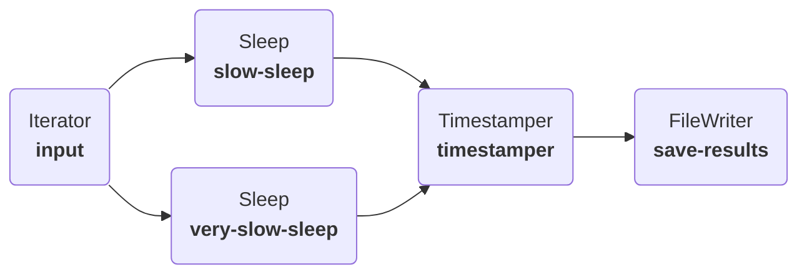

---
tags:
  - ray
---
Up until now we have running all our models in a single computational process. This is perfectly sufficient for simple models, or when your components can make use of [Python's asyncio](https://docs.python.org/3/library/asyncio.html) to avoid blocking.

As your models get larger and more computationally intensive you may benefit from running parts of the model in parallel. Plugboard integrates with the [Ray](https://docs.ray.io/) framework, allowing you to split your computation across multiple CPU cores, or even across nodes in a [Ray cluster](https://docs.ray.io/en/latest/cluster/getting-started.html).

!!! tip
    Keep in mind that parallelising a model has a cost associated with it: the communication between the different components will be slower on Ray than it is locally.
    
    For small models, or when a single component is the computational bottleneck then this overhead may not be worth it. However, when you have multiple computationally-intensive components in different branches of your `Process` then moving to Ray can give you a performance boost.

Before running this tutorial be sure to install Ray with pip, or install plugboard with its optional `ray` extra.

## Parallelising a model

For demonstration purposes we're going to use a model with two branches that containing `Sleep` components to simulate computationally intensive activity. In real scenarios these might instead be calls to simulation software or machine-learning model inference.



### Defining the components

Let's define the various components that we need. The `Timestamper` component simply emits the current time in ISO format so that our output file will contain a record of how long each step of the model took. We can again use [`FileWriter`][plugboard.library.FileWriter] to save the output to CSV.
```python
--8<-- "examples/tutorials/004_using_ray/hello_ray.py:components"
```

1. We're using `time.sleep` here and not `asyncio.sleep` because we're deliberately blocking execution to simulate a computationally intensive component.

### Running normally in a `LocalProcess`

First we can setup the [`LocalProcess`][plugboard.process.LocalProcess] and run it as we have in previous tutorials.
```python
--8<-- "examples/tutorials/004_using_ray/hello_ray.py:local"
```

Running 20 iterations takes around 30 seconds, because each step of the model contains 1.5s of computation.

### Running in parallel using `RayProcess`

With some small changes we can make the same model run in parallel on Ray. First we change the `Process` class to [`RayProcess`][plugboard.process.RayProcess]. Then when creating the [`Connector`][plugboard.connector.Connector] objects we need to change the channel type to [`RayChannel`][plugboard.connector.RayChannel].

!!! info
    [`Channel`][plugboard.connector.Channel] objects are used by Plugboard to handle the communication between components. So far we have used [`AsyncioChannel`][plugboard.connector.AsyncioChannel], which is the best option for simple models that don't require parallelisation.

    Plugboard provides different channel classes for use in parallel environments: [`RayChannel`][plugboard.connector.RayChannel] is suitable for single and multi-host Ray environments. [`ZMQChannel`][plugboard.connector.ZMQChannel] is faster, but currently only works on a single host.

```python
--8<-- "examples/tutorials/004_using_ray/hello_ray.py:ray"
```

Now the 20 iteration model takes around 23s, because the two different `Sleep` components are being executed in parallel (20s compute time plus a little overhead).

## Using YAML config

Defining your model as a YAML config file is particularly useful when you want to use more computational resources: the config file is **portable** and lets you easily move the model to different compute environments.

Specifying the process type and channel builder type in the YAML is the only change needed to get the example above to run on Ray.
```yaml hl_lines="3-5"
--8<-- "examples/tutorials/004_using_ray/model-ray.yaml"
```

1. Tell Plugboard to use a [`RayProcess`][plugboard.process.RayProcess] instead of the default [`LocalProcess`][plugboard.process.LocalProcess].
2. Also change the connector builder to [`RayConnector`][plugboard.connector.RayConnector], which will build [`RayChannel`][plugboard.connector.RayChannel] objects when creating the `Process`.
