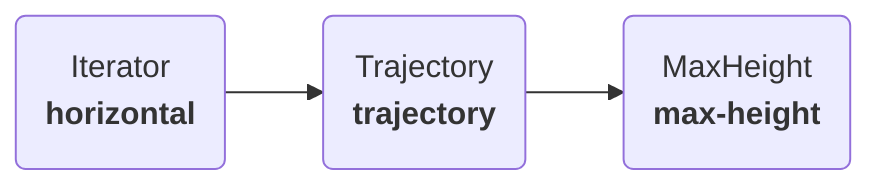

---
tags:
  - optimisation
---
Once you have built a model of your process, a common problem you might face is tuning its parameters. Plugboard includes a built-in optimisation utility based on [Ray Tune](https://docs.ray.io/en/latest/tune/index.html) and [Optuna](https://optuna.org/). Using this tool you can do things like:

* Calibrate the parameters of a process model to match observed results; and
* Optimise a process model to maximise or minimise its output.

These capabilities are particularly useful when working with digital twins: for example given a model of a production line, you could use the tuner to work out how to maximise its output.

!!! tip
    By using Ray Tune, Plugboard allows you to run optimisations in parallel within a Ray cluster, allowing you to explore the parameter space quickly even when working with long simulations.

## Define a model to optimise

As a simple example, we'll create a simple 3-component model to calculate the maximum height of a [projectile](https://en.wikipedia.org/wiki/Projectile_motion#Displacement) launched at a given angle and velocity.


Running the model with different values of the angle and velocity parameters configured on the `Trajectory` component will result in different heights being found on the `MaxHeight` component at the end of the simulation. We will use the [`Tuner`][plugboard.tune.Tuner] class to explore this parameter space and maximise the projectile height.

### Setting up the components

We'll need the following components to implement the model above:
```python
--8<-- "examples/tutorials/006_optimisation/hello_tuner.py:components"
```

Instead of building a [`Process`][plugboard.process.Process] as we would normally do to run the model directly, we'll instead define the [`ProcessSpec`][plugboard.schemas.ProcessSpec] for the model.
```python
--8<-- "examples/tutorials/006_optimisation/hello_tuner.py:define_process"
```

## Setting up the Tuner

Next, we set up a [`Tuner`][plugboard.tune.Tuner] object by configuring the `angle` and `velocity` arguments as floating point parameters, along with constraints.

!!! info
    Plugboard supports floating point, integer and categorical variables as tunable model parameters. See the definition of [`ParameterSpec`][plugboard.schemas.ParameterSpec] for details.

When building the tuner, we also specify the number of optimisation samples and how many we will allow to run in parallel on Ray.
```python
--8<-- "examples/tutorials/006_optimisation/hello_tuner.py:run_tuner"
```

1.  Set the objective, i.e. what we want our optimisation to target. In this case it is a field  on the `max-height` component. This can be a list of objectives if you need to do multi-objective optimisation.
2.  List the tunable parameters here. The `field_type` can be `"arg"` or `"initial_value"`. This is also where you can specify constraints on the parameters.
3.  Set the number of trials to run. More trials will take longer, but may get closer to finding the true optimum.
4.  The level of concurrency to use in Ray.
5.  Whether to minimise or maximise the objective. This must be set as a list for multi-objective optimisation.

Running this code will execute an optimisation job and print out information on each trial, along with the final optimisation result.

!!! tip
    Since [Optuna](https://optuna.org/) is used under the hood, you can configure the optional `algorithm` argument on the `Tuner` with additional configuration defined in [`OptunaSpec`][plugboard.schemas.OptunaSpec]. For example, the [`storage`](https://optuna.readthedocs.io/en/stable/reference/storages.html) argument allows you to save the optimisation results to a database or SQLite file. You can then use a tool like [Optuna Dashboard](https://optuna-dashboard.readthedocs.io/en/stable/getting-started.html) to study the optimisation output in more detail.

!!! tip
    You can impose arbitary constraints on variables within a `Process`. In your `step` method you can raise a [`ConstraintError`][plugboard.exceptions.ConstraintError] to indicate to the `Tuner` that a constraint has been breached. This will cause the trial to be stopped, and the optimisation will continue trying to find parameters that don't cause the constraint violation.

## Using YAML config

Plugboard's YAML config supports an optional `tune` section, allowing you to define optimisation jobs alongside your model configuration:
```yaml
--8<-- "examples/tutorials/006_optimisation/model-with-tuner.yaml"
```

1.  As usual, this section defines the [`Process`][plugboard.process.Process]. It can also be replaced by a path to another YAML file.
2.  This section is optional, and configures the [`Tuner`][plugboard.tune.Tuner].
3.  Parameters need to reference a type, so that Plugboard knows the type of parameter to build.

Now run `plugboard process tune model-with-tuner.yaml` to execute the optimisation job from the CLI.

## Advanced usage: complex search spaces

Occasionally you may need to define more complex search spaces, which go beyond what can be defined with a simple parameter configuration. For example:

*  Conditional parameters, e.g. where parameter `a` must be greater than parameter `b`; or
*  Looping, e.g. building up a list of tunable parameters that is of variable length.

These conditional search space functions are supported by Ray Tune and can be defined as described in the [Ray documentation](https://docs.ray.io/en/latest/tune/examples/optuna_example.html#conditional-search-spaces). To use such a function you will need to:

1. Setup the [`Tuner`][plugboard.tune.Tuner], defining your parameters as usual;
2. Write a custom function to define the search space, where each tunable parameter has a name of the form `"{component_name.field_or_arg_name}"`; then
3. Supply your custom function to the `OptunaSpec` algorithm configuration.

For example, the following search space makes the velocity depend on the angle:
```python
--8<-- "examples/tutorials/006_optimisation/hello_tuner.py:custom_search_space"
```

Then use this configuration to point the  tuner to the `custom_space` function.
```yaml
--8<-- "examples/tutorials/006_optimisation/model-with-tuner-custom.yaml"
```

1. We can reference a [`Process`][plugboard.process.Process] from another YAML file here to avoid repetition.
2. Add the algorithm configuration here.

Then run using `plugboard process tune model-with-tuner-custom.yaml`.
