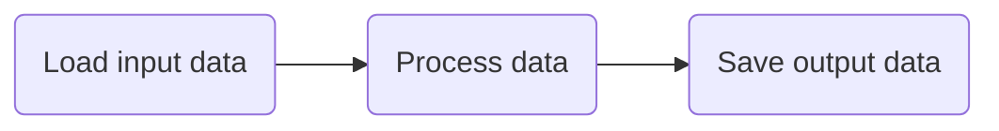
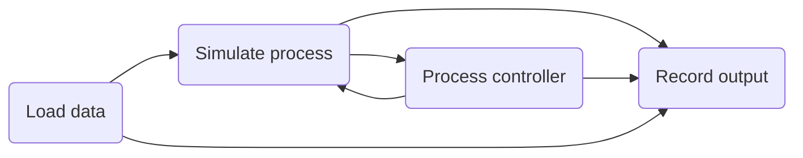

If you enjoy learning by following examples, we recommend diving straight into the [tutorials](../../examples/tutorials/hello-world/) section. All of the tutorials and demos can be found in our [Github repo](https://github.com/plugboard-dev/plugboard/tree/main/examples).

This section introduces some of the key concepts in Plugboard and how to apply them when building your own models.

## Terminology

### Components

The basic building blocks of Plugboard models are [`Component`][plugboard.component.Component] objects. Typical uses of components are:

* Loading data into and saving data out of models;
* Preparing data and/or running calculations;
* Modelling a particular physical entity, e.g. within a model of a factory production line, you might define separate components representing the conveyor belts, sensors and workstations;
* Making calls to external systems, e.g. fetching data from the internet, calling an LLM, spinning up a subprocess to run some third-party simulation software.

When implementing your own components, you will need to:

* Subclass the base [`Component`][plugboard.component.Component];
* Specify its inputs and ouputs using an [`IOController`][plugboard.component.IOController];
* Define a `step()` method the executes the main logic of your component for a single step; and
* Optionally define an `init()` method to do any required preparatory steps before the model in run.
* In the case of event based models, define custom [`Event`][plugboard.events.Event] subclasses and corresponding event handler methods decorated with `Event.handler`.

### Connectors

Data flows between components via **Connectors**. You will need to use these to tell Plugboard how data should flow between your components. Your overall model might be very simple, for example:

However Plugboard supports much more complex model structures, including looping and branching:

For models with explicitly declared input and output fields, connectors for each input-output pair must be defined explicitly using one of the [`Connector`][plugboard.connector.Connector] implementations. Connectors required for any events used in the model will be created for you automatically. 

### Processes

Components and connectors are collected together under a **Process**. This top-level class takes care of starting the model and running it until completion. Model execution is broken down into discrete _steps_. Running a model means executing all steps for each component until all of the available data has flowed through the model. The `step()` method advances the model forward by a single step. The `run()` method will repeatedly call `step()` until completion.

Plugboard supports both bounded and unbounded data streams. That is to say, you can either run a model with a fixed size input data set until completion, or run a model indefinitely which will continuously process new inputs as they arrive until a shutdown signal is received.

Plugboard uses Python's **asynchronous concurrency** to schedule execution of each of the components. Don't worry if asynchronous Python is unfamiliar to you: Plugboard takes care of all the details, so that you can focus on the logic of your model.

These Process classes are currently available which can be extended with custom implementations:

* [`LocalProcess`][plugboard.process.LocalProcess] runs models in a single Python process on your computer. This is useful for initial development, and is often sufficient for models are not computationally demanding.
* [`RayProcess`][plugboard.process.RayProcess] allows you to execute components on different Python processes using the [Ray Framework](https://docs.ray.io/en/latest/). This supports parallel computation on a single machine and scales out to large-scale [compute clusters](https://docs.ray.io/en/latest/cluster/getting-started.html).

## Running models

Most models start out life in a Jupyter notebook or Python script. Later on in development you may choose to convert the Plugboard process definition to a YAML file. This allows you to:

* Separate your model code from its configuration;
* Run the model via Plugboard's CLI - see `plugboard process run --help` for details;
* Transfer your model to a cluster to take advantage of larger-scale computational resources.
