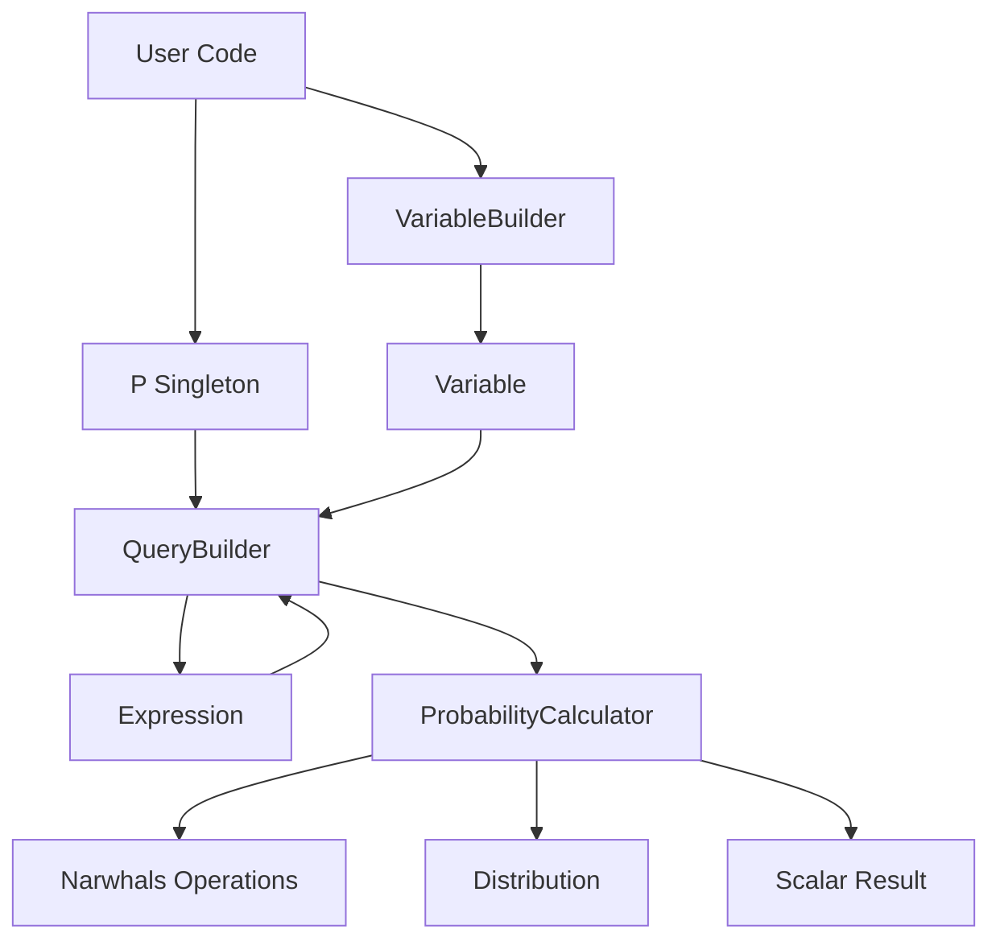

# Design Document

## Overview

Poffertjes provides a probabilistic query interface for dataframes through a singleton pattern and fluent API. The design leverages Narwhals for dataframe-agnostic operations, enabling support for both Pandas and Polars with efficient lazy evaluation. The core architecture separates concerns between variable management, query construction, probability calculation, and result representation.

The library follows a functional approach where probability queries are expressed as method chains that build up computation graphs, which are then executed efficiently using Narwhals' group-by and aggregation operations.

## Design Rationale

### Why Store Dataframe Reference in Variables?

The Variable class stores a reference to the Narwhals frame and its ID because:

1. **Memory efficiency:** Multiple variables from the same dataframe share the same frame reference (Python references don't duplicate objects)
2. **Query execution:** The frame is needed when executing probability calculations
3. **Identity tracking:** The frame ID prevents mixing variables from different dataframes
4. **Simplicity:** Variables are lightweight - just a name, frame reference, and ID

Example memory behavior:
```python
# All variables share the same frame reference
vb = VariableBuilder.from_data(df)
x, y, z = vb.get_variables('x', 'y', 'z')
# Memory: 1 Narwhals frame (shared), 3 lightweight variable objects
# x._nw_frame is y._nw_frame is z._nw_frame  # True (same object)
```

Note: Python references don't copy objects, so storing `_nw_frame` in each variable doesn't duplicate the dataframe in memory - they all point to the same object.

### Why Validate Same Dataframe?

The `_validate_same_dataframe` method is critical for correctness. Without it, users could accidentally compute meaningless probabilities like P(X from df1, Y from df2), which would either fail or produce nonsensical results. By tracking dataframe identity with `id()`, we ensure all variables in a query come from the same dataset.

### Why Implement `given()` on Result Objects?

The `.given()` method is implemented on result objects (not as a separate function) to enable fluent chaining:
- `p(x).given(y)` reads naturally as "probability of x given y"
- Results carry context (dataframe, conditions) needed for conditional calculations
- Allows progressive refinement: `p(x).given(y).given(z)` (though this would be same as `p(x).given(y, z)`)

### Why Add `isin()` for Categorical Variables?

Categorical variables often need "membership" queries like "probability where category is one of [A, B, C]". The `isin()` method:
- Maps directly to Narwhals' efficient `.is_in()` expression
- Provides cleaner syntax than `(x == 'A') | (x == 'B') | (x == 'C')`
- Is familiar to Pandas/Polars users

## Architecture

### High-Level Architecture

```
User Code
    ↓
P Singleton (Query Interface)
    ↓
Query Builder (Constructs computation graph)
    ↓
Probability Calculator (Executes via Narwhals)
    ↓
Result Objects (Distribution/Scalar)
```

### Component Diagram



## Components and Interfaces

### 1. Variable and VariableBuilder

**Purpose:** Represent random variables extracted from dataframe columns and bind them to their source dataframe.

**Variable Class:**
```python
from typing import Any
import narwhals as nw

class Variable:
    """Represents a random variable bound to a dataframe column.
    
    Note: Variables store the dataframe ID and a reference to the Narwhals frame.
    Multiple variables from the same dataframe share the same frame reference,
    avoiding duplication in memory.
    """
    
    def __init__(self, name: str, nw_frame: Any, frame_id: int) -> None:
        self.name = name
        # Store reference to Narwhals frame (shared among variables from same dataframe)
        self._nw_frame = nw_frame
        # Store dataframe identity for validation
        self._frame_id = frame_id
    
    def __repr__(self) -> str:
        return f"Variable({self.name})"
    
    def __eq__(self, value: Any) -> "Expression":
        """Create equality expression."""
        return Expression(self, "==", value)
    
    def __ne__(self, value: Any) -> "Expression":
        """Create inequality expression."""
        return Expression(self, "!=", value)
    
    def __lt__(self, value: Any) -> "Expression":
        """Create less-than expression."""
        return Expression(self, "<", value)
    
    def __le__(self, value: Any) -> "Expression":
        """Create less-than-or-equal expression."""
        return Expression(self, "<=", value)
    
    def __gt__(self, value: Any) -> "Expression":
        """Create greater-than expression."""
        return Expression(self, ">", value)
    
    def __ge__(self, value: Any) -> "Expression":
        """Create greater-than-or-equal expression."""
        return Expression(self, ">=", value)
    
    def isin(self, values: List[Any]) -> "Expression":
        """Create 'in' expression for categorical variables.
        
        Example:
            p(x.isin(['cat1', 'cat2', 'cat3']))
        """
        return Expression(self, "in", values)
    
    @property
    def dataframe_id(self) -> int:
        """Return unique identifier for the source dataframe."""
        return self._frame_id
```

**VariableBuilder Class:**
```python
from typing import List
from narwhals.typing import IntoFrameT

class VariableBuilder:
    """Factory for creating Variable objects from dataframes.
    
    The builder stores the dataframe once, and all variables created from it
    reference the builder. This avoids duplicating the dataframe in memory.
    """
    
    def __init__(self, data: IntoFrameT) -> None:
        # Store only Narwhals frame
        self._nw_frame = nw.from_native(data)
        # Cache the dataframe identity
        self._id = id(self._nw_frame)
    
    @property
    def dataframe_id(self) -> int:
        """Return unique identifier for the dataframe."""
        return self._id
    
    def get_variables(self, *args: str) -> List[Variable]:
        """Extract variables from dataframe columns.
        
        Args:
            *args: Column names. If empty, returns all columns.
            
        Returns:
            List of Variable objects.
            
        Raises:
            ValueError: If a column name doesn't exist.
        """
        columns = list(args) if args else self._nw_frame.columns
        
        # Validate columns exist
        missing = set(columns) - set(self._nw_frame.columns)
        if missing:
            raise ValueError(
                f"Columns not found in dataframe: {missing}"
            )
        
        # Pass the Narwhals frame and its ID to variables
        # All variables share the same frame reference (no duplication)
        return [Variable(name, self._nw_frame, self._id) for name in columns]
    
    @staticmethod
    def from_data(data: IntoFrameT) -> "VariableBuilder":
        """Create a VariableBuilder from a dataframe."""
        return VariableBuilder(data)
```

### 2. Expression System

**Purpose:** Represent expressions on variables that can be combined and evaluated.

**Expression Class:**
```python
from typing import Any, Union
from enum import Enum

class ExpressionOp(Enum):
    """Supported expression operators."""
    EQ = "=="
    NE = "!="
    LT = "<"
    LE = "<="
    GT = ">"
    GE = ">="
    BETWEEN = "between"
    IN = "in"  # For categorical variables: x.isin([val1, val2, ...])

class Expression:
    """Represents an expression on a variable (e.g., x == 5, x > 10)."""
    
    def __init__(
        self,
        variable: Variable,
        operator: Union[str, ExpressionOp],
        value: Any,
        upper_bound: Any = None
    ) -> None:
        self.variable = variable
        self.operator = ExpressionOp(operator) if isinstance(operator, str) else operator
        self.value = value
        self.upper_bound = upper_bound  # For BETWEEN operations
    
    def __and__(self, other: "Expression") -> "CompositeExpression":
        """Combine expressions with AND."""
        return CompositeExpression([self, other], "AND")
    
    def __or__(self, other: "Expression") -> "CompositeExpression":
        """Combine expressions with OR."""
        return CompositeExpression([self, other], "OR")
    
    def to_narwhals_expr(self) -> Any:
        """Convert expression to Narwhals expression."""
        col = nw.col(self.variable.name)
        
        if self.operator == ExpressionOp.EQ:
            return col == self.value
        elif self.operator == ExpressionOp.NE:
            return col != self.value
        elif self.operator == ExpressionOp.LT:
            return col < self.value
        elif self.operator == ExpressionOp.LE:
            return col <= self.value
        elif self.operator == ExpressionOp.GT:
            return col > self.value
        elif self.operator == ExpressionOp.GE:
            return col >= self.value
        elif self.operator == ExpressionOp.BETWEEN:
            return col.is_between(self.value, self.upper_bound, closed="none")
        elif self.operator == ExpressionOp.IN:
            return col.is_in(self.value)  # value should be a list/set
        else:
            raise ValueError(f"Unsupported operator: {self.operator}")

class CompositeExpression:
    """Represents multiple expressions combined with AND/OR."""
    
    def __init__(self, expressions: List[Union[Expression, "CompositeExpression"]], logic: str) -> None:
        self.expressions = expressions
        self.logic = logic  # "AND" or "OR"
    
    def to_narwhals_expr(self) -> Any:
        """Convert composite expression to Narwhals expression."""
        exprs = [e.to_narwhals_expr() for e in self.expressions]
        
        if self.logic == "AND":
            result = exprs[0]
            for expr in exprs[1:]:
                result = result & expr
            return result
        else:  # OR
            result = exprs[0]
            for expr in exprs[1:]:
                result = result | expr
            return result
```

**Ternary Expression Support:**
```python
class TernaryExpression(Expression):
    """Represents a ternary expression like a < x < b."""
    
    def __init__(self, variable: Variable, lower: Any, upper: Any, closed: str = "none") -> None:
        super().__init__(variable, ExpressionOp.BETWEEN, lower, upper)
        self.closed = closed  # "none", "left", "right", "both"
    
    def to_narwhals_expr(self) -> Any:
        """Convert to Narwhals is_between expression."""
        return nw.col(self.variable.name).is_between(
            self.value, self.upper_bound, closed=self.closed
        )
```

### 3. P Singleton and Query Interface

**Purpose:** Provide the main user-facing API for probability queries.

**P Class:**
```python
from typing import Union, Tuple

class P:
    """Singleton probability query interface."""
    
    _instance = None
    
    def __new__(cls):
        if cls._instance is None:
            cls._instance = super().__new__(cls)
        return cls._instance
    
    def __call__(
        self,
        *args: Union[Variable, Expression, Tuple[Variable, ...]]
    ) -> "QueryResult":
        """Execute a probability query.
        
        Args:
            *args: Variables or expressions to query.
            
        Returns:
            QueryResult that can be a scalar or distribution,
            and supports .given() for conditional probabilities.
        """
        # Validate all variables come from same dataframe
        variables = self._extract_variables(args)
        self._validate_same_dataframe(variables)
        
        # Build query
        query = QueryBuilder(args)
        
        # Execute and return result
        return query.execute()
    
    def _extract_variables(self, args) -> List[Variable]:
        """Extract all variables from arguments."""
        variables = []
        for arg in args:
            if isinstance(arg, Variable):
                variables.append(arg)
            elif isinstance(arg, Expression):
                variables.append(arg.variable)
            elif isinstance(arg, CompositeExpression):
                for expr in arg.expressions:
                    if isinstance(expr, Expression):
                        variables.append(expr.variable)
        return variables
    
    def _validate_same_dataframe(self, variables: List[Variable]) -> None:
        """Ensure all variables come from the same dataframe.
        
        This is critical because probability calculations require all variables
        to be from the same dataset. If we allowed mixing variables from different
        dataframes, we'd be computing meaningless probabilities (e.g., P(X from df1, Y from df2)).
        
        We use id() to track dataframe identity because:
        1. It's fast (O(1) comparison)
        2. It correctly identifies the same dataframe instance
        3. It prevents accidental mixing even if dataframes have same content
        
        Example of what we prevent:
            df1 = pd.DataFrame({'x': [1, 2, 3]})
            df2 = pd.DataFrame({'y': [4, 5, 6]})
            vb1 = VariableBuilder.from_data(df1)
            vb2 = VariableBuilder.from_data(df2)
            x = vb1.get_variables('x')[0]
            y = vb2.get_variables('y')[0]
            p(x, y)  # This should raise an error!
        """
        if not variables:
            return
        
        first_id = variables[0].dataframe_id
        for var in variables[1:]:
            if var.dataframe_id != first_id:
                raise ValueError(
                    f"Variables from different dataframes cannot be mixed: "
                    f"{variables[0].name} and {var.name}"
                )

# Create singleton instance
p = P()
```

### 4. Query Builder

**Purpose:** Build and execute probability queries using Narwhals operations.

**QueryBuilder Class:**
```python
from typing import Union, List, Tuple, Optional

class QueryBuilder:
    """Builds and executes probability queries."""
    
    def __init__(self, args: Tuple[Union[Variable, Expression], ...]) -> None:
        self.args = args
        self.variables: List[Variable] = []
        self.expressions: List[Union[Expression, CompositeExpression]] = []
        self._parse_args()
    
    def _parse_args(self) -> None:
        """Parse arguments into variables and expressions."""
        for arg in self.args:
            if isinstance(arg, Variable):
                self.variables.append(arg)
            elif isinstance(arg, (Expression, CompositeExpression)):
                self.expressions.append(arg)
                if isinstance(arg, Expression):
                    if arg.variable not in self.variables:
                        self.variables.append(arg.variable)
    
    def execute(self) -> "QueryResult":
        """Execute the query and return result."""
        # Get the dataframe from first variable
        df = self.variables[0]._nw_frame
        
        # Determine if this is a scalar or distribution query
        has_expressions = len(self.expressions) > 0
        
        if has_expressions:
            # Scalar query
            calculator = ProbabilityCalculator(df)
            prob = calculator.calculate_scalar(self.expressions)
            return ScalarResult(prob, self.expressions, df)
        else:
            # Distribution query
            calculator = ProbabilityCalculator(df)
            dist = calculator.calculate_distribution(self.variables)
            return DistributionResult(dist, self.variables, df)

class QueryResult:
    """Base class for query results."""
    
    def given(self, *conditions: Union[Expression, Variable]) -> "QueryResult":
        """Apply conditional probability.
        
        Note: 'conditions' here refers to the conditioning part of conditional probability,
        not to be confused with Expression objects which represent boolean expressions.
        """
        raise NotImplementedError

class ScalarResult(QueryResult):
    """Represents a scalar probability value."""
    
    def __init__(
        self,
        value: float,
        expressions: List[Union[Expression, CompositeExpression]] = None,
        dataframe: Any = None  # Narwhals dataframe
    ) -> None:
        self.value = value
        self._expressions = expressions or []
        self._dataframe = dataframe  # Narwhals frame
    
    def __float__(self) -> float:
        return self.value
    
    def __repr__(self) -> str:
        return f"{self.value:.6f}"
    
    def given(self, *args: Union[Expression, Variable]) -> "ScalarResult":
        """Calculate conditional probability P(original expressions | conditions).
        
        Example:
            p(x == 1).given(y == 2)  # P(X=1 | Y=2)
        
        Args:
            *args: Expressions or variables to condition on.
            
        Returns:
            New ScalarResult with conditional probability.
        """
        # Parse conditioning arguments
        conditions = self._parse_conditioning_args(args)
        
        # Calculate conditional probability
        calculator = ProbabilityCalculator(self._dataframe)
        prob = calculator.calculate_scalar(
            expressions=self._expressions,
            conditions=conditions
        )
        
        return ScalarResult(prob, self._expressions, self._dataframe)
    
    def _parse_conditioning_args(self, args) -> List[Expression]:
        """Parse arguments into list of expressions for conditioning."""
        conditions = []
        for arg in args:
            if isinstance(arg, Expression):
                conditions.append(arg)
            elif isinstance(arg, Variable):
                # Variable without expression means condition on all values
                # This is handled differently in distribution case
                raise ValueError(
                    "Scalar result cannot be conditioned on variable without expression. "
                    "Use an expression like y == value instead."
                )
        return conditions

class DistributionResult(QueryResult):
    """Represents a probability distribution."""
    
    def __init__(
        self,
        distribution: Any,  # Narwhals dataframe
        variables: List[Variable],
        dataframe: Any,  # Narwhals dataframe
        conditions: List[Expression] = None
    ) -> None:
        self.distribution = distribution
        self.variables = variables
        self.dataframe = dataframe  # Narwhals frame
        self._conditions = conditions or []
    
    def given(self, *args: Union[Expression, Variable]) -> "DistributionResult":
        """Calculate conditional distribution P(variables | conditions).
        
        Examples:
            p(x).given(y == 2)        # P(X | Y=2) - distribution
            p(x).given(y)              # P(X | Y) - distribution for each Y value
            p(x, y).given(z == 3)      # P(X,Y | Z=3) - joint conditional
            p(x).given(y == 1, z == 2) # P(X | Y=1, Z=2) - multiple conditions
        
        Args:
            *args: Expressions or variables to condition on.
            
        Returns:
            New DistributionResult with conditional distribution.
        """
        # Parse conditioning arguments
        conditions = self._parse_conditioning_args(args)
        
        # Calculate conditional distribution
        calculator = ProbabilityCalculator(self.dataframe)
        dist = calculator.calculate_distribution(
            variables=self.variables,
            conditions=conditions
        )
        
        return DistributionResult(
            dist,
            self.variables,
            self.dataframe,
            conditions
        )
    
    def _parse_conditioning_args(self, args) -> List[Union[Expression, Variable]]:
        """Parse arguments into list of expressions/variables for conditioning."""
        result = []
        for arg in args:
            if isinstance(arg, (Expression, Variable)):
                result.append(arg)
            else:
                raise ValueError(f"Invalid conditioning argument: {arg}")
        return result
    
    def to_dict(self) -> dict:
        """Convert distribution to dictionary."""
        pass
    
    def to_dataframe(self) -> Any:
        """Convert distribution to dataframe."""
        pass
```

### 5. Probability Calculator

**Purpose:** Execute probability calculations using efficient Narwhals operations.

**ProbabilityCalculator Class:**
```python
import narwhals as nw
from typing import List, Union, Any

class ProbabilityCalculator:
    """Calculates probabilities using Narwhals operations."""
    
    def __init__(self, dataframe: Any) -> None:
        self.df = dataframe
        self.total_count = len(dataframe)
    
    def calculate_distribution(
        self,
        variables: List[Variable],
        conditions: Optional[List[Expression]] = None
    ) -> Any:
        """Calculate probability distribution using group_by + agg.
        
        For P(X): df.group_by('X').agg(nw.len())
        For P(X,Y): df.group_by(['X', 'Y']).agg(nw.len())
        For P(X|Y=y): df.filter(Y==y).group_by('X').agg(nw.len())
        """
        df = self.df
        
        # Apply conditions if present (for conditional probabilities)
        if conditions:
            for cond in conditions:
                df = df.filter(cond.to_narwhals_expr())
            total = len(df)
            if total == 0:
                raise ValueError("Conditioning event has zero probability")
        else:
            total = self.total_count
        
        # Group by variables and count
        var_names = [v.name for v in variables]
        result = (
            df.group_by(var_names)
            .agg(count=nw.len())
            .with_columns(probability=nw.col("count") / total)
            .sort(var_names)
        )
        
        return result
    
    def calculate_scalar(
        self,
        expressions: List[Union[Expression, CompositeExpression]],
        conditions: Optional[List[Expression]] = None
    ) -> float:
        """Calculate scalar probability.
        
        For P(X=x): count(X=x) / total
        For P(X=x|Y=y): count(X=x AND Y=y) / count(Y=y)
        
        Args:
            expressions: The expressions to evaluate (e.g., x == 5)
            conditions: Optional conditioning expressions (for conditional probability)
        """
        df = self.df
        
        # Apply conditions first (for conditional probabilities)
        if conditions:
            for cond in conditions:
                df = df.filter(cond.to_narwhals_expr())
            denominator = len(df)
            if denominator == 0:
                raise ValueError("Conditioning event has zero probability")
        else:
            denominator = self.total_count
        
        # Apply expressions
        for expr in expressions:
            df = df.filter(expr.to_narwhals_expr())
        
        numerator = len(df)
        return numerator / denominator if denominator > 0 else 0.0
    
    def calculate_joint(
        self,
        variables: List[Variable],
        conditions: Optional[List[Expression]] = None
    ) -> Any:
        """Calculate joint probability distribution.
        
        Same as calculate_distribution but explicitly for multiple variables.
        """
        return self.calculate_distribution(variables, conditions)
```

## Data Models

### Distribution Object

```python
from typing import Iterator, Tuple, Dict, Any
import narwhals as nw

class Distribution:
    """Represents a probability distribution."""
    
    def __init__(self, data: Any, variables: List[str]) -> None:
        self.data = data  # Narwhals dataframe with columns: var1, var2, ..., count, probability
        self.variables = variables
    
    def __iter__(self) -> Iterator[Tuple[Any, float]]:
        """Iterate over (value, probability) pairs."""
        for row in self.data.iter_rows(named=True):
            if len(self.variables) == 1:
                value = row[self.variables[0]]
            else:
                value = tuple(row[v] for v in self.variables)
            yield value, row["probability"]
    
    def __repr__(self) -> str:
        """Display distribution in readable format."""
        lines = [f"Distribution over {', '.join(self.variables)}:"]
        lines.append("-" * 50)
        
        # Show first 10 rows
        rows = list(self.data.iter_rows(named=True))
        for i, row in enumerate(rows[:10]):
            if len(self.variables) == 1:
                value = row[self.variables[0]]
            else:
                value = tuple(row[v] for v in self.variables)
            prob = row["probability"]
            lines.append(f"  {value}: {prob:.6f}")
        
        if len(rows) > 10:
            lines.append(f"  ... ({len(rows) - 10} more values)")
        
        return "\n".join(lines)
    
    def to_dict(self) -> Dict[Any, float]:
        """Convert to dictionary."""
        return {value: prob for value, prob in self}
    
    def to_dataframe(self) -> Any:
        """Convert to native dataframe format (Pandas/Polars)."""
        return self.data.to_native()
    
    def __eq__(self, other: "Distribution") -> bool:
        """Compare distributions for equality."""
        if not isinstance(other, Distribution):
            return False
        # Compare with tolerance for floating point
        return self.data.equals(other.data)
```

## Error Handling

### Exception Hierarchy

```python
class PoffertjesError(Exception):
    """Base exception for poffertjes."""
    pass

class DataframeError(PoffertjesError):
    """Errors related to dataframe operations."""
    pass

class VariableError(PoffertjesError):
    """Errors related to variables."""
    pass

class ExpressionError(PoffertjesError):
    """Errors related to expressions."""
    pass

class ProbabilityError(PoffertjesError):
    """Errors related to probability calculations."""
    pass
```

### Error Handling Strategy

1. **Column not found:** Raise `VariableError` with list of available columns
2. **Mixed dataframes:** Raise `DataframeError` indicating which variables are incompatible
3. **Zero probability conditioning:** Raise `ProbabilityError` with clear message
4. **Empty dataframe:** Raise `DataframeError` at Variable creation time
5. **Invalid operations:** Raise `ExpressionError` with helpful message

## Testing Strategy

### Unit Tests Structure

```
tests/
├── test_variable.py          # Variable and VariableBuilder tests
├── test_expression.py         # Expression system tests
├── test_p_interface.py        # P singleton and API tests
├── test_calculator.py         # ProbabilityCalculator tests
├── test_distribution.py       # Distribution object tests
├── test_integration.py        # End-to-end integration tests
└── test_property_based.py     # Hypothesis property-based tests
```

### Property-Based Tests

Using Hypothesis to verify:

1. **Probability Axioms:**
   - Non-negativity: All probabilities >= 0
   - Normalization: Sum of probabilities = 1.0
   - Monotonicity: P(A) <= P(A or B)

2. **Probability Laws:**
   - Chain rule: P(X,Y) = P(X|Y) * P(Y)
   - Bayes' theorem: P(X|Y) * P(Y) = P(Y|X) * P(X)
   - Law of total probability: P(X) = sum over Y of P(X|Y) * P(Y)
   - Union: P(X or Y) = P(X) + P(Y) - P(X and Y)
   - Marginalization: sum over Y of P(X,Y) = P(X)

3. **Edge Cases:**
   - Single value columns
   - Empty results
   - Very small/large datasets
   - All dtypes

### Test Data Strategy

```python
import hypothesis.strategies as st
from hypothesis import given

# Strategy for generating test dataframes
@st.composite
def dataframe_strategy(draw):
    n_rows = draw(st.integers(min_value=10, max_value=1000))
    n_cols = draw(st.integers(min_value=1, max_value=5))
    
    # Generate columns with different dtypes
    columns = {}
    for i in range(n_cols):
        dtype = draw(st.sampled_from(['int', 'float', 'str', 'bool']))
        if dtype == 'int':
            columns[f'col_{i}'] = draw(st.lists(
                st.integers(min_value=0, max_value=10),
                min_size=n_rows, max_size=n_rows
            ))
        # ... other dtypes
    
    return pd.DataFrame(columns)
```

## Performance Considerations

### Lazy Evaluation

1. Use Narwhals lazy frames when possible
2. Defer `.collect()` until final result needed
3. Chain operations to allow query optimization

### Caching Strategy

1. Cache group_by results for repeated queries on same variables
2. Reuse filtered dataframes for multiple conditional queries
3. Memoize distribution calculations

### Memory Management

1. Use streaming for very large distributions
2. Implement pagination for display
3. Provide `.head()` and `.tail()` methods on distributions

## Dependencies

```toml
[project]
dependencies = [
    "narwhals>=1.0.0",
    "pandas>=2.0.0",  # Optional, for Pandas support
    "polars>=0.20.0",  # Optional, for Polars support
]

[project.optional-dependencies]
dev = [
    "pytest>=7.0.0",
    "hypothesis>=6.0.0",
    "pytest-cov>=4.0.0",
]
```

## API Examples

### Basic Usage

```python
import pandas as pd
from poffertjes import p, VariableBuilder

# Create dataframe
df = pd.DataFrame({
    'x': [1, 2, 2, 3, 3, 3],
    'y': ['a', 'a', 'b', 'b', 'c', 'c']
})

# Extract variables
vb = VariableBuilder.from_data(df)
x, y = vb.get_variables('x', 'y')

# Marginal probability
p(x)  # Returns Distribution
p(x == 2)  # Returns 0.333...

# Conditional probability
p(x).given(y == 'a')  # Returns Distribution
p(x == 2).given(y == 'a')  # Returns 0.5

# Joint probability
p(x, y)  # Returns Distribution
p(x == 2, y == 'a')  # Returns 0.166...

# Multiple conditioning
p(x).given(y == 'a', x > 1)  # Returns Distribution

# Ternary conditions
p(1 < x < 3)  # Returns probability

# Categorical 'in' operator
p(y.isin(['a', 'b']))  # Returns probability where y is 'a' or 'b'
p(x).given(y.isin(['a', 'b']))  # Distribution of x given y in ['a', 'b']
```

## Future Enhancements

1. **Smoothing:** Add Laplace smoothing for zero probabilities
2. **Continuous distributions:** Support for KDE and binning strategies
3. **Sampling:** Generate samples from distributions
4. **Visualization:** Built-in plotting methods
5. **Information theory:** Entropy, mutual information, KL divergence
6. **Performance:** Parallel processing for large datasets
