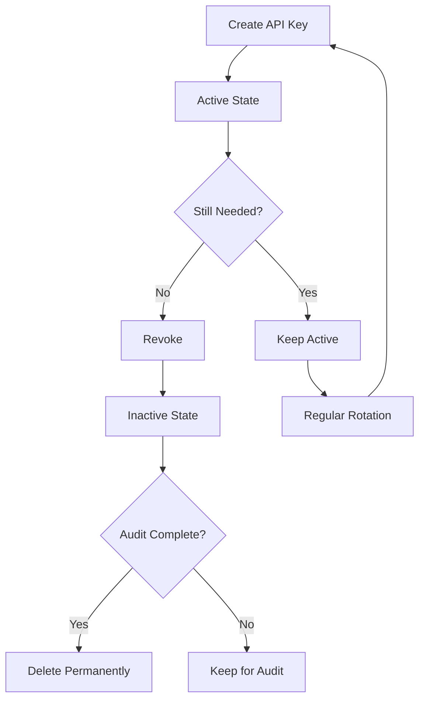

# Authentication Guide

PutPlace API uses **API Key authentication** to secure API endpoints and **User authentication** for web access. This guide explains how to set up and use authentication.

## Table of Contents

- [Overview](#overview)
- [Initial Setup](#initial-setup)
- [Quick Start](#quick-start)
- [Creating Your First API Key](#creating-your-first-api-key)
- [Using API Keys](#using-api-keys)
- [API Key Management](#api-key-management)
- [Security Best Practices](#security-best-practices)

---

## Overview

**Authentication Methods:**
- **API Key Authentication** (via `X-API-Key` header) - For API endpoints
- **User Authentication** (username/password + JWT) - For web interface

**Protected Endpoints:**
- `POST /put_file` - Upload file metadata
- `GET /get_file/{sha256}` - Retrieve file metadata
- `POST /upload_file/{sha256}` - Upload file content
- `POST /api_keys` - Create API keys
- `GET /api_keys` - List API keys
- `DELETE /api_keys/{key_id}` - Delete API key
- `PUT /api_keys/{key_id}/revoke` - Revoke API key

**Public Endpoints** (no authentication required):
- `GET /` - Root endpoint
- `GET /health` - Health check
- `POST /api/register` - User registration
- `POST /api/login` - User login

---

## Initial Setup

PutPlace automatically creates an initial admin user on first startup using a **hybrid approach**:

### Automatic Admin Creation

**On first startup (when no users exist), PutPlace will:**

#### Option 1: Environment Variables (Recommended for Production)

Set these environment variables before starting the server:

```bash
export PUTPLACE_ADMIN_USERNAME="admin"
export PUTPLACE_ADMIN_PASSWORD="your-secure-password-here"
export PUTPLACE_ADMIN_EMAIL="admin@example.com"
```

**Requirements:**
- Password must be at least 8 characters
- Username and password are required
- Email is optional (defaults to `admin@localhost`)

**Docker/Docker Compose:**
```yaml
services:
  putplace:
    environment:
      - PUTPLACE_ADMIN_USERNAME=admin
      - PUTPLACE_ADMIN_PASSWORD=${ADMIN_PASSWORD}  # From .env file
      - PUTPLACE_ADMIN_EMAIL=admin@example.com
```

#### Option 2: Random Password Generation (Development)

If no environment variables are set, PutPlace will:
1. Generate a secure random password
2. Create an admin user with username `admin`
3. Display the credentials **once** in the server logs:

```
================================================================================
🔐 INITIAL ADMIN CREDENTIALS GENERATED
================================================================================
   Username: admin
   Password: AbCdEf1234567890XyZ

⚠️  SAVE THESE CREDENTIALS NOW - They won't be shown again!

For production, set environment variables instead:
   PUTPLACE_ADMIN_USERNAME=your-admin
   PUTPLACE_ADMIN_PASSWORD=your-secure-password
   PUTPLACE_ADMIN_EMAIL=admin@example.com
================================================================================
```

**Important Notes:**
- ✅ Admin is only created if **no users exist**
- ✅ Credentials are also written to `/tmp/putplace_initial_creds.txt`
- ⚠️ Delete the credentials file after saving the password
- ⚠️ Use environment variables in production for security

### After Initial Setup

Once the admin user exists:
1. Log in to the web interface at `http://localhost:8000`
2. Create additional users via `/api/register` endpoint
3. Generate API keys for programmatic access

---

## Quick Start

### 1. Create Your First API Key

Use the bootstrap script to create your first API key:

```bash
# Basic usage
python -m putplace.scripts.create_api_key --name "admin-key"

# With description
python -m putplace.scripts.create_api_key \
    --name "production-server-01" \
    --description "API key for production server #1"
```

**Output:**
```
================================================================================
✓ API Key Created Successfully!
================================================================================

API Key ID: 65f1234567890abcdef12345
Name: admin-key
Created: 2025-10-15 10:30:00

⚠️  IMPORTANT: Save this API key - it won't be shown again!

  API Key: a1b2c3d4e5f6g7h8i9j0k1l2m3n4o5p6q7r8s9t0u1v2w3x4y5z6a7b8c9d0

================================================================================
Usage:
  curl -H 'X-API-Key: a1b2c3d4...' http://localhost:8000/api_keys

Or in your .env file:
  PUTPLACE_API_KEY=a1b2c3d4e5f6g7h8i9j0k1l2m3n4o5p6q7r8s9t0u1v2w3x4y5z6a7b8c9d0
================================================================================
```

**⚠️ IMPORTANT:** Save the API key securely! It's shown only once and cannot be retrieved later.

### 2. Use the API Key with Client

```bash
# Option 1: Command line argument
python ppclient.py /var/log --api-key "YOUR_API_KEY_HERE"

# Option 2: Environment variable
export PUTPLACE_API_KEY="YOUR_API_KEY_HERE"
python ppclient.py /var/log

# Option 3: Config file
echo "api_key = YOUR_API_KEY_HERE" >> ~/ppclient.conf
python ppclient.py /var/log
```

### 3. Use the API Key with curl

```bash
# Upload file metadata
curl -X POST http://localhost:8000/put_file \
  -H "X-API-Key: YOUR_API_KEY_HERE" \
  -H "Content-Type: application/json" \
  -d '{
    "filepath": "/var/log/app.log",
    "hostname": "server01",
    "ip_address": "192.168.1.100",
    "sha256": "e3b0c44298fc1c149afbf4c8996fb92427ae41e4649b934ca495991b7852b855",
    "file_size": 2048,
    "file_mode": 33188,
    "file_uid": 1000,
    "file_gid": 1000,
    "file_mtime": 1609459200.0,
    "file_atime": 1609459200.0,
    "file_ctime": 1609459200.0
  }'
```

---

## Creating Your First API Key

Since all endpoints require authentication, you need to bootstrap the first API key directly in the database.

### Method 1: Bootstrap Script (Recommended)

```bash
python -m putplace.scripts.create_api_key --name "admin-key"
```

This script:
- ✅ Connects directly to MongoDB (bypasses API auth)
- ✅ Creates an API key with a secure random value
- ✅ Hashes the key before storing (SHA256)
- ✅ Shows the API key only once

### Method 2: Manual MongoDB Insertion (Advanced)

If you prefer to create the key manually:

```bash
# Generate API key
API_KEY=$(python -c "import secrets; print(secrets.token_hex(32))")

# Hash the key
KEY_HASH=$(echo -n "$API_KEY" | sha256sum | cut -d' ' -f1)

# Insert into MongoDB
mongosh putplace --eval "
db.api_keys.insertOne({
  key_hash: '$KEY_HASH',
  name: 'admin-key',
  description: 'First API key',
  created_at: new Date(),
  last_used_at: null,
  is_active: true
})
"

echo "API Key: $API_KEY"
```

---

## Using API Keys

### With Python Client

```bash
# Using command line
ppclient /var/log --api-key "your-api-key-here"

# Using environment variable
export PUTPLACE_API_KEY="your-api-key-here"
ppclient /var/log
```

### With curl

```bash
curl -H "X-API-Key: your-api-key-here" http://localhost:8000/api_keys
```

### With httpx/requests (Python)

```python
import httpx

api_key = "your-api-key-here"
headers = {"X-API-Key": api_key}

# Upload metadata
response = httpx.post(
    "http://localhost:8000/put_file",
    headers=headers,
    json=metadata,
)
```

### With JavaScript/Node.js

```javascript
const apiKey = "your-api-key-here";

fetch("http://localhost:8000/api_keys", {
  headers: {
    "X-API-Key": apiKey
  }
})
.then(response => response.json())
.then(data => console.log(data));
```

---

## API Key Management

Once you have your first API key, you can create and manage additional keys via the API.

### Create New API Key

```bash
curl -X POST http://localhost:8000/api_keys \
  -H "X-API-Key: YOUR_EXISTING_KEY" \
  -H "Content-Type: application/json" \
  -d '{
    "name": "server-02-key",
    "description": "API key for server 02"
  }'
```

**Response:**
```json
{
  "api_key": "new-generated-key-here-save-it",
  "_id": "65f1234567890abcdef12345",
  "name": "server-02-key",
  "description": "API key for server 02",
  "created_at": "2025-10-15T10:30:00Z",
  "is_active": true
}
```

### List API Keys

```bash
curl -H "X-API-Key: YOUR_KEY" http://localhost:8000/api_keys
```

**Response:**
```json
[
  {
    "_id": "65f1234567890abcdef12345",
    "name": "admin-key",
    "description": "First API key",
    "created_at": "2025-10-15T10:00:00Z",
    "last_used_at": "2025-10-15T10:30:00Z",
    "is_active": true
  },
  {
    "_id": "65f9876543210fedcba09876",
    "name": "server-02-key",
    "description": "API key for server 02",
    "created_at": "2025-10-15T10:30:00Z",
    "last_used_at": null,
    "is_active": true
  }
]
```

### Revoke API Key

Revoke (deactivate) a key without deleting it:

```bash
curl -X PUT http://localhost:8000/api_keys/65f9876543210fedcba09876/revoke \
  -H "X-API-Key: YOUR_KEY"
```

**Response:**
```json
{
  "message": "API key 65f9876543210fedcba09876 revoked successfully"
}
```

### Delete API Key

Permanently delete a key:

```bash
curl -X DELETE http://localhost:8000/api_keys/65f9876543210fedcba09876 \
  -H "X-API-Key: YOUR_KEY"
```

**Response:**
```json
{
  "message": "API key 65f9876543210fedcba09876 deleted successfully"
}
```

---

## Security Best Practices

### ✅ DO:

1. **Store API keys securely**
   - Use environment variables or secure vaults (not in code)
   - Use config files with restricted permissions (chmod 600)

2. **Use separate keys for different purposes**
   - One key per server/application
   - Different keys for dev/staging/production

3. **Rotate keys regularly**
   - Create new key
   - Update applications
   - Revoke old key

4. **Monitor key usage**
   - Check `last_used_at` timestamp
   - Revoke unused keys

5. **Use HTTPS in production**
   - API keys sent in headers are visible over HTTP
   - Always use TLS/SSL in production

### ❌ DON'T:

1. **Don't commit keys to version control**
   - Add `.env` to `.gitignore`
   - Never put keys in code

2. **Don't share keys between applications**
   - Create separate keys for each application
   - Easier to revoke if compromised

3. **Don't log API keys**
   - Sanitize logs before storing
   - The client hides keys in output (shows `********` + last 8 chars)

4. **Don't use the same key everywhere**
   - If one server is compromised, all are compromised
   - Use separate keys

---

## Troubleshooting

### "API key required" Error

```json
{
  "detail": "API key required. Include X-API-Key header."
}
```

**Solution:** Include the `X-API-Key` header in your request.

### "Invalid or inactive API key" Error

```json
{
  "detail": "Invalid or inactive API key"
}
```

**Possible causes:**
1. Wrong API key
2. Key has been revoked
3. Key doesn't exist in database

**Solution:** Check your API key or create a new one.

### Bootstrap Script Fails

```
Error: Database not connected
```

**Solution:** Check MongoDB connection:
```bash
# Test MongoDB connection
mongosh $MONGODB_URL

# Check .env file has correct MONGODB_URL
cat .env | grep MONGODB_URL
```

---

## API Key Lifecycle



1. **Create:** Bootstrap script or API endpoint
2. **Use:** Include in X-API-Key header
3. **Revoke:** Mark as inactive (audit trail preserved)
4. **Delete:** Permanently remove (no recovery)

---

## Example Workflows

### Single Server Setup

```bash
# 1. Create API key
python -m putplace.scripts.create_api_key --name "server-01"

# 2. Save to environment
echo 'export PUTPLACE_API_KEY="your-key-here"' >> ~/.bashrc
source ~/.bashrc

# 3. Use client
ppclient /var/log
```

### Multi-Server Setup

```bash
# Server 1
python -m putplace.scripts.create_api_key --name "server-01" > server1_key.txt

# Server 2 (using existing key to create new one)
curl -X POST http://localhost:8000/api_keys \
  -H "X-API-Key: $(cat server1_key.txt | grep 'API Key:' | cut -d' ' -f4)" \
  -H "Content-Type: application/json" \
  -d '{"name": "server-02"}' > server2_key.txt
```

### Key Rotation

```bash
# 1. Create new key
NEW_KEY=$(curl -X POST http://localhost:8000/api_keys \
  -H "X-API-Key: $OLD_KEY" \
  -H "Content-Type: application/json" \
  -d '{"name": "rotated-key"}' | jq -r '.api_key')

# 2. Update applications with new key
export PUTPLACE_API_KEY="$NEW_KEY"

# 3. Test new key works
curl -H "X-API-Key: $NEW_KEY" http://localhost:8000/api_keys

# 4. Revoke old key
curl -X PUT http://localhost:8000/api_keys/$OLD_KEY_ID/revoke \
  -H "X-API-Key: $NEW_KEY"
```

---

## Next Steps

- 📖 Read [API Documentation](API.md) for endpoint details
- 🔒 Review [Security Guide](../SECURITY.md) for AWS credentials
- 🚀 Deploy with [Production Guide](DEPLOYMENT.md)
