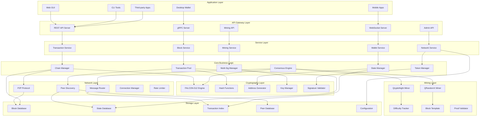
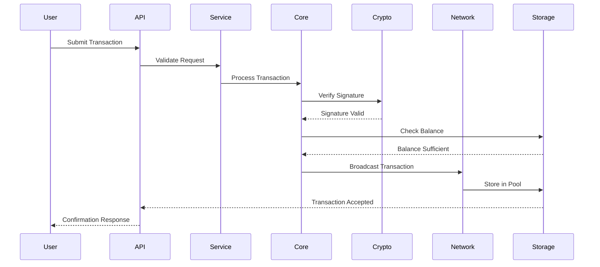
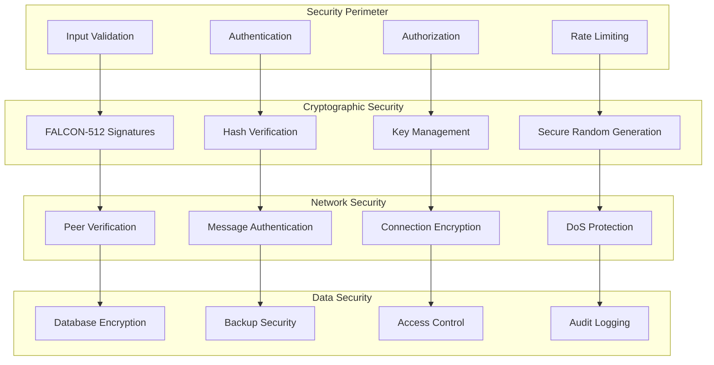

# Qbitcoin Technical Architecture

## System Architecture Overview



## Component Descriptions

### Application Layer
- **Web GUI**: Browser-based interface for blockchain interaction
- **Desktop Wallet**: Native desktop application with full features
- **Mobile Apps**: iOS and Android applications for basic operations
- **CLI Tools**: Command-line utilities for advanced users
- **Third-party Apps**: External applications using Qbitcoin APIs

### API Gateway Layer
- **REST API Server**: HTTP-based API for web integration
- **gRPC Server**: High-performance RPC for backend services
- **WebSocket Server**: Real-time updates and notifications
- **Mining API**: Specialized API for mining pool integration
- **Admin API**: Administrative functions for node operators

### Service Layer
- **Transaction Service**: Transaction creation, validation, and broadcasting
- **Block Service**: Block retrieval, validation, and chain operations
- **Wallet Service**: Wallet management and key operations
- **Mining Service**: Mining coordination and block template generation
- **Network Service**: P2P network management and peer coordination

### Core Business Logic
- **Chain Manager**: Blockchain state management and fork resolution
- **Transaction Pool**: Pending transaction management and ordering
- **State Manager**: Account balances and state transitions
- **Multi-Sig Manager**: Multi-signature wallet operations
- **Token Manager**: Custom token creation and transfers
- **Consensus Engine**: Proof-of-work consensus implementation

### Cryptography Layer
- **FALCON-512 Engine**: Post-quantum signature implementation
- **Hash Functions**: SHA-256 and other cryptographic hashing
- **Address Generator**: Quantum-safe address derivation
- **Key Manager**: Private key storage and management
- **Signature Validator**: Batch signature verification

### Network Layer
- **P2P Protocol**: Peer-to-peer communication protocol
- **Peer Discovery**: Network topology management
- **Message Router**: Message routing and propagation
- **Connection Manager**: Connection lifecycle management
- **Rate Limiter**: Anti-spam and DoS protection

### Storage Layer
- **Block Database**: Persistent block storage using LevelDB
- **State Database**: Account states and balances
- **Transaction Index**: Fast transaction lookup
- **Peer Database**: Known peer information
- **Configuration**: Node configuration and settings

### Mining Layer
- **QryptoNight Miner**: Legacy mining algorithm implementation
- **QRandomX Miner**: Modern mining algorithm for CPU/GPU
- **Difficulty Tracker**: Dynamic difficulty adjustment
- **Block Template**: Mining template generation
- **Proof Validator**: Proof-of-work validation

## Data Flow Architecture



## Security Architecture



## Performance Considerations

### Throughput Optimization
- **Parallel Validation**: Multi-threaded transaction processing
- **Signature Batching**: Batch verification of FALCON signatures
- **Database Optimization**: Efficient storage and retrieval
- **Network Optimization**: Message compression and batching

### Scalability Measures
- **Dynamic Block Size**: Adaptive block size based on network demand
- **State Pruning**: Remove old state data to reduce storage
- **Light Clients**: SPV support for mobile and web clients
- **Layer 2 Integration**: Payment channels and sidechains

### Memory Management
- **Transaction Pool**: Limited size with priority-based eviction
- **Block Cache**: LRU cache for frequently accessed blocks
- **State Cache**: In-memory cache for active account states
- **Peer Management**: Connection limits and cleanup

## Configuration Management

### Node Configuration
```yaml
# Qbitcoin Node Configuration
node:
  data_directory: "/home/user/.qbitcoin"
  log_level: "INFO"
  max_connections: 100
  
network:
  listen_port: 19000
  public_port: 19000
  bootstrap_peers:
    - "134.122.79.166:19000"
    - "220.158.73.254:19000"
    
mining:
  enabled: false
  mining_address: ""
  thread_count: 0  # Auto-detect
  
api:
  public_api:
    enabled: true
    host: "0.0.0.0"
    port: 19009
  admin_api:
    enabled: false
    host: "127.0.0.1"
    port: 19008
```

### Database Configuration
```yaml
# Database Settings
database:
  type: "leveldb"
  path: "blockchain_db"
  cache_size: "100MB"
  write_buffer_size: "4MB"
  compression: "snappy"
  
state_db:
  type: "leveldb"
  path: "state_db"
  cache_size: "200MB"
  bloom_filter_bits: 10
```
