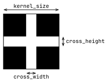
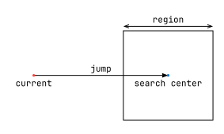

<p align="center">
  
  <br>
  <i>Segmentation of tables from images</i>
  <br>
  <br>
  <a href="https://pypi.org/project/taulu/">
    
  </a>
  
</p>

<p align="center">
<a href="https://ghentcdh.github.io/taulu">Documentation</a>
</p>

## Data Requirements

This package assumes that you are working with images of tables that have **clearly visible rules** (the lines that divide the table into cells).

To fully utilize the automated workflow, your tables should include a recognizable header. This header will be used to identify the position of the first cell in the input image and determine the expected widths of the table's cells.

For optimal segmentation, ensure that the tables are rotated so the borders are approximately vertical and horizontal. Minor page warping is acceptable.

## Installation

### Using pip

```sh
pip install taulu
```

### Using uv

```sh
uv add taulu
```

## Usage

```python
from taulu import Taulu
import os


def setup():
    # create an Annotation file of the headers in the image
    # (one for the left header, one for the right)
    # and store them in the examples directory
    print("Annotating the LEFT header...")
    Taulu.annotate("../data/table_00.png", "table_00_header_left.png")

    print("Annotating the RIGHT header...")
    Taulu.annotate("../data/table_00.png", "table_00_header_right.png")


def main():
    taulu = Taulu(("table_00_header_left.png", "table_00_header_right.png"))
    table = taulu.segment_table("../data/table_00.png", 0.8, debug_view=True)

    table.show_cells("../data/table_00.png")


if __name__ == "__main__":
    if os.path.exists("table_00_header_left.png") and os.path.exists(
        "table_00_header_right.png"
    ):
        main()
    else:
        setup()
        main()
```

This file can be found at `examples/example.py`. To run it, clone this repository, create a uv
project, and run the script:

```
git clone git@github.com:GhentCDH/taulu.git
cd taulu
uv init --no-workspace --bare
uv run example.py
```

During this example, you will need to annotate the header image. You do this by simply clicking twice per line, once for each endpoint. It does not matter in which order you annotate the lines. Example:


Below is an example of table cell identification using the `Taulu` package:


## Workflow

This package is structured in a modular way, with several components that work together.

The Taulu class combines the components into one simple API, as seen in [Usage](#usage)

The algorithm identifies the header's location in the input image, which provides a starting point. From there, it scans the image to find intersections of the rules (borders) and segments the image into cells accordingly.

The output is a `TableGrid` object that contains the detected intersections and which defines some useful methods, enabling you to segment the image into rows, columns, and cells.

The main classes are:

- `HeaderAligner`: Uses template matching to identify the header's location in the input images.
- `HeaderTemplate`: Stores header template information by reading an annotation JSON file. You can create this file by running `HeaderTemplate.annotate_image`.
- `GridDetector`: Processes the image to identify intersections of horizontal and vertical lines (borders). To see its progress, you can run it with `debug_view=True`. This should allow you to tune the parameters to your data.

## Parameters and Methods

The taulu algorithm has a number of parameters which you might need to tune in order for it to fit your data's characteristics.
The following is a summary of the most important parameters and how you could tune them to your data.

### `Taulu`

- `header_path`: a path of the header image which has an annotation associated with it. The annotation is assumed to have the same path, but with a `json` suffix (this is the case when created with `Taulu.annotate`). When working with images that have two tables (or one table, split across two pages), you can supply a tuple of the left and right header images.
- `kernel_size`, `cross_width`: The GridDetector uses a kernel to detect intersections of rules in the image. The kernel looks like this:

  

  The goal is to make this kernel look like the actual corners in your images after thresholding and dilation. The example script shows the dilated result (because `debug_view=True`), which you can use to estimate the `cross_width` and `kernel_size` values that fit your image.
  Note that the optimal values will depend on the `morph_size` parameter too.

- `morph_size`: The GridDetector uses a dilation step in order to _connect lines_ in the image that might be broken up after thresholding. With a larger `morph_size`, larger gaps in the lines will be connected, but it will also lead to much thicker lines. As a result, this parameter affects the optimal `cross_width` and `cross_height`.
- `region`: This parameter influences the search algorithm. The algorithm has a rough idea of where the next corner point should be. At that location, the algorithm then finds the best match that is within a square of size `region` around that point, and selects that as the detected corner. Visualized:

  

  A larger region will be more forgiving for warping or other artefacts, but could lead to false positives too. You can see this region as blue squares when running the segmentation with `debug_view=True`

- `sauvola_k`: This parameter adjusts the threshold that is used when binarizing the image. The larger `sauvola_k` more pixels will be mapped to zero. You should increase this parameter until most of the noise is gone in your image, without removing too many pixels from the actual lines of the table.

**These methods are the most useful**:

- `Taulu.annotate`: create an annotation file for a header image. This requires an image of a table with a clear header. Taulu will first ask you to crop the header in the image (by clicking four points, one for each corner). Then, it will ask you to annotate the lines in the header (by clicking two points per line, one for each endpoint). The annotation file will be saved as a `json` file and a `png` with the same name.
- `Taulu.segment_table`: given an input image, segment into a `TableGrid` object.
  - `cell_height_factor`: a float or a list of floats that determine the expected height of each row in the table, relative to the height of the header. If the list is shorter than the number of rows, the last value will be repeated for the remaining rows. If a single float is given, it will be used for all rows.

### `TableGrid`

`Taulu.segment_table` returns a `TableGrid` instance, which you can use to get information about the location and bounding box of cells in your image.

These methods are the most useful:

- `save`: save the `TableGrid` object as a `json` file
- `from_saved`: restore a `TableGrid` object from a `json` file
- `cell`: given a location in the image (`(tuple[float, float]`), return the cell index `(row, column)`
- `cell_polygon`: get the polygon (left top, right top, right bottom, left bottom) of the cell in the image
- `region`: given a start and end cell, get the polygon that surrounds all cells in between (inclusive range)
- `highlight_all_cells`: highlight all cell edges on an image
- `show_cells`: interactively highlight cells you click on in the image (in an OpenCV window)
- `crop_cell` and `crop_region`: crop the image to the supplied cell or region
