# Temporal Architecture Documentation

This document provides a detailed explanation of the Temporal model architecture.

## Overview

Temporal is a transformer-based model specifically designed for time series forecasting. It leverages the self-attention mechanism to capture complex temporal dependencies and patterns in sequential data.

### Quick Visual Overview


**📊 For complete diagrams**, see [DIAGRAMS.md](DIAGRAMS.md)

## Architecture Components

### 1. Input Processing

#### Input Embedding
- **Purpose**: Project input time series to model dimension
- **Implementation**: Linear layer mapping from `input_dim` to `d_model`
- **Input**: (batch_size, seq_len, input_dim)
- **Output**: (batch_size, seq_len, d_model)

```python
self.input_embedding = nn.Linear(input_dim, d_model)
```



```mermaid
graph LR
    A[Input<br/>batch, seq_len, input_dim] --> B[Linear<br/>input_dim → d_model]
    B --> C[Output<br/>batch, seq_len, d_model]

    style A fill:#e1f5ff
    style C fill:#e1ffe1
```

#### Positional Encoding
- **Purpose**: Inject temporal position information
- **Types**:
  - **Sinusoidal**: Fixed encoding using sin/cos functions
  - **Learnable**: Trainable positional embeddings

**Sinusoidal Encoding Formula**:
```
PE(pos, 2i) = sin(pos / 10000^(2i/d_model))
PE(pos, 2i+1) = cos(pos / 10000^(2i/d_model))
```

### 2. Encoder

The encoder processes the input time series to extract meaningful representations.


#### Encoder Layer Structure

Each encoder layer consists of:

1. **Multi-Head Self-Attention**
   - Allows the model to attend to different positions in the input sequence
   - Number of heads: typically 8-16
   - Each head dimension: d_k = d_model / num_heads

2. **Feed-Forward Network**
   - Two linear transformations with GELU activation
   - Hidden dimension: typically 4 × d_model

   ```
   FFN(x) = Linear2(GELU(Linear1(x)))
   ```

3. **Residual Connections**
   - Add input to output of each sub-layer
   - Helps with gradient flow

   ```
   output = LayerNorm(x + Sublayer(x))
   ```

4. **Layer Normalization**
   - Applied after each residual connection
   - Stabilizes training

**Full Encoder Layer**:
```
x = LayerNorm(x + MultiHeadAttention(x, x, x))
x = LayerNorm(x + FeedForward(x))
```

### 3. Decoder

The decoder generates forecasts using both encoder output and previously generated values.


#### Decoder Layer Structure

Each decoder layer consists of:

1. **Masked Multi-Head Self-Attention**
   - Attends to previously generated positions
   - Uses causal mask to prevent looking ahead
   - Ensures autoregressive property

2. **Cross-Attention**
   - Attends to encoder output
   - Query from decoder, Key and Value from encoder
   - Incorporates information from input sequence

3. **Feed-Forward Network**
   - Same structure as encoder FFN

4. **Residual Connections and Layer Normalization**
   - Applied after each sub-layer

**Full Decoder Layer**:
```
x = LayerNorm(x + MaskedSelfAttention(x, x, x))
x = LayerNorm(x + CrossAttention(x, encoder_out, encoder_out))
x = LayerNorm(x + FeedForward(x))
```

### 4. Multi-Head Attention

The core mechanism for capturing dependencies.

#### Scaled Dot-Product Attention

```
Attention(Q, K, V) = softmax(QK^T / √d_k) V
```

Where:
- Q: Query matrix
- K: Key matrix
- V: Value matrix
- d_k: Dimension of key vectors
- √d_k: Scaling factor to prevent extreme softmax values

#### Multi-Head Mechanism

```
MultiHead(Q, K, V) = Concat(head_1, ..., head_h) W^O

where head_i = Attention(QW_i^Q, KW_i^K, VW_i^V)
```

Benefits:
- Attend to different representation subspaces
- Capture various types of relationships
- Parallel computation

### 5. Output Projection

- **Purpose**: Map decoder output to forecast values
- **Implementation**: Linear layer from `d_model` to `input_dim`
- **Output**: (batch_size, forecast_horizon, input_dim)

```python
self.output_projection = nn.Linear(d_model, input_dim)
```

## Training vs. Inference

### Training Mode (Teacher Forcing)

1. **Input**: Historical data + actual future values
2. **Process**:
   - Encode historical data
   - Decode using actual future values (shifted)
   - Predict all time steps in parallel
3. **Advantage**: Faster training, stable gradients

```python
output = model(src=historical, tgt=future_values)
```

### Inference Mode (Autoregressive)

1. **Input**: Historical data only
2. **Process**:
   - Encode historical data
   - Generate one step at a time
   - Use previous prediction as input for next step
3. **Steps**:
   ```
   for t in range(horizon):
       pred_t = model(history, previous_predictions)
       append pred_t to previous_predictions
   ```

## Model Sizes

### Small Configuration
- d_model: 128
- Encoder layers: 2
- Decoder layers: 2
- Attention heads: 4
- FFN dimension: 512
- Parameters: ~1M

### Medium Configuration
- d_model: 256
- Encoder layers: 4
- Decoder layers: 4
- Attention heads: 8
- FFN dimension: 1024
- Parameters: ~10M

### Large Configuration
- d_model: 512
- Encoder layers: 6
- Decoder layers: 6
- Attention heads: 16
- FFN dimension: 2048
- Parameters: ~50M

## Computational Complexity

### Time Complexity
- Self-Attention: O(n² · d)
- Feed-Forward: O(n · d²)
- Total per layer: O(n² · d + n · d²)

Where:
- n: sequence length
- d: model dimension

### Space Complexity
- Model parameters: O(L · d²)
- Attention matrices: O(n²)

Where:
- L: number of layers

## Key Design Decisions

### 1. Why Encoder-Decoder?
- **Encoder**: Processes entire input sequence in parallel
- **Decoder**: Generates forecast autoregressively
- **Benefit**: Leverages full context while maintaining sequential generation

### 2. Why Multi-Head Attention?
- Captures different types of patterns simultaneously
- Some heads may focus on recent trends
- Others may capture seasonal patterns
- Improves model expressiveness

### 3. Why Residual Connections?
- Enables deep networks (6+ layers)
- Improves gradient flow
- Allows learning of residual functions

### 4. Why Layer Normalization?
- Stabilizes training
- Reduces internal covariate shift
- Enables higher learning rates

## Comparison with Other Architectures

| Feature | RNN/LSTM | Temporal (Transformer) |
|---------|----------|------------------------|
| Parallelization | Sequential | Parallel |
| Long-term dependencies | Limited | Excellent |
| Training speed | Slower | Faster |
| Memory | O(n) | O(n²) |
| Interpretability | Low | High (attention) |

## Extensions and Variations

### 1. Informer-style Sparse Attention
- For very long sequences
- Reduces O(n²) to O(n log n)

### 2. Multi-scale Temporal Attention
- Different heads attend to different timescales
- Explicitly model hourly, daily, weekly patterns

### 3. Hierarchical Structure
- Multiple levels of abstraction
- Coarse-to-fine forecasting

### 4. Incorporating External Features
- Add covariates (weather, holidays, etc.)
- Separate embedding for each feature type

## References

1. Vaswani et al., "Attention is All You Need" (2017)
2. Wu et al., "Autoformer: Decomposition Transformers with Auto-Correlation for Long-Term Series Forecasting" (2021)
3. Zhou et al., "Informer: Beyond Efficient Transformer for Long Sequence Time-Series Forecasting" (2021)
4. Modern transformer-based time series forecasting research
