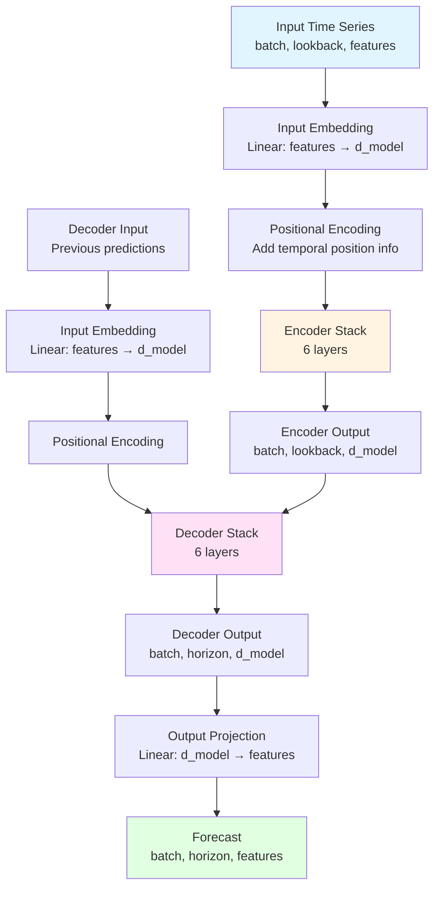
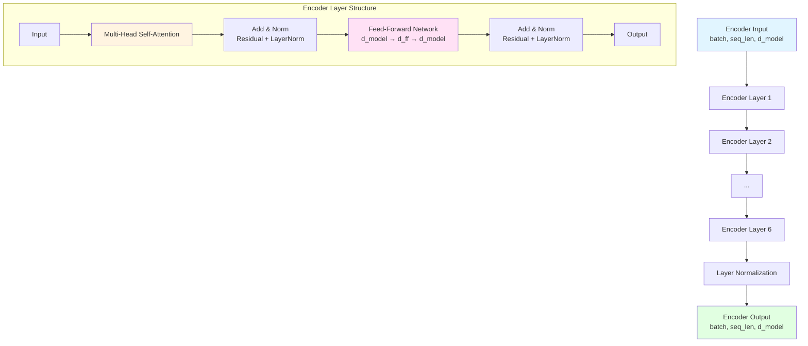
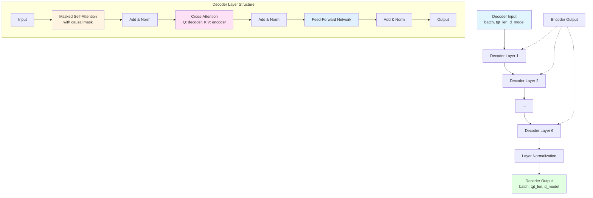
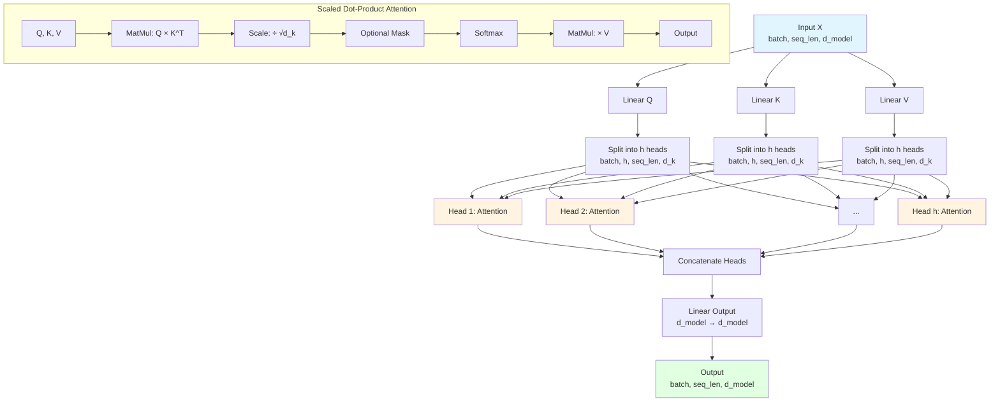
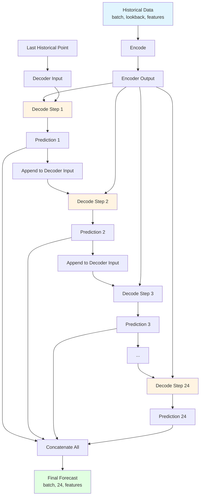
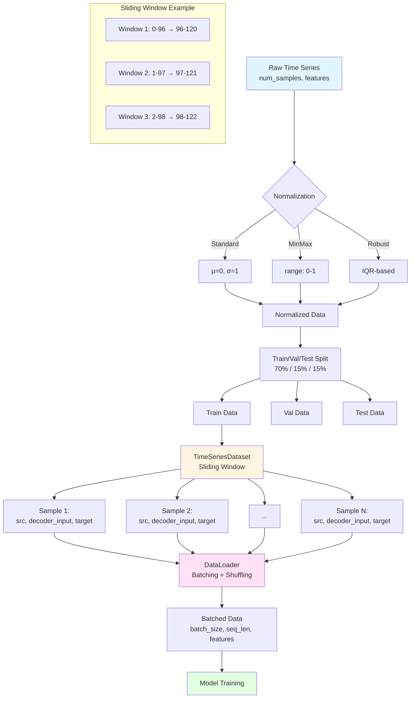
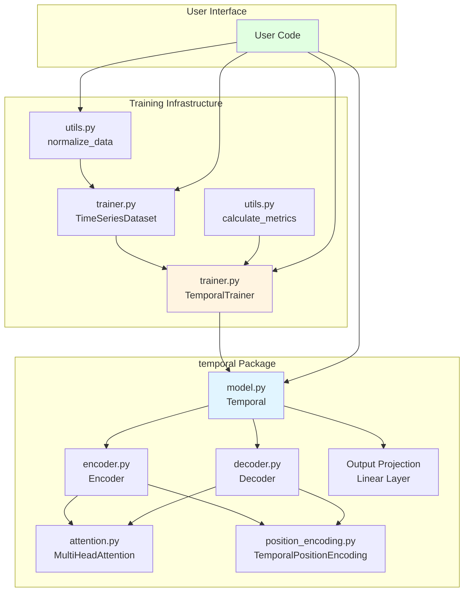
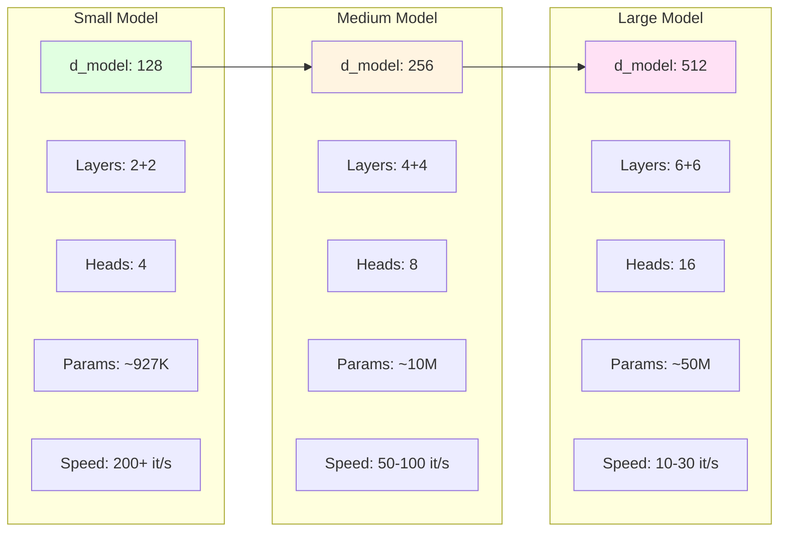
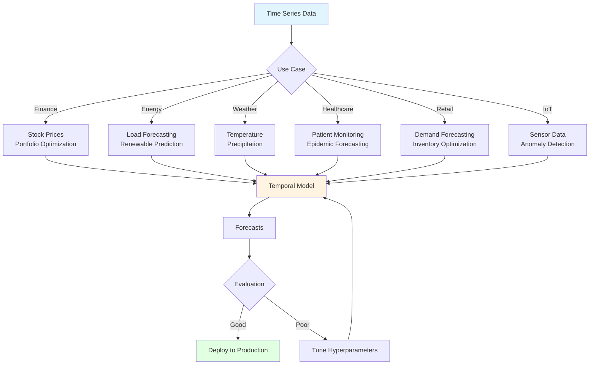

# Temporal Architecture Diagrams

This document contains visual diagrams of the Temporal model architecture using Mermaid.

## Table of Contents
- [Overall Architecture](#overall-architecture)
- [Encoder Architecture](#encoder-architecture)
- [Decoder Architecture](#decoder-architecture)
- [Multi-Head Attention](#multi-head-attention)
- [Training Flow](#training-flow)
- [Inference Flow](#inference-flow)
- [Data Pipeline](#data-pipeline)

---

## Overall Architecture

---

## Encoder Architecture

---

## Decoder Architecture

---

## Multi-Head Attention

---

## Training Flow

```mermaid
graph LR
    A[Raw Time Series] --> B[Normalize Data]
    B --> C[Create Sliding Windows<br/>lookback → horizon]
    C --> D[DataLoader<br/>batch_size=32]

    D --> E[Forward Pass]
    E --> E1[Encode Source]
    E1 --> E2[Decode with Teacher Forcing<br/>use actual target values]
    E2 --> E3[Compute Loss<br/>MSE predictions vs targets]

    E3 --> F[Backward Pass]
    F --> F1[loss.backward]
    F1 --> F2[Gradient Clipping<br/>max_norm=1.0]
    F2 --> F3[Optimizer Step<br/>AdamW]

    F3 --> G{Epoch Complete?}
    G -->|No| D
    G -->|Yes| H[Validate]

    H --> I[Compute Val Loss]
    I --> J{Early Stop?}
    J -->|No| K{More Epochs?}
    J -->|Yes| L[Training Complete]
    K -->|Yes| D
    K -->|No| L

    L --> M[Best Model Saved]

    style A fill:#e1f5ff
    style M fill:#e1ffe1
    style E2 fill:#fff4e1
    style F2 fill:#ffe1f5
```

---

## Inference Flow

---

## Data Pipeline

---

## Component Interaction

---

## Model Size Comparison

---

## Use Cases Flow

---

## Notes

- All diagrams render automatically on GitHub
- Diagrams use Mermaid syntax (supported natively in GitHub Markdown)
- Color coding:
  - Light blue: Input data
  - Light green: Output/results
  - Light yellow: Processing steps
  - Light pink: Critical operations
  - Light purple: Alternative options

For more details, see:
- [ARCHITECTURE.md](ARCHITECTURE.md) - Detailed architecture documentation
- [DESIGN_OVERVIEW.md](DESIGN_OVERVIEW.md) - Visual text-based diagrams
- [README.md](README.md) - Complete usage guide
