# UML Diagram - TSFM Codebase

```mermaid
classDiagram
    %% Exceptions
    class TSFMError {
        <<Exception>>
    }
    
    class InvalidInputError {
        <<Exception>>
        +__init__(message: str)
    }
    
    Exception <|-- TSFMError
    TSFMError <|-- InvalidInputError
    
    %% Output Classes
    class ForecastOutput {
        -df_preds: DataFrame
        -meta: dict[str, Any]
        +rmsfe: DataFrame
        +mae: DataFrame
        +me: DataFrame
        +metric(name: Literal) DataFrame
        +summary(digits: int) None
        +plot_actual_vs_pred(horizon: int, ax: Axes, start: Timestamp, end: Timestamp, return_ax: bool) Axes
        -_agg_mean(s: Series, name: str, post: Callable) DataFrame
        -_summary(digits: int) str
    }
    
    %% Base Model (Abstract)
    class Model {
        <<Abstract>>
        +registry: ClassVar[dict]
        +name: property
        +__init_subclass__(cls, name: str, **kwargs)
        +build(name: str, **kwargs) Model
        +_pred(df: DataFrame, y: str, X: list, ctx_len: int, horizon: int, oos_start: str)* DataFrame
        +pred(df: DataFrame, y: str, X: list, ctx_len: int, horizon: int, oos_start: str) ForecastOutput
    }
    
    ABC <|-- Model
    
    %% ARModel
    class ARModel {
        +_pred(df: DataFrame, y: str, X: list, ctx_len: int, horizon: int, oos_start: str) DataFrame
    }
    
    Model <|-- ARModel : name="armodel"
    ARModel ..> InvalidInputError : raises
    ARModel ..> ForecastOutput : creates
    
    %% Moirai Model
    class Moirai {
        +get_model(ctx_len: int, horizon: int, n_covariates: int) MoiraiForecast
        +_pred(df: DataFrame, y: str, X: list, ctx_len: int, horizon: int, oos_start: str) DataFrame
    }
    
    Model <|-- Moirai : name="moirai"
    Moirai ..> ForecastOutput : creates
    
    %% Moirai2 Model
    class Moirai2 {
        +get_model(ctx_len: int, horizon: int, n_covariates: int) Moirai2Forecast
        +_pred(df: DataFrame, y: str, X: list, ctx_len: int, horizon: int, oos_start: str) DataFrame
    }
    
    Model <|-- Moirai2 : name="moirai2"
    Moirai2 ..> ForecastOutput : creates
    
    %% Data Module Functions
    class DataModule {
        <<module: data.py>>
        +generator(n: int, phi: float, beta0: float, beta1: float, sigma: float, trend: float, season_period: int, season_ampl: float, seed: int) DataFrame
        +split_is_oos(df: DataFrame, test_frac: float) tuple[DataFrame, DataFrame]
    }
    
    %% ARModel Helper Functions
    class ARModelHelpers {
        <<module: armodel.py>>
        +create_lags(var: Series, lags: int) DataFrame
        +get_design_matrix(ys: Series, y_lags: int, horizon: int) tuple[Series, DataFrame]
        +fit(ys: Series, y_lags: int, horizon: int) RegressionResultsWrapper
        +pred(ys: Series, y_lags: int, horizon: int, oos_start: str) Series
        +build_oos_panel(ys: Series, y_lags: int, horizon: int, oos_start: str) DataFrame
        -_to_month_end(idx: Index) DatetimeIndex
    }
    
    ARModel ..> ARModelHelpers : uses
    
    %% Moirai Helper Functions
    class MoiraiHelpers {
        <<module: moirai.py>>
        +make_fc_df(forecasts: list, y_true_series: Series) DataFrame
        +prepare_data(df: DataFrame, y: str, X: list, horizon: int, oos_start: str) TestData
        +MODEL_ID: str
    }
    
    Moirai ..> MoiraiHelpers : uses
    
    %% Moirai2 Helper Functions
    class Moirai2Helpers {
        <<module: moirai2.py>>
        +make_fc_df(forecasts: list, y_true_series: Series) DataFrame
        +prepare_data(df: DataFrame, y: str, X: list, horizon: int, oos_start: str) TestData
        +MODEL_ID: str
    }
    
    Moirai2 ..> Moirai2Helpers : uses
    
    %% Output Helper Functions
    class OutputHelpers {
        <<module: outputs.py>>
        +get_horizon_groupby(df: DataFrame) Index
    }
    
    ForecastOutput ..> OutputHelpers : uses
    
    %% Relationships with external libraries
    Model ..> ForecastOutput : returns
    
    %% Package level
    class TSFMPackage {
        <<module: __init__.py>>
        +ARModel
        +Model
        +Moirai
        +Moirai2
        +generator
    }
    
    TSFMPackage ..> ARModel : exports
    TSFMPackage ..> Model : exports
    TSFMPackage ..> Moirai : exports
    TSFMPackage ..> Moirai2 : exports
    TSFMPackage ..> DataModule : exports generator

    %% Notes
    note for Model "Registry pattern:\nSubclasses auto-register\nby name parameter"
    
    note for ForecastOutput "Contains forecast results\nwith MultiIndex[cutoff, oos_date]\nand metrics calculation"
    
    note for ARModel "Autoregressive model\nusing statsmodels OLS\nwith HAC standard errors"
    
    note for Moirai "Pretrained foundation model\nfrom Salesforce\nmodel: moirai-1.1-R-small"
    
    note for Moirai2 "Pretrained foundation model\nfrom Salesforce\nmodel: moirai-2.0-R-small\nuses uni2ts library"
```

## Class Descriptions

### Core Classes

1. **Model (Abstract Base Class)**
   - Registry pattern for dynamic model creation
   - All models inherit from this class
   - Defines interface: `_pred()` (abstract) and `pred()` (concrete)
   - Registry allows building models by name

2. **ARModel**
   - Autoregressive time series model
   - Uses statsmodels for OLS regression with HAC standard errors
   - Does not support covariates (raises `InvalidInputError`)
   - Implements expanding window forecasting

3. **Moirai**
   - Wrapper for Salesforce's Moirai foundation model
   - Supports covariates
   - Uses GluonTS for data preparation
   - Generates 100 samples for probabilistic forecasting

4. **Moirai2**
   - Wrapper for Salesforce's Moirai 2.0 foundation model
   - Supports covariates
   - Uses uni2ts library for inference
   - Uses quantile-based forecasting (median as point forecast)

### Data Structures

5. **ForecastOutput**
   - Dataclass containing forecast results
   - MultiIndex DataFrame: (cutoff, oos_date)
   - Cached properties for metrics: RMSFE, MAE, ME
   - Methods for summary statistics and plotting

### Exceptions

6. **TSFMError**
   - Base exception for the package

7. **InvalidInputError**
   - Raised when input validation fails

### Utility Modules

8. **DataModule (data.py)**
   - `generator()`: Simulates time series with AR, trend, seasonality
   - `split_is_oos()`: Splits data into train/test

9. **Helper Functions**
   - ARModel helpers: lag creation, design matrix, OLS fitting
   - Moirai helpers: forecast formatting, data preparation
   - Moirai2 helpers: forecast formatting, data preparation (uni2ts-based)
   - Output helpers: horizon grouping utilities

## Architecture Patterns

- **Registry Pattern**: Models self-register via `__init_subclass__`
- **Template Method**: Base `Model.pred()` calls abstract `_pred()`
- **Dataclass**: `ForecastOutput` with cached properties
- **Facade**: Simple interface (`pred()`) over complex forecasting logic
