<div align="center">
  
</div>

# Time Series Forecasting Models (TSFM)

A unified Python framework for time series forecasting that makes it easy to switch between classical statistical models and modern foundation models with just a single line of code.

## Why TSFM?

Forecasting time series data shouldn't require rewriting your entire pipeline when you want to try a different model. TSFM provides:

- **One Interface, Multiple Models**: Switch from autoregressive models to state-of-the-art foundation models (Moirai, Chronos) by changing just the model name
- **Works With Any Frequency**: Automatically detects whether your data is monthly, quarterly, weekly, or daily - no manual configuration needed
- **Batteries Included**: Built-in metrics (RMSFE, MAE, ME), visualizations, and prediction intervals out of the box
- **Production Ready**: Consistent API across all models makes it easy to integrate into your workflow

## Quick Start

### Installation

Create a dedicated conda environment:

```bash
conda create -n tsfm python==3.12 ipykernel
conda activate tsfm
pip install tsfmecb
# Optional: register Jupyter kernel if you work within a notebook environment
python -m ipykernel install --user --name=tsfm --display-name "tsfm"
```

### Your First Forecast

```python
from tsfm import Model, generator

# Generate some sample data (or use your own DataFrame)
df = generator()

# Build a model - try "armodel", "moirai", "moirai2", "chronos", or "chronos2"
mdl = Model.build(name="moirai2")

# Generate forecasts
yhs = mdl.pred(df, y="y", ctx_len=12, horizon=6, oos_start="2005-01-31")

# View results
yhs.summary()  # See metrics
yhs.plot_actual_vs_pred(horizon=1)  # Visualize forecasts
```

That's it! The model automatically:
- Detects your data frequency
- Handles the forecasting
- Computes accuracy metrics
- Provides prediction intervals

### Try Different Models

The beauty of TSFM is how easy it is to compare models:

```python
# Classical autoregressive model
mdl_ar = Model.build(name="armodel")
yhs_ar = mdl_ar.pred(df, y="y", ctx_len=12, horizon=6, oos_start="2005-01-31")

# Salesforce Moirai foundation model
mdl_moirai = Model.build(name="moirai2")
yhs_moirai = mdl_moirai.pred(df, y="y", ctx_len=12, horizon=6, oos_start="2005-01-31")

# Amazon Chronos foundation model
mdl_chronos = Model.build(name="chronos2")
yhs_chronos = mdl_chronos.pred(df, y="y", ctx_len=12, horizon=6, oos_start="2005-01-31")

# Compare accuracy
print(f"AR RMSFE: {yhs_ar.rmsfe.values.mean():.3f}")
print(f"Moirai RMSFE: {yhs_moirai.rmsfe.values.mean():.3f}")
print(f"Chronos RMSFE: {yhs_chronos.rmsfe.values.mean():.3f}")
```

### Works With Any Frequency

Have quarterly data? No problem:

```python
# Resample to quarterly
df_quarterly = df.resample('Q').mean()

# Same code works - frequency is detected automatically
mdl = Model.build(name="moirai2")
yhs = mdl.pred(df_quarterly, y="y", ctx_len=4, horizon=2, oos_start="2005Q1")

# horizon=1 now means "next quarter" (not next month!)
yhs.plot_actual_vs_pred(horizon=1)
```

Supports monthly (M), quarterly (Q), weekly (W), daily (D), and any pandas frequency.

## Available Models

| Model | Type | Covariates | Speed |
|-------|------|------------|-------|
| `armodel` | Classical AR | ❌ | ⚡⚡⚡ |
| `moirai` | Foundation (Salesforce 1.1) | ✅ | ⚡⚡ |
| `moirai2` | Foundation (Salesforce 2.0) | ✅ | ⚡⚡ |
| `chronos` | Foundation (Amazon Bolt) | ❌ | ⚡⚡ |
| `chronos2` | Foundation (Amazon 2.0) | ✅ | ⚡⚡ |

## What You Get

Every forecast returns a `ForecastOutput` object with:

- **Predictions**: Full DataFrame with actuals vs predictions by horizon and quantile
- **Metrics**: RMSFE, MAE, ME computed automatically
- **Visualization**: Built-in plotting with prediction intervals
- **Uncertainty**: Quantile forecasts (10th, 50th, 90th percentiles, etc.)

```python
# Access predictions
yhs.df_preds  # MultiIndex DataFrame

# Get metrics by horizon
yhs.rmsfe  # Root Mean Squared Forecast Error
yhs.mae    # Mean Absolute Error
yhs.me     # Mean Error

# Quick summary
yhs.summary()

# Plot with uncertainty bands
yhs.plot_actual_vs_pred(horizon=1)
```

## Learn More

Check out the [tutorial notebook](https://github.com/IliasAarab/tsfm/blob/main/notebooks/tutorial.ipynb) for:
- Data format requirements
- Model selection guidance
- Uncertainty quantification
- Troubleshooting tips
- Advanced usage examples

---

## Technical Documentation

### Architecture Overview

TSFM is a unified time series forecasting framework that supports multiple frequencies (monthly, quarterly, etc.) with automatic frequency inference. It provides a consistent interface across classical statistical models and modern foundation models.

### Key Features

- **Automatic Frequency Inference**: No need to specify data frequency - it's detected from the DataFrame's DatetimeIndex
- **Multiple Model Support**: Classical AR models and state-of-the-art foundation models (Moirai, Chronos)
- **Unified API**: Consistent interface across all models with `pred()` method
- **Frequency-Aware Metrics**: Horizons adapt to your data frequency (horizon=1 means next period, regardless of frequency)
- **Rich Outputs**: Built-in metrics (RMSFE, MAE, ME) and visualization with prediction intervals

### UML Diagram

```mermaid
classDiagram
    %% Exceptions
    class TSFMError {
        <<Exception>>
    }
    
    class InvalidInputError {
        <<Exception>>
        +__init__(message: str)
    }
    
    Exception <|-- TSFMError
    TSFMError <|-- InvalidInputError
    
    %% Output Classes
    class ForecastOutput {
        -df_preds: DataFrame
        -meta: dict[str, Any]
        +rmsfe: DataFrame
        +mae: DataFrame
        +me: DataFrame
        +metric(name: Literal) DataFrame
        +summary(digits: int) None
        +plot_actual_vs_pred(horizon: int, ax: Axes, start: Timestamp, end: Timestamp, return_ax: bool) Axes
        -_agg_mean(s: Series, name: str, post: Callable) DataFrame
        -_summary(digits: int) str
    }
    
    %% Base Model (Abstract)
    class Model {
        <<Abstract>>
        +registry: ClassVar[dict]
        +name: property
        +__init_subclass__(cls, name: str, **kwargs)
        +build(name: str, **kwargs) Model
        +get_backbone() Any*
        +_pred(df: DataFrame, y: str, X: list, ctx_len: int, horizon: int, oos_start: str)* DataFrame
        +pred(df: DataFrame, y: str, X: list, ctx_len: int, horizon: int, oos_start: str) ForecastOutput
    }
    
    ABC <|-- Model
    
    %% ARModel
    class ARModel {
        +get_backbone() None
        +_pred(df: DataFrame, y: str, X: list, ctx_len: int, horizon: int, oos_start: str) DataFrame
    }
    
    Model <|-- ARModel : name="armodel"
    ARModel ..> InvalidInputError : raises
    ARModel ..> ForecastOutput : creates
    
    %% Moirai Model
    class Moirai {
        +get_backbone() MoiraiModule
        +get_model(ctx_len: int, horizon: int, n_covariates: int) MoiraiForecast
        +_pred(df: DataFrame, y: str, X: list, ctx_len: int, horizon: int, oos_start: str) DataFrame
    }
    
    Model <|-- Moirai : name="moirai"
    Moirai ..> ForecastOutput : creates
    
    %% Moirai2 Model
    class Moirai2 {
        +get_backbone() Moirai2Module
        +get_model(ctx_len: int, horizon: int, n_covariates: int) Moirai2Forecast
        +_pred(df: DataFrame, y: str, X: list, ctx_len: int, horizon: int, oos_start: str) DataFrame
    }
    
    Model <|-- Moirai2 : name="moirai2"
    Moirai2 ..> ForecastOutput : creates
    
    %% Chronos Model
    class Chronos {
        +get_backbone() BaseChronosPipeline
        +_pred(df: DataFrame, y: str, X: list, ctx_len: int, horizon: int, oos_start: str) DataFrame
    }
    
    Model <|-- Chronos : name="chronos"
    Chronos ..> ForecastOutput : creates
    
    %% Chronos2 Model
    class Chronos2 {
        +get_backbone() Chronos2Pipeline
        +_pred(df: DataFrame, y: str, X: list, ctx_len: int, horizon: int, oos_start: str) DataFrame
    }
    
    Model <|-- Chronos2 : name="chronos2"
    Chronos2 ..> ForecastOutput : creates
    
    %% Data Module Functions
    class DataModule {
        <<module: data.py>>
        +infer_freq(df: DataFrame) str
        +generator(n: int, phi: float, beta0: float, beta1: float, sigma: float, trend: float, season_period: int, season_ampl: float, seed: int) DataFrame
        +split_is_oos(df: DataFrame, test_frac: float) tuple[DataFrame, DataFrame]
    }
    
    %% ARModel Helper Functions
    class ARModelHelpers {
        <<module: armodel.py>>
        +create_lags(var: Series, lags: int) DataFrame
        +get_design_matrix(ys: Series, y_lags: int, horizon: int) tuple[Series, DataFrame]
        +fit(ys: Series, y_lags: int, horizon: int) RegressionResultsWrapper
        +pred(ys: Series, y_lags: int, horizon: int, oos_start: str) Series
        +build_oos_panel(ys: Series, y_lags: int, horizon: int, oos_start: str, freq: str) DataFrame
        -_to_period_end(idx: Index, freq: str) DatetimeIndex
    }
    
    ARModel ..> ARModelHelpers : uses
    
    %% Moirai Helper Functions
    class MoiraiHelpers {
        <<module: moirai.py>>
        +make_fc_df(forecasts: list, y_true_series: Series, freq: str) DataFrame
        +prepare_data(df: DataFrame, y: str, X: list, horizon: int, oos_start: str, freq: str) TestData
        +MODEL_ID: str
    }
    
    Moirai ..> MoiraiHelpers : uses
    
    %% Moirai2 Helper Functions
    class Moirai2Helpers {
        <<module: moirai2.py>>
        +make_fc_df(forecasts: list, y_true_series: Series, freq: str) DataFrame
        +prepare_data(df: DataFrame, y: str, X: list, horizon: int, oos_start: str, freq: str) TestData
        +MODEL_ID: str
    }
    
    Moirai2 ..> Moirai2Helpers : uses
    
    %% Chronos Helper Functions
    class ChronosHelpers {
        <<module: chronos.py>>
        +prepare_data(df: DataFrame, y: str, X: list, ctx_len: int, oos_start: str, freq: str) DataFrame
        +make_fc_df(forecasts: DataFrame, y_true: DataFrame, horizon: int, freq: str) DataFrame
        +BOLT_MODEL_ID: str
    }
    
    Chronos ..> ChronosHelpers : uses
    
    %% Chronos2 Helper Functions
    class Chronos2Helpers {
        <<module: chronos2.py>>
        +prepare_data(df: DataFrame, y: str, X: list, ctx_len: int, oos_start: str, freq: str) DataFrame
        +make_fc_df(forecasts: DataFrame, y_true: DataFrame, horizon: int, freq: str) DataFrame
        +MODEL_ID: str
    }
    
    Chronos2 ..> Chronos2Helpers : uses
    
    %% Output Helper Functions
    class OutputHelpers {
        <<module: outputs.py>>
        +get_horizon_groupby(df: DataFrame, freq: str) Index
    }
    
    ForecastOutput ..> OutputHelpers : uses
    
    %% Relationships with external libraries
    Model ..> ForecastOutput : returns
    Model ..> DataModule : uses infer_freq
    
    %% Package level
    class TSFMPackage {
        <<module: __init__.py>>
        +ARModel
        +Model
        +Moirai
        +Moirai2
        +Chronos
        +Chronos2
        +generator
    }
    
    TSFMPackage ..> ARModel : exports
    TSFMPackage ..> Model : exports
    TSFMPackage ..> Moirai : exports
    TSFMPackage ..> Moirai2 : exports
    TSFMPackage ..> Chronos : exports
    TSFMPackage ..> Chronos2 : exports
    TSFMPackage ..> DataModule : exports generator

    %% Notes
    note for Model "Registry pattern:\nSubclasses auto-register\nby name parameter\nAuto-infers frequency from data"
    
    note for ForecastOutput "Contains forecast results\nwith MultiIndex[cutoff, oos_date]\nFrequency-aware metrics\nand visualization"
    
    note for ARModel "Autoregressive model\nusing statsmodels OLS\nwith HAC standard errors\nNo covariate support"
    
    note for Moirai "Pretrained foundation model\nfrom Salesforce\nmodel: moirai-1.1-R-small\nSupports covariates"
    
    note for Moirai2 "Pretrained foundation model\nfrom Salesforce\nmodel: moirai-2.0-R-small\nuses uni2ts library\nSupports covariates"
    
    note for Chronos "Amazon Chronos-Bolt model\nchronos-bolt-small\nNo covariate support\nFrequency-aware"
    
    note for Chronos2 "Amazon Chronos 2.0 model\namazon/chronos-2\nSupports covariates\nFrequency-aware"
    
    note for DataModule "infer_freq:\nAuto-detects frequency\nfrom DatetimeIndex\nSupports M, Q, W, D, etc."
```



## Class Descriptions

### Core Classes

1. **Model (Abstract Base Class)**
   - Registry pattern for dynamic model creation
   - All models inherit from this class
   - Defines interface: `get_backbone()` (abstract), `_pred()` (abstract), and `pred()` (concrete)
   - Registry allows building models by name: `Model.build(name="armodel")`
   - Automatically infers frequency from DataFrame and passes to ForecastOutput

2. **ARModel**
   - Autoregressive time series model using classical statistical methods
   - Uses statsmodels for OLS regression with HAC standard errors
   - Does not support covariates (raises `InvalidInputError`)
   - Implements expanding window forecasting
   - Frequency-aware: automatically adapts to monthly, quarterly, or other frequencies

3. **Moirai**
   - Wrapper for Salesforce's Moirai 1.1 foundation model (moirai-1.1-R-small)
   - Supports covariates via `past_feat_dynamic_real`
   - Uses GluonTS for data preparation
   - Generates 1,000 samples for probabilistic forecasting with quantile outputs
   - Frequency-aware with automatic normalization of timestamps

4. **Moirai2**
   - Wrapper for Salesforce's Moirai 2.0 foundation model (moirai-2.0-R-small)
   - Supports covariates
   - Uses uni2ts library for inference
   - Quantile-based forecasting (median as point forecast)
   - Frequency-aware with automatic normalization of timestamps

5. **Chronos**
   - Amazon Chronos-Bolt model (chronos-bolt-small)
   - Fast inference with quantile predictions
   - Does not support covariates
   - Frequency-aware with dynamic offset calculations
   - Returns quantile predictions (0.1 through 0.9)

6. **Chronos2**
   - Amazon Chronos 2.0 model (amazon/chronos-2)
   - Supports covariates via DataFrame columns
   - Uses `predict_df()` interface for batch predictions
   - Frequency-aware with dynamic offset calculations
   - Returns quantile predictions and point forecasts

### Data Structures

7. **ForecastOutput**
   - Dataclass containing forecast results
   - MultiIndex DataFrame: (cutoff, oos_date)
   - Cached properties for metrics: RMSFE, MAE, ME
   - Frequency-aware metrics (stored in `meta['freq']`)
   - Methods for summary statistics and plotting
   - `plot_actual_vs_pred()`: Visualize forecasts with prediction intervals
   - Horizon parameter adapts to data frequency (horizon=1 = next period)

### Exceptions

8. **TSFMError**
   - Base exception for the package

9. **InvalidInputError**
   - Raised when input validation fails (e.g., covariates not supported)

### Utility Modules

10. **DataModule (data.py)**
    - `infer_freq()`: Automatically detects frequency from DataFrame's DatetimeIndex
    - `generator()`: Simulates time series with AR, trend, seasonality
    - `split_is_oos()`: Splits data into train/test

11. **Helper Functions**
    - **ARModel helpers**: lag creation, design matrix, OLS fitting, frequency-aware period alignment
    - **Moirai helpers**: forecast formatting with frequency parameter, GluonTS data preparation
    - **Moirai2 helpers**: forecast formatting with frequency parameter, uni2ts data preparation
    - **Chronos helpers**: rolling window data preparation, frequency-aware offset handling
    - **Chronos2 helpers**: DataFrame-based data preparation, frequency-aware offset handling
    - **Output helpers**: horizon grouping with frequency awareness

## Architecture Patterns

- **Registry Pattern**: Models self-register via `__init_subclass__` enabling dynamic instantiation
- **Template Method**: Base `Model.pred()` calls abstract `_pred()` and handles common logic
- **Dataclass**: `ForecastOutput` with cached properties for lazy metric computation
- **Facade**: Simple interface (`pred()`) over complex forecasting logic
- **Frequency Inference**: Automatic detection and propagation of time series frequency throughout the pipeline

### Frequency Support

All models automatically detect and adapt to your data's frequency:

- **Monthly (M)**: Standard month-end dates
- **Quarterly (Q)**: Quarter-end dates  
- **Weekly (W)**: Week-end dates
- **Daily (D)**: Daily dates
- **Custom**: Any pandas frequency string

The frequency is:
1. Inferred from the DataFrame's DatetimeIndex using `pd.infer_freq()`
2. Passed through the prediction pipeline
3. Stored in `ForecastOutput.meta['freq']`
4. Used for horizon calculations, metrics, and plotting

### Detailed API Usage

#### Monthly Data Example

```python
from tsfm import Model, generator

# Generate monthly data (frequency auto-detected)
df = generator()

# Build and use any model
mdl = Model.build(name="moirai2")
yhs = mdl.pred(df, y="y", ctx_len=12, horizon=6, oos_start="2005-01-31")

# View metrics
yhs.summary()

# Plot forecasts (horizon=1 means next month)
yhs.plot_actual_vs_pred(horizon=1)
```

#### Quarterly Data Example

```python
# Resample to quarterly (frequency auto-detected as 'Q')
df_quarterly = df.resample('Q').mean()

# Use the same interface - frequency is handled automatically
mdl = Model.build(name="chronos2")
yhs = mdl.pred(df_quarterly, y="y", ctx_len=4, horizon=2, oos_start="2005Q1")

# horizon=1 now means next quarter (not next 3 months!)
yhs.plot_actual_vs_pred(horizon=1)
```

#### Model Selection

```python
# Classical statistical model
mdl = Model.build(name="armodel")

# Foundation models from Salesforce
mdl = Model.build(name="moirai")   # Moirai 1.1
mdl = Model.build(name="moirai2")  # Moirai 2.0

# Foundation models from Amazon
mdl = Model.build(name="chronos")   # Chronos-Bolt
mdl = Model.build(name="chronos2")  # Chronos 2.0
```

#### Accessing Metrics and Predictions

```python
# Individual metrics
rmsfe = yhs.rmsfe  # Root Mean Squared Forecast Error by horizon
mae = yhs.mae      # Mean Absolute Error by horizon
me = yhs.me        # Mean Error by horizon

# Or use the metric method
yhs.metric("mae")

# Access raw predictions
yhs.df_preds  # MultiIndex DataFrame with y_true, y_pred, quantiles
```
