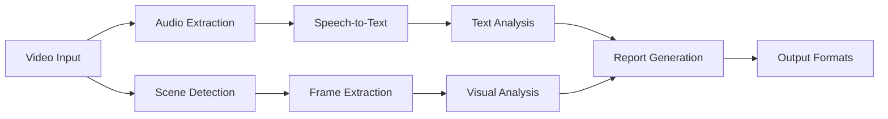

# 🎥 Video Analysis App – Complete Planning Document

## 🎯 Executive Summary

A video analysis application that helps students, educators, and professionals analyze presentations by combining speech transcription, visual analysis, and AI-powered feedback. The app processes videos to provide actionable insights on speaking performance, visual effectiveness, and overall presentation quality.

## 🏷️ Project Names and Taglines

### Top Candidates
1. **FrameFocus** ⭐
   - *"Focus on what matters, frame by frame."*
2. **DeepBrief** ⭐
   - *"Summarize visuals, voices, and everything in between."*
3. **VidInsight**
   - *"Transform videos into actionable insights."*

### Other Options
- **SceneSense** - *"Understand the scenes, not just the screen."*
- **Visiolyze** - *"See what's said. Hear what's shown."*
- **SynqLens** - *"Bringing speech and visuals into focus."*
- **TalkToScene** - *"Let your video speak for itself."*

## 🖥️ Frontend Architecture & Strategy

### Frontend Evolution Plan

#### Phase 1: Gradio MVP (Months 1-2)
**Why Gradio for MVP:**
- Fastest path to working prototype
- Built-in file upload/processing workflow
- Can create professional-looking dashboards
- Supports both local and web deployment
- Easy to style with themes and custom CSS

**Gradio Capabilities:**
- ✅ File upload/download
- ✅ Real-time progress updates
- ✅ Interactive charts (Plotly integration)
- ✅ Professional themes available
- ✅ Dashboard layouts with gr.Blocks
- ❌ Limited for real-time video streaming
- ❌ Not ideal for complex interactions

#### Phase 2: Flet Desktop App (Months 3-4)
**Why Add Flet:**
- Native desktop experience
- Better for privacy-conscious users
- Easy distribution (.exe/.app)
- No web browser required
- More control over user experience

**Architecture Pattern:**
```
┌─────────────────────┐
│   Core Analysis     │  (Shared between all frontends)
│   VideoAnalyzer     │
│   ReportGenerator   │
└──────────┬──────────┘
           │
    ┌──────┴──────┬────────────┐
    │             │            │
┌───▼────┐ ┌─────▼────┐ ┌─────▼────┐
│ Gradio │ │   Flet   │ │   CLI    │
│  Web   │ │ Desktop  │ │  Tool    │
└────────┘ └──────────┘ └──────────┘
```

#### Phase 3: Advanced Options (Months 5+)
- **PWA**: For mobile access
- **FastAPI + React**: If enterprise features needed
- **Electron**: If cross-platform desktop with web tech preferred

### Frontend Replaceability

**Core Principle**: Keep business logic separate from UI

```python
# core/analyzer.py
class VideoAnalyzer:
    def analyze(self, video_path, config):
        # All processing logic here
        return AnalysisResults(...)

# frontends/gradio_app.py
from core.analyzer import VideoAnalyzer

def create_gradio_interface():
    analyzer = VideoAnalyzer()
    # Gradio-specific UI code
    
# frontends/flet_app.py
from core.analyzer import VideoAnalyzer

def create_flet_app():
    analyzer = VideoAnalyzer()
    # Flet-specific UI code
```

### Making Gradio Professional

```python
# Professional Gradio configuration
custom_theme = gr.themes.Soft(
    primary_hue="blue",
    secondary_hue="gray",
    font=gr.themes.GoogleFont("Inter")
)

custom_css = """
    /* Hide Gradio branding */
    footer { display: none !important; }
    
    /* Professional styling */
    .gradio-container {
        max-width: 1200px;
        margin: auto;
    }
"""
```

### Deployment Strategy

1. **MVP Deployment**:
   ```bash
   # Local mode (privacy-focused)
   python app.py --local
   
   # Shareable link (still processes locally)
   python app.py --share
   ```

2. **Phase 2 Deployment**:
   ```bash
   # Gradio web version
   python app_gradio.py
   
   # Flet desktop version
   flet pack app_flet.py --name FrameFocus
   ```

### Real-time Analysis Considerations

Real-time video analysis is complex and not recommended for early phases:
- Requires WebRTC for video streaming
- Need WebSockets for live updates
- Complex buffering and synchronization
- Better suited for Phase 4+

**Current Approach**: Focus on batch processing with progress updates

---

## 🚀 MVP Vision

### Core MVP Features (Phase 1)
1. **Video Processing**
   - Audio extraction from video
   - Basic scene detection
   - Speech-to-text transcription

2. **Analysis**
   - Word count and speaking rate
   - Filler word detection
   - Basic sentiment analysis
   - Simple frame captioning

3. **Output**
   - JSON report with scene-by-scene breakdown
   - Basic HTML report for viewing
   - Transcript with timestamps

### MVP Technical Stack
- **Backend**: Python with modular architecture
- **Processing**: ffmpeg, Whisper (local), basic OpenCV
- **Frontend**: Gradio for MVP (professional theme, dashboard capable)
- **Deployment**: Local web interface with option for desktop app

---

## 📋 Complete Feature Roadmap

### Phase 1: MVP (Months 1-2)
- ✅ Basic video processing pipeline
- ✅ Speech transcription with Whisper
- ✅ Scene detection with configurable thresholds
- ✅ Simple NLP analysis
- ✅ JSON/HTML output

### Phase 2: Enhanced Analysis (Months 3-4)
- 🔄 Speaker diarization
- 🔄 Word-level timestamp alignment
- 🔄 Custom rubric support
- 🔄 Comparative analytics
- 🔄 Interactive HTML reports

### Phase 3: Advanced Features (Months 5-6)
- 📅 Real-time processing mode
- 📅 Body language analysis
- 📅 Emotional tone detection
- 📅 Mobile app (PWA)
- 📅 Cloud integration options

### Phase 4: Platform & Scale (Months 7+)
- 📅 LMS integrations
- 📅 Team collaboration features
- 📅 API for third-party integration
- 📅 Advanced ML models

---

## 🏗️ Technical Architecture

### Core Pipeline Design



### Detailed Pipeline Steps

1. **Video Input & Validation**
   - Support MP4, MOV, AVI, WebM
   - File size limits (configurable)
   - Corruption detection

2. **Audio Processing**
   ```bash
   ffmpeg -i input.mp4 -vn -acodec pcm_s16le -ar 16000 audio.wav
   ```
   - Extract audio at 16kHz for Whisper
   - Noise reduction preprocessing (optional)

3. **Scene Detection**
   ```bash
   # Basic scene detection
   ffmpeg -i input.mp4 -vf "select='gt(scene,0.4)',showinfo" -vsync vfr scene_%04d.jpg
   
   # With timestamps
   ffmpeg -i input.mp4 -filter:v "select='gt(scene,0.4)',metadata=print" -an -f null -
   ```
   - Configurable thresholds (0.2-0.8)
   - Fallback: Fixed interval extraction
   - Minimum scene duration: 2 seconds

4. **Speech-to-Text**
   ```python
   import whisper
   
   model = whisper.load_model("base")
   result = model.transcribe("audio.wav", 
                           word_timestamps=True,
                           language="auto")
   ```

5. **Frame Analysis**
   - Extract representative frame per scene
   - Vision model for captioning
   - OCR for slide text
   - Object detection (optional)

6. **Text Analysis**
   - **Traditional NLP**: spaCy, NLTK
   - **Metrics**: WPM, readability, sentiment
   - **LLM Analysis**: Coherence, engagement

7. **Report Generation**
   - Scene-level insights
   - Overall metrics
   - Actionable recommendations

---

## 🛠️ Technology Stack

### Core Dependencies

| Component | MVP Choice | Alternative Options | Notes |
|-----------|------------|-------------------|--------|
| **Audio Extraction** | ffmpeg | moviepy, pydub | ffmpeg is most reliable |
| **STT** | Whisper (local) | Google Cloud STT, Azure | Local for privacy |
| **Scene Detection** | ffmpeg scene filter | PySceneDetect, OpenCV | Start simple |
| **Vision Model** | BLIP-2 | GPT-4V, LLaVA | Balance cost/quality |
| **Text Analysis** | spaCy + GPT-3.5 | Claude, local LLMs | Hybrid approach |
| **Frontend (MVP)** | Gradio | Will add Flet in Phase 2 | Professional themes available |
| **Frontend (Phase 2)** | Flet (Desktop) | Keep Gradio for web | Native app experience |
| **Frontend (Future)** | FastAPI + React | For advanced web app | Only if scaling needed |
| **Diarization** | pyannote.audio | AWS Transcribe | Added in Phase 2 |

### Infrastructure Options

#### Local Deployment
```dockerfile
FROM python:3.11-slim
RUN apt-get update && apt-get install -y ffmpeg
COPY requirements.txt .
RUN pip install -r requirements.txt
COPY models/ ./models/  # Pre-downloaded Whisper models
COPY app/ ./app/
CMD ["python", "app/main.py"]
```

#### Cloud Deployment
- **Compute**: AWS EC2/Lambda, Google Cloud Run
- **Storage**: S3/GCS for videos
- **Queue**: SQS/Pub-Sub for processing
- **CDN**: CloudFront for report delivery

---

## 📊 Data Models & Output Formats

### Enhanced JSON Schema

```json
{
  "metadata": {
    "version": "1.0",
    "filename": "presentation.mp4",
    "duration_seconds": 420,
    "fps": 30,
    "resolution": "1920x1080",
    "processed_at": "2025-06-24T10:30:00Z",
    "processing_time_seconds": 125
  },
  
  "settings": {
    "scene_threshold": 0.4,
    "stt_model": "whisper-base",
    "vision_model": "blip2",
    "diarization_enabled": false
  },
  
  "scenes": [
    {
      "id": 1,
      "time_range": {
        "start": "00:00:00",
        "end": "00:01:25",
        "duration_seconds": 85
      },
      
      "transcript": {
        "text": "Hello everyone, my name is Sarah...",
        "words": [
          {"word": "Hello", "start": 0.0, "end": 0.5, "confidence": 0.95},
          {"word": "everyone", "start": 0.6, "end": 1.1, "confidence": 0.93}
        ],
        "speakers": [
          {"id": "A", "name": null, "segments": [[0.0, 85.0]]}
        ]
      },
      
      "audio_metrics": {
        "speaking_rate_wpm": 145,
        "silence_ratio": 0.15,
        "volume_consistency": 0.85,
        "filler_words": {
          "um": 2,
          "uh": 1,
          "like": 3
        }
      },
      
      "visual_analysis": {
        "keyframe": {
          "timestamp": "00:00:03",
          "path": "frames/scene_001.jpg"
        },
        "caption": "Person presenting with introduction slide",
        "detected_text": ["Introduction", "Sarah Johnson"],
        "objects": ["person", "presentation_slide"],
        "quality_metrics": {
          "lighting": "good",
          "blur_score": 0.1,
          "contrast": 0.75
        }
      },
      
      "ai_feedback": {
        "content": {
          "clarity": 8.5,
          "structure": 9.0,
          "engagement": 7.5
        },
        "delivery": {
          "confidence": 8.0,
          "pace": "appropriate",
          "energy": "moderate"
        },
        "visuals": {
          "alignment": 9.0,
          "quality": 7.5,
          "effectiveness": 8.0
        },
        "suggestions": [
          "Consider adding more gesture variety",
          "Slide font could be larger for readability"
        ]
      }
    }
  ],
  
  "summary": {
    "transcript_insights": {
      "total_words": 2150,
      "unique_words": 485,
      "average_wpm": 152,
      "readability_score": "Grade 8",
      "sentiment_trajectory": "neutral -> positive",
      "key_topics": ["research", "methodology", "results"]
    },
    
    "visual_insights": {
      "slide_count": 12,
      "visual_consistency": 0.85,
      "text_visibility_score": 7.8,
      "common_issues": ["low contrast on 2 slides"]
    },
    
    "overall_assessment": {
      "strengths": [
        "Clear structure and organization",
        "Good use of visual aids",
        "Confident delivery"
      ],
      "improvements": [
        "Reduce filler words in transitions",
        "Increase slide text size",
        "Add more pauses for emphasis"
      ],
      "score": 8.2,
      "grade": "B+"
    },
    
    "custom_rubric": {
      "enabled": false,
      "scores": {}
    }
  }
}
```

### Output Format Options

1. **JSON** - For programmatic access
2. **HTML Report** - Interactive with embedded video clips
3. **PDF Report** - For printing/sharing
4. **CSV Export** - Scene-level metrics
5. **Markdown** - For easy editing
6. **API Response** - For integration

---

## 🎯 User Experience & Features

### Target User Personas

1. **Students**
   - Practice presentations
   - Self-assessment before submission
   - Track improvement over time
   - Mobile recording capability

2. **Educators**
   - Batch process student submissions
   - Custom rubric evaluation
   - Comparative analysis
   - LMS integration

3. **Professionals**
   - Sales pitch analysis
   - Conference talk preparation
   - Team presentation review
   - Executive coaching

### Feature Priority Matrix

| Feature | User Value | Technical Effort | MVP | Phase |
|---------|-----------|-----------------|-----|--------|
| Basic transcription | High | Low | ✅ | 1 |
| Scene detection | High | Low | ✅ | 1 |
| Filler word detection | High | Low | ✅ | 1 |
| Speaking rate | High | Low | ✅ | 1 |
| Basic visual analysis | Medium | Medium | ✅ | 1 |
| HTML report | High | Low | ✅ | 1 |
| Speaker diarization | High | Medium | ❌ | 2 |
| Custom rubrics | High | Medium | ❌ | 2 |
| Body language | Medium | High | ❌ | 3 |
| Real-time mode | Medium | High | ❌ | 3 |
| Mobile app | High | High | ❌ | 3 |
| Team features | Low | High | ❌ | 4 |

### UI/UX Considerations

#### Desktop Web Interface
```
┌─────────────────────────────────────┐
│  FrameFocus - Video Analysis Tool   │
├─────────────────────────────────────┤
│                                     │
│    📹 Drop video here or browse     │
│                                     │
│    ┌───────────────────────┐        │
│    │ Advanced Settings  ▼  │        │
│    └───────────────────────┘        │
│                                     │
│    [❤ Start Analysis]               │
│                                     │
├─────────────────────────────────────┤
│ Recent Analyses:                    │
│ • Presentation_v3.mp4 (2 hours ago) │
│ • Practice_run.mp4 (yesterday)      │
└─────────────────────────────────────┘
```

#### Mobile PWA Interface
- Camera integration for direct recording
- Simplified settings
- Cloud sync for desktop analysis
- Offline mode for basic features

---

## 🔒 Privacy & Security

### Data Handling
1. **Local Processing Mode**
   - All processing on user's device
   - No data leaves the machine
   - Suitable for sensitive content

2. **Cloud Processing Mode**
   - Encrypted upload/download
   - Automatic deletion after processing
   - GDPR compliance
   - User consent for each upload

3. **Hybrid Mode**
   - Transcription local, LLM analysis cloud
   - User chooses what to share
   - Anonymization options

### Security Features
- Input validation (file type, size)
- Sandboxed processing environment
- Rate limiting for cloud features
- Audit logs for compliance

---

## 💰 Business Model Options

### Freemium Model
- **Free Tier**: 5 videos/month, basic features
- **Pro**: Unlimited, advanced features, priority
- **Team**: Collaboration, LMS integration, API

### Educational Licensing
- Institution-wide licenses
- Bulk processing capabilities
- Custom rubric library
- Priority support

### API/Platform Play
- Developer API for integration
- White-label options
- Revenue sharing with LMS platforms

---

## 📈 Success Metrics

### Technical Metrics
- Processing speed (< 0.5x real-time)
- Accuracy rates (>90% transcription)
- System uptime (99.9%)
- Error rates (<1%)

### User Metrics
- User retention (>40% monthly)
- Videos processed per user
- Feature adoption rates
- Support ticket volume

### Business Metrics
- Conversion rate (free to paid)
- Customer acquisition cost
- Lifetime value
- Churn rate

---

## 🚧 Implementation Roadmap

### Month 1: Foundation
- [ ] Set up development environment
- [ ] Implement basic video processing pipeline
- [ ] Integrate Whisper for transcription
- [ ] Create simple CLI interface

### Month 2: MVP Completion
- [ ] Add scene detection
- [ ] Implement basic NLP analysis
- [ ] Create JSON output format
- [ ] Build simple web interface
- [ ] Beta testing with 10 users

### Month 3: Enhanced Analysis
- [ ] Add speaker diarization
- [ ] Implement custom rubrics
- [ ] Create interactive HTML reports
- [ ] Improve visual analysis

### Month 4: Polish & Launch
- [ ] Performance optimization
- [ ] UI/UX improvements
- [ ] Documentation
- [ ] Marketing website
- [ ] Public launch

### Month 5-6: Scale & Iterate
- [ ] Mobile PWA
- [ ] Advanced features
- [ ] API development
- [ ] Integration partnerships

---

## 🤔 Challenges & Mitigations

### Technical Challenges
1. **Variable Video Quality**
   - Mitigation: Preprocessing pipeline, quality warnings

2. **Processing Speed**
   - Mitigation: GPU acceleration, model optimization

3. **Accuracy in Noisy Environments**
   - Mitigation: Audio enhancement, confidence scores

### User Challenges
1. **Non-Tech-Savvy Users**
   - Mitigation: One-click installer, video tutorials

2. **Privacy Concerns**
   - Mitigation: Local processing option, clear policies

3. **Feature Overwhelm**
   - Mitigation: Progressive disclosure, guided mode

---

## 💡 Ideas Parking Lot

### Good Ideas (Future Consideration)
- VR presentation practice mode
- AI avatar for practice audiences
- Gesture recognition library
- Presentation template generator
- Voice coaching with examples
- Audience reaction simulation
- Integration with teleprompters
- Automatic subtitle generation
- Multi-language support
- Presentation style transfer

### Ideas to Avoid (For Now)
- Blockchain certificates
- NFT achievements
- Overly complex AI explanations
- Too many configuration options
- Feature creep in MVP
- Platform-specific optimizations
- Custom hardware requirements
- Paid-only basic features

---

## 📚 Resources & References

### Libraries & Tools
- [Whisper](https://github.com/openai/whisper) - Speech recognition
- [pyannote.audio](https://github.com/pyannote/pyannote-audio) - Speaker diarization
- [FFmpeg](https://ffmpeg.org/) - Video processing
- [Gradio](https://gradio.app/) - Web interface
- [spaCy](https://spacy.io/) - NLP analysis

### Research Papers
- "Automated Presentation Skills Assessment" (2023)
- "Multimodal Analysis of Educational Videos" (2024)
- "Speaker Diarization: A Review" (2022)

### Competitors/Inspiration
- Presentable.app
- Orai
- VirtualSpeech
- Ummo
- SpeechAce

---

## 🎯 Final MVP Checklist

### Must Have (MVP)
- [x] Video upload interface
- [x] Audio extraction
- [x] Speech transcription
- [x] Basic scene detection
- [x] Filler word counting
- [x] Speaking rate calculation
- [x] Simple visual description
- [x] JSON output
- [x] Basic HTML report

### Should Have (Post-MVP)
- [ ] Speaker identification
- [ ] Custom rubrics
- [ ] Confidence scores
- [ ] Export options
- [ ] Progress tracking

### Could Have (Future)
- [ ] Mobile app
- [ ] Real-time analysis
- [ ] Team features
- [ ] API access
- [ ] Advanced analytics

### Won't Have (Initial Release)
- [ ] Live streaming analysis
- [ ] VR/AR features
- [ ] Hardware integration
- [ ] Social features
- [ ] Gamification

---

## 📝 Configuration Template

```yaml
# config.yaml - MVP Configuration
app:
  name: "FrameFocus"
  version: "1.0.0"
  
processing:
  max_video_size_mb: 500
  supported_formats: ["mp4", "mov", "avi", "webm"]
  
scene_detection:
  method: "threshold"
  threshold: 0.4
  min_scene_duration: 2.0
  fallback_interval: 30.0
  
audio:
  sample_rate: 16000
  channels: 1
  
transcription:
  model: "whisper-base"
  language: "auto"
  word_timestamps: true
  
analysis:
  filler_words: ["um", "uh", "like", "you know", "so"]
  target_wpm_range: [140, 160]
  
output:
  formats: ["json", "html"]
  include_frames: true
  frame_quality: 80
```

---

## 🚀 Quick Start Guide (MVP)

1. **Install Dependencies**
   ```bash
   pip install -r requirements.txt
   apt-get install ffmpeg
   ```

2. **Download Whisper Model**
   ```python
   import whisper
   model = whisper.load_model("base")
   ```

3. **Run Analysis**
   ```bash
   python analyze.py video.mp4 --output report.json
   ```

4. **View Results**
   ```bash
   python serve.py report.json
   # Opens browser with interactive report
   ```

---

## 📞 Contact & Contribution

- **Project Lead**: Michael Borck
- **Repository**: https://github.com/michael-borck/deep-brief
- **Documentation**: [Docs Link]
- **Support**: support@frameocus.app

### How to Contribute
1. Fork the repository
2. Create feature branch
3. Submit pull request
4. Update documentation

---

*This document is a living document and will be updated as the project evolves. Last updated: June 2025*
