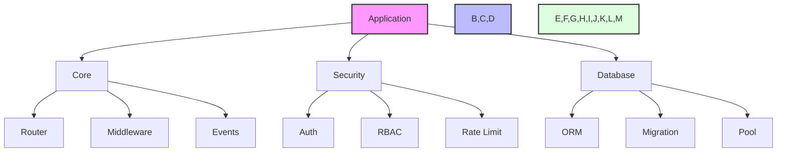

# Zephyr Framework

[](https://badge.fury.io/py/zephyr-py)
[](https://pypi.org/project/zephyr-py/)
[](https://pepy.tech/project/zephyr-py)
[](https://github.com/bbdevs/zephyr/blob/main/LICENSE)

A modern, high-performance Python web framework with advanced developer tools and enterprise-grade capabilities.

> **⚠️ Development Status**: This framework is currently in active development (v0.1.0-dev0). APIs may change between releases. Use in production at your own risk.

## Architecture



## Current Features

### Core Framework ✅
- Modern API patterns (FastAPI-style decorators)
- ASGI-compliant application structure
- HTTP routing system (GET, POST, PUT, DELETE)
- Request/Response handling
- Path parameter extraction
- Type-safe request/response models

### Development Tools ✅
- Colored logging system
- Basic CLI framework
- Project structure and configuration

## Planned Features

### Security 🚧
- JWT Authentication
- Role-Based Access Control (RBAC)
- Redis-based Rate Limiting
- CSRF Protection
- Security Headers

### Database 🚧
- Advanced ORM with type safety
- Query builder with joins
- Migration system
- Connection pooling
- Read/write splitting

### Advanced Features 🚧
- GraphQL & WebSocket support
- Event-driven architecture
- Multi-level caching (Memory + Redis)
- Distributed job queues
- Interactive debugger with breakpoints
- Performance profiler
- Distributed tracing and monitoring


## Installation

### Using uv (Recommended)

[`uv`](https://github.com/astral-sh/uv) is an extremely fast Python package and project manager written in Rust. It's 10-100x faster than pip and provides a unified toolchain.

**Install uv:**
```bash
# macOS / Linux
curl -LsSf https://astral.sh/uv/install.sh | sh

# Windows (PowerShell)
powershell -ExecutionPolicy ByPass -c "irm https://astral.sh/uv/install.ps1 | iex"

# Or via pip/pipx
pip install uv
```

**Install Zephyr:**
```bash
# Create virtual environment and install
uv venv
source .venv/bin/activate  # Windows: .venv\Scripts\activate
uv pip install zephyr-py

# With performance optimizations
uv pip install zephyr-py[performance]

# With all dev tools
uv pip install zephyr-py[dev]
```

### Using pip

```bash
# Create virtual environment
python -m venv .venv
source .venv/bin/activate  # Windows: .venv\Scripts\activate

# Install package
pip install zephyr-py

# With optional dependencies
pip install zephyr-py[performance]  # Performance optimizations
pip install zephyr-py[dev]          # Development tools
```

## Requirements

- Python 3.11 or higher
- Modern async/await support

## Quick Start

```python
from zephyr import Zephyr
from zephyr.core import Router

# Create application
app = Zephyr()

# Create router
router = Router()

@router.get("/")
async def hello():
    return {"message": "Hello from Zephyr!"}

@router.get("/users/{user_id}")
async def get_user(user_id: int):
    return {"user_id": user_id, "name": f"User {user_id}"}

@router.post("/items")
async def create_item(data: dict):
    return {"created": True, "data": data}

# Add router to app
app.add_router(router)

# Run with ASGI server (uvicorn, hypercorn, etc.)
if __name__ == "__main__":
    import uvicorn
    uvicorn.run(app, host="0.0.0.0", port=8000)
```

## Visualizing Diagrams

The documentation includes Mermaid diagrams which can be viewed in several ways:

1. **GitHub**: Diagrams are automatically rendered in GitHub markdown.

2. **VS Code**: 
   - Install the "Markdown Preview Mermaid Support" extension
   - Open markdown file and press `Ctrl+Shift+V` to preview

3. **Mermaid Live Editor**:
   - Copy diagram code between ```mermaid tags
   - Paste at [Mermaid Live Editor](https://mermaid.live)

4. **Documentation Site**:
   - Run `mkdocs serve` in the project directory
   - Open http://localhost:8000

## Documentation

- [Getting Started](docs/guides/getting_started.md)
- [Core Concepts](docs/guides/core_concepts.md)
- [Security Guide](docs/guides/security.md)
- [Database Guide](docs/guides/database.md)
- [Cache Guide](docs/guides/cache.md)
- [Queue Guide](docs/guides/queue.md)
- [GraphQL Guide](docs/guides/graphql.md)
- [WebSocket Guide](docs/guides/websockets.md)
- [API Reference](docs/api/reference.md)
- [Deployment Guide](docs/guides/deployment.md)

## Links

- **PyPI**: https://pypi.org/project/zephyr-py/
- **Documentation**: https://zephyr-py.readthedocs.io/

## Contributing

See [CONTRIBUTING.md](CONTRIBUTING.md) for guidelines.

## License

MIT License - see [LICENSE](LICENSE) for details.

## Changelog

See [CHANGELOG.md](CHANGELOG.md) for version history and release notes.
