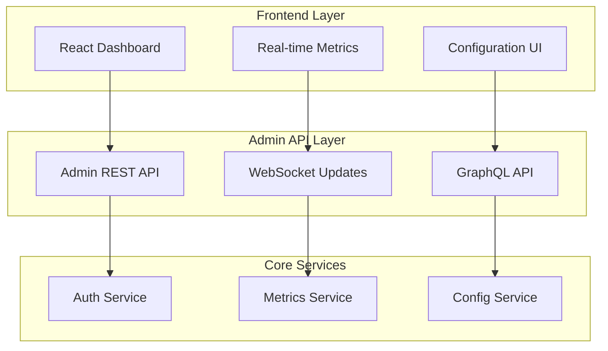

# Zephyr Admin Interface

## Architecture Overview



## Features

### 1. Dashboard
- Real-time system metrics
- Service health status
- Resource utilization graphs
- Alert notifications
- Quick action buttons

### 2. Service Management
```python
class ServiceManager:
    """
    Service lifecycle management
    Features:
    - Start/Stop services
    - Scale services
    - View logs
    - Configure settings
    """
    pass
```

### 3. Database Administration
- Database health monitoring
- Query analyzer
- Schema management
- Backup/restore interface
- Migration management

### 4. Cache Control
- Cache statistics
- Manual cache clearing
- Cache warming
- Distribution visualization

### 5. Security Management
```python
class SecurityManager:
    """
    Security configuration interface
    Features:
    - User management
    - Role configuration
    - Permission settings
    - API key management
    """
    pass
```

## Implementation

### Frontend (Using Zephyrix)
```typescript
// Dashboard component
interface DashboardProps {
    metrics: SystemMetrics;
    services: ServiceStatus[];
    alerts: AlertNotification[];
}

const Dashboard: React.FC<DashboardProps> = ({
    metrics,
    services,
    alerts
}) => {
    // Implementation
};

// Real-time updates
const useMetricsSocket = () => {
    const socket = useWebSocket('/metrics');
    // Implementation
};
```

### Backend API
```python
@admin_route
class AdminAPI:
    """Admin interface REST API"""
    
    @get("/metrics")
    async def get_metrics(self):
        """Get system metrics"""
        return await self.metrics_service.get_current()
    
    @post("/services/{service_id}/action")
    async def service_action(self, service_id: str, action: str):
        """Perform service action"""
        return await self.service_manager.execute_action(
            service_id, action
        )
```

## Security

### Authentication
```python
class AdminAuth:
    """
    Admin authentication system
    - JWT based authentication
    - Role-based access control
    - Multi-factor authentication
    - Session management
    """
    pass
```

### Authorization
- Role-based access control
- Fine-grained permissions
- API key management
- Audit logging

## Customization

### Theme Configuration
```typescript
interface ThemeConfig {
    primary: string;
    secondary: string;
    background: string;
    text: string;
}

const customizeTheme = (config: ThemeConfig) => {
    // Implementation
};
```

### Layout Customization
- Drag-and-drop widgets
- Custom dashboard layouts
- Saved configurations
- Widget library

## Integration

### External Tools
- Prometheus integration
- Grafana dashboards
- Log aggregation systems
- CI/CD platforms

### API Documentation
- OpenAPI specification
- GraphQL schema
- WebSocket endpoints
- Authentication details

## Development

### Adding New Features
```python
@admin_feature
class CustomFeature:
    """
    Custom admin feature template
    Steps:
    1. Define API endpoints
    2. Create frontend components
    3. Add to navigation
    4. Configure permissions
    """
    pass
```

### Plugin System
- Custom plugin development
- Plugin marketplace
- Version management
- Dependency resolution

## Deployment

### Docker Support
```yaml
# docker-compose.yml
version: '3.8'
services:
  admin:
    image: zephyr/admin
    ports:
      - "8080:8080"
    environment:
      - ZEPHYR_CONFIG=/etc/zephyr/config.yaml
```

### Kubernetes
- Helm charts
- Resource configurations
- Auto-scaling rules
- Load balancing setup

## Getting Started

### Quick Start
```bash
# Install admin interface
zephyr admin install

# Configure admin
zephyr admin configure

# Start admin interface
zephyr admin start
```

### Configuration
```yaml
# admin_config.yaml
admin:
  port: 8080
  auth:
    provider: jwt
    secret: ${ADMIN_SECRET}
  features:
    metrics: true
    services: true
    database: true
```

## Contributing

See [CONTRIBUTING.md](../CONTRIBUTING.md) for guidelines on:
1. Adding new features
2. Improving existing features
3. Bug fixes
4. Documentation
5. Testing
