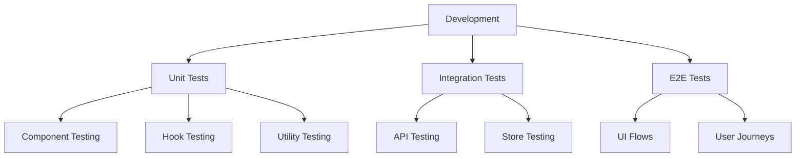

# Zephyr Admin UI - Testing and Development Guide

## Overview

This guide covers testing strategies and development workflows for the Zephyr Admin UI.



## 1. Testing Strategy

### Unit Testing

```typescript
// src/components/__tests__/MetricsPanel.test.tsx
import { render, fireEvent } from '@testing-library/react';
import { MetricsPanel } from '../MetricsPanel';

describe('MetricsPanel', () => {
  it('should render metrics data', () => {
    const metrics = {
      cpu: 45,
      memory: 60,
      requests: 1000
    };

    const { getByText } = render(
      <MetricsPanel metrics={metrics} />
    );

    expect(getByText('CPU: 45%')).toBeInTheDocument();
    expect(getByText('Memory: 60%')).toBeInTheDocument();
    expect(getByText('Requests: 1000')).toBeInTheDocument();
  });

  it('should handle metric updates', () => {
    const { rerender, getByText } = render(
      <MetricsPanel metrics={{ cpu: 45 }} />
    );

    rerender(<MetricsPanel metrics={{ cpu: 60 }} />);
    expect(getByText('CPU: 60%')).toBeInTheDocument();
  });
});
```

### Integration Testing

```typescript
// src/api/__tests__/services.integration.test.ts
import { servicesAPI } from '../services';
import { mockAPI } from '../../testing/mockAPI';

describe('Services API Integration', () => {
  beforeEach(() => {
    mockAPI.reset();
  });

  it('should fetch and update service status', async () => {
    // Setup mock responses
    mockAPI.onGet('/services').reply(200, [
      { id: '1', status: 'running' }
    ]);

    // Test API call
    const services = await servicesAPI.list();
    expect(services[0].status).toBe('running');

    // Test WebSocket update
    mockAPI.emit('service.status', {
      id: '1',
      status: 'stopped'
    });

    // Verify store update
    expect(servicesStore.getState().services[0].status)
      .toBe('stopped');
  });
});
```

### E2E Testing

```typescript
// e2e/specs/dashboard.spec.ts
import { test, expect } from '@playwright/test';

test('dashboard functionality', async ({ page }) => {
  // Login
  await page.goto('/admin');
  await page.fill('[data-testid="username"]', 'admin');
  await page.fill('[data-testid="password"]', 'password');
  await page.click('[data-testid="login-button"]');

  // Verify dashboard loads
  await expect(page.locator('h1')).toHaveText('Dashboard');
  
  // Check metrics panel
  await expect(page.locator('[data-testid="metrics-panel"]'))
    .toBeVisible();
  
  // Test service interaction
  await page.click('[data-testid="service-restart"]');
  await expect(page.locator('[data-testid="service-status"]'))
    .toHaveText('Restarting');
});
```

## 2. Development Workflow

### Component Development

```typescript
// Template for new components
export const componentTemplate = `
import { Component } from '@zephyrix/core';
import { Props, State } from './types';

export class NewComponent extends Component<Props, State> {
  static defaultProps = {
    // Default props
  };

  state = {
    // Initial state
  };

  componentDidMount() {
    // Setup code
  }

  componentWillUnmount() {
    // Cleanup code
  }

  render() {
    return (
      // JSX
    );
  }
}
`;
```

### Development Server

```typescript
// scripts/dev-server.ts
import { createDevServer } from '@zephyrix/dev';

const server = createDevServer({
  port: 3000,
  proxy: {
    '/api': 'http://localhost:8000',
    '/ws': {
      target: 'ws://localhost:8000',
      ws: true
    }
  },
  mock: {
    enabled: true,
    directory: './mocks'
  },
  hmr: {
    enabled: true
  }
});

server.start();
```

## 3. Code Quality

### Linting

```javascript
// .eslintrc.js
module.exports = {
  extends: [
    '@zephyrix/eslint-config',
    'plugin:@typescript-eslint/recommended'
  ],
  rules: {
    'react-hooks/rules-of-hooks': 'error',
    'react-hooks/exhaustive-deps': 'warn'
  }
};
```

### Type Checking

```typescript
// tsconfig.json
{
  "compilerOptions": {
    "strict": true,
    "noImplicitAny": true,
    "noUnusedLocals": true,
    "noUnusedParameters": true
  }
}
```

## 4. Performance Testing

### Metrics Collection

```typescript
// src/utils/performance.ts
export const performanceMetrics = {
  async measureComponentPerformance(
    component: string,
    action: string
  ) {
    const start = performance.now();
    
    try {
      await action();
    } finally {
      const duration = performance.now() - start;
      this.logMetric(component, duration);
    }
  },

  logMetric(component: string, duration: number) {
    // Send to monitoring system
  }
};
```

### Load Testing

```typescript
// load-tests/dashboard.test.ts
import { loadTest } from 'k6';
import http from 'k6/http';

export const options = {
  vus: 10,
  duration: '30s'
};

export default function() {
  const res = http.get('http://admin.local/api/metrics');
  check(res, {
    'is status 200': (r) => r.status === 200,
    'response time < 200ms': (r) => r.timings.duration < 200
  });
}
```

## 5. Debugging

### Debug Configuration

```typescript
// src/debug/config.ts
export const debugConfig = {
  enabled: process.env.NODE_ENV === 'development',
  level: 'info',
  components: {
    MetricsPanel: true,
    ServiceList: true
  }
};

// Usage in components
@debug('MetricsPanel')
export class MetricsPanel extends Component {
  // Component code
}
```

### Performance Monitoring

```typescript
// src/monitoring/performance.ts
export const performanceMonitor = {
  measurements: new Map(),

  start(id: string) {
    this.measurements.set(id, performance.now());
  },

  end(id: string) {
    const start = this.measurements.get(id);
    if (start) {
      const duration = performance.now() - start;
      this.report(id, duration);
    }
  },

  report(id: string, duration: number) {
    // Send to monitoring system
  }
};
```

## 6. Development Tools

### Component Development Tool

```typescript
// tools/component-dev.ts
export class ComponentDev {
  static create(name: string) {
    // Create component files
    this.createComponent(name);
    this.createTest(name);
    this.createStyles(name);
    this.updateIndex(name);
  }

  static createComponent(name: string) {
    const template = `
      export class ${name} extends Component {
        render() {
          return (
            <div data-testid="${name.toLowerCase()}">
              ${name}
            </div>
          );
        }
      }
    `;
    
    // Write to file
  }
}
```

## 7. CI/CD Pipeline

### GitHub Actions

```yaml
# .github/workflows/ci.yml
name: CI

on: [push, pull_request]

jobs:
  test:
    runs-on: ubuntu-latest
    steps:
      - uses: actions/checkout@v2
      - uses: actions/setup-node@v2
      
      - name: Install dependencies
        run: npm install
        
      - name: Run tests
        run: npm test
        
      - name: Run E2E tests
        run: npm run test:e2e
        
      - name: Build
        run: npm run build
```

## 8. Documentation

### Component Documentation

```typescript
// src/docs/components.ts
export const componentDocs = {
  MetricsPanel: {
    description: 'Displays real-time system metrics',
    props: {
      metrics: {
        type: 'object',
        required: true,
        description: 'Current system metrics'
      },
      refreshRate: {
        type: 'number',
        default: 1000,
        description: 'Refresh rate in milliseconds'
      }
    },
    examples: [
      {
        title: 'Basic Usage',
        code: `
          <MetricsPanel
            metrics={systemMetrics}
            refreshRate={2000}
          />
        `
      }
    ]
  }
};
```

Would you like me to:
1. Add more specific testing examples?
2. Create detailed CI/CD configuration?
3. Add more development tools?
4. Create performance optimization guides?
