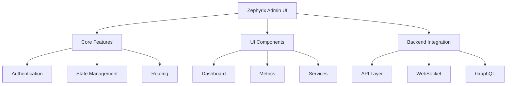

# Zephyr Admin UI Implementation Guide

## Overview

This document outlines the implementation of Zephyr's admin interface using the Zephyrix framework.



## 1. Implementation Plan

### Phase 1: Setup and Core Infrastructure
- Initialize Zephyrix admin project
- Set up authentication system
- Implement core routing
- Create base layouts

### Phase 2: UI Components
- Build dashboard components
- Implement metrics visualization
- Create service management interface
- Develop configuration panels

### Phase 3: Backend Integration
- Implement API layer
- Set up WebSocket connections
- Add GraphQL integration
- Create data synchronization

### Phase 4: Advanced Features
- Add performance monitoring
- Implement advanced analytics
- Create custom plugins system
- Add theme customization

## 2. Project Structure

```
zephyr-admin/
├── src/
│   ├── components/
│   │   ├── core/
│   │   │   ├── Layout.tsx
│   │   │   ├── Navigation.tsx
│   │   │   └── Header.tsx
│   │   ├── dashboard/
│   │   │   ├── MetricsPanel.tsx
│   │   │   ├── ServiceStatus.tsx
│   │   │   └── AlertsPanel.tsx
│   │   ├── services/
│   │   │   ├── ServiceList.tsx
│   │   │   ├── ServiceDetails.tsx
│   │   │   └── ServiceConfig.tsx
│   │   └── settings/
│   │       ├── GeneralSettings.tsx
│   │       ├── SecuritySettings.tsx
│   │       └── PerformanceSettings.tsx
│   ├── hooks/
│   │   ├── useMetrics.ts
│   │   ├── useServices.ts
│   │   └── useWebSocket.ts
│   ├── state/
│   │   ├── metrics.ts
│   │   ├── services.ts
│   │   └── settings.ts
│   ├── api/
│   │   ├── client.ts
│   │   ├── metrics.ts
│   │   └── services.ts
│   └── types/
       ├── metrics.ts
       ├── services.ts
       └── settings.ts
```

## 3. Component Examples

### Core Layout
```typescript
// src/components/core/Layout.tsx
import { Component } from '@zephyrix/core';
import { Layout, Sidebar } from '@zephyrix/ui';

export class AdminLayout extends Component {
  render() {
    return (
      <Layout type="admin">
        <Sidebar>
          <Navigation />
        </Sidebar>
        <Content>
          {this.props.children}
        </Content>
      </Layout>
    );
  }
}
```

### Metrics Panel
```typescript
// src/components/dashboard/MetricsPanel.tsx
import { Component, signal } from '@zephyrix/core';
import { Card, Chart } from '@zephyrix/ui';

export class MetricsPanel extends Component {
  metrics = signal({
    cpu: 0,
    memory: 0,
    requests: 0
  });

  onMount() {
    this.startMetricsStream();
  }

  render() {
    return (
      <Card title="System Metrics">
        <Chart 
          data={this.metrics()} 
          type="real-time"
          refreshRate={1000}
        />
      </Card>
    );
  }
}
```

### Service Management
```typescript
// src/components/services/ServiceList.tsx
import { Component, signal } from '@zephyrix/core';
import { DataGrid, Button } from '@zephyrix/ui';

export class ServiceList extends Component {
  services = signal([]);

  async loadServices() {
    const data = await api.services.list();
    this.services.set(data);
  }

  render() {
    return (
      <DataGrid
        data={this.services()}
        columns={[
          { field: 'name', header: 'Service' },
          { field: 'status', header: 'Status' },
          { field: 'actions', header: 'Actions' }
        ]}
      />
    );
  }
}
```

## 4. Backend Integration

### API Client
```typescript
// src/api/client.ts
import { createClient } from '@zephyrix/core';

export const api = createClient({
  baseURL: '/api/admin',
  auth: {
    type: 'jwt',
    endpoints: {
      login: '/auth/login',
      refresh: '/auth/refresh'
    }
  },
  websocket: {
    endpoint: '/ws',
    reconnect: true
  }
});
```

### Real-time Updates
```typescript
// src/hooks/useWebSocket.ts
import { createSocket } from '@zephyrix/core';

export function useMetricsSocket() {
  return createSocket({
    endpoint: '/metrics',
    handlers: {
      'metrics.update': (data) => {
        metrics.update(data);
      },
      'service.status': (data) => {
        services.updateStatus(data);
      }
    }
  });
}
```

## 5. State Management

### Metrics Store
```typescript
// src/state/metrics.ts
import { createStore } from '@zephyrix/core';

export const metricsStore = createStore({
  state: {
    current: {},
    history: [],
    alerts: []
  },
  actions: {
    updateMetrics(metrics) {
      this.current = metrics;
      this.history.push(metrics);
    },
    addAlert(alert) {
      this.alerts.push(alert);
    }
  }
});
```

## 6. Security

### Authentication
```typescript
// src/auth/index.ts
import { createAuth } from '@zephyrix/core';

export const auth = createAuth({
  type: 'jwt',
  storage: 'localStorage',
  endpoints: {
    login: '/api/admin/auth/login',
    logout: '/api/admin/auth/logout',
    refresh: '/api/admin/auth/refresh'
  }
});
```

## 7. Performance Optimization

### Virtual Scrolling
```typescript
// src/components/services/VirtualServiceList.tsx
import { VirtualList } from '@zephyrix/ui';

export class VirtualServiceList extends Component {
  render() {
    return (
      <VirtualList
        items={this.services()}
        height={400}
        itemHeight={50}
        renderItem={(service) => (
          <ServiceItem service={service} />
        )}
      />
    );
  }
}
```

## 8. Getting Started

### Installation
```bash
# Create new admin UI project
zx create admin-ui --template zephyr-admin

# Install dependencies
cd admin-ui
npm install

# Start development server
npm run dev
```

### Configuration
```typescript
// src/config.ts
export const config = {
  api: {
    baseURL: process.env.API_URL || '/api/admin',
    timeout: 5000
  },
  websocket: {
    url: process.env.WS_URL || '/ws',
    reconnectInterval: 1000
  },
  auth: {
    storage: 'localStorage',
    tokenKey: 'admin_token'
  }
};
```

## 9. Development Workflow

1. Component Development
   - Create component in appropriate directory
   - Add to component registry
   - Write tests
   - Add documentation

2. API Integration
   - Define API endpoints
   - Create API client methods
   - Add error handling
   - Implement caching if needed

3. Testing
   - Unit tests for components
   - Integration tests for API
   - End-to-end tests for workflows
   - Performance testing

4. Deployment
   - Build optimization
   - Asset compression
   - Environment configuration
   - Deployment scripts

## 10. Contributing

See [CONTRIBUTING.md](../CONTRIBUTING.md) for guidelines on:
1. Code style
2. Component creation
3. Testing requirements
4. Documentation
5. Review process
