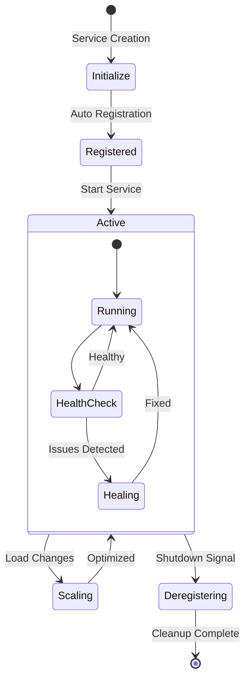
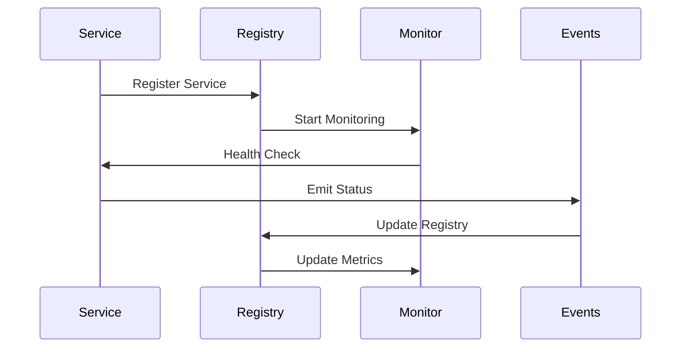
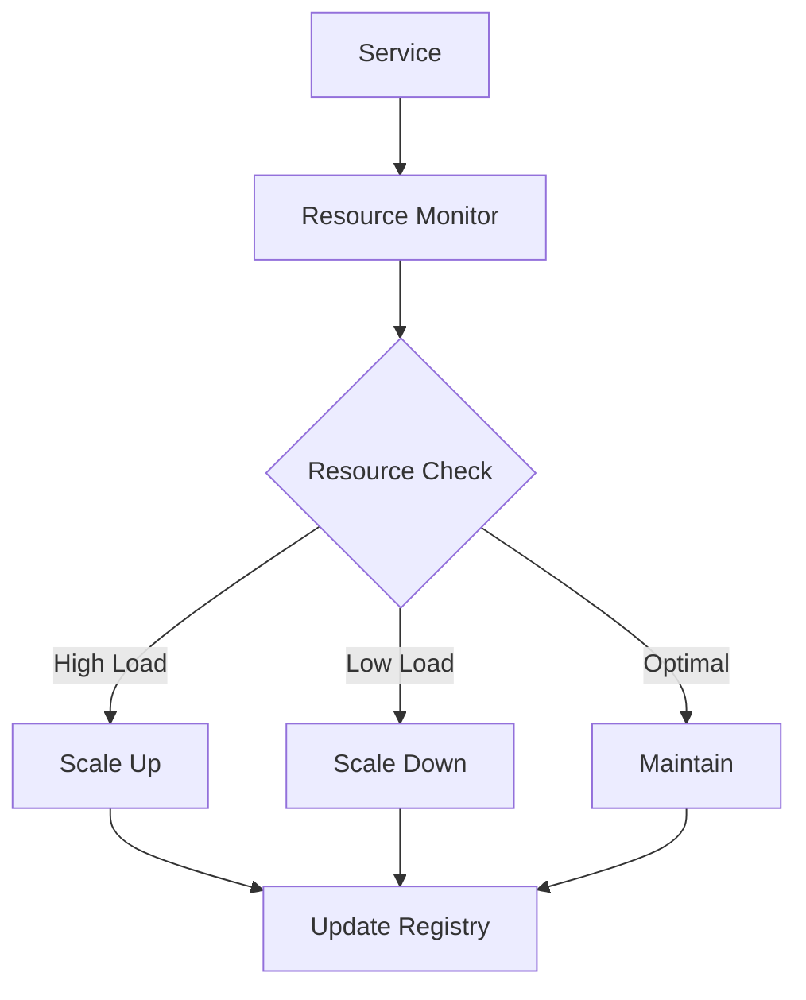
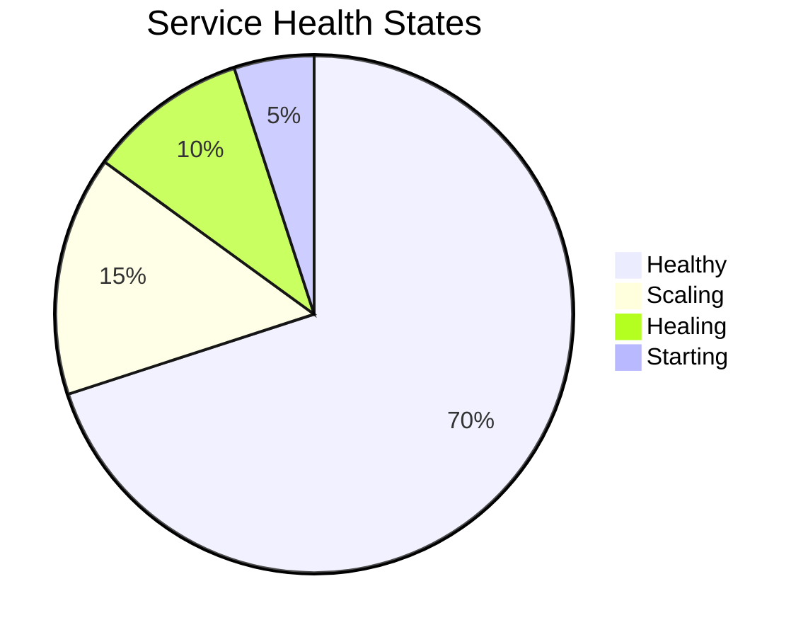

# Service Lifecycle Management

## Service Lifecycle Flow



## Service Communication



## Resource Management



## Service Features
- Automatic registration
- Health monitoring
- Self-healing
- Resource optimization
- Event handling

## Example Usage

```python
@service
class UserService:
    async def run(self):
        # Business logic only
        # Framework handles lifecycle
        pass
```

## Health States


