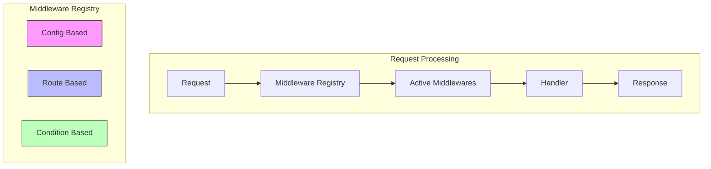
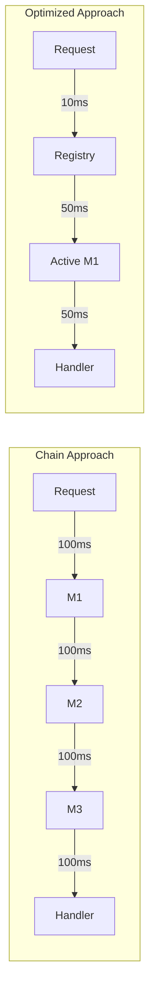

# Middleware System

## Optimized Architecture



## Performance-Optimized Implementation

```python
class MiddlewareRegistry:
    def __init__(self):
        self.middlewares = {}
        self.conditions = {}

    def register(self, name: str, middleware: type, condition: Optional[Callable] = None):
        """Register middleware with optional condition"""
        self.middlewares[name] = middleware
        if condition:
            self.conditions[name] = condition

    async def get_active_middlewares(self, request: Request) -> List[Middleware]:
        """Get only the middlewares that should run for this request"""
        active = []
        for name, middleware in self.middlewares.items():
            if name in request.config.enabled_middlewares:
                if name not in self.conditions or await self.conditions[name](request):
                    active.append(middleware)
        return active

class RequestProcessor:
    def __init__(self, registry: MiddlewareRegistry):
        self.registry = registry

    async def process(self, request: Request, handler: Handler) -> Response:
        # Get only needed middlewares for this request
        active_middlewares = await self.registry.get_active_middlewares(request)
        
        # Fast path if no middlewares
        if not active_middlewares:
            return await handler(request)

        # Process only necessary middlewares
        for middleware in active_middlewares:
            request = await middleware.process_request(request)
            if request.response:  # Early return if middleware generated response
                return request.response

        response = await handler(request)

        # Process response middlewares in reverse
        for middleware in reversed(active_middlewares):
            response = await middleware.process_response(response)

        return response
```

## Configuration-Based Activation

```python
# config.yaml
middleware:
  auth:
    enabled: true
    exclude_paths: ["/health", "/metrics"]
  logging:
    enabled: true
    level: INFO
  tracing:
    enabled: false  # Disabled in development
  rate_limit:
    enabled: true
    conditions:
      - path: "/api/*"
        limit: 100
      - path: "/admin/*"
        limit: 20
```

## Conditional Middleware

```python
class AuthMiddleware:
    @staticmethod
    async def should_run(request: Request) -> bool:
        """Fast check if middleware should run"""
        return (
            request.path not in request.config.auth.exclude_paths
            and not request.path.startswith("/public")
        )

    async def process_request(self, request: Request) -> Request:
        if not await self.should_run(request):
            return request  # Skip processing
        # Process auth...
        return request

# Register with condition
registry.register("auth", AuthMiddleware, AuthMiddleware.should_run)
```

## Route-Specific Middleware

```python
@service
class UserService:
    @endpoint("/users", middlewares=["auth", "rate_limit"])
    async def get_users(self, request):
        # Only specified middlewares run
        pass

    @endpoint("/health", middlewares=[])  # No middleware
    async def health_check(self, request):
        # Fast path - no middleware overhead
        pass
```

## Performance Comparison



## Best Practices

1. **Conditional Execution**
   - Only run middlewares when needed
   - Use fast conditions for checks
   - Skip middleware based on config

2. **Configuration**
   - Enable/disable via config
   - Environment-specific settings
   - Route-specific activation

3. **Performance**
   - Avoid chain of responsibility
   - Use early returns
   - Minimize middleware count
   - Cache condition results

4. **Development**
   - Easy middleware registration
   - Clear activation conditions
   - Simple configuration
   - Performance monitoring
