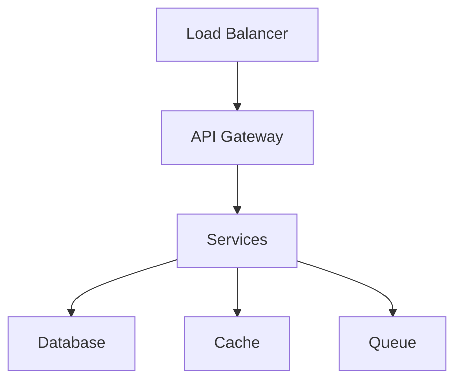

# Deployment Guide

## Overview

Zephyr provides multiple deployment options:
- Cloud deployment (AWS, GCP, Azure)
- Edge deployment
- Serverless deployment
- On-premises deployment

## Deployment Options

### 1. Cloud Deployment


### 2. Edge Deployment


## Deployment Process

### 1. Build Process
```bash
# Build application
zephyr build

# Build output:
dist/
├── app/              # Application files
├── config/          # Configuration
└── dependencies/   # Dependencies
```

### 2. Deployment Steps
```bash
# Deploy to environment
zephyr deploy --env production

# Scale services
zephyr scale --service user-service --replicas 3
```

## Configuration

### 1. Environment Configuration
```yaml
# config/production.yaml
environment:
  name: production
  region: us-west-2
  
services:
  replicas: 3
  min_replicas: 2
  max_replicas: 5
```

### 2. Resource Configuration
```yaml
# config/resources.yaml
resources:
  cpu: 2
  memory: 1Gi
  storage: 10Gi
  
scaling:
  cpu_threshold: 80
  memory_threshold: 85
```

## Monitoring Setup

### 1. Metrics Configuration
```yaml
# config/monitoring.yaml
monitoring:
  metrics:
    enabled: true
    endpoint: /metrics
    
  tracing:
    enabled: true
    sampler: 0.1
```

### 2. Logging Configuration
```yaml
# config/logging.yaml
logging:
  level: info
  format: json
  
  outputs:
    - type: file
      path: /var/log/app.log
    - type: elasticsearch
      url: ${ES_URL}
```

## Security Configuration

### 1. TLS Configuration
```yaml
# config/security.yaml
tls:
  enabled: true
  cert: /path/to/cert.pem
  key: /path/to/key.pem
  
cors:
  allowed_origins: ["https://api.example.com"]
```

### 2. Authentication Configuration
```yaml
# config/auth.yaml
auth:
  provider: oauth2
  jwt_secret: ${JWT_SECRET}
  
  oauth2:
    client_id: ${OAUTH_CLIENT_ID}
    client_secret: ${OAUTH_CLIENT_SECRET}
```

## Scaling Configuration

### 1. Auto-scaling
```yaml
# config/scaling.yaml
autoscaling:
  enabled: true
  min_replicas: 2
  max_replicas: 10
  
  metrics:
    - type: cpu
      target: 80
    - type: memory
      target: 85
```

### 2. Load Balancing
```yaml
# config/loadbalancer.yaml
loadbalancer:
  algorithm: round_robin
  health_check:
    path: /health
    interval: 30s
```

## Deployment Commands

### Basic Commands
```bash
# Deploy application
zephyr deploy --env production

# Scale services
zephyr scale --service user-service --replicas 3

# Check status
zephyr status

# View logs
zephyr logs --service user-service
```

### Advanced Commands
```bash
# Rolling update
zephyr update --rolling

# Canary deployment
zephyr deploy --canary

# Rollback deployment
zephyr rollback

# View metrics
zephyr metrics
```

## Best Practices

### 1. Deployment Checklist
- [ ] Run all tests
- [ ] Check resource requirements
- [ ] Verify configurations
- [ ] Test rollback procedure
- [ ] Monitor deployment

### 2. Security Checklist
- [ ] Enable TLS
- [ ] Configure authentication
- [ ] Set up monitoring
- [ ] Enable audit logging
- [ ] Review permissions

## Troubleshooting

### Common Issues
1. Service not starting
   ```bash
   # Check service logs
   zephyr logs --service <service-name>
   
   # Check service status
   zephyr status --service <service-name>
   ```

2. Performance issues
   ```bash
   # View metrics
   zephyr metrics --service <service-name>
   
   # Check resource usage
   zephyr resources --service <service-name>
   ```

## Next Steps
1. [Monitoring Guide](monitoring.md)
2. [Security Guide](security.md)
3. [Scaling Guide](scaling.md)
