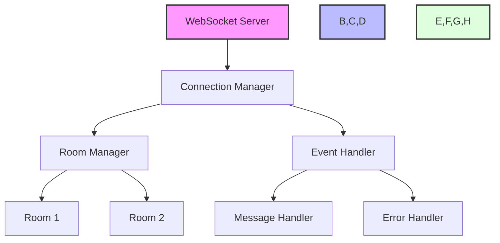
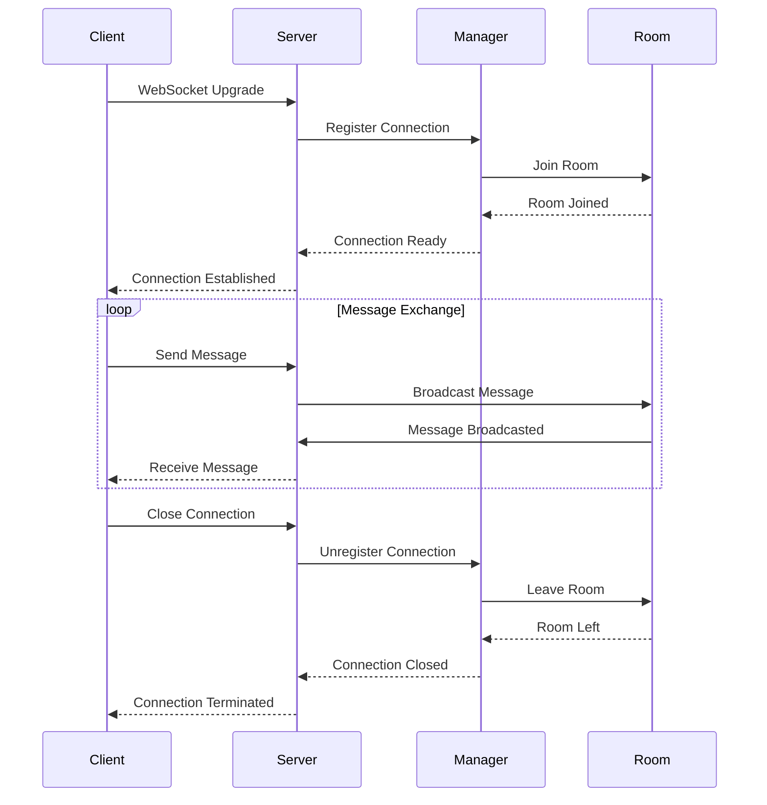
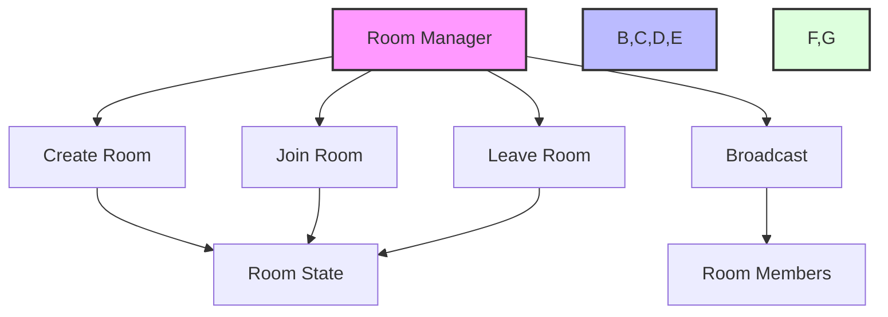
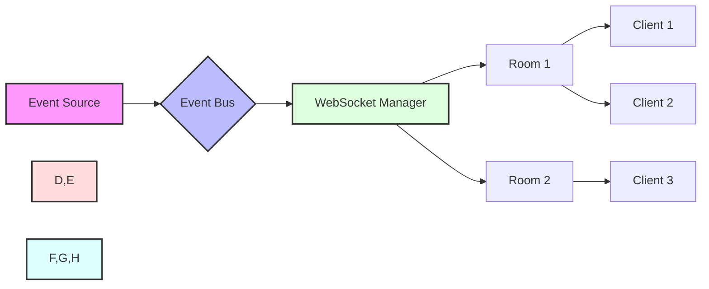
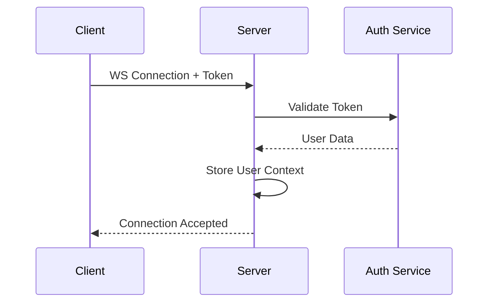
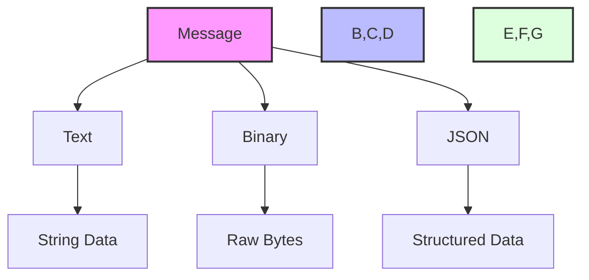
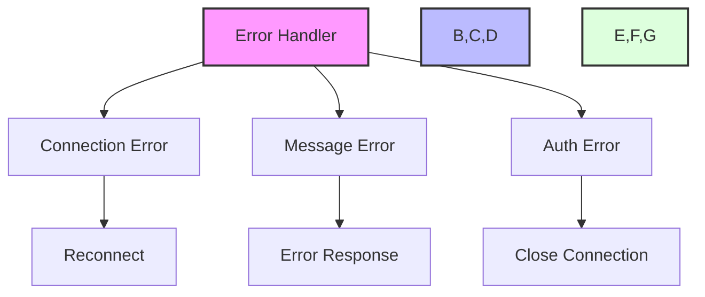
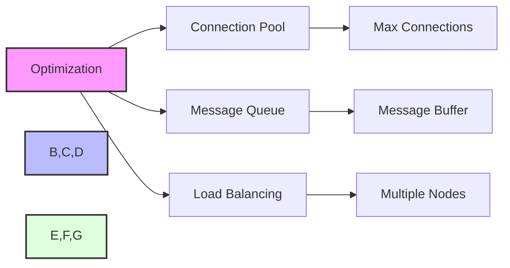

# WebSocket Guide

This guide covers WebSocket implementation in the Zephyr Framework.

## WebSocket Architecture



## Connection Lifecycle



## Basic Implementation

```python
from zephyr.websockets import WebSocket, WebSocketManager

manager = WebSocketManager()

@app.websocket("/ws")
async def websocket_endpoint(ws: WebSocket):
    await manager.connect(ws)
    try:
        while True:
            data = await ws.receive_json()
            await manager.broadcast(data)
    except WebSocketDisconnect:
        await manager.disconnect(ws)
```

## Room Management



Example implementation:

```python
@app.websocket("/ws/{room_id}")
async def room_websocket(
    ws: WebSocket,
    room_id: str
):
    await manager.connect(ws)
    await manager.join_room(ws, room_id)
    try:
        while True:
            data = await ws.receive_json()
            await manager.broadcast_to_room(room_id, data)
    except WebSocketDisconnect:
        await manager.leave_room(ws, room_id)
        await manager.disconnect(ws)
```

## Real-time Events



## Authentication



Example:

```python
@app.websocket("/ws")
async def authenticated_websocket(
    ws: WebSocket,
    token: str = Query(...),
    auth: AuthService = Depends()
):
    user = await auth.validate_token(token)
    if not user:
        await ws.close(code=4001)
        return
        
    await manager.connect(ws, user)
    try:
        while True:
            data = await ws.receive_json()
            # Add user context to message
            data["user"] = user.dict()
            await manager.broadcast(data)
    except WebSocketDisconnect:
        await manager.disconnect(ws)
```

## Message Types



## Error Handling



## Performance Optimization



## Client Implementation

```javascript
// Browser WebSocket client
const ws = new WebSocket('ws://localhost:8000/ws');

ws.onopen = () => {
    console.log('Connected to server');
    ws.send(JSON.stringify({
        type: 'join',
        room: 'main'
    }));
};

ws.onmessage = (event) => {
    const data = JSON.parse(event.data);
    console.log('Received:', data);
};

ws.onclose = () => {
    console.log('Disconnected from server');
};
```
