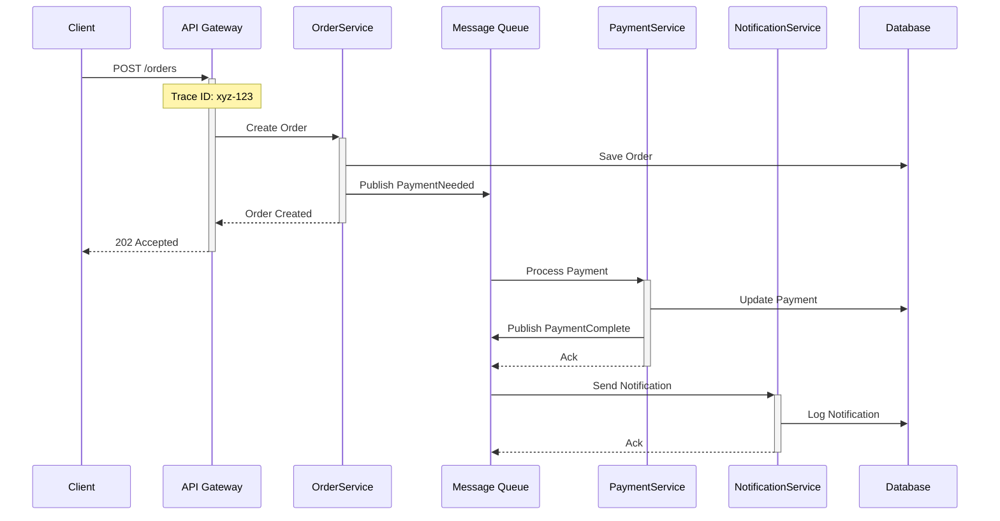
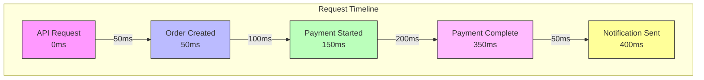
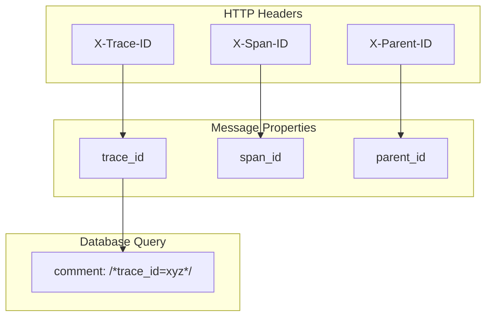
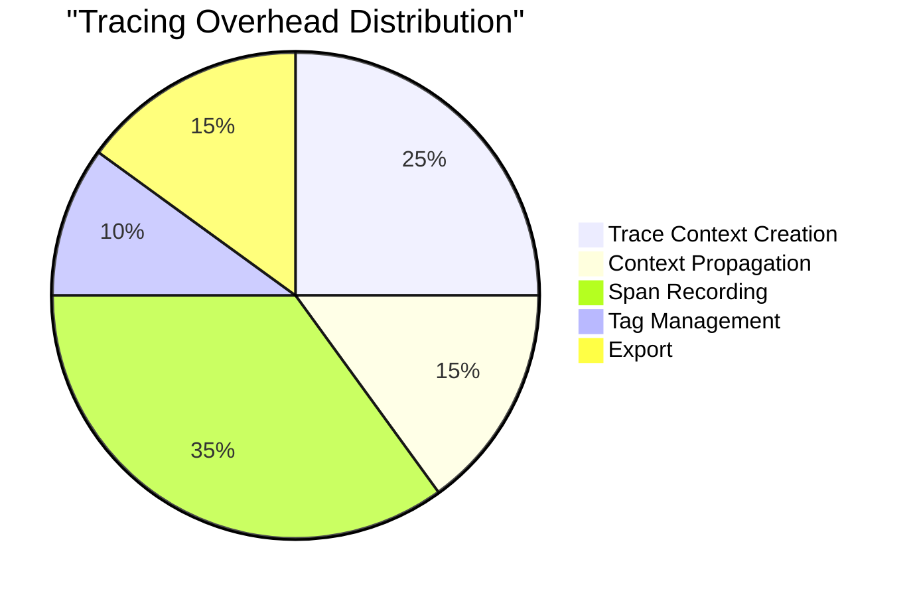

# Distributed Tracing

## Request Flow Tracing



## Implementation Example

```python
@service
class OrderService:
    @traced
    async def create_order(self, order_data: dict) -> Order:
        with TraceContext() as trace:
            # Automatically captures the trace context
            trace.add_tag("order_type", order_data["type"])
            
            # Database operation is traced
            order = await self.db.create_order(order_data)
            
            # Message queue operation is traced
            await self.queue.publish(
                "payment_needed",
                {"order_id": order.id},
                trace_context=trace.context
            )
            
            return order

@service
class PaymentService:
    @traced
    async def handle_payment(self, message: Message) -> None:
        # Trace context is automatically extracted from message
        with TraceContext.from_message(message) as trace:
            trace.add_tag("payment_provider", self.provider)
            
            # Process payment
            payment = await self.process_payment(message.order_id)
            
            # Publish result with trace context
            await self.queue.publish(
                "payment_complete",
                {"payment_id": payment.id},
                trace_context=trace.context
            )

@service
class NotificationService:
    @traced
    async def notify_payment_complete(self, message: Message) -> None:
        with TraceContext.from_message(message) as trace:
            # Send notification
            await self.send_notification(message.payment_id)
```

## Trace Visualization



## Trace Context Propagation



## Configuration

```python
TRACING_CONFIG = {
    'service_name': 'order-service',
    'sampler': {
        'type': 'probabilistic',
        'rate': 0.1  # Sample 10% of requests
    },
    'propagation': {
        'http': True,
        'grpc': True,
        'messaging': True,
        'database': True
    },
    'exporters': [{
        'type': 'jaeger',
        'endpoint': 'http://jaeger:14268/api/traces'
    }]
}

@service(tracing=TRACING_CONFIG)
class TracedService:
    pass
```

## Performance Impact Analysis



## Best Practices

1. **Sampling Strategy**
   - Use adaptive sampling
   - Sample more for errors
   - Keep important traces
   - Configure by endpoint

2. **Context Management**
   - Propagate full context
   - Preserve parent relations
   - Handle async operations
   - Clean up resources

3. **Performance**
   - Use sampling appropriately
   - Minimize tag count
   - Batch trace exports
   - Monitor overhead

4. **Integration**
   - Consistent service names
   - Meaningful operation names
   - Useful tags
   - Error tracking

## Error Tracing Example

```python
@service
class ResilientService:
    @traced
    async def critical_operation(self, data: dict) -> Result:
        with TraceContext() as trace:
            try:
                result = await self.process(data)
                trace.add_tag("status", "success")
                return result
            except Exception as e:
                trace.add_tag("status", "error")
                trace.add_tag("error_type", type(e).__name__)
                trace.add_tag("error_message", str(e))
                trace.mark_as_error()
                raise
```
