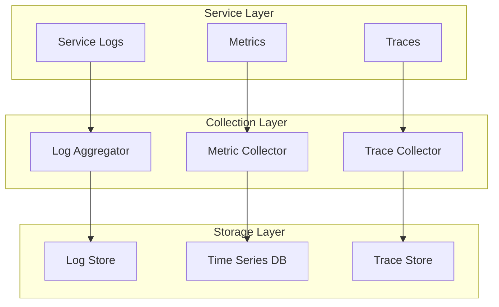
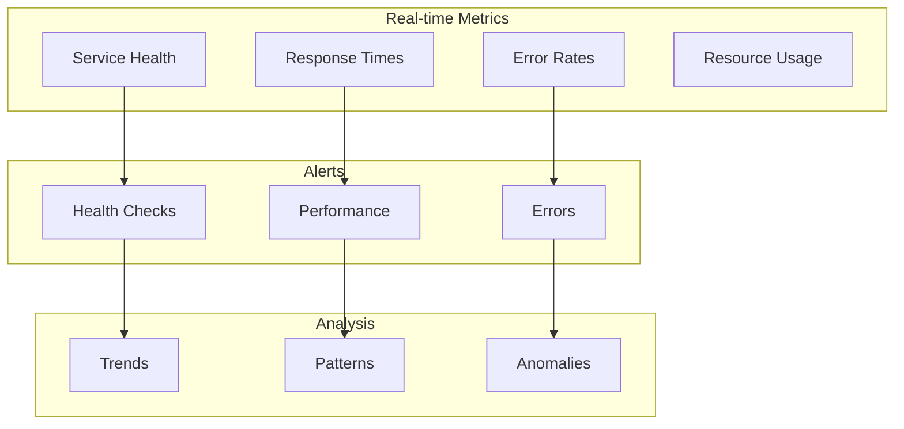
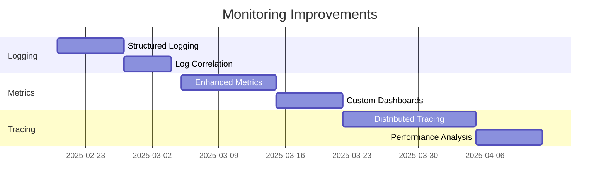

# Logging and Monitoring

## Architecture Overview



## Current Implementation

### Logging
```python
@service
class PaymentService:
    def __init__(self):
        self.logger = Logger.get_logger(__name__)

    async def process_payment(self, payment):
        self.logger.info("Processing payment", payment_id=payment.id)
        try:
            result = await self.payments.process(payment)
            self.logger.info("Payment processed", 
                           payment_id=payment.id,
                           status=result.status)
            return result
        except Exception as e:
            self.logger.error("Payment failed",
                            payment_id=payment.id,
                            error=str(e),
                            traceback=traceback.format_exc())
            raise
```

### Metrics
```python
@service
class OrderService:
    def __init__(self):
        self.metrics = Metrics.get_collector(__name__)
        self.order_counter = self.metrics.counter("orders_processed")
        self.processing_time = self.metrics.histogram("order_processing_time")

    @metrics_tracked
    async def create_order(self, order_data):
        with self.processing_time.time():
            result = await self.orders.create(order_data)
            self.order_counter.inc()
            return result
```

### Tracing
```python
@service
class UserService:
    @traced
    async def register_user(self, user_data):
        with Span("user_registration"):
            # Registration steps are automatically traced
            validated = await self.validate(user_data)
            user = await self.users.create(validated)
            await self.send_welcome_email(user)
            return user
```

## Monitoring Dashboard



## Areas for Improvement

### 1. Enhanced Logging
- Structured logging with more context
- Log correlation across services
- Better error categorization
- Log level management per component
- Automated log analysis

### 2. Metric Collection
- More granular metrics
- Custom metric definitions
- Better histogram configurations
- Resource usage tracking
- Business metrics integration

### 3. Tracing Enhancements
- Distributed tracing
- Better span management
- Automatic context propagation
- Performance impact analysis
- Trace sampling configuration

### 4. Integration
- Better third-party tool integration
- Unified monitoring interface
- Custom dashboard creation
- Alert management
- Historical data analysis

## Implementation Plan



## Best Practices

### Logging
```python
# Recommended approach
@service
class ImprovedService:
    async def process_item(self, item):
        with LogContext(item_id=item.id, type=item.type):
            self.logger.info("Starting processing")
            try:
                result = await self.process(item)
                self.logger.info("Processing complete", 
                               duration=result.duration,
                               status=result.status)
                return result
            except Exception as e:
                self.logger.error("Processing failed",
                                error_type=type(e).__name__,
                                error_details=str(e))
                raise
```

### Metrics
```python
# Enhanced metrics collection
@service
class EnhancedMetrics:
    @metrics(
        counters=["requests", "errors"],
        histograms=["duration", "payload_size"],
        gauges=["active_connections"]
    )
    async def handle_request(self, request):
        # Metrics automatically collected
        return await self.process(request)
```

### Tracing
```python
# Advanced tracing
@service
class TracedService:
    @distributed_trace
    async def complex_operation(self, data):
        with TraceContext() as ctx:
            ctx.add_tag("data_size", len(data))
            result = await self.process(data)
            ctx.add_tag("result_status", result.status)
            return result
```
