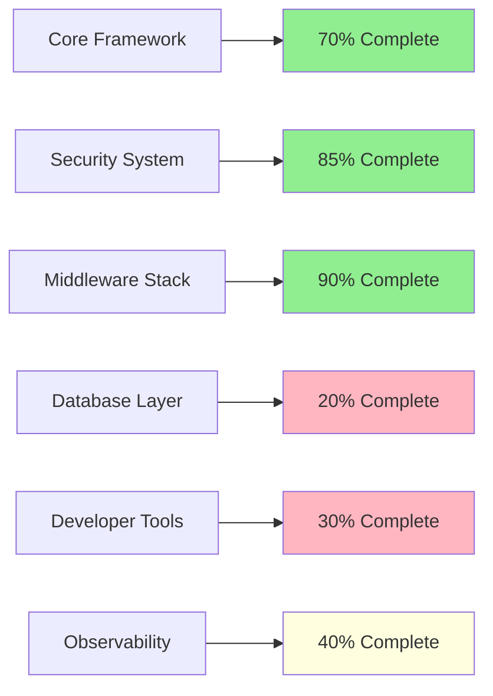
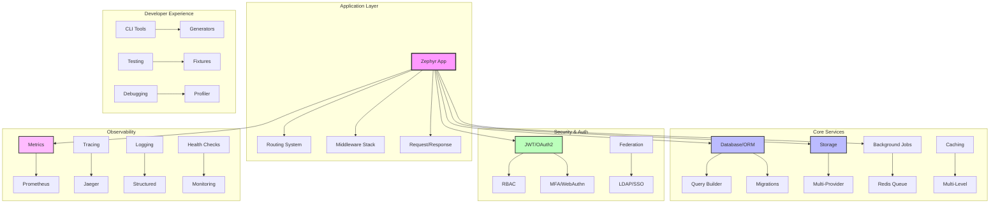
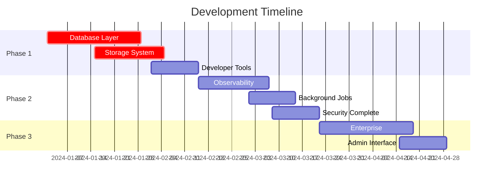

# Zephyr Framework Development Proposals

## Executive Summary

Zephyr is a modern, high-performance Python web framework currently at **70-80% completion** with excellent foundations in core functionality, security, and middleware. This document outlines the strategic roadmap to transform Zephyr into a world-class, production-ready framework suitable for everything from simple APIs to enterprise-grade applications.

### Current State Assessment

### Strategic Vision

Transform Zephyr into a **complete, enterprise-ready framework** that:
- Maintains simplicity for beginners (3-line hello world)
- Scales seamlessly to enterprise applications
- Provides best-in-class developer experience
- Offers comprehensive observability and monitoring
- Supports modern deployment patterns (containers, microservices)

## Framework Architecture Overview

## Development Roadmap

### Phase 1: Foundation (Weeks 1-8)
| Priority | Component | Status | Effort |
|----------|-----------|---------|---------|
| **Critical** | Database & ORM Layer | 🔴 Missing | 4 weeks |
| **Critical** | Universal Storage | 🔴 Missing | 3 weeks |
| **High** | Developer CLI Tools | 🟡 Partial | 2 weeks |
| **High** | Enhanced Testing | 🟡 Partial | 1 week |

### Phase 2: Production Ready (Weeks 9-16)
| Priority | Component | Status | Effort |
|----------|-----------|---------|---------|
| **Critical** | Observability Stack | 🟡 Partial | 3 weeks |
| **High** | Background Jobs | 🔴 Missing | 2 weeks |
| **High** | Security Completion | 🟡 Partial | 2 weeks |
| **Medium** | Production Infrastructure | 🔴 Missing | 3 weeks |

### Phase 3: Enterprise (Weeks 17-24)
| Priority | Component | Status | Effort |
|----------|-----------|---------|---------|
| **Medium** | Enterprise Features | 🔴 Missing | 4 weeks |
| **Medium** | Admin Interface | 🔴 Missing | 2 weeks |
| **Low** | Advanced Integrations | 🔴 Missing | 2 weeks |

## Proposal Documents Overview

### 🎯 **Immediate Priority**

#### [1. Database & ORM Layer](./database-orm-layer.md)
**Status**: 🔴 Critical Gap  
**Effort**: 4 weeks  
**Impact**: High - Enables real application development

Complete async database abstraction with SQLAlchemy, migrations, query builder, and connection pooling.

#### [2. Universal Storage Abstraction](./universal-storage.md)
**Status**: 🔴 Critical Gap  
**Effort**: 3 weeks  
**Impact**: High - Multi-cloud storage with unified API

Provider-agnostic storage layer supporting S3, GCS, Azure, and local filesystem with automatic failover.

### 🚀 **High Priority**

#### [3. Observability & Monitoring Stack](./observability-monitoring.md)
**Status**: 🟡 Partial Implementation  
**Effort**: 3 weeks  
**Impact**: High - Production monitoring and debugging

Comprehensive observability with Prometheus, Grafana, distributed tracing, and structured logging.

#### [4. Developer Experience & Tooling](./developer-experience.md)
**Status**: 🟡 Basic CLI Exists  
**Effort**: 2 weeks  
**Impact**: High - Developer productivity

Enhanced CLI tools, code generators, testing framework, and debugging utilities.

### 🏗️ **Production Ready**

#### [5. Production Infrastructure](./production-infrastructure.md)
**Status**: 🔴 Missing  
**Effort**: 3 weeks  
**Impact**: Medium - Deployment and scaling

Docker containers, Kubernetes manifests, background jobs, and caching systems.

#### [6. Security & Compliance](./security-compliance.md)
**Status**: 🟡 Core Complete  
**Effort**: 2 weeks  
**Impact**: Medium - Enterprise security requirements

Complete MFA, WebAuthn, federation, and comprehensive security testing.

### 🏢 **Enterprise Ready**

#### [7. Enterprise Features](./enterprise-features.md)
**Status**: 🔴 Future  
**Effort**: 4 weeks  
**Impact**: Low - Advanced enterprise capabilities

Microservices support, multi-tenancy, admin interface, and advanced integrations.

## Resource Requirements

### Development Team

### Effort Estimation
| Phase | Duration | FTE Required | Total Effort |
|-------|----------|--------------|--------------|
| Phase 1 | 8 weeks | 1.5 FTE | 12 person-weeks |
| Phase 2 | 8 weeks | 1.5 FTE | 12 person-weeks |
| Phase 3 | 8 weeks | 1.0 FTE | 8 person-weeks |
| **Total** | **24 weeks** | **~1.3 avg FTE** | **32 person-weeks** |

## Success Metrics

### Framework Maturity
| Metric | Current | Phase 1 Target | Phase 2 Target | Phase 3 Target |
|--------|---------|----------------|----------------|----------------|
| Core Completeness | 75% | 90% | 95% | 100% |
| Test Coverage | 60% | 80% | 90% | 95% |
| Documentation | 40% | 70% | 85% | 95% |
| Performance | Good | Excellent | Excellent | Excellent |

### Developer Experience
- **Time to Hello World**: < 2 minutes
- **Time to Production App**: < 1 hour
- **CLI Command Coverage**: 20+ commands
- **Code Generation**: Models, routes, middleware, tests

### Production Readiness
- **Observability**: Full Prometheus + Grafana stack
- **Security**: Enterprise-grade authentication/authorization
- **Scalability**: Horizontal scaling with load balancing
- **Reliability**: 99.9% uptime with proper monitoring

## Risk Assessment

### High Risk
| Risk | Impact | Mitigation |
|------|--------|------------|
| Database integration complexity | High | Incremental implementation, extensive testing |
| Storage provider API changes | Medium | Abstract interfaces, comprehensive mocking |
| Performance regression | High | Continuous benchmarking, performance tests |

### Medium Risk
| Risk | Impact | Mitigation |
|------|--------|------------|
| Third-party dependency issues | Medium | Vendor evaluation, fallback options |
| Security vulnerabilities | High | Security audits, automated scanning |
| Documentation lag | Low | Documentation-driven development |

## Next Steps

### Immediate Actions (Week 1)
1. **Review and approve** this strategic roadmap
2. **Prioritize** Phase 1 proposals based on business needs
3. **Allocate resources** for database layer implementation
4. **Set up** development tracking and metrics

### Short-term Goals (Month 1)
1. Complete database layer foundation
2. Implement universal storage abstraction
3. Enhance developer CLI tools
4. Establish comprehensive testing framework

### Long-term Vision (6 months)
1. Production-ready framework with full observability
2. Enterprise-grade security and compliance
3. Comprehensive developer ecosystem
4. Active community and documentation

---

## Document Navigation

- **[Database & ORM Layer](./database-orm-layer.md)** - Complete async database abstraction
- **[Universal Storage](./universal-storage.md)** - Multi-provider storage system
- **[Observability & Monitoring](./observability-monitoring.md)** - Production monitoring stack
- **[Developer Experience](./developer-experience.md)** - CLI tools and developer productivity
- **[Production Infrastructure](./production-infrastructure.md)** - Deployment and scaling
- **[Security & Compliance](./security-compliance.md)** - Enterprise security features
- **[Enterprise Features](./enterprise-features.md)** - Advanced enterprise capabilities

---

*Last Updated: January 2024*  
*Version: 1.0*  
*Status: Draft for Review*

