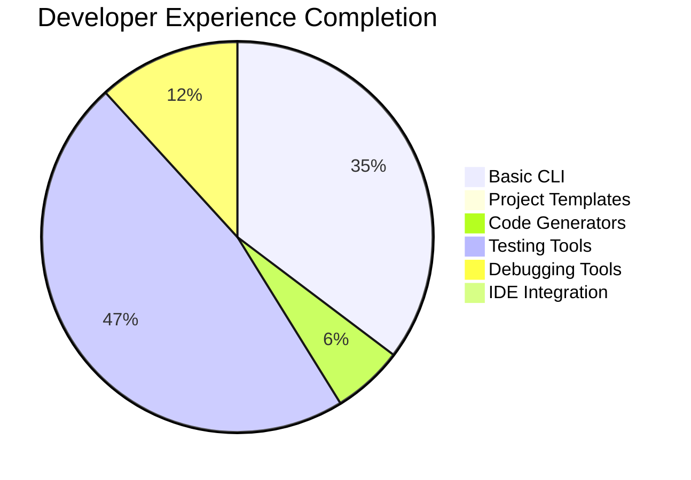
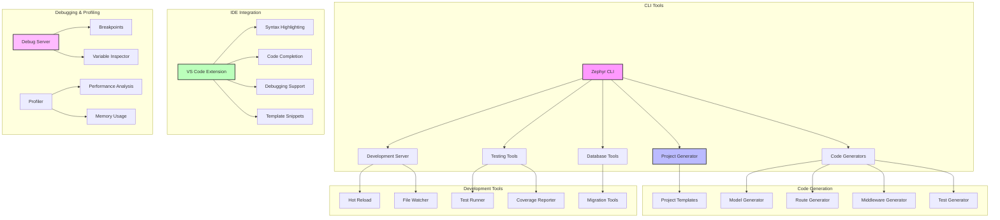
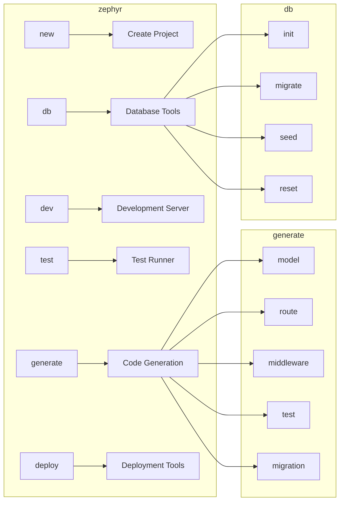

# Developer Experience & Tooling Proposal

## Executive Summary

Transform Zephyr into a developer-first framework by implementing comprehensive CLI tools, code generators, enhanced testing utilities, debugging tools, and IDE integration. This proposal focuses on reducing development time, improving code quality, and creating an exceptional developer experience from project creation to production deployment.

**Priority**: 🟡 **High**  
**Effort**: 2 weeks  
**Impact**: High - Dramatically improves developer productivity

## Current State Analysis

### ✅ What Exists
- Basic CLI framework structure
- Simple application class with decorators
- Basic testing setup with pytest
- Configuration system with settings

### ❌ What's Missing
- Project scaffolding and templates
- Code generators for models, routes, middleware
- Enhanced testing utilities and fixtures
- Interactive debugging tools
- IDE integration and extensions
- Development server with hot reload

### 📊 Completion Status


## Technical Architecture

### Developer Tooling Overview


### CLI Command Structure


## Feature Specifications

### Must Have Features

#### 1. Project Scaffolding
```bash
# Create new projects with templates
zephyr new myproject                    # Minimal template
zephyr new myproject --template=api     # API-focused template
zephyr new myproject --template=web     # Full-stack web template
zephyr new myproject --template=micro   # Microservice template

# Interactive project creation
zephyr new myproject --interactive
# ? Project name: My Awesome API
# ? Template: API-focused
# ? Database: PostgreSQL
# ? Authentication: JWT
# ? Testing: pytest + coverage
# ? Deployment: Docker
```

#### 2. Code Generators
```bash
# Model generation
zephyr generate model User name:str email:str:unique age:int:optional
zephyr generate model Post title:str content:text user:User:foreign

# Route generation
zephyr generate route users --crud      # Full CRUD routes
zephyr generate route auth --template=jwt  # JWT auth routes

# Middleware generation
zephyr generate middleware auth --template=jwt
zephyr generate middleware cors --template=basic

# Test generation
zephyr generate test users --model      # Model tests
zephyr generate test users --routes     # Route tests
zephyr generate test --integration      # Integration tests
```

#### 3. Enhanced Development Server
```bash
# Development server with hot reload
zephyr dev                              # Start with default settings
zephyr dev --host=0.0.0.0 --port=8080  # Custom host/port
zephyr dev --reload --debug             # Hot reload + debug mode
zephyr dev --profile                    # Enable profiling

# Features:
# - Automatic code reload on file changes
# - Enhanced error pages with stack traces
# - Request/response logging
# - Performance metrics display
# - Database query logging
```

#### 4. Testing Framework Enhancement
```python
from zephyr.testing import TestClient, create_test_db, MockService

class TestUserAPI:
    def setup_method(self):
        self.client = TestClient(app)
        self.db = create_test_db()
    
    async def test_create_user(self):
        response = await self.client.post("/users", json={
            "name": "John Doe",
            "email": "john@example.com"
        })
        assert response.status_code == 201
        assert response.json()["name"] == "John Doe"
    
    async def test_with_mock_service(self):
        with MockService("email_service") as mock:
            mock.send_email.return_value = {"status": "sent"}
            
            response = await self.client.post("/users", json={
                "name": "Jane Doe",
                "email": "jane@example.com"
            })
            
            assert mock.send_email.called
            assert response.status_code == 201

# CLI testing commands
zephyr test                             # Run all tests
zephyr test tests/test_users.py         # Run specific test file
zephyr test --coverage                  # Run with coverage report
zephyr test --watch                     # Watch mode for TDD
zephyr test --parallel                  # Parallel test execution
```

### Should Have Features

#### 1. Interactive Debugging
```python
from zephyr.debug import debugger

@app.get("/users/{user_id}")
async def get_user(user_id: int):
    debugger.breakpoint()  # Interactive breakpoint
    user = await User.get(user_id)
    debugger.inspect(user)  # Variable inspection
    return user

# CLI debugging
zephyr debug --attach                   # Attach to running process
zephyr debug --trace                    # Trace all requests
zephyr debug --profile                  # Profile performance
```

#### 2. Code Quality Tools
```bash
# Code formatting and linting
zephyr lint                             # Run ruff linting
zephyr format                           # Format code with black
zephyr check                            # Type checking with mypy
zephyr security                         # Security scanning

# Pre-commit hooks
zephyr hooks install                    # Install git hooks
zephyr hooks run                        # Run all hooks
```

#### 3. Documentation Generation
```bash
# API documentation
zephyr docs generate                    # Generate OpenAPI docs
zephyr docs serve                       # Serve docs locally
zephyr docs deploy                      # Deploy to GitHub Pages

# Code documentation
zephyr docs code                        # Generate code docs
zephyr docs coverage                    # Documentation coverage
```

### Good to Have Features

#### 1. VS Code Extension
```json
{
  "name": "zephyr-framework",
  "displayName": "Zephyr Framework",
  "description": "Zephyr framework support for VS Code",
  "features": [
    "Syntax highlighting for Zephyr decorators",
    "Code completion for framework APIs",
    "Integrated debugging support",
    "Template snippets for common patterns",
    "Project explorer integration",
    "Test runner integration"
  ]
}
```

#### 2. Performance Profiling
```python
from zephyr.profiling import profiler

# Automatic profiling
@profiler.profile
async def expensive_operation():
    # This function will be automatically profiled
    result = await complex_computation()
    return result

# CLI profiling
zephyr profile start                    # Start profiling
zephyr profile stop                     # Stop and save profile
zephyr profile analyze profile.prof     # Analyze profile
zephyr profile compare old.prof new.prof  # Compare profiles
```

#### 3. Deployment Tools
```bash
# Docker deployment
zephyr deploy docker                    # Generate Dockerfile
zephyr deploy docker --build           # Build Docker image
zephyr deploy docker --push            # Push to registry

# Kubernetes deployment
zephyr deploy k8s                       # Generate K8s manifests
zephyr deploy k8s --apply              # Apply to cluster
zephyr deploy k8s --status             # Check deployment status

# Cloud deployment
zephyr deploy aws                       # Deploy to AWS
zephyr deploy gcp                       # Deploy to Google Cloud
zephyr deploy azure                     # Deploy to Azure
```

## Implementation Roadmap

### Phase 1: Core CLI & Generators (Week 1)
| Task | Priority | Effort | Dependencies |
|------|----------|--------|--------------|
| CLI framework enhancement | Critical | 2 days | None |
| Project templates | Critical | 2 days | CLI |
| Model generator | High | 1 day | Templates |
| Route generator | High | 1 day | Templates |
| Basic testing utilities | High | 1 day | None |

**Deliverables**:
- Complete CLI framework with subcommands
- Project scaffolding with multiple templates
- Code generators for models and routes
- Enhanced testing utilities and fixtures

### Phase 2: Development Tools (Week 2)
| Task | Priority | Effort | Dependencies |
|------|----------|--------|--------------|
| Development server with hot reload | High | 2 days | CLI |
| Interactive debugging tools | Medium | 2 days | Dev server |
| Code quality integration | Medium | 1 day | CLI |
| Documentation generation | Medium | 2 days | CLI |

**Deliverables**:
- Hot-reloading development server
- Interactive debugging capabilities
- Integrated code quality tools
- Automatic documentation generation

## File Structure

```
zephyr/
├── cli/
│   ├── __init__.py              # Main CLI entry point
│   ├── main.py                  # CLI application
│   ├── commands/
│   │   ├── __init__.py
│   │   ├── new.py               # Project creation
│   │   ├── generate.py          # Code generation
│   │   ├── dev.py               # Development server
│   │   ├── test.py              # Testing commands
│   │   ├── lint.py              # Code quality
│   │   ├── docs.py              # Documentation
│   │   └── deploy.py            # Deployment
│   ├── generators/
│   │   ├── __init__.py
│   │   ├── base.py              # Base generator class
│   │   ├── model.py             # Model generator
│   │   ├── route.py             # Route generator
│   │   ├── middleware.py        # Middleware generator
│   │   └── test.py              # Test generator
│   └── templates/
│       ├── project/
│       │   ├── minimal/         # Minimal project template
│       │   ├── api/             # API project template
│       │   ├── web/             # Web project template
│       │   └── microservice/    # Microservice template
│       ├── model.py.j2          # Model template
│       ├── route.py.j2          # Route template
│       ├── middleware.py.j2     # Middleware template
│       └── test.py.j2           # Test template
├── testing/
│   ├── __init__.py              # Testing utilities exports
│   ├── client.py                # Enhanced test client
│   ├── fixtures.py              # Common test fixtures
│   ├── mocks.py                 # Mocking utilities
│   ├── database.py              # Database testing utilities
│   └── assertions.py            # Custom assertions
├── debug/
│   ├── __init__.py              # Debug utilities exports
│   ├── debugger.py              # Interactive debugger
│   ├── profiler.py              # Performance profiler
│   ├── inspector.py             # Variable inspector
│   └── server.py                # Debug server
└── dev/
    ├── __init__.py              # Development utilities
    ├── server.py                # Development server
    ├── reloader.py              # Hot reload functionality
    ├── watcher.py               # File watcher
    └── logger.py                # Development logging
```

## Template Specifications

### Project Templates

#### Minimal Template
```python
# {{project_name}}/app.py
from zephyr import Zephyr

app = Zephyr(title="{{project_title}}")

@app.get("/")
async def hello():
    return {"message": "Hello from {{project_name}}!"}

if __name__ == "__main__":
    import uvicorn
    uvicorn.run(app, host="0.0.0.0", port=8000)
```

#### API Template
```python
# {{project_name}}/app.py
from zephyr import Zephyr
from zephyr.database import Base, session
from zephyr.security import JWTManager

app = Zephyr(
    title="{{project_title}} API",
    description="{{project_description}}",
    version="1.0.0"
)

# Database setup
Base.metadata.create_all()

# Authentication setup
jwt_manager = JWTManager(app)

@app.get("/")
async def root():
    return {"message": "{{project_title}} API", "version": "1.0.0"}

@app.get("/health")
async def health():
    return {"status": "healthy"}

# Include routers
from .routes import users, auth
app.include_router(users.router, prefix="/api/v1")
app.include_router(auth.router, prefix="/api/v1/auth")
```

### Code Generation Templates

#### Model Template
```python
# models/{{model_name|lower}}.py
from zephyr.database import Base, Mapped, mapped_column
from datetime import datetime

{{ import }}


class {{model_name}}(Base):
    __tablename__ = "{{table_name}}"
    
    
    {{field.name}}: Mapped[{{field.type}}] = mapped_column({{field.constraints}})
    
    
    created_at: Mapped[datetime] = mapped_column(default=datetime.utcnow)
    updated_at: Mapped[datetime] = mapped_column(default=datetime.utcnow, onupdate=datetime.utcnow)
    
    def __repr__(self):
        return f"<{{model_name}}(id={self.id})>"
```

#### Route Template
```python
# routes/{{resource_name}}.py
from zephyr import APIRouter
from zephyr.database import session
from ..models.{{model_name|lower}} import {{model_name}}
from ..schemas.{{model_name|lower}} import {{model_name}}Create, {{model_name}}Update, {{model_name}}Response

router = APIRouter(prefix="/{{resource_name}}", tags=["{{resource_name}}"])

@router.get("/", response_model=list[{{model_name}}Response])
async def list_{{resource_name}}():
    """List all {{resource_name}}."""
    async with session() as db:
        result = await db.execute(select({{model_name}}))
        return result.scalars().all()

@router.post("/", response_model={{model_name}}Response, status_code=201)
async def create_{{resource_name|singular}}({{resource_name|singular}}: {{model_name}}Create):
    """Create a new {{resource_name|singular}}."""
    async with session() as db:
        db_{{resource_name|singular}} = {{model_name}}(**{{resource_name|singular}}.dict())
        db.add(db_{{resource_name|singular}})
        await db.commit()
        await db.refresh(db_{{resource_name|singular}})
        return db_{{resource_name|singular}}

@router.get("/{{{resource_name|singular}}_id}", response_model={{model_name}}Response)
async def get_{{resource_name|singular}}({{resource_name|singular}}_id: int):
    """Get a {{resource_name|singular}} by ID."""
    async with session() as db:
        {{resource_name|singular}} = await db.get({{model_name}}, {{resource_name|singular}}_id)
        if not {{resource_name|singular}}:
            raise HTTPException(status_code=404, detail="{{model_name}} not found")
        return {{resource_name|singular}}
```

## CLI Command Specifications

### Project Creation
```bash
# Basic project creation
zephyr new myproject
# Creates: myproject/ with minimal template

# Template selection
zephyr new myproject --template=api
zephyr new myproject --template=web
zephyr new myproject --template=microservice

# Interactive mode
zephyr new myproject --interactive
# Prompts for: template, database, auth, testing, deployment

# Advanced options
zephyr new myproject \
  --template=api \
  --database=postgresql \
  --auth=jwt \
  --testing=pytest \
  --deployment=docker
```

### Code Generation
```bash
# Model generation
zephyr generate model User name:str email:str:unique
zephyr generate model Post title:str content:text user:User:foreign

# Route generation
zephyr generate route users --crud
zephyr generate route auth --template=jwt

# Middleware generation
zephyr generate middleware cors
zephyr generate middleware auth --template=jwt

# Test generation
zephyr generate test users --model
zephyr generate test users --routes
```

### Development Commands
```bash
# Development server
zephyr dev                              # Default settings
zephyr dev --port=8080                  # Custom port
zephyr dev --reload                     # Hot reload
zephyr dev --debug                      # Debug mode

# Testing
zephyr test                             # Run all tests
zephyr test --watch                     # Watch mode
zephyr test --coverage                  # Coverage report
zephyr test --parallel                  # Parallel execution

# Code quality
zephyr lint                             # Lint code
zephyr format                           # Format code
zephyr check                            # Type check
```

## Testing Enhancement Specifications

### Enhanced Test Client
```python
from zephyr.testing import TestClient, AsyncTestClient

class TestClient:
    """Enhanced test client with additional utilities."""
    
    def __init__(self, app, base_url="http://testserver"):
        self.app = app
        self.base_url = base_url
    
    async def authenticate(self, user_id: int):
        """Authenticate as a specific user."""
        token = create_test_token(user_id)
        self.headers["Authorization"] = f"Bearer {token}"
    
    async def upload_file(self, endpoint: str, file_path: str, **kwargs):
        """Upload a file to an endpoint."""
        with open(file_path, "rb") as f:
            files = {"file": f}
            return await self.post(endpoint, files=files, **kwargs)
    
    def assert_json_contains(self, response, expected: dict):
        """Assert response JSON contains expected data."""
        actual = response.json()
        for key, value in expected.items():
            assert key in actual
            assert actual[key] == value

# Usage example
async def test_user_creation():
    async with TestClient(app) as client:
        await client.authenticate(admin_user_id)
        
        response = await client.post("/users", json={
            "name": "John Doe",
            "email": "john@example.com"
        })
        
        client.assert_json_contains(response, {
            "name": "John Doe",
            "email": "john@example.com"
        })
        assert response.status_code == 201
```

### Test Fixtures
```python
# zephyr/testing/fixtures.py
import pytest
from zephyr.testing import create_test_db, TestClient

@pytest.fixture
async def db():
    """Provide clean database for each test."""
    async with create_test_db() as database:
        yield database

@pytest.fixture
async def client(app):
    """Provide test client."""
    async with TestClient(app) as test_client:
        yield test_client

@pytest.fixture
async def authenticated_client(app, test_user):
    """Provide authenticated test client."""
    async with TestClient(app) as client:
        await client.authenticate(test_user.id)
        yield client

@pytest.fixture
def test_user(db):
    """Create test user."""
    user = User(name="Test User", email="test@example.com")
    db.add(user)
    db.commit()
    return user
```

## Configuration Specifications

### CLI Configuration
```python
# zephyr/cli/config.py
from pydantic import BaseSettings

class CLISettings(BaseSettings):
    # Project defaults
    DEFAULT_TEMPLATE: str = "minimal"
    DEFAULT_DATABASE: str = "sqlite"
    DEFAULT_AUTH: str = "none"
    
    # Development server
    DEV_HOST: str = "127.0.0.1"
    DEV_PORT: int = 8000
    DEV_RELOAD: bool = True
    DEV_DEBUG: bool = True
    
    # Testing
    TEST_PARALLEL: bool = True
    TEST_COVERAGE_THRESHOLD: int = 80
    
    # Code quality
    LINT_CONFIG: str = "pyproject.toml"
    FORMAT_CONFIG: str = "pyproject.toml"
    
    class Config:
        env_prefix = "ZEPHYR_"
        env_file = ".zephyr"
```

### Project Configuration
```toml
# .zephyr file in project root
[project]
name = "myproject"
template = "api"
database = "postgresql"
auth = "jwt"

[dev]
host = "0.0.0.0"
port = 8000
reload = true
debug = true

[test]
parallel = true
coverage_threshold = 85
watch_patterns = ["*.py", "tests/**/*.py"]

[lint]
config = "pyproject.toml"
exclude = ["migrations/", "build/"]

[deploy]
platform = "docker"
registry = "myregistry.com"
```

## Dependencies

### Required Dependencies
```toml
# pyproject.toml additions
dependencies = [
    # Existing dependencies...
    "click>=8.1.0",                 # CLI framework
    "jinja2>=3.1.0",                # Template engine
    "watchfiles>=0.20.0",           # File watching
    "rich>=13.0.0",                 # Rich terminal output
    "typer>=0.9.0",                 # Enhanced CLI
]
```

### Development Dependencies
```toml
[project.optional-dependencies]
dev = [
    "pytest>=7.4.0",               # Testing framework
    "pytest-asyncio>=0.21.0",      # Async testing
    "pytest-cov>=4.1.0",           # Coverage reporting
    "pytest-xdist>=3.3.0",         # Parallel testing
    "httpx>=0.24.0",                # HTTP client for testing
    "black>=23.7.0",                # Code formatting
    "ruff>=0.0.287",                # Linting
    "mypy>=1.5.0",                  # Type checking
]
```

## Performance Benchmarks

### CLI Performance Targets
| Command | Target Time | Notes |
|---------|-------------|-------|
| `zephyr new` | < 10s | Project creation |
| `zephyr generate model` | < 2s | Code generation |
| `zephyr dev` startup | < 3s | Development server |
| `zephyr test` | < 30s | Test suite execution |
| Hot reload | < 1s | File change detection |

### Development Server Metrics
```python
# Performance monitoring for dev server
class DevServerMetrics:
    def __init__(self):
        self.reload_times = []
        self.request_times = []
    
    def record_reload_time(self, duration: float):
        self.reload_times.append(duration)
        if duration > 2.0:  # Warn if reload takes > 2s
            print(f"⚠️  Slow reload: {duration:.2f}s")
    
    def record_request_time(self, duration: float):
        self.request_times.append(duration)
        if duration > 1.0:  # Warn if request takes > 1s
            print(f"⚠️  Slow request: {duration:.2f}s")
```

## Risk Assessment

### High Risk Items
| Risk | Impact | Probability | Mitigation |
|------|--------|-------------|------------|
| Template maintenance overhead | Medium | High | Automated testing, community contributions |
| CLI complexity growth | High | Medium | Modular design, clear documentation |
| IDE extension maintenance | Medium | Medium | Focus on VS Code first, community support |

### Medium Risk Items
| Risk | Impact | Probability | Mitigation |
|------|--------|-------------|------------|
| Hot reload stability | Medium | Medium | Robust file watching, error handling |
| Code generation bugs | Medium | Medium | Comprehensive testing, validation |
| Performance overhead | Low | Medium | Profiling, optimization |

## Success Metrics

### Developer Productivity Metrics
- ✅ < 2 minutes from `zephyr new` to running app
- ✅ < 30 seconds to generate CRUD routes for a model
- ✅ < 1 second hot reload time
- ✅ > 80% test coverage with generated tests

### Developer Experience Metrics
- ✅ Clear, helpful error messages
- ✅ Comprehensive CLI help and documentation
- ✅ IDE autocompletion and syntax highlighting
- ✅ Intuitive command structure and naming

### Adoption Metrics
- ✅ Framework usage in new projects
- ✅ Community contributions to templates
- ✅ Developer satisfaction surveys
- ✅ Documentation and tutorial engagement

## Next Steps

### Immediate Actions (Week 1)
1. **Enhance CLI framework with Click/Typer**
2. **Create project templates (minimal, API, web)**
3. **Implement model and route generators**
4. **Build enhanced test client and fixtures**

### Short-term Goals (Month 1)
1. **Complete development server with hot reload**
2. **Add interactive debugging capabilities**
3. **Create VS Code extension**
4. **Implement deployment tools**

### Integration Points
- **Database Layer**: Model generation and migration tools
- **Security System**: Authentication scaffolding
- **Storage System**: File upload route generation
- **Observability**: Monitoring setup automation

---

**Related Proposals**:
- [Database & ORM Layer](./database-orm-layer.md) - Model generation and migration tools
- [Observability & Monitoring](./observability-monitoring.md) - Development debugging tools
- [Production Infrastructure](./production-infrastructure.md) - Deployment automation

---

*Last Updated: January 2024*  
*Version: 1.0*  
*Status: Ready for Implementation*


