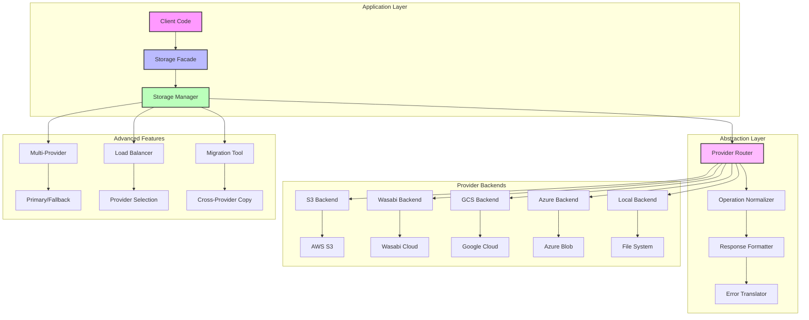
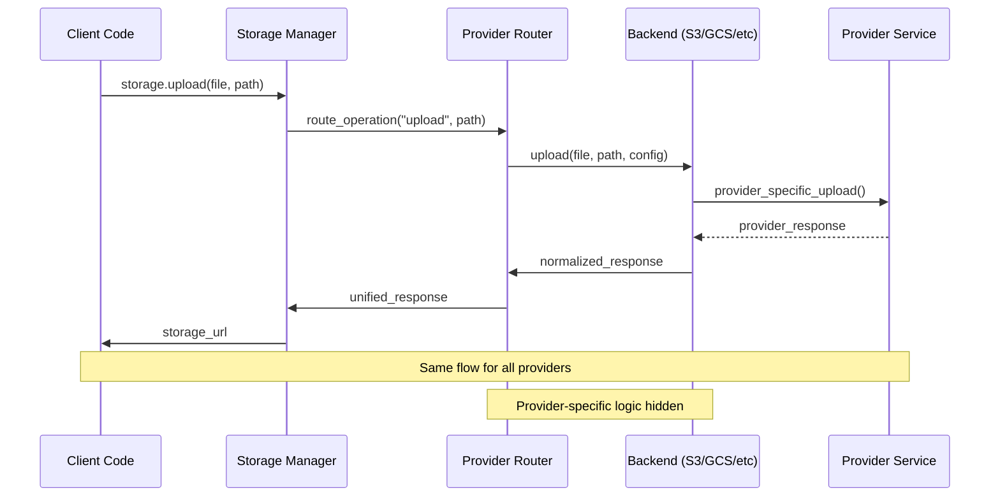

# Universal Storage Abstraction Proposal

## Executive Summary

Implement a completely abstracted storage layer where client applications use identical code regardless of storage provider (S3, Wasabi, GCS, Azure, Local). Provider switching requires only configuration changes with zero client code modifications, enabling true multi-cloud flexibility and vendor independence.

**Priority**: 🔴 **Critical**  
**Effort**: 3 weeks  
**Impact**: High - Enables flexible, scalable file storage

## Core Principle: Complete Provider Abstraction

### Universal Client Code
```python
from zephyr.storage import storage

# Upload - works with any provider
url = await storage.upload(file_data, "documents/report.pdf")

# Download - provider transparent  
content = await storage.download("documents/report.pdf")

# Delete - same API everywhere
await storage.delete("documents/report.pdf")

# List - consistent across all providers
files = await storage.list("documents/")

# Get metadata - unified response format
info = await storage.get_info("documents/report.pdf")
```

### Configuration-Only Provider Switching
```python
# Switch from S3 to Wasabi - just change config
STORAGE_PROVIDER = "wasabi"  # was "s3"
WASABI_ACCESS_KEY = "..."
WASABI_SECRET_KEY = "..."

# Client code remains 100% identical
```

## Technical Architecture

### Storage System Overview


### Provider Abstraction Flow


## Feature Specifications

### Must Have Features

#### 1. Universal Storage Interface
```python
from zephyr.storage import storage

class StorageInterface:
    """Universal storage interface - same for all providers."""
    
    async def upload(self, file: bytes | BinaryIO, path: str, **kwargs) -> str:
        """Upload file and return public URL."""
        
    async def download(self, path: str) -> bytes:
        """Download file content."""
        
    async def delete(self, path: str) -> bool:
        """Delete file, return success status."""
        
    async def exists(self, path: str) -> bool:
        """Check if file exists."""
        
    async def list(self, prefix: str = "", limit: int = 1000) -> list[FileInfo]:
        """List files with metadata."""
        
    async def get_info(self, path: str) -> FileInfo:
        """Get file metadata."""
        
    async def get_url(self, path: str, expires: int = 3600) -> str:
        """Get signed URL for direct access."""
```

#### 2. Multi-Provider Support
```python
# Simple single provider
STORAGE_PROVIDER = "s3"

# Advanced: Route different data types to different providers
STORAGE_ROUTING = {
    "user_uploads": "s3",           # User files to S3
    "temp_files": "local",          # Temp files locally  
    "backups": "wasabi",            # Backups to Wasabi (cheaper)
    "media": "gcs",                 # Media files to Google Cloud
    "documents": "azure",           # Documents to Azure
    "default": "s3"                 # Fallback for unspecified
}

# Route by file patterns/paths
STORAGE_PATTERNS = {
    "*.jpg|*.png|*.gif": "gcs",     # Images to GCS
    "*.pdf|*.doc|*.docx": "azure",  # Documents to Azure
    "*.mp4|*.avi|*.mov": "wasabi",  # Videos to Wasabi
    "temp/*": "local",              # Temp files locally
    "cache/*": "local",             # Cache files locally
    "uploads/avatars/*": "s3",      # Avatar uploads to S3
    "*": "s3"                       # Everything else to S3
}
```

#### 3. Provider Backends
```python
# All providers implement the same interface
class BaseStorageBackend:
    async def upload(self, file: bytes, path: str) -> str: ...
    async def download(self, path: str) -> bytes: ...
    async def delete(self, path: str) -> bool: ...
    # ... other methods

# S3-compatible providers (S3, Wasabi, MinIO)
class S3Backend(BaseStorageBackend):
    def __init__(self, access_key: str, secret_key: str, bucket: str, endpoint: str = None):
        self.client = boto3.client('s3', endpoint_url=endpoint)

# Google Cloud Storage
class GCSBackend(BaseStorageBackend):
    def __init__(self, credentials: str, bucket: str):
        self.client = storage.Client.from_service_account_json(credentials)

# Azure Blob Storage
class AzureBackend(BaseStorageBackend):
    def __init__(self, connection_string: str, container: str):
        self.client = BlobServiceClient.from_connection_string(connection_string)

# Local filesystem
class LocalBackend(BaseStorageBackend):
    def __init__(self, base_path: str, base_url: str):
        self.base_path = Path(base_path)
```

### Should Have Features

#### 1. Automatic Failover
```python
# Multi-provider with failover per route
STORAGE_PROVIDERS = {
    "s3": {"primary": "s3", "fallback": "local"},
    "wasabi": {"primary": "wasabi", "fallback": "s3"},
    "gcs": {"primary": "gcs", "fallback": "s3"},
    "azure": {"primary": "azure", "fallback": "local"}
}

# Automatic retry with exponential backoff
STORAGE_RETRY_ATTEMPTS = 3
STORAGE_RETRY_DELAY = 1.0  # seconds
STORAGE_RETRY_EXPONENTIAL = True
```

#### 2. Streaming Support
```python
# Stream large files without loading into memory
async def upload_large_file(file_path: str, storage_path: str):
    async with aiofiles.open(file_path, 'rb') as f:
        await storage.upload_stream(f, storage_path)

# Stream download for large files
async def download_large_file(storage_path: str, local_path: str):
    async with storage.download_stream(storage_path) as stream:
        async with aiofiles.open(local_path, 'wb') as f:
            async for chunk in stream:
                await f.write(chunk)
```

#### 3. Metadata and Tagging
```python
# Upload with metadata
await storage.upload(
    file_data, 
    "documents/report.pdf",
    metadata={
        "author": "John Doe",
        "department": "Finance",
        "classification": "Internal"
    },
    tags={
        "project": "Q4-Report",
        "type": "document"
    }
)

# Search by metadata/tags
files = await storage.search(
    tags={"project": "Q4-Report"},
    metadata={"department": "Finance"}
)
```

### Good to Have Features

#### 1. Cross-Provider Migration
```python
# Migrate files between providers
await storage.migrate(
    from_provider="s3",
    to_provider="gcs",
    path_pattern="backups/*",
    delete_source=True
)

# Sync between providers
await storage.sync(
    source_provider="s3",
    target_provider="wasabi",
    path_pattern="documents/*"
)
```

#### 2. CDN Integration
```python
# Automatic CDN URL generation
STORAGE_CDN_ENABLED = True
STORAGE_CDN_DOMAIN = "cdn.example.com"

# Returns CDN URL instead of direct storage URL
url = await storage.upload(file, "images/photo.jpg")
# Returns: https://cdn.example.com/images/photo.jpg
```

#### 3. Image Processing
```python
# Automatic image optimization
await storage.upload(
    image_file,
    "images/photo.jpg",
    transforms=[
        {"resize": {"width": 800, "height": 600}},
        {"format": "webp"},
        {"quality": 85}
    ]
)

# Generate multiple sizes
await storage.upload_variants(
    image_file,
    "images/photo.jpg",
    variants={
        "thumbnail": {"resize": {"width": 150, "height": 150}},
        "medium": {"resize": {"width": 400, "height": 300}},
        "large": {"resize": {"width": 1200, "height": 900}}
    }
)
```

## Implementation Roadmap

### Phase 1: Universal Interface Foundation (Week 1)
| Task | Priority | Effort | Dependencies |
|------|----------|--------|--------------|
| Abstract storage interface | Critical | 2 days | None |
| Storage manager implementation | Critical | 2 days | Interface |
| Local filesystem backend | Critical | 1 day | Manager |
| Configuration system | Critical | 1 day | None |
| Basic error handling | High | 1 day | Interface |

**Deliverables**:
- Complete abstract storage interface
- Storage manager with provider resolution
- Working local filesystem backend
- Configuration-based provider selection
- Unified error handling system

### Phase 2: Cloud Provider Backends (Week 2)
| Task | Priority | Effort | Dependencies |
|------|----------|--------|--------------|
| S3 backend implementation | Critical | 2 days | Interface |
| Wasabi backend (S3-compatible) | High | 1 day | S3 backend |
| Google Cloud Storage backend | High | 2 days | Interface |
| Azure Blob Storage backend | High | 2 days | Interface |
| Response format normalization | Critical | 1 day | All backends |

**Deliverables**:
- Complete S3 backend with all operations
- Wasabi backend with endpoint override
- Google Cloud Storage integration
- Azure Blob Storage integration
- Consistent response formats across providers

### Phase 3: Advanced Abstraction Features (Week 3)
| Task | Priority | Effort | Dependencies |
|------|----------|--------|--------------|
| Multi-provider routing | High | 2 days | All backends |
| Automatic failover logic | High | 2 days | Routing |
| Streaming file operations | Medium | 2 days | Backends |
| Metadata and tagging | Medium | 1 day | Backends |
| Cross-provider migration | Low | 2 days | All features |

**Deliverables**:
- Pattern-based provider routing
- Primary/fallback provider support
- Streaming upload/download
- Unified metadata system
- Migration utilities

## File Structure

```
zephyr/
├── storage/
│   └── __init__.py              # Universal storage facade
├── core/
│   └── storage/
│       ├── __init__.py
│       ├── manager.py           # Storage manager and provider resolution
│       ├── config.py            # Configuration system
│       ├── exceptions.py        # Unified exceptions
│       ├── types.py             # Common data types (FileInfo, etc.)
│       ├── routing.py           # Provider routing logic
│       ├── migration.py         # Cross-provider migration
│       └── backends/
│           ├── __init__.py
│           ├── base.py          # Abstract backend interface
│           ├── s3.py            # AWS S3 implementation
│           ├── wasabi.py        # Wasabi implementation
│           ├── gcs.py           # Google Cloud Storage
│           ├── azure.py         # Azure Blob Storage
│           └── local.py         # Local filesystem
├── cli/
│   └── storage/
│       ├── __init__.py
│       ├── migrate.py           # Migration commands
│       ├── sync.py              # Sync commands
│       └── test.py              # Storage testing commands
└── tests/
    └── storage/
        ├── __init__.py
        ├── conftest.py          # Storage test fixtures
        ├── test_manager.py      # Manager testing
        ├── test_routing.py      # Routing logic testing
        ├── test_backends.py     # Backend testing
        └── backends/
            ├── test_s3.py       # S3 backend tests
            ├── test_gcs.py      # GCS backend tests
            ├── test_azure.py    # Azure backend tests
            └── test_local.py    # Local backend tests
```

## Configuration Specifications

### Storage Settings
```python
# zephyr/conf/base.py additions
class BaseSettings(PydanticBaseSettings):
    # Primary Storage Configuration
    STORAGE_PROVIDER: str = "local"
    STORAGE_BASE_URL: str = "http://localhost:8000/media"
    
    # Multi-Provider Routing
    STORAGE_ROUTING: dict[str, str] = {}
    STORAGE_PATTERNS: dict[str, str] = {}
    STORAGE_PROVIDERS: dict[str, dict] = {}
    
    # Local Storage
    LOCAL_STORAGE_PATH: str = "./media"
    LOCAL_STORAGE_URL: str = "/media"
    
    # AWS S3
    S3_ACCESS_KEY: str | None = None
    S3_SECRET_KEY: str | None = None
    S3_BUCKET: str | None = None
    S3_REGION: str = "us-east-1"
    S3_ENDPOINT_URL: str | None = None
    
    # Wasabi (S3-compatible)
    WASABI_ACCESS_KEY: str | None = None
    WASABI_SECRET_KEY: str | None = None
    WASABI_BUCKET: str | None = None
    WASABI_REGION: str = "us-east-1"
    
    # Google Cloud Storage
    GCS_CREDENTIALS: str | None = None
    GCS_BUCKET: str | None = None
    GCS_PROJECT: str | None = None
    
    # Azure Blob Storage
    AZURE_CONNECTION_STRING: str | None = None
    AZURE_CONTAINER: str | None = None
    
    # Advanced Features
    STORAGE_CDN_ENABLED: bool = False
    STORAGE_CDN_DOMAIN: str | None = None
    STORAGE_RETRY_ATTEMPTS: int = 3
    STORAGE_RETRY_DELAY: float = 1.0
    STORAGE_MAX_FILE_SIZE: int = 100 * 1024 * 1024  # 100MB
```

### Environment Configuration Examples
```bash
# Simple S3 setup
STORAGE_PROVIDER=s3
S3_ACCESS_KEY=your_access_key
S3_SECRET_KEY=your_secret_key
S3_BUCKET=your_bucket

# Multi-provider with routing
STORAGE_ROUTING='{"user_uploads": "s3", "temp_files": "local", "backups": "wasabi"}'
S3_BUCKET=main-storage
WASABI_BUCKET=backup-storage
LOCAL_STORAGE_PATH=./temp

# Production with CDN
STORAGE_CDN_ENABLED=true
STORAGE_CDN_DOMAIN=cdn.example.com
```

## Data Types and Models

### Core Data Types
```python
from dataclasses import dataclass
from datetime import datetime
from typing import Optional, Dict, Any

@dataclass
class FileInfo:
    """Unified file information across all providers."""
    path: str
    size: int
    content_type: str
    last_modified: datetime
    etag: str
    metadata: Dict[str, Any] = None
    tags: Dict[str, str] = None
    url: Optional[str] = None
    provider: Optional[str] = None

@dataclass
class UploadResult:
    """Result of file upload operation."""
    path: str
    url: str
    size: int
    content_type: str
    provider: str
    metadata: Dict[str, Any] = None

class StorageException(Exception):
    """Base exception for storage operations."""
    pass

class FileNotFoundError(StorageException):
    """File not found in storage."""
    pass

class ProviderError(StorageException):
    """Provider-specific error."""
    def __init__(self, message: str, provider: str, original_error: Exception = None):
        super().__init__(message)
        self.provider = provider
        self.original_error = original_error
```

## Testing Strategy

### Test Coverage Requirements
| Component | Target Coverage | Test Types |
|-----------|----------------|------------|
| Storage Manager | 95% | Unit, Integration |
| Provider Backends | 90% | Unit, Integration, E2E |
| Routing Logic | 95% | Unit, Integration |
| Error Handling | 90% | Unit, Integration |
| CLI Tools | 80% | Integration, E2E |

### Mock Testing Strategy
```python
# tests/storage/conftest.py
@pytest.fixture
def mock_s3_client():
    """Mock S3 client for testing."""
    with mock.patch('boto3.client') as mock_client:
        mock_instance = mock.MagicMock()
        mock_client.return_value = mock_instance
        yield mock_instance

@pytest.fixture
def storage_manager():
    """Storage manager with test configuration."""
    config = StorageConfig(
        provider="local",
        local_path="./test_storage",
        local_url="/test_media"
    )
    return StorageManager(config)

# tests/storage/test_backends.py
class TestS3Backend:
    async def test_upload_file(self, mock_s3_client):
        backend = S3Backend("key", "secret", "bucket")
        
        mock_s3_client.upload_fileobj.return_value = None
        mock_s3_client.head_object.return_value = {
            'ContentLength': 1024,
            'ContentType': 'text/plain',
            'LastModified': datetime.now(),
            'ETag': '"abc123"'
        }
        
        result = await backend.upload(b"test content", "test.txt")
        
        assert result.path == "test.txt"
        assert result.size == 1024
        mock_s3_client.upload_fileobj.assert_called_once()
```

## Performance Benchmarks

### Target Performance Metrics
| Operation | Target | Provider | Notes |
|-----------|--------|----------|-------|
| Small file upload (< 1MB) | < 500ms | All | 95th percentile |
| Large file upload (100MB) | < 30s | Cloud | With streaming |
| File download | < 200ms | All | 95th percentile |
| File listing (1000 files) | < 2s | All | With pagination |
| Provider failover | < 5s | Multi | Including retry |

### Load Testing Scenarios
```python
# Performance test scenarios
async def test_concurrent_uploads():
    """Test 50 concurrent file uploads."""
    files = [f"test_file_{i}.txt" for i in range(50)]
    tasks = [storage.upload(b"content", f) for f in files]
    results = await asyncio.gather(*tasks)
    assert len(results) == 50

async def test_large_file_streaming():
    """Test streaming upload of 100MB file."""
    large_file = b"x" * (100 * 1024 * 1024)
    start_time = time.time()
    result = await storage.upload(large_file, "large_file.bin")
    duration = time.time() - start_time
    assert duration < 30  # Should complete within 30 seconds
```

## Dependencies

### Required Dependencies
```toml
# pyproject.toml additions
dependencies = [
    # Existing dependencies...
    "boto3>=1.28.0",              # AWS S3 and S3-compatible
    "google-cloud-storage>=2.10.0", # Google Cloud Storage
    "azure-storage-blob>=12.17.0", # Azure Blob Storage
    "aiofiles>=23.2.0",          # Async file operations
    "tenacity>=8.2.0",           # Retry logic and failover
    "python-magic>=0.4.27",      # MIME type detection
]
```

### Optional Dependencies
```toml
[project.optional-dependencies]
storage = [
    "pillow>=10.0.0",            # Image processing
    "python-magic-bin>=0.4.14", # Binary for python-magic (Windows)
]
```

## Integration Points

### Framework Integration
```python
# Integration with existing UploadFile system
from zephyr.storage import storage
from zephyr.app.requests import Request

@app.post("/upload")
async def upload_file(request: Request):
    form = await request.form()
    file = form["file"]
    
    # Automatic storage with provider abstraction
    url = await storage.upload(
        await file.read(),
        f"uploads/{file.filename}"
    )
    
    return {"url": url}

# Middleware for automatic file handling
class StorageMiddleware:
    async def __call__(self, scope, receive, send):
        if scope["type"] == "http":
            # Automatically handle file uploads
            # Route to appropriate storage provider
            pass
```

## Risk Assessment

### High Risk Items
| Risk | Impact | Probability | Mitigation |
|------|--------|-------------|------------|
| Provider API changes | High | Medium | Version pinning, adapter pattern |
| Data loss during migration | Critical | Low | Backup verification, rollback |
| Provider service outages | High | Medium | Multi-provider failover |

### Medium Risk Items
| Risk | Impact | Probability | Mitigation |
|------|--------|-------------|------------|
| Performance degradation | Medium | Medium | Benchmarking, caching |
| Configuration complexity | Medium | High | Clear documentation, validation |
| Vendor lock-in concerns | Medium | Low | Provider abstraction design |

## Success Metrics

### Functional Metrics
- ✅ Single API works with all providers (S3, GCS, Azure, Local)
- ✅ Provider switching with configuration only
- ✅ Automatic failover between providers
- ✅ Streaming support for large files
- ✅ Cross-provider migration tools

### Performance Metrics
- ✅ < 500ms for small file operations (95th percentile)
- ✅ < 30s for large file uploads (100MB)
- ✅ < 5s failover time between providers
- ✅ Support for 1000+ concurrent operations

### Developer Experience Metrics
- ✅ Zero code changes for provider switching
- ✅ < 5 minutes to configure new provider
- ✅ Clear error messages with provider context
- ✅ Comprehensive documentation and examples

## Next Steps

### Immediate Actions (Week 1)
1. **Implement abstract storage interface**
2. **Create storage manager with provider resolution**
3. **Build local filesystem backend as reference**
4. **Set up configuration system**

### Short-term Goals (Month 1)
1. **Complete all cloud provider backends**
2. **Implement multi-provider routing**
3. **Add automatic failover capabilities**
4. **Create comprehensive test suite**

### Integration Points
- **Settings System**: Storage configuration integration
- **CLI Framework**: Storage management commands
- **Request Handling**: Automatic file upload processing
- **Monitoring**: Storage operation metrics

---

**Related Proposals**:
- [Database & ORM Layer](./database-orm-layer.md) - File metadata storage
- [Observability & Monitoring](./observability-monitoring.md) - Storage operation monitoring
- [Developer Experience](./developer-experience.md) - CLI tools for storage management

---

*Last Updated: January 2024*  
*Version: 1.0*  
*Status: Ready for Implementation*


