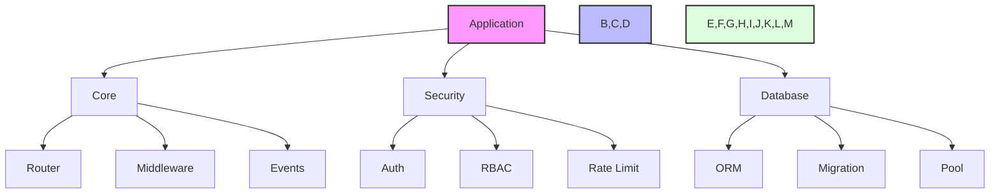

# Zephyr Framework

[](https://badge.fury.io/py/zephyr-py)
[](https://pypi.org/project/zephyr-py/)
[](https://pepy.tech/project/zephyr-py)

A modern, high-performance Python web framework with advanced developer tools and enterprise-grade capabilities.

> **⚠️ Development Status**: This framework is currently in active development (v0.1.0-dev0). APIs may change between releases. Use in production at your own risk.

## Architecture



## Features

### Core Framework
- Modern API patterns (FastAPI-style decorators)
- GraphQL & WebSocket support
- Event-driven architecture
- Advanced database patterns
- Type-safe queries and validation

### Security
- JWT Authentication
- Role-Based Access Control (RBAC)
- Redis-based Rate Limiting
- CSRF Protection
- Security Headers

### Database
- Advanced ORM with type safety
- Query builder with joins
- Migration system
- Connection pooling
- Read/write splitting

### Caching
- Multi-level cache (Memory + Redis)
- Cache tags and invalidation
- Cache warming strategies
- Distributed caching

### Queue System
- Distributed job queues
- Job scheduling
- Retry mechanisms
- Dead letter queues
- Queue monitoring

### Developer Tools
- Interactive debugger with breakpoints
- Performance profiler
- Code generation tools
- Schema management
- Migration tools

### Observability
- Distributed tracing
- Metrics collection
- Structured logging
- Real-time monitoring
- Health checks

### CLI Tools
- Development server
- Database migrations
- Code generation
- Monitoring dashboard
- Deployment management

## Project Structure
```
zephyr/
├── zephyr/                # Main package
│   ├── core/             # Core components
│   │   ├── app.py       # Application class
│   │   ├── config.py    # Configuration
│   │   ├── context.py   # Request context
│   │   └── router.py    # URL routing
│   ├── security/        # Security components
│   │   ├── auth.py     # Authentication
│   │   ├── rbac.py     # Access control
│   │   └── rate_limit.py# Rate limiting
│   ├── db/             # Database components
│   │   ├── models.py   # ORM models
│   │   ├── query.py    # Query builder
│   │   └── pool.py     # Connection pool
│   ├── cache/          # Caching system
│   │   ├── memory.py   # Memory cache
│   │   └── redis.py    # Redis cache
│   ├── queue/          # Queue system
│   │   ├── memory.py   # Memory queue
│   │   └── redis.py    # Redis queue
│   ├── graphql/        # GraphQL support
│   ├── websockets/     # WebSocket support
│   └── tools/          # Developer tools
├── docs/               # Documentation
├── examples/           # Example code
└── deployment/         # Deployment configs
```

## Installation

### Using uv (Recommended)

[`uv`](https://github.com/astral-sh/uv) is an extremely fast Python package and project manager written in Rust. It's 10-100x faster than pip and provides a unified toolchain.

**Install uv:**
```bash
# macOS / Linux
curl -LsSf https://astral.sh/uv/install.sh | sh

# Windows (PowerShell)
powershell -ExecutionPolicy ByPass -c "irm https://astral.sh/uv/install.ps1 | iex"

# Or via pip/pipx
pip install uv
```

**Install Zephyr:**
```bash
# Create virtual environment and install
uv venv
source .venv/bin/activate  # Windows: .venv\Scripts\activate
uv pip install zephyr-py

# With performance optimizations
uv pip install zephyr-py[performance]

# With all dev tools
uv pip install zephyr-py[dev]
```

### Using pip

```bash
# Create virtual environment
python -m venv .venv
source .venv/bin/activate  # Windows: .venv\Scripts\activate

# Install package
pip install zephyr-py

# With optional dependencies
pip install zephyr-py[performance]  # Performance optimizations
pip install zephyr-py[dev]          # Development tools
```

## Requirements

- Python 3.11 or higher
- Modern async/await support

## Quick Start

```python
from zephyr import Application
from zephyr.core import Router
from zephyr.security import JWT, RateLimiter
from zephyr.cache import RedisCache
from zephyr.db import Database

# Create application
app = Application("myapp")

# Configure components
app.use_jwt(JWT(secret_key="your-secret"))
app.use_rate_limit(RateLimiter(requests=100, window=60))
app.use_cache(RedisCache(url="redis://localhost"))
app.use_database(Database(url="postgresql://localhost/myapp"))

# Define routes
router = Router()

@router.get("/")
async def hello():
    return {"message": "Hello from Zephyr!"}

@router.post("/items")
@jwt_required
async def create_item(item: Item):
    return await item.save()

app.add_router(router)

# Run the application
if __name__ == "__main__":
    app.run(host="0.0.0.0", port=8000)
```

## Visualizing Diagrams

The documentation includes Mermaid diagrams which can be viewed in several ways:

1. **VS Code**: 
   - Install the "Markdown Preview Mermaid Support" extension
   - Open markdown file and press `Ctrl+Shift+V` to preview

2. **Mermaid Live Editor**:
   - Copy diagram code between ```mermaid tags
   - Paste at [Mermaid Live Editor](https://mermaid.live)

3. **Documentation Site**:
   - Run `mkdocs serve` in the project directory
   - Open http://localhost:8000

## Documentation

- [Getting Started](docs/guides/getting_started.md)
- [Core Concepts](docs/guides/core_concepts.md)
- [Security Guide](docs/guides/security.md)
- [Database Guide](docs/guides/database.md)
- [Cache Guide](docs/guides/cache.md)
- [Queue Guide](docs/guides/queue.md)
- [GraphQL Guide](docs/guides/graphql.md)
- [WebSocket Guide](docs/guides/websockets.md)
- [API Reference](docs/api/reference.md)
- [Deployment Guide](docs/guides/deployment.md)

## Links

- **PyPI**: https://pypi.org/project/zephyr-py/
- **Documentation**: https://zephyr-py.readthedocs.io/
- **Source Code**: Available on internal Gerrit repository
- **Issue Tracker**: Contact development team for bug reports

## Contributing

This is a proprietary framework developed by BBDevs. External contributions are not currently accepted.

## License

**Business Source License (BSL) 1.1**

This software is licensed under the Business Source License 1.1. You may use this software for development and testing purposes. Commercial use requires a separate commercial license from BBDevs.

Key restrictions:
- ✅ **Allowed**: Development, testing, evaluation, non-commercial use
- ❌ **Restricted**: Commercial production use without license
- ❌ **Restricted**: Creating competing frameworks or services
- ❌ **Restricted**: Redistribution of source code

For commercial licensing, contact: licensing@bbdevs.com

See [LICENSE](LICENSE) for full terms.

## Changelog

See [CHANGELOG.md](CHANGELOG.md) for version history and release notes.
