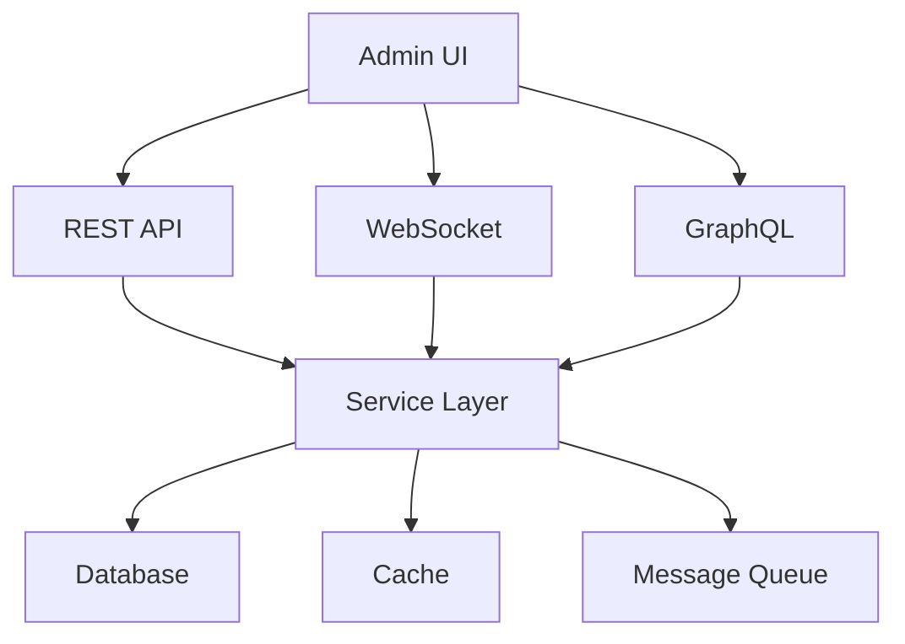

# Zephyr Admin UI - API Integration Guide

## Overview

This guide covers the integration between the Zephyrix-based admin UI and Zephyr backend services.



## 1. API Client Setup

### Base Configuration

```typescript
// src/api/config.ts
export const apiConfig = {
  baseURL: process.env.API_URL || '/api/admin',
  timeout: 30000,
  headers: {
    'Content-Type': 'application/json'
  },
  retry: {
    maxRetries: 3,
    backoff: 'exponential'
  }
};

// src/api/client.ts
import { createAPIClient } from '@zephyrix/core';

export const api = createAPIClient({
  ...apiConfig,
  interceptors: {
    request: [
      (config) => {
        const token = auth.getToken();
        if (token) {
          config.headers.Authorization = `Bearer ${token}`;
        }
        return config;
      }
    ],
    response: [
      (response) => response,
      (error) => {
        if (error.status === 401) {
          auth.logout();
        }
        return Promise.reject(error);
      }
    ]
  }
});
```

## 2. REST API Integration

### Service Management

```typescript
// src/api/services.ts
export const servicesAPI = {
  async list(params: ServiceListParams) {
    return api.get('/services', { params });
  },

  async getDetails(serviceId: string) {
    return api.get(`/services/${serviceId}`);
  },

  async updateConfig(serviceId: string, config: ServiceConfig) {
    return api.put(`/services/${serviceId}/config`, config);
  },

  async restart(serviceId: string) {
    return api.post(`/services/${serviceId}/restart`);
  },

  async getLogs(serviceId: string, params: LogParams) {
    return api.get(`/services/${serviceId}/logs`, { params });
  }
};
```

### System Metrics

```typescript
// src/api/metrics.ts
export const metricsAPI = {
  async getCurrentMetrics() {
    return api.get('/metrics/current');
  },

  async getHistoricalMetrics(params: MetricsParams) {
    return api.get('/metrics/historical', { params });
  },

  async getServiceMetrics(serviceId: string) {
    return api.get(`/metrics/services/${serviceId}`);
  }
};
```

## 3. WebSocket Integration

### Real-time Updates

```typescript
// src/websocket/client.ts
import { createWebSocket } from '@zephyrix/core';

export const wsClient = createWebSocket({
  url: process.env.WS_URL || '/ws',
  options: {
    reconnect: true,
    maxRetries: Infinity,
    reconnectInterval: 1000
  }
});

// src/websocket/handlers.ts
export const wsHandlers = {
  'metrics.update': (data: MetricsData) => {
    metricsStore.update(data);
  },

  'service.status': (data: ServiceStatus) => {
    servicesStore.updateStatus(data);
  },

  'system.alert': (data: SystemAlert) => {
    alertsStore.addAlert(data);
  }
};

wsClient.registerHandlers(wsHandlers);
```

## 4. GraphQL Integration

### Client Setup

```typescript
// src/graphql/client.ts
import { createGraphQLClient } from '@zephyrix/core';

export const graphql = createGraphQLClient({
  url: '/graphql',
  options: {
    credentials: 'include'
  }
});

// src/graphql/queries.ts
export const queries = {
  getDashboardData: gql`
    query GetDashboardData {
      metrics {
        cpu
        memory
        requests
      }
      services {
        id
        name
        status
        metrics {
          uptime
          requests
          errors
        }
      }
      alerts {
        id
        message
        severity
        timestamp
      }
    }
  `
};
```

## 5. Error Handling

### Global Error Handler

```typescript
// src/api/errorHandler.ts
export class APIErrorHandler {
  static handle(error: any) {
    if (error.isNetworkError) {
      notifyNetworkError();
      return;
    }

    switch (error.status) {
      case 401:
        handleUnauthorized();
        break;
      case 403:
        handleForbidden();
        break;
      case 404:
        handleNotFound();
        break;
      case 500:
        handleServerError();
        break;
      default:
        handleUnknownError();
    }
  }
}
```

## 6. Caching Strategy

### API Cache

```typescript
// src/api/cache.ts
export const apiCache = createCache({
  storage: 'memory',
  ttl: 5 * 60 * 1000, // 5 minutes
  invalidation: {
    patterns: {
      services: [
        '/services/*',
        '/metrics/services/*'
      ],
      metrics: [
        '/metrics/*'
      ]
    }
  }
});

// Usage in API calls
async function getCachedData(key: string, fetcher: () => Promise<any>) {
  const cached = await apiCache.get(key);
  if (cached) return cached;

  const data = await fetcher();
  await apiCache.set(key, data);
  return data;
}
```

## 7. Rate Limiting

### Client-side Rate Limiting

```typescript
// src/api/rateLimit.ts
export const rateLimiter = createRateLimiter({
  windowMs: 60 * 1000, // 1 minute
  max: 100, // max 100 requests per minute
  handler: (req) => {
    console.warn(`Rate limit exceeded for ${req.url}`);
    return delay(1000); // Wait 1 second before retry
  }
});

api.use(rateLimiter);
```

## 8. Authentication

### JWT Authentication

```typescript
// src/auth/jwt.ts
export const jwtAuth = {
  async login(credentials: Credentials) {
    const response = await api.post('/auth/login', credentials);
    const { token } = response.data;
    
    this.setToken(token);
    return token;
  },

  async refresh() {
    const response = await api.post('/auth/refresh');
    const { token } = response.data;
    
    this.setToken(token);
    return token;
  },

  setToken(token: string) {
    localStorage.setItem('auth_token', token);
    api.setHeader('Authorization', `Bearer ${token}`);
  },

  getToken() {
    return localStorage.getItem('auth_token');
  },

  removeToken() {
    localStorage.removeItem('auth_token');
    api.removeHeader('Authorization');
  }
};
```

## 9. Security

### CSRF Protection

```typescript
// src/api/csrf.ts
export const csrfProtection = {
  async getToken() {
    const response = await api.get('/csrf-token');
    return response.data.token;
  },

  setToken(token: string) {
    api.setHeader('X-CSRF-Token', token);
  }
};

// Initialize CSRF protection
api.interceptors.request.use(async (config) => {
  const token = await csrfProtection.getToken();
  csrfProtection.setToken(token);
  return config;
});
```

## 10. Performance Optimization

### Request Batching

```typescript
// src/api/batch.ts
export const batchRequests = createBatchProcessor({
  maxBatchSize: 10,
  maxWaitTime: 50, // ms
  processor: async (requests) => {
    const response = await api.post('/batch', {
      requests: requests.map(req => ({
        method: req.method,
        url: req.url,
        data: req.data
      }))
    });
    
    return response.data;
  }
});
```

## 11. Testing

### API Testing

```typescript
// src/api/__tests__/services.test.ts
describe('Services API', () => {
  it('should list services', async () => {
    const services = await servicesAPI.list();
    expect(services).toBeArray();
  });

  it('should handle service not found', async () => {
    await expect(
      servicesAPI.getDetails('non-existent')
    ).rejects.toThrow('Service not found');
  });
});
```

## 12. Documentation

### API Documentation

```typescript
// src/api/docs.ts
export const apiDocs = {
  services: {
    list: {
      method: 'GET',
      path: '/services',
      params: {
        page: 'number',
        limit: 'number',
        status: 'string'
      },
      responses: {
        200: 'ServiceList',
        401: 'Unauthorized',
        403: 'Forbidden'
      }
    }
    // ... more endpoints
  }
};
```

This documentation provides a comprehensive guide for integrating the admin UI with Zephyr's backend services. Would you like me to:

1. Add more specific API endpoint examples?
2. Create detailed WebSocket implementation examples?
3. Add more security features?
4. Create deployment configuration examples?
