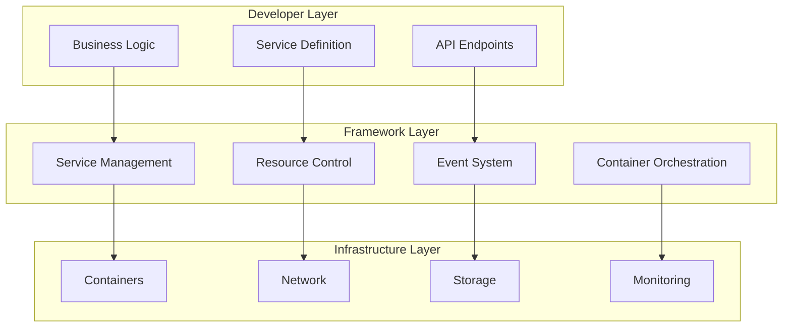
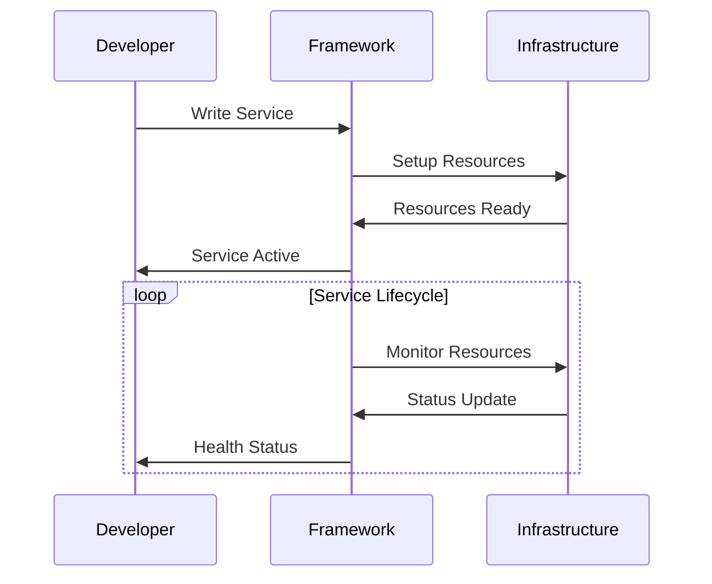
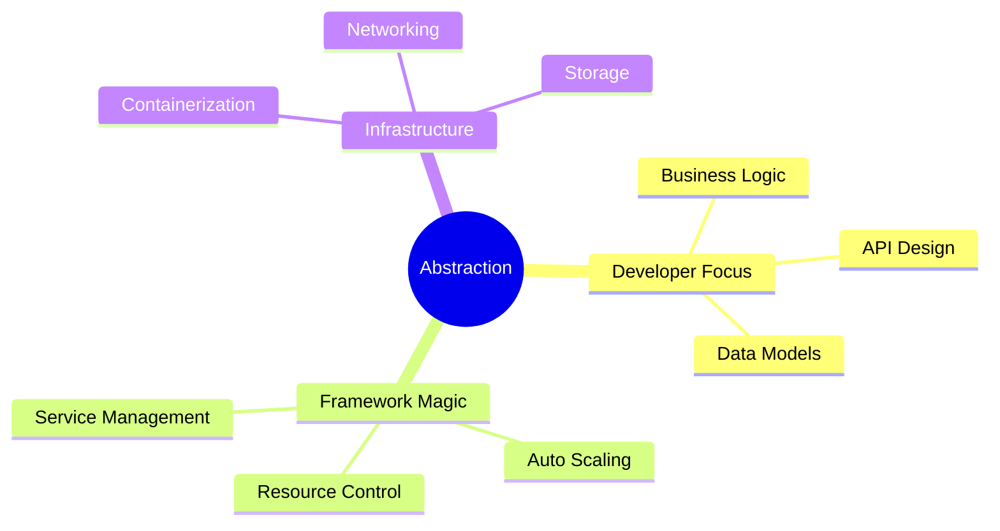
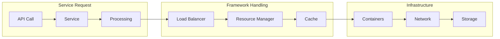
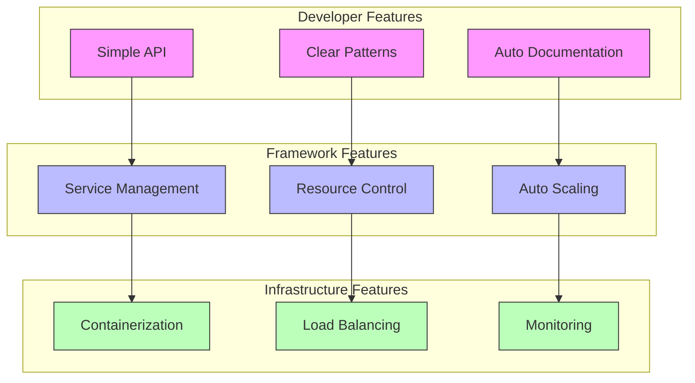
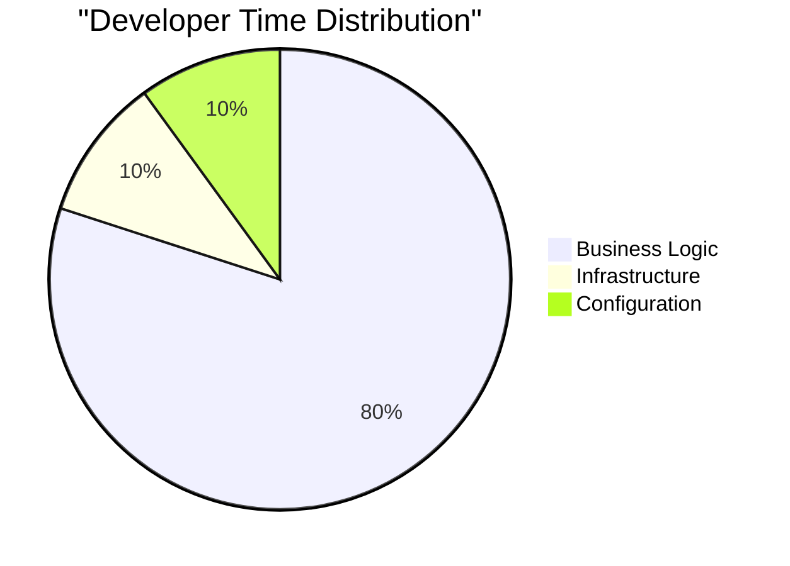

# Service Abstraction Layers

## System Architecture



## Layer Interaction



## Abstraction Benefits



## Resource Flow



## Example: Clean Service

```python
@service
class OrderService:
    async def create_order(self, order_data):
        # Developer only writes business logic
        # Framework handles:
        # - Database connections
        # - Caching
        # - Event publishing
        # - Resource management
        return await self.orders.create(order_data)
```

## Layer Features



## Development Experience


