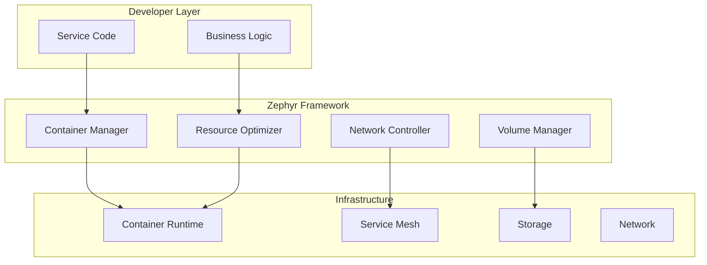
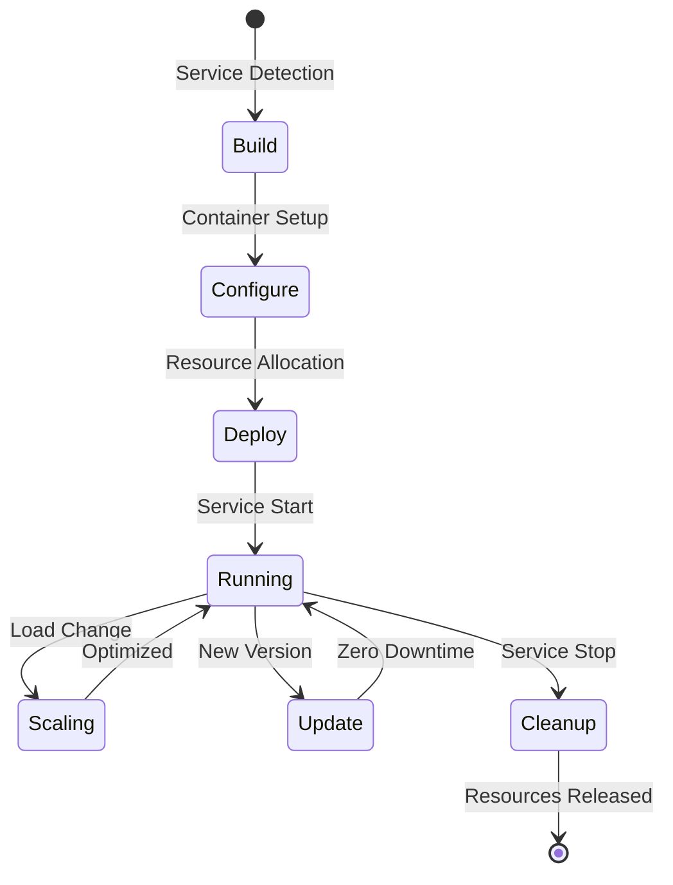
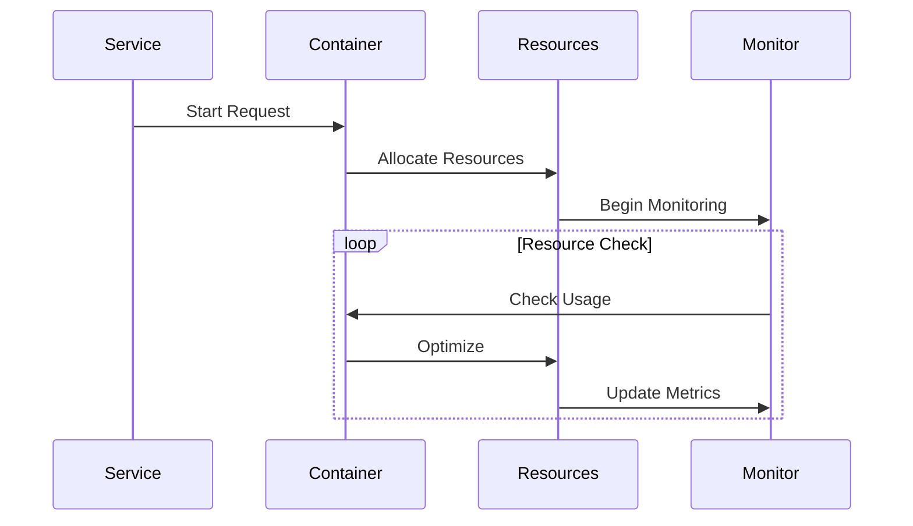
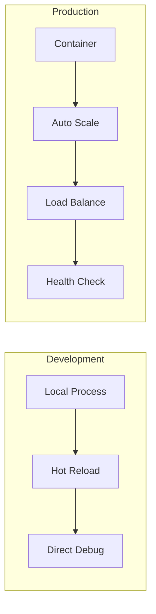
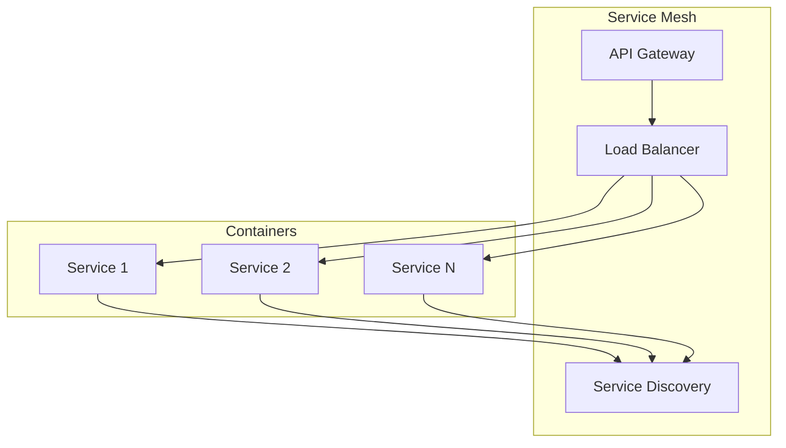
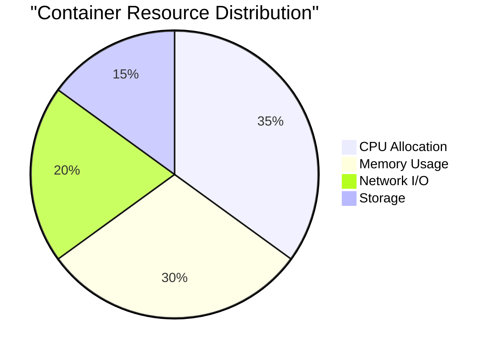
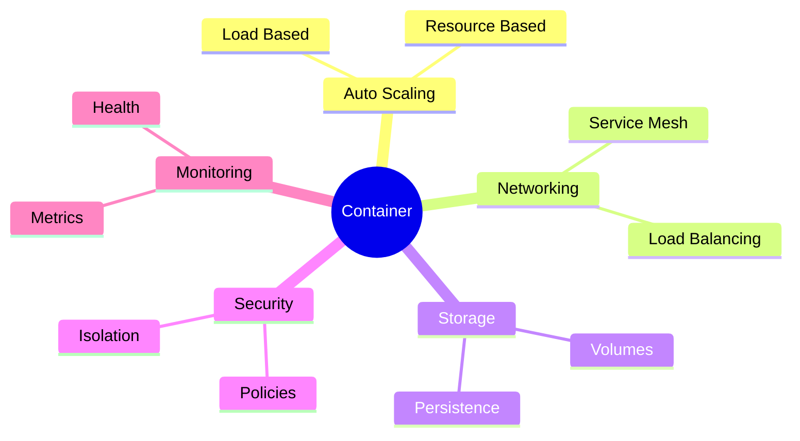

# Containerization and Service Isolation

## Architecture Overview



## Container Lifecycle



## Resource Management Flow



## Development vs Production



## Container Networking



## Resource Optimization



## Example Implementation

```python
@service
class PaymentService:
    async def process_payment(self, payment):
        # Framework automatically:
        # - Creates optimized container
        # - Manages resources
        # - Handles networking
        # - Monitors health
        return await self.payments.process(payment)
```

## Container Features


