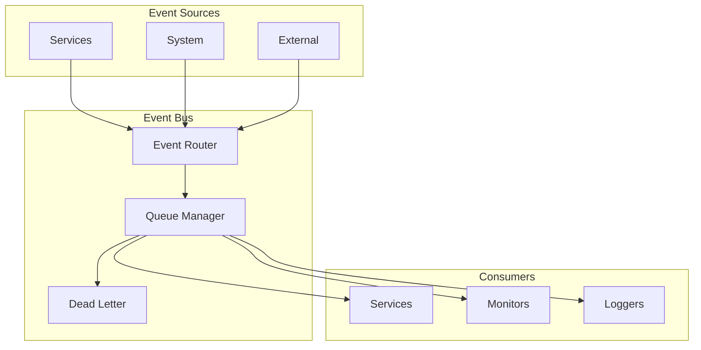
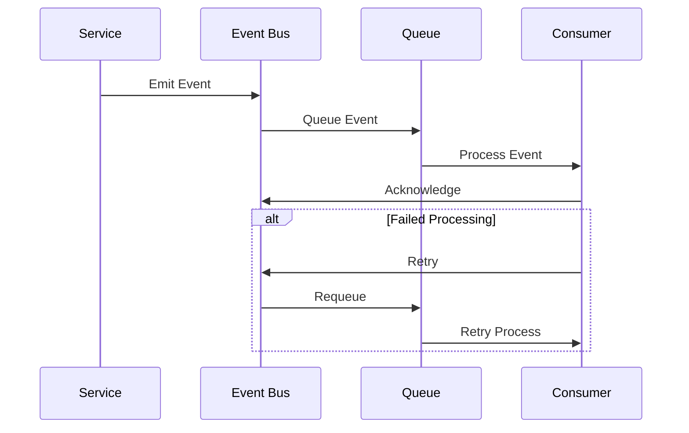
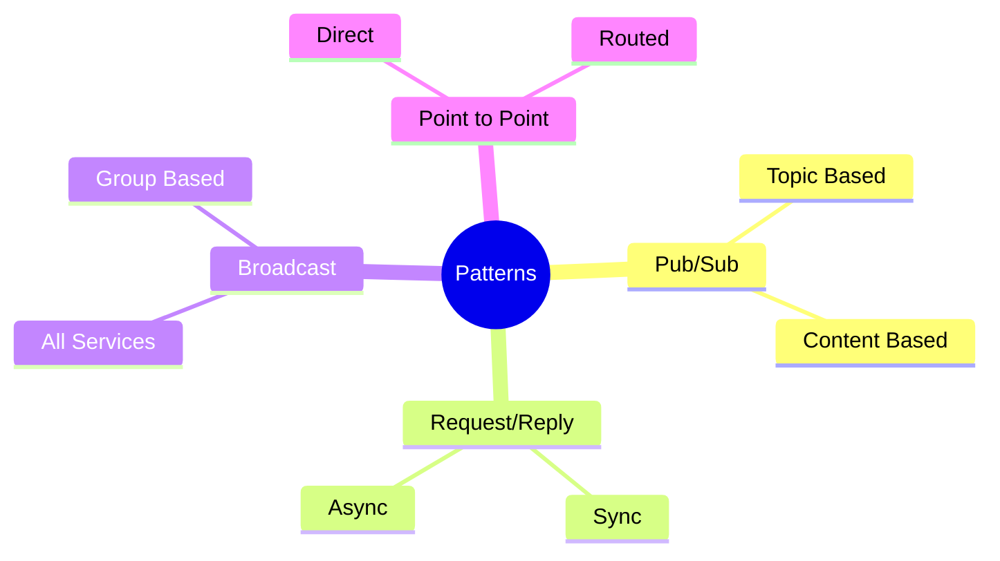
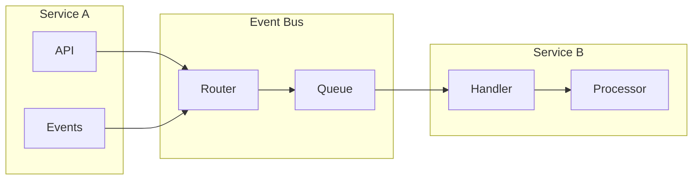
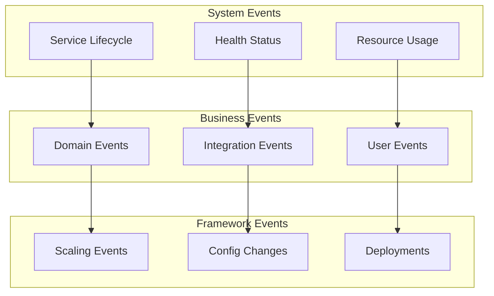
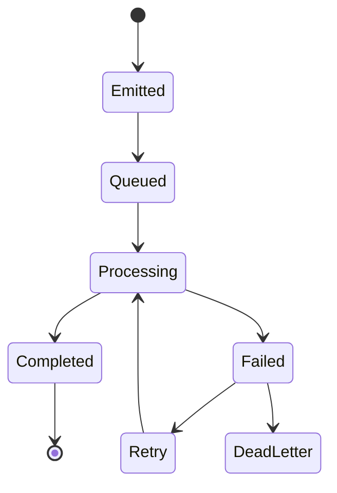

# Events and Communication

## Event System Architecture



## Event Flow



## Communication Patterns



## Service Communication



## Example: Event-Driven Service

```python
@service
class OrderService:
    @on_event("payment.completed")
    async def process_order(self, event):
        # Framework handles:
        # - Event subscription
        # - Message routing
        # - Retry logic
        # - Error handling
        await self.fulfill_order(event.order_id)

    @emit_event("order.fulfilled")
    async def fulfill_order(self, order_id):
        # Business logic only
        # Framework manages event emission
        return await self.orders.fulfill(order_id)
```

## Event Types



## Event Reliability


