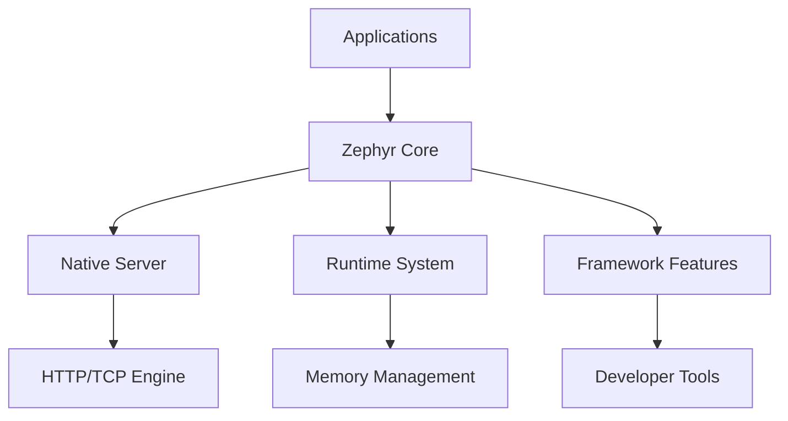
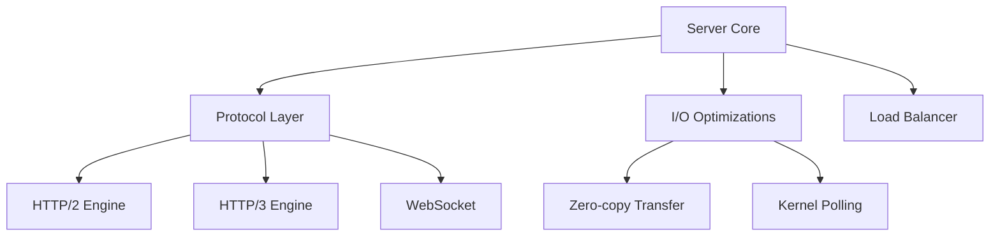
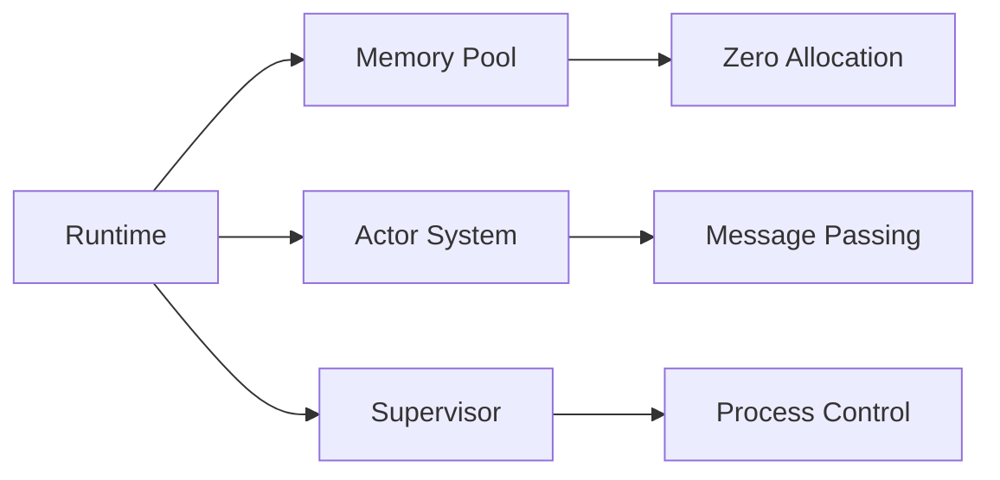
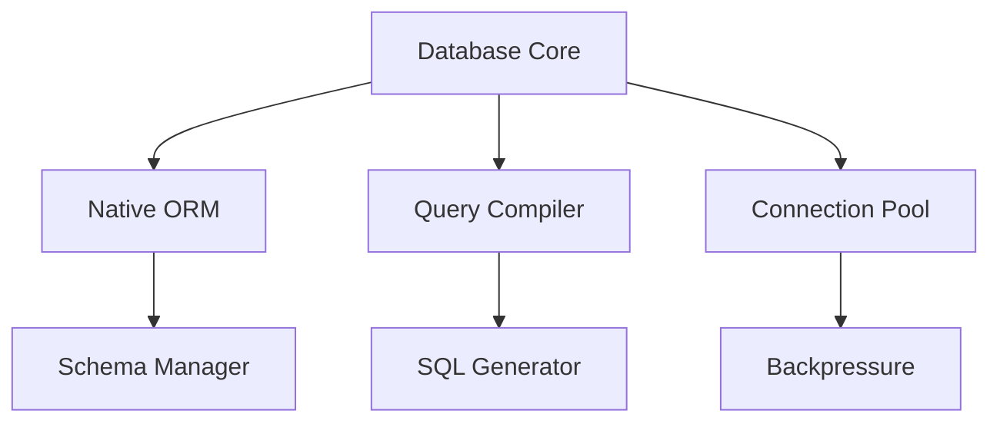
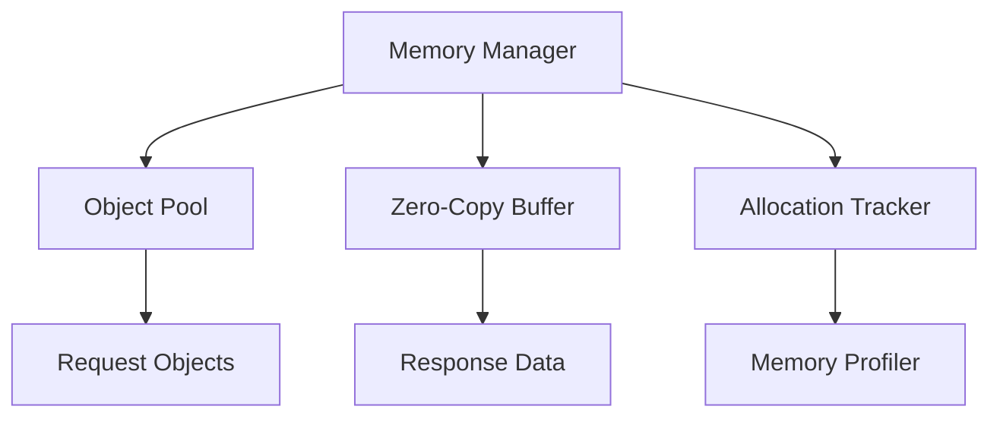
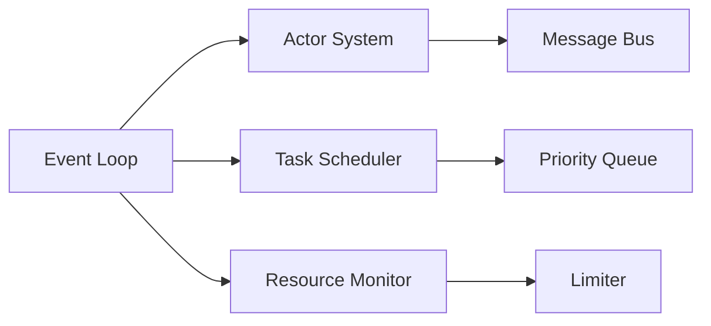

# Zephyr Architecture Overview

## Core Philosophy
Zephyr is built on three core principles:
1. **Zero External Dependencies** - Maximum control and performance through custom implementations
2. **Native Performance** - Kernel-level optimizations and zero-copy operations
3. **Developer Experience** - Powerful built-in tools without external dependencies

## System Architecture

### High-Level Overview


## Core Components

### 1. Native Server (`zephyr/server/`)


### 2. Runtime System (`zephyr/runtime/`)


### 3. Database Engine (`zephyr/db/`)


## Implementation Details

### High-Performance Server
```python
class ZephyrServer:
    def __init__(self):
        self.io_uring = IOUring()  # Linux kernel IO optimization
        self.memory_pool = MemoryPool()
        self.worker_pool = WorkerPool()

    async def handle_connection(self, conn):
        with self.memory_pool.acquire() as buffer:
            data = await self.io_uring.recv_into(conn, buffer)
            response = await self.process_request(data)
            await self.io_uring.send_from(conn, response)
```

### Actor-based Request Processing
```python
@actor
class RequestProcessor:
    def __init__(self):
        self.router = Router()  # Zero-allocation router
        self.supervisor = Supervisor()

    async def process(self, request: Request) -> Response:
        with request.trace():  # Built-in tracing
            handler = self.router.match(request)
            return await handler.handle(request)
```

## Performance Features

### Memory Management


### Concurrency Model


## Developer Tools

### Built-in Capabilities
- Hot Code Reloading
- Interactive REPL
- Performance Profiler
- Memory Analyzer
- Request Tracer
- Schema Manager

## Configuration Example
```yaml
server:
  workers: auto  # Automatic based on CPU cores
  io_engine: io_uring  # Linux optimized I/O
  
runtime:
  memory_pool_size: 64MB
  actor_threads: 4
  supervisor_mode: distributed

performance:
  zero_copy: true
  kernel_tls: true
  tcp_fastopen: true
```

## Next Steps
1. [Server Implementation](server.md)
2. [Runtime System](runtime.md)
3. [Database Engine](database.md)
4. [Performance Guide](../performance/optimization.md)
