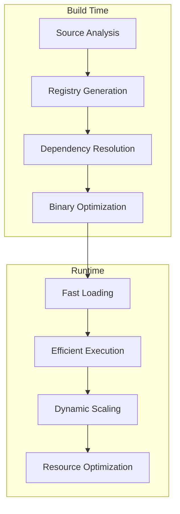
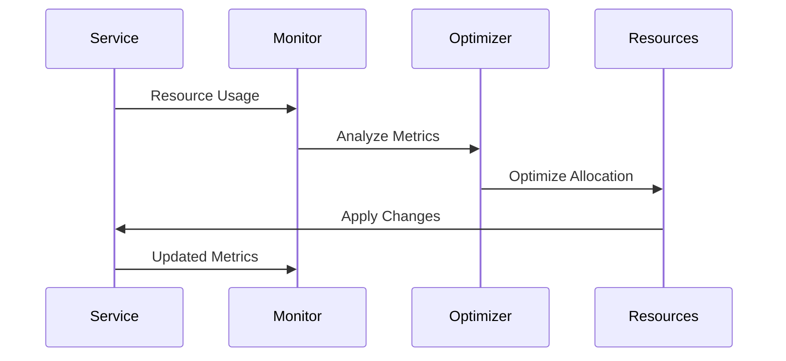
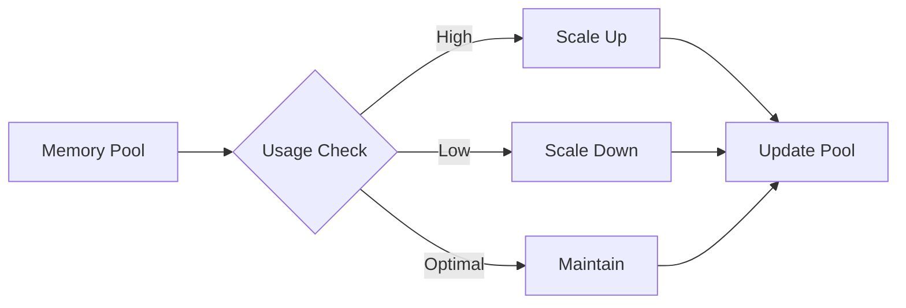
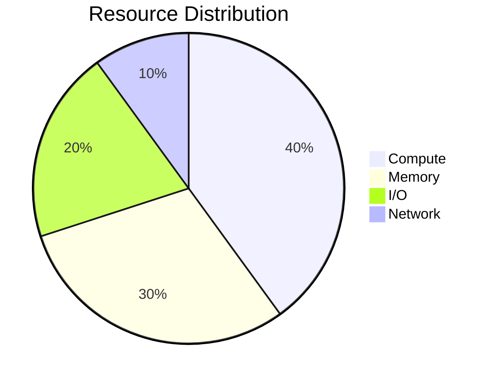
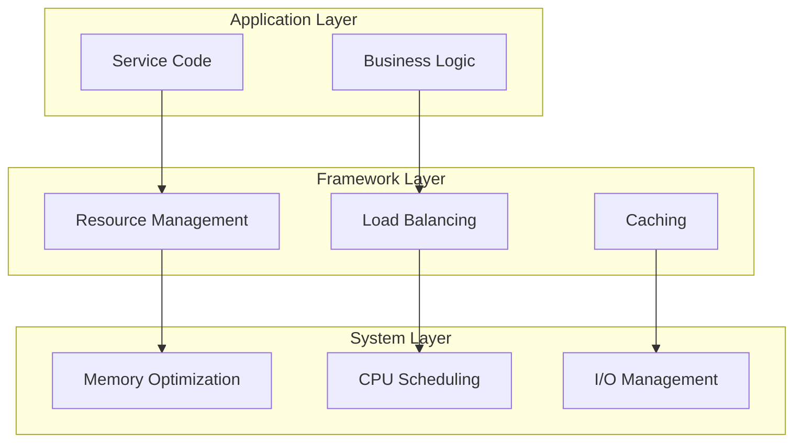

# Performance Optimization

## Build Time vs Runtime



## Resource Optimization Flow



## Memory Management



## Performance Metrics



## Optimization Layers



## Example: Optimized Service

```python
@service(optimize=True)
class VideoService:
    async def process_video(self, video):
        # Framework automatically:
        # - Optimizes resource usage
        # - Manages memory efficiently
        # - Scales based on load
        # - Handles caching
        return await self.processor.run(video)
```

## Best Practices
1. Let framework handle optimization
2. Trust automatic scaling
3. Use built-in monitoring
4. Follow framework patterns
