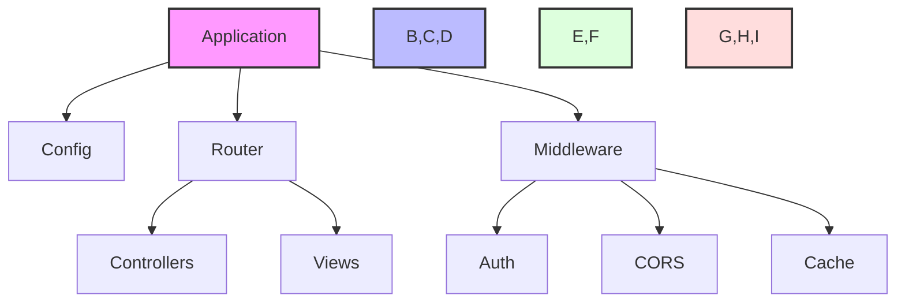
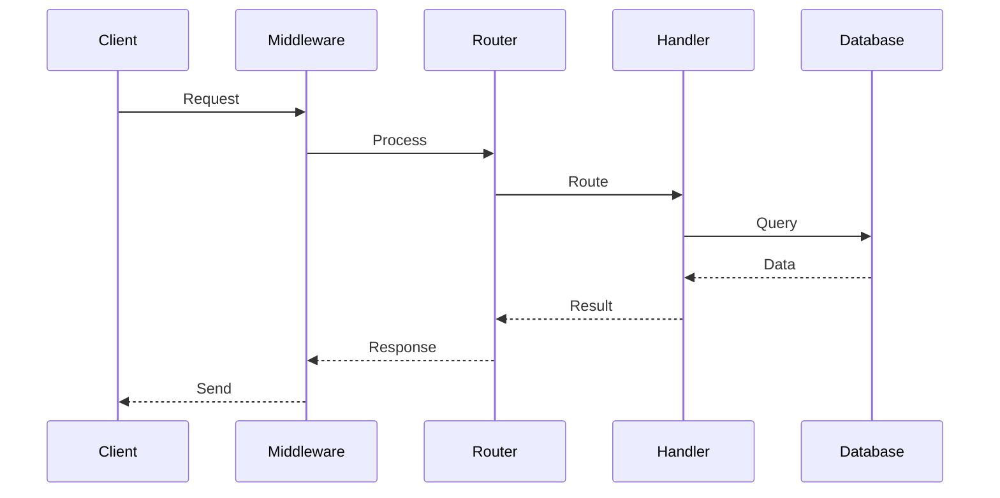
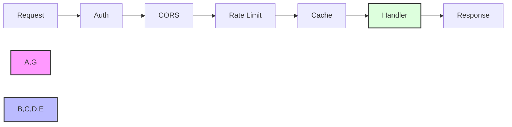
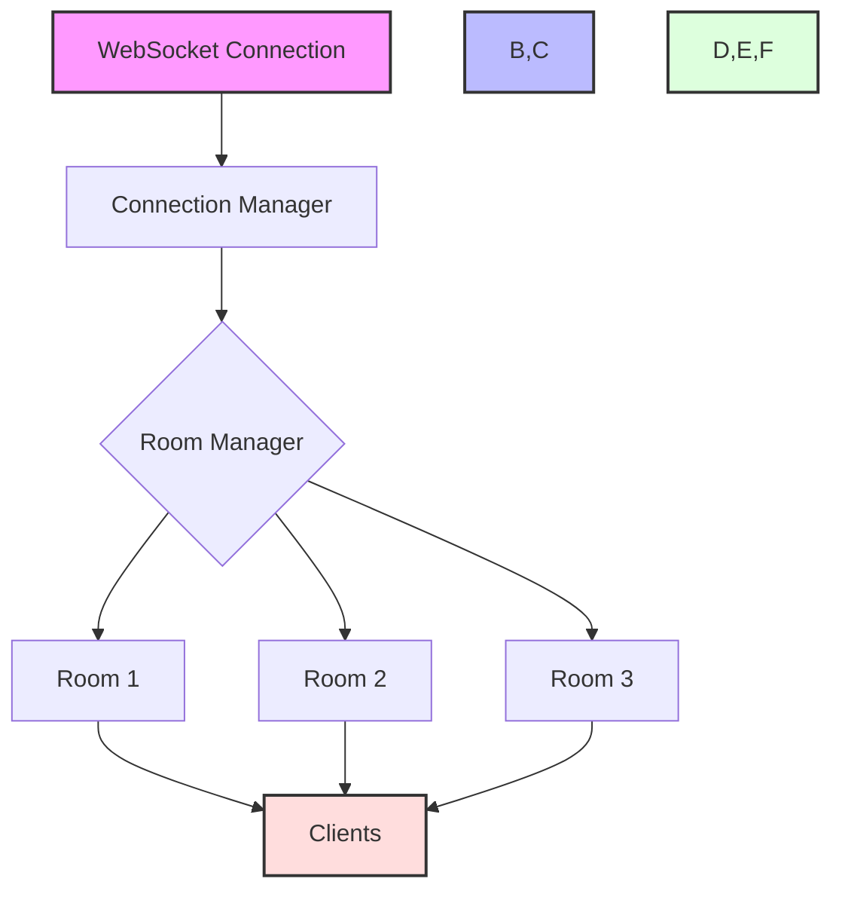
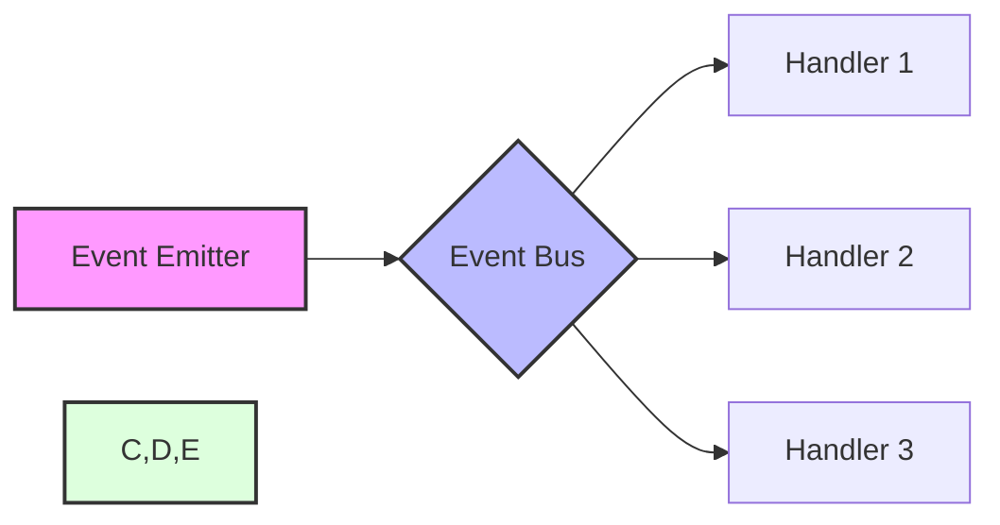
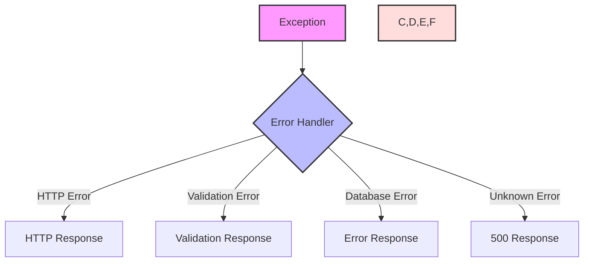

# Core Concepts

This guide covers the fundamental concepts of the Zephyr Framework.

## Application Structure



## Dependency Injection

Zephyr uses a powerful dependency injection system:

```python
from zephyr.core import ZephyrApp
from zephyr.di import Depends, Injectable

@Injectable()
class UserService:
    def __init__(self, db: Database = Depends()):
        self.db = db

    async def get_user(self, user_id: int):
        return await self.db.users.get(id=user_id)

app = ZephyrApp()

@app.route("/users/{user_id}")
async def get_user(
    user_id: int,
    user_service: UserService = Depends()
):
    return await user_service.get_user(user_id)
```

## Request Flow



## Data Models

Define your data models with type safety:

```python
from zephyr.db import Model, Field

class User(Model):
    id: int = Field(primary_key=True)
    username: str = Field(unique=True)
    email: str = Field(unique=True)
    is_active: bool = Field(default=True)

    class Config:
        table_name = "users"
```

## Middleware Pipeline



## Service Layer

The service layer handles business logic:

```python
@Injectable()
class OrderService:
    def __init__(
        self,
        db: Database = Depends(),
        cache: Cache = Depends(),
        queue: Queue = Depends()
    ):
        self.db = db
        self.cache = cache
        self.queue = queue

    async def create_order(self, order_data: dict):
        # Transaction management
        async with self.db.transaction():
            # Create order
            order = await self.db.orders.create(**order_data)
            
            # Invalidate cache
            await self.cache.delete(f"user_orders:{order.user_id}")
            
            # Queue notification
            await self.queue.push("notifications", {
                "type": "order_created",
                "order_id": order.id
            })
            
            return order
```

## WebSocket Handling



## Event System



## Configuration Management

```python
from zephyr.config import Config

config = Config({
    "app": {
        "name": "MyApp",
        "debug": True
    },
    "database": {
        "url": "postgresql://localhost/myapp",
        "pool_size": 10
    },
    "cache": {
        "url": "redis://localhost",
        "ttl": 3600
    }
})

app = ZephyrApp(config)
```

## Error Handling


