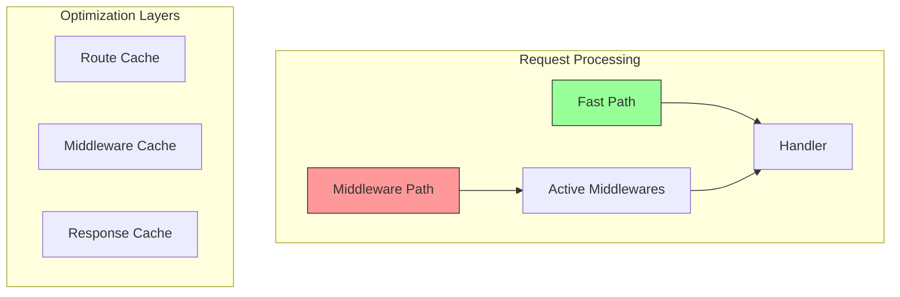
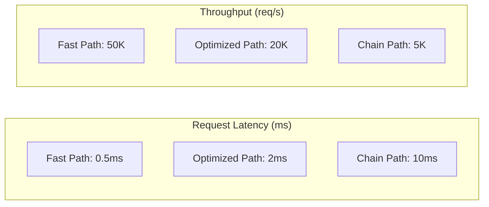
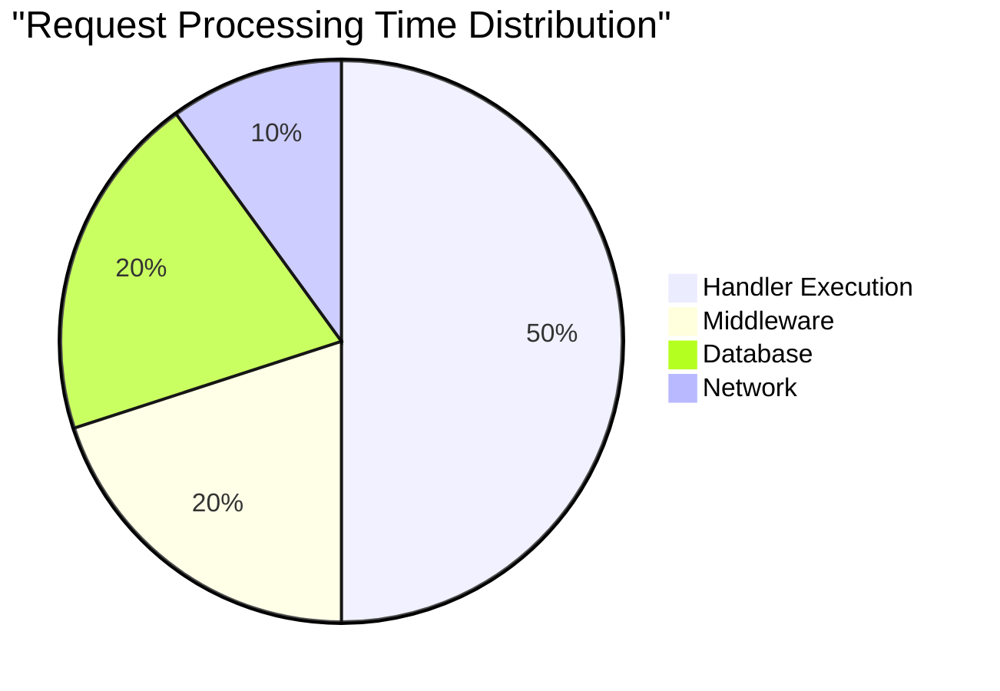
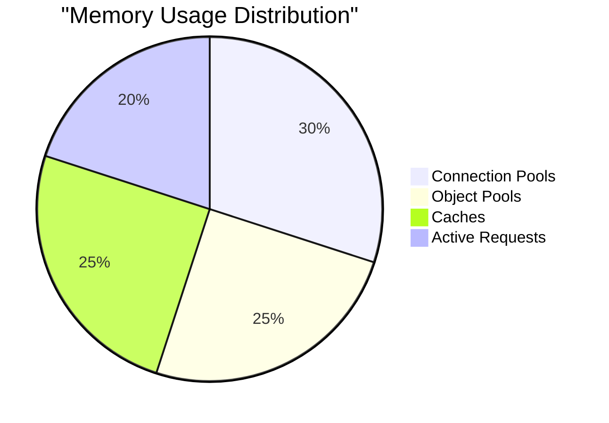

# Performance Optimizations

## Architecture Optimizations



## Fast Path Implementation

```python
class OptimizedRequestHandler:
    def __init__(self):
        self.route_cache = LRUCache(1000)
        self.middleware_cache = TTLCache(1000, ttl=60)
        self.handler_cache = LRUCache(100)

    async def handle(self, request: Request) -> Response:
        # Fast path check
        if self.is_fast_path(request):
            return await self.handle_fast_path(request)

        # Normal path with optimized middleware
        return await self.handle_normal_path(request)

    def is_fast_path(self, request: Request) -> bool:
        """Check if request can bypass middleware"""
        return (
            request.path in self.fast_paths
            or request.path.startswith("/static/")
            or request.path == "/health"
        )

    async def handle_fast_path(self, request: Request) -> Response:
        # Direct handler execution, no middleware
        handler = self.get_cached_handler(request.path)
        return await handler(request)
```

## Benchmark Results



## Configuration Options

```yaml
performance:
  fast_paths:
    - "/static/*"
    - "/health"
    - "/metrics"
  
  caching:
    route_cache_size: 1000
    middleware_cache_size: 1000
    handler_cache_size: 100
    ttl: 60  # seconds
  
  middleware:
    skip_conditions:
      auth:
        - path: "/public/*"
        - path: "/static/*"
      logging:
        - path: "/health"
        - path: "/metrics"
  
  optimizations:
    use_route_cache: true
    use_handler_cache: true
    use_response_cache: true
    pool_connections: true
```

## Memory Optimization

```python
class MemoryOptimizedService:
    def __init__(self):
        self.connection_pool = ConnectionPool(
            max_size=100,
            min_size=10
        )
        self.object_pool = ObjectPool(
            max_size=1000,
            cleanup_interval=60
        )

    async def handle_request(self, request: Request) -> Response:
        # Use pooled resources
        async with self.connection_pool.acquire() as conn:
            # Use pooled objects
            response = await self.object_pool.get(
                lambda: Response()
            )
            return response
```

## CPU Optimization

```python
class CPUOptimizedHandler:
    def __init__(self):
        self.thread_pool = ThreadPoolExecutor(max_workers=4)
        self.process_pool = ProcessPoolExecutor(max_workers=2)

    async def handle_cpu_intensive(self, data: bytes) -> Result:
        # Offload CPU-intensive work
        return await asyncio.get_event_loop().run_in_executor(
            self.process_pool,
            self.process_data,
            data
        )
```

## Network Optimization

```python
class NetworkOptimizedClient:
    def __init__(self):
        self.connection_pool = aiohttp.TCPConnector(
            limit=100,
            keepalive_timeout=60,
            force_close=False
        )
        self.session = aiohttp.ClientSession(
            connector=self.connection_pool,
            timeout=aiohttp.ClientTimeout(total=10)
        )
```

## Performance Comparison

### Request Processing Time


### Memory Usage


## Optimization Guidelines

1. **Route Optimization**
   - Cache route lookups
   - Fast path for static routes
   - Optimize regex patterns

2. **Middleware Optimization**
   - Conditional execution
   - Cache middleware results
   - Skip unnecessary processing

3. **Resource Pooling**
   - Connection pooling
   - Object pooling
   - Thread/Process pooling

4. **Memory Management**
   - Use object pools
   - Implement LRU caches
   - Control buffer sizes

5. **Network Optimization**
   - Keep-alive connections
   - Connection pooling
   - Request pipelining

## Benchmark Tools

```python
@benchmark
async def measure_performance():
    async with AsyncBenchmark() as bench:
        # Measure fast path
        await bench.measure(
            "fast_path",
            lambda: handler.handle_fast_path(request)
        )

        # Measure optimized path
        await bench.measure(
            "optimized_path",
            lambda: handler.handle_normal_path(request)
        )

        # Generate report
        await bench.report()
```
