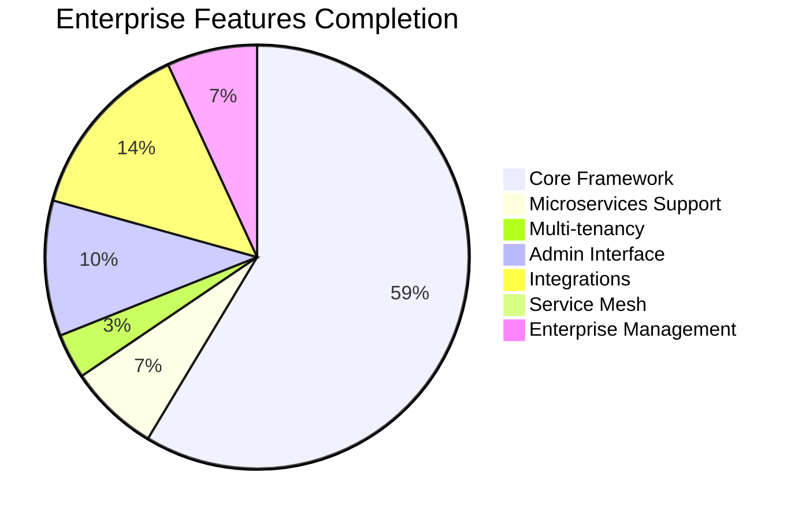
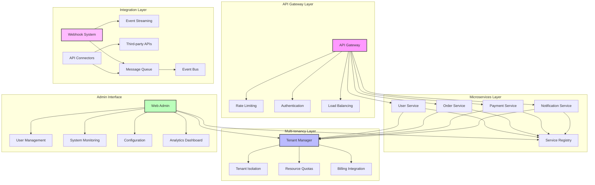
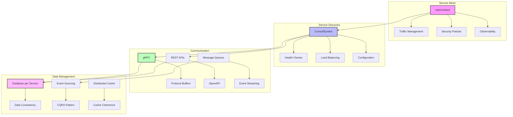

# Enterprise Features Proposal

## Executive Summary

Implement advanced enterprise-grade capabilities for Zephyr including microservices architecture support, multi-tenancy, comprehensive admin interface, advanced integrations, and enterprise management tools. This positions Zephyr as a complete enterprise platform capable of supporting large-scale, complex business applications with sophisticated operational requirements.

**Priority**: 🔵 **Low (Future)**  
**Effort**: 4 weeks  
**Impact**: Low - Advanced enterprise capabilities

## Current State Analysis

### ✅ What Exists (Strong Foundation)
- Complete core framework with security and middleware
- Database layer with connection pooling
- Background job processing system
- Observability and monitoring stack
- Production infrastructure support

### ❌ What's Missing
- Microservices architecture support
- Multi-tenant application framework
- Comprehensive admin interface
- Advanced integration capabilities
- Enterprise management tools
- Service mesh integration

### 📊 Completion Status


## Technical Architecture

### Enterprise Platform Overview


### Microservices Architecture


## Feature Specifications

### Must Have Features

#### 1. Microservices Architecture Support
```python
from zephyr.microservices import ServiceRegistry, ServiceDiscovery, APIGateway

# Service registration
service_registry = ServiceRegistry(
    backend="consul",  # consul, eureka, etcd
    host="consul.service.consul",
    port=8500
)

@app.on_event("startup")
async def register_service():
    await service_registry.register(
        service_name="user-service",
        service_id="user-service-1",
        host="user-service.local",
        port=8000,
        health_check_url="/health",
        tags=["api", "v1", "users"],
        metadata={
            "version": "1.0.0",
            "environment": "production"
        }
    )

@app.on_event("shutdown")
async def deregister_service():
    await service_registry.deregister("user-service-1")

# Service discovery client
discovery = ServiceDiscovery(service_registry)

@app.get("/orders/{order_id}")
async def get_order_with_user(order_id: int):
    # Discover user service
    user_service = await discovery.get_service("user-service")
    
    # Make inter-service call
    async with httpx.AsyncClient() as client:
        user_response = await client.get(
            f"http://{user_service.host}:{user_service.port}/users/{order.user_id}"
        )
        user_data = user_response.json()
    
    return {
        "order": order,
        "user": user_data
    }

# API Gateway configuration
gateway = APIGateway(
    routes=[
        {
            "path": "/api/v1/users/*",
            "service": "user-service",
            "strip_path": True,
            "rate_limit": {"requests": 1000, "window": 60}
        },
        {
            "path": "/api/v1/orders/*",
            "service": "order-service",
            "strip_path": True,
            "auth_required": True
        }
    ],
    middleware=[
        "authentication",
        "rate_limiting",
        "request_logging",
        "circuit_breaker"
    ]
)

# gRPC service support
from zephyr.microservices.grpc import GRPCService, GRPCClient

class UserServiceGRPC(GRPCService):
    async def GetUser(self, request, context):
        user = await User.get(request.user_id)
        return UserResponse(
            id=user.id,
            name=user.name,
            email=user.email
        )

# Start gRPC server alongside HTTP
@app.on_event("startup")
async def start_grpc_server():
    grpc_server = GRPCService(
        service_class=UserServiceGRPC,
        port=50051,
        reflection=True,  # Enable gRPC reflection
        health_check=True
    )
    await grpc_server.start()
```

#### 2. Multi-tenancy Framework
```python
from zephyr.multitenancy import TenantManager, TenantMiddleware, TenantIsolation

# Tenant configuration
tenant_manager = TenantManager(
    isolation_strategy="schema",  # schema, database, row_level
    tenant_resolver="subdomain",  # subdomain, header, path
    default_tenant="public"
)

# Tenant middleware
@app.middleware("http")
async def tenant_middleware(request: Request, call_next):
    # Resolve tenant from request
    tenant = await tenant_manager.resolve_tenant(request)
    
    if not tenant:
        return JSONResponse(
            status_code=400,
            content={"detail": "Invalid tenant"}
        )
    
    # Set tenant context
    request.state.tenant = tenant
    
    # Apply tenant isolation
    with tenant_manager.tenant_context(tenant):
        response = await call_next(request)
    
    return response

# Tenant-aware database models
from zephyr.multitenancy.models import TenantModel

class User(TenantModel):
    __tablename__ = "users"
    
    id: Mapped[int] = mapped_column(primary_key=True)
    name: Mapped[str]
    email: Mapped[str]
    
    # Tenant isolation is handled automatically

# Tenant management API
@app.post("/admin/tenants")
async def create_tenant(
    tenant_data: TenantCreate,
    admin_user: User = Depends(require_admin)
):
    tenant = await tenant_manager.create_tenant(
        name=tenant_data.name,
        subdomain=tenant_data.subdomain,
        plan=tenant_data.plan,
        settings=tenant_data.settings
    )
    
    # Initialize tenant schema/database
    await tenant_manager.initialize_tenant(tenant.id)
    
    return tenant

@app.get("/admin/tenants/{tenant_id}/usage")
async def get_tenant_usage(
    tenant_id: str,
    admin_user: User = Depends(require_admin)
):
    usage = await tenant_manager.get_tenant_usage(tenant_id)
    return {
        "tenant_id": tenant_id,
        "users_count": usage.users_count,
        "storage_used": usage.storage_used,
        "api_calls": usage.api_calls,
        "bandwidth_used": usage.bandwidth_used
    }

# Resource quotas and billing
from zephyr.multitenancy.billing import BillingManager

billing = BillingManager(
    provider="stripe",  # stripe, paypal, custom
    plans={
        "basic": {
            "users": 10,
            "storage": "1GB",
            "api_calls": 10000,
            "price": 29.99
        },
        "pro": {
            "users": 100,
            "storage": "10GB",
            "api_calls": 100000,
            "price": 99.99
        }
    }
)

@app.middleware("http")
async def quota_enforcement_middleware(request: Request, call_next):
    tenant = request.state.tenant
    
    # Check quotas
    if await billing.is_quota_exceeded(tenant.id, "api_calls"):
        return JSONResponse(
            status_code=429,
            content={"detail": "API quota exceeded"}
        )
    
    response = await call_next(request)
    
    # Track usage
    await billing.track_usage(tenant.id, "api_calls", 1)
    
    return response
```

#### 3. Comprehensive Admin Interface
```python
from zephyr.admin import AdminInterface, AdminView, AdminAction

# Admin interface configuration
admin = AdminInterface(
    title="Zephyr Admin",
    description="Enterprise Administration Panel",
    auth_backend="jwt",
    theme="modern",
    features=[
        "user_management",
        "system_monitoring",
        "configuration",
        "analytics",
        "audit_logs"
    ]
)

# User management view
class UserAdminView(AdminView):
    model = User
    list_display = ["id", "name", "email", "created_at", "is_active"]
    list_filter = ["is_active", "created_at", "tenant"]
    search_fields = ["name", "email"]
    actions = ["activate_users", "deactivate_users", "send_email"]
    
    @AdminAction(description="Activate selected users")
    async def activate_users(self, request, queryset):
        count = await queryset.update(is_active=True)
        return f"Activated {count} users"
    
    @AdminAction(description="Send email to selected users")
    async def send_email(self, request, queryset):
        # Custom action implementation
        users = await queryset.all()
        for user in users:
            await send_notification_email(user.email, "Admin notification")
        return f"Sent emails to {len(users)} users"

admin.register(User, UserAdminView)

# System monitoring dashboard
@admin.dashboard_widget("system_stats")
async def system_stats_widget():
    return {
        "title": "System Statistics",
        "data": {
            "total_users": await User.count(),
            "active_sessions": await Session.filter(active=True).count(),
            "api_calls_today": await get_api_calls_count(today()),
            "error_rate": await get_error_rate_percentage()
        },
        "chart_type": "metrics"
    }

@admin.dashboard_widget("performance_chart")
async def performance_chart_widget():
    metrics = await get_performance_metrics(days=7)
    return {
        "title": "Performance Metrics",
        "data": metrics,
        "chart_type": "line",
        "x_axis": "date",
        "y_axis": "response_time"
    }

# Configuration management
@admin.configuration_section("application")
class ApplicationConfig:
    debug_mode: bool = False
    max_upload_size: int = 10 * 1024 * 1024  # 10MB
    session_timeout: int = 3600
    rate_limit_requests: int = 1000
    
    class Meta:
        title = "Application Settings"
        description = "Core application configuration"

@admin.configuration_section("email")
class EmailConfig:
    smtp_host: str = "localhost"
    smtp_port: int = 587
    smtp_username: str = ""
    smtp_password: str = ""
    from_email: str = "noreply@example.com"
    
    class Meta:
        title = "Email Settings"
        description = "SMTP configuration for outgoing emails"

# Analytics dashboard
@admin.analytics_view("user_analytics")
async def user_analytics():
    return {
        "title": "User Analytics",
        "metrics": [
            {
                "name": "New Users",
                "value": await get_new_users_count(days=30),
                "change": "+12%",
                "trend": "up"
            },
            {
                "name": "Active Users",
                "value": await get_active_users_count(days=7),
                "change": "+5%",
                "trend": "up"
            }
        ],
        "charts": [
            {
                "title": "User Registration Trend",
                "data": await get_user_registration_trend(days=30),
                "type": "area"
            }
        ]
    }
```

#### 4. Advanced Integration System
```python
from zephyr.integrations import WebhookManager, EventStreaming, APIConnector

# Webhook system
webhook_manager = WebhookManager(
    signature_header="X-Webhook-Signature",
    secret_key="webhook_secret",
    retry_attempts=3,
    retry_delay=60
)

@app.post("/webhooks/register")
async def register_webhook(
    webhook_data: WebhookRegistration,
    user: User = Depends(get_current_user)
):
    webhook = await webhook_manager.register_webhook(
        url=webhook_data.url,
        events=webhook_data.events,
        secret=webhook_data.secret,
        user_id=user.id
    )
    
    return {"webhook_id": webhook.id, "status": "registered"}

# Event streaming
event_stream = EventStreaming(
    backend="kafka",  # kafka, redis, rabbitmq
    topics=["user.created", "order.completed", "payment.processed"]
)

@app.on_event("startup")
async def setup_event_streaming():
    await event_stream.initialize()
    
    # Subscribe to events
    await event_stream.subscribe("user.created", handle_user_created)
    await event_stream.subscribe("order.completed", handle_order_completed)

async def handle_user_created(event):
    """Handle user creation event."""
    user_data = event.data
    
    # Send welcome email
    await send_welcome_email(user_data["email"])
    
    # Trigger webhooks
    await webhook_manager.trigger_webhooks("user.created", user_data)
    
    # Update analytics
    await analytics.track_event("user_registered", user_data)

# API connectors for third-party integrations
class SlackConnector(APIConnector):
    base_url = "https://slack.com/api"
    
    async def send_message(self, channel: str, message: str):
        return await self.post("/chat.postMessage", {
            "channel": channel,
            "text": message
        })

class StripeConnector(APIConnector):
    base_url = "https://api.stripe.com/v1"
    
    async def create_customer(self, email: str, name: str):
        return await self.post("/customers", {
            "email": email,
            "name": name
        })
    
    async def create_payment_intent(self, amount: int, currency: str = "usd"):
        return await self.post("/payment_intents", {
            "amount": amount,
            "currency": currency
        })

# Integration marketplace
@app.get("/admin/integrations")
async def list_available_integrations():
    return {
        "integrations": [
            {
                "name": "Slack",
                "description": "Send notifications to Slack channels",
                "connector": "SlackConnector",
                "configuration": ["webhook_url", "default_channel"]
            },
            {
                "name": "Stripe",
                "description": "Process payments with Stripe",
                "connector": "StripeConnector",
                "configuration": ["api_key", "webhook_secret"]
            }
        ]
    }

@app.post("/admin/integrations/{integration_name}/enable")
async def enable_integration(
    integration_name: str,
    config: dict,
    admin_user: User = Depends(require_admin)
):
    integration = await IntegrationManager.enable_integration(
        name=integration_name,
        configuration=config,
        enabled_by=admin_user.id
    )
    
    return {"status": "enabled", "integration_id": integration.id}
```

### Should Have Features

#### 1. Service Mesh Integration
```python
from zephyr.servicemesh import IstioIntegration, LinkerdIntegration

# Istio service mesh configuration
istio = IstioIntegration(
    namespace="zephyr-system",
    gateway_config={
        "hosts": ["api.example.com"],
        "tls": {
            "mode": "SIMPLE",
            "credentialName": "api-tls-secret"
        }
    }
)

@app.on_event("startup")
async def configure_service_mesh():
    # Configure virtual service
    await istio.create_virtual_service(
        name="user-service",
        routes=[
            {
                "match": [{"uri": {"prefix": "/api/v1/users"}}],
                "route": [{"destination": {"host": "user-service"}}]
            }
        ]
    )
    
    # Configure destination rule
    await istio.create_destination_rule(
        name="user-service",
        host="user-service",
        traffic_policy={
            "loadBalancer": {"simple": "LEAST_CONN"},
            "connectionPool": {
                "tcp": {"maxConnections": 100},
                "http": {"http1MaxPendingRequests": 50}
            }
        }
    )

# Circuit breaker configuration
@istio.circuit_breaker("payment-service")
class PaymentServiceCircuitBreaker:
    consecutive_errors = 5
    interval = 30
    base_ejection_time = 30
    max_ejection_percent = 50
```

#### 2. Enterprise Workflow Engine
```python
from zephyr.workflow import WorkflowEngine, WorkflowStep, WorkflowCondition

# Workflow definition
workflow_engine = WorkflowEngine()

@workflow_engine.workflow("user_onboarding")
class UserOnboardingWorkflow:
    @WorkflowStep("send_welcome_email")
    async def send_welcome_email(self, context):
        user = context["user"]
        await send_email(user.email, "Welcome to our platform!")
        return {"email_sent": True}
    
    @WorkflowStep("create_default_settings")
    async def create_default_settings(self, context):
        user = context["user"]
        await UserSettings.create(
            user_id=user.id,
            theme="light",
            notifications=True
        )
        return {"settings_created": True}
    
    @WorkflowStep("assign_trial_subscription")
    @WorkflowCondition(lambda ctx: ctx["user"].plan == "trial")
    async def assign_trial_subscription(self, context):
        user = context["user"]
        await Subscription.create(
            user_id=user.id,
            plan="trial",
            expires_at=datetime.utcnow() + timedelta(days=14)
        )
        return {"trial_assigned": True}

# Trigger workflow
@app.post("/users")
async def create_user(user_data: UserCreate):
    user = await User.create(**user_data.dict())
    
    # Start onboarding workflow
    await workflow_engine.start_workflow(
        "user_onboarding",
        context={"user": user}
    )
    
    return user
```

### Good to Have Features

#### 1. AI-Powered Analytics
```python
from zephyr.ai import AnalyticsAI, PredictiveModels

# AI-powered analytics
analytics_ai = AnalyticsAI()

@app.get("/admin/analytics/predictions")
async def get_predictions(admin_user: User = Depends(require_admin)):
    predictions = await analytics_ai.generate_predictions([
        "user_churn_risk",
        "revenue_forecast",
        "system_load_prediction"
    ])
    
    return {
        "predictions": predictions,
        "confidence_scores": await analytics_ai.get_confidence_scores(),
        "recommendations": await analytics_ai.get_recommendations()
    }

# Anomaly detection
@app.middleware("http")
async def anomaly_detection_middleware(request: Request, call_next):
    # Collect request metrics
    metrics = {
        "endpoint": request.url.path,
        "method": request.method,
        "timestamp": datetime.utcnow(),
        "user_id": getattr(request.state, "user_id", None)
    }
    
    # Check for anomalies
    is_anomaly = await analytics_ai.detect_anomaly(metrics)
    
    if is_anomaly:
        await analytics_ai.log_anomaly(metrics)
        # Optionally trigger alerts
    
    response = await call_next(request)
    return response
```

#### 2. Enterprise Reporting System
```python
from zephyr.reporting import ReportGenerator, ReportScheduler

# Report generator
report_generator = ReportGenerator(
    output_formats=["pdf", "excel", "csv"],
    templates_dir="templates/reports"
)

@app.post("/admin/reports/generate")
async def generate_report(
    report_request: ReportRequest,
    admin_user: User = Depends(require_admin)
):
    report = await report_generator.generate_report(
        template=report_request.template,
        data_source=report_request.data_source,
        filters=report_request.filters,
        format=report_request.format
    )
    
    return {
        "report_id": report.id,
        "download_url": f"/admin/reports/{report.id}/download",
        "expires_at": report.expires_at
    }

# Scheduled reports
report_scheduler = ReportScheduler()

@report_scheduler.schedule("monthly_user_report", cron="0 0 1 * *")
async def monthly_user_report():
    """Generate monthly user activity report."""
    data = await get_monthly_user_data()
    
    report = await report_generator.generate_report(
        template="monthly_users",
        data=data,
        format="pdf"
    )
    
    # Email to administrators
    admins = await User.filter(is_admin=True).all()
    for admin in admins:
        await send_email(
            to=admin.email,
            subject="Monthly User Report",
            attachment=report.file_path
        )
```

## Implementation Roadmap

### Phase 1: Microservices Foundation (Week 1)
| Task | Priority | Effort | Dependencies |
|------|----------|--------|--------------|
| Service registry integration | High | 3 days | None |
| Service discovery client | High | 2 days | Registry |
| API Gateway implementation | Medium | 2 days | Discovery |
| gRPC service support | Medium | 1 day | None |

**Deliverables**:
- Complete service registry and discovery
- API Gateway with routing and middleware
- gRPC service integration
- Inter-service communication patterns

### Phase 2: Multi-tenancy & Admin Interface (Week 2-3)
| Task | Priority | Effort | Dependencies |
|------|----------|--------|--------------|
| Multi-tenancy framework | High | 4 days | Database layer |
| Tenant isolation strategies | High | 2 days | Multi-tenancy |
| Admin interface foundation | Medium | 3 days | None |
| User management views | Medium | 2 days | Admin interface |
| System monitoring dashboard | Medium | 2 days | Observability |

**Deliverables**:
- Complete multi-tenancy support
- Comprehensive admin interface
- User and system management tools
- Analytics and monitoring dashboards

### Phase 3: Advanced Integrations (Week 4)
| Task | Priority | Effort | Dependencies |
|------|----------|--------|--------------|
| Webhook system | Medium | 2 days | None |
| Event streaming | Medium | 2 days | Message queue |
| API connector framework | Medium | 2 days | None |
| Integration marketplace | Low | 2 days | Connectors |

**Deliverables**:
- Webhook management system
- Event streaming capabilities
- Third-party API integration framework
- Integration marketplace and management

## File Structure

```
zephyr/
├── enterprise/
│   └── __init__.py              # Enterprise features exports
├── core/
│   └── enterprise/
│       ├── __init__.py
│       ├── microservices/
│       │   ├── __init__.py
│       │   ├── registry.py      # Service registry
│       │   ├── discovery.py     # Service discovery
│       │   ├── gateway.py       # API Gateway
│       │   └── grpc.py          # gRPC support
│       ├── multitenancy/
│       │   ├── __init__.py
│       │   ├── manager.py       # Tenant manager
│       │   ├── isolation.py     # Tenant isolation
│       │   ├── models.py        # Tenant models
│       │   └── billing.py       # Billing integration
│       ├── admin/
│       │   ├── __init__.py
│       │   ├── interface.py     # Admin interface
│       │   ├── views.py         # Admin views
│       │   ├── actions.py       # Admin actions
│       │   ├── dashboard.py     # Dashboard widgets
│       │   └── analytics.py     # Analytics views
│       ├── integrations/
│       │   ├── __init__.py
│       │   ├── webhooks.py      # Webhook system
│       │   ├── streaming.py     # Event streaming
│       │   ├── connectors.py    # API connectors
│       │   └── marketplace.py   # Integration marketplace
│       ├── workflow/
│       │   ├── __init__.py
│       │   ├── engine.py        # Workflow engine
│       │   ├── steps.py         # Workflow steps
│       │   └── conditions.py    # Workflow conditions
│       └── reporting/
│           ├── __init__.py
│           ├── generator.py     # Report generator
│           ├── scheduler.py     # Report scheduler
│           └── templates.py     # Report templates
├── cli/
│   └── enterprise/
│       ├── __init__.py
│       ├── microservices.py     # Microservices CLI
│       ├── tenants.py           # Tenant management CLI
│       └── admin.py             # Admin CLI commands
└── templates/
    ├── admin/
    │   ├── base.html            # Admin base template
    │   ├── dashboard.html       # Dashboard template
    │   ├── users.html           # User management
    │   └── analytics.html       # Analytics template
    └── reports/
        ├── monthly_users.html   # Monthly user report
        ├── system_health.html   # System health report
        └── financial.html       # Financial report
```

## Configuration Specifications

### Enterprise Settings
```python
# zephyr/conf/base.py additions
class BaseSettings(PydanticBaseSettings):
    # Microservices Configuration
    SERVICE_REGISTRY_BACKEND: str = "consul"
    SERVICE_REGISTRY_HOST: str = "localhost"
    SERVICE_REGISTRY_PORT: int = 8500
    SERVICE_NAME: str = "zephyr-service"
    SERVICE_VERSION: str = "1.0.0"
    
    # Multi-tenancy Configuration
    MULTITENANCY_ENABLED: bool = False
    TENANT_ISOLATION_STRATEGY: str = "schema"  # schema, database, row_level
    TENANT_RESOLVER: str = "subdomain"  # subdomain, header, path
    DEFAULT_TENANT: str = "public"
    
    # Admin Interface Configuration
    ADMIN_ENABLED: bool = True
    ADMIN_PATH: str = "/admin"
    ADMIN_TITLE: str = "Zephyr Admin"
    ADMIN_THEME: str = "modern"
    
    # Integration Configuration
    WEBHOOKS_ENABLED: bool = True
    WEBHOOK_SIGNATURE_HEADER: str = "X-Webhook-Signature"
    EVENT_STREAMING_BACKEND: str = "redis"  # redis, kafka, rabbitmq
    
    # Workflow Configuration
    WORKFLOW_ENGINE_ENABLED: bool = False
    WORKFLOW_BACKEND: str = "database"  # database, redis
    
    # Reporting Configuration
    REPORTING_ENABLED: bool = True
    REPORT_OUTPUT_DIR: str = "./reports"
    REPORT_RETENTION_DAYS: int = 30
```

## Performance Benchmarks

### Target Performance Metrics
| Component | Target | Measurement | Notes |
|-----------|--------|-------------|-------|
| Service Discovery | < 10ms | Service lookup | Cached responses |
| API Gateway Routing | < 5ms | Request routing | Additional latency |
| Multi-tenant Isolation | < 2ms | Tenant resolution | Per request |
| Admin Interface Load | < 2s | Page load time | With data |
| Webhook Delivery | < 30s | End-to-end | Including retries |

### Scalability Targets
```python
# Enterprise scalability requirements
SCALABILITY_TARGETS = {
    "concurrent_tenants": 10000,
    "services_per_registry": 1000,
    "webhooks_per_second": 10000,
    "admin_concurrent_users": 100,
    "workflow_executions_per_minute": 1000
}
```

## Dependencies

### Required Dependencies
```toml
# pyproject.toml additions
dependencies = [
    # Existing dependencies...
    "consul>=1.1.0",                # Service discovery
    "grpcio>=1.57.0",               # gRPC support
    "grpcio-tools>=1.57.0",         # gRPC tools
    "kafka-python>=2.0.2",          # Kafka integration
    "jinja2>=3.1.0",                # Template engine (admin)
]
```

### Optional Dependencies
```toml
[project.optional-dependencies]
enterprise = [
    "istio-client>=1.0.0",          # Istio service mesh
    "linkerd-client>=1.0.0",        # Linkerd service mesh
    "reportlab>=4.0.0",             # PDF report generation
    "openpyxl>=3.1.0",              # Excel report generation
]
```

## Risk Assessment

### High Risk Items
| Risk | Impact | Probability | Mitigation |
|------|--------|-------------|------------|
| Multi-tenancy data leakage | Critical | Low | Comprehensive testing, security review |
| Service mesh complexity | High | Medium | Gradual rollout, documentation |
| Admin interface security | High | Medium | Role-based access, audit logging |

### Medium Risk Items
| Risk | Impact | Probability | Mitigation |
|------|--------|-------------|------------|
| Microservices communication overhead | Medium | High | Performance optimization, caching |
| Integration marketplace quality | Medium | Medium | Approval process, testing requirements |
| Workflow engine performance | Medium | Medium | Async processing, queue management |

## Success Metrics

### Enterprise Adoption Metrics
- ✅ Support for 1000+ concurrent tenants
- ✅ < 10ms service discovery latency
- ✅ 99.9% webhook delivery success rate
- ✅ < 2s admin interface response time

### Developer Experience Metrics
- ✅ One-command microservice deployment
- ✅ Zero-configuration multi-tenancy
- ✅ Drag-and-drop admin interface customization
- ✅ Self-service integration marketplace

### Business Metrics
- ✅ Enterprise customer acquisition
- ✅ Reduced operational overhead
- ✅ Improved system reliability
- ✅ Enhanced security compliance

## Next Steps

### Immediate Actions (Week 1)
1. **Implement service registry and discovery**
2. **Build API Gateway with routing**
3. **Add gRPC service support**
4. **Create microservices communication patterns**

### Short-term Goals (Month 1)
1. **Complete multi-tenancy framework**
2. **Build comprehensive admin interface**
3. **Implement webhook and integration system**
4. **Add workflow engine capabilities**

### Integration Points
- **Database Layer**: Multi-tenant data isolation
- **Security System**: Enterprise authentication and authorization
- **Observability**: Service mesh monitoring and tracing
- **Production Infrastructure**: Microservices deployment patterns

---

**Related Proposals**:
- [Database & ORM Layer](./database-orm-layer.md) - Multi-tenant data management
- [Security & Compliance](./security-compliance.md) - Enterprise security features
- [Production Infrastructure](./production-infrastructure.md) - Microservices deployment

---

*Last Updated: January 2024*  
*Version: 1.0*  
*Status: Future Implementation*


