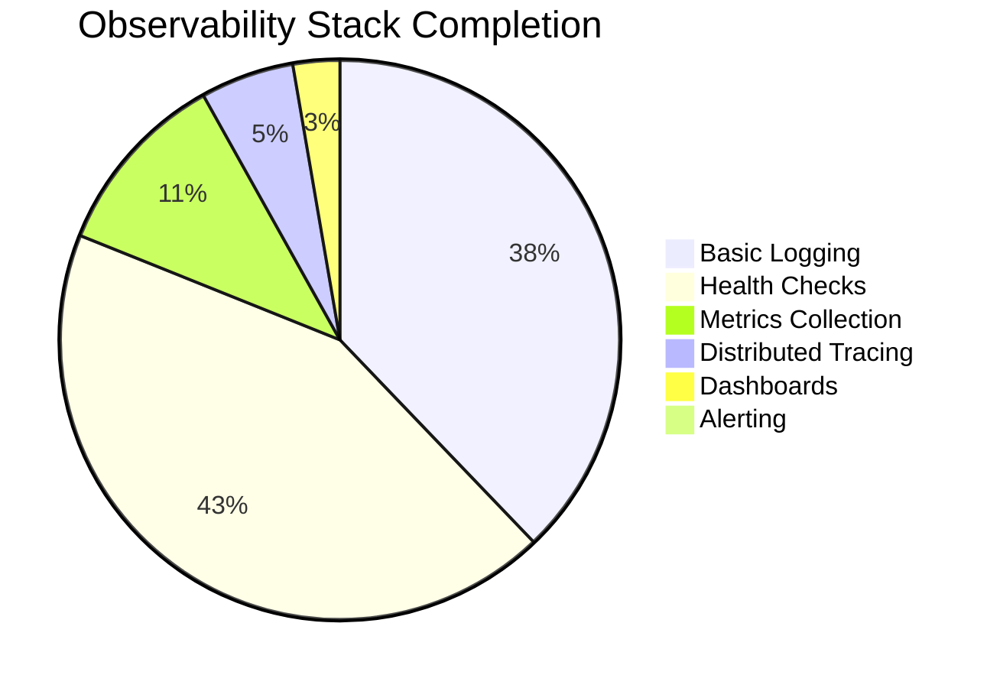
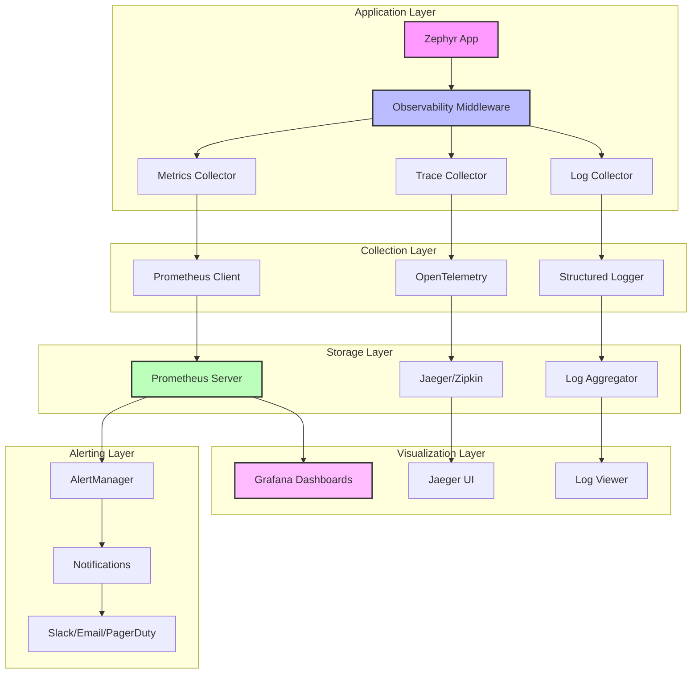
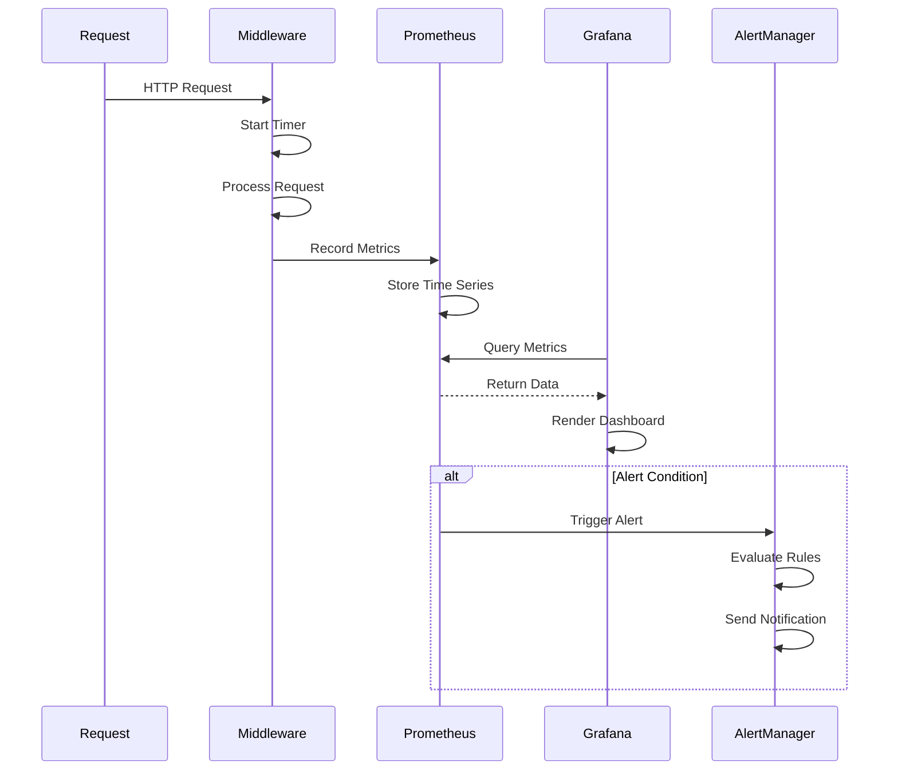
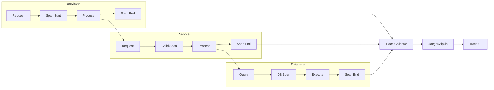

# Observability & Monitoring Stack Proposal

## Executive Summary

Implement a comprehensive observability and monitoring stack for Zephyr that provides production-grade insights through metrics collection, distributed tracing, structured logging, and real-time monitoring. This enables proactive issue detection, performance optimization, and operational excellence.

**Priority**: 🟡 **High**  
**Effort**: 3 weeks  
**Impact**: High - Essential for production deployments

## Current State Analysis

### ✅ What Exists
- Basic logging system with structured formatting
- Metrics middleware placeholder
- Tracing middleware placeholder
- Health check endpoints (`/health`, `/health/ready`, `/health/live`)

### ❌ What's Missing
- Prometheus metrics collection and export
- Grafana dashboard integration
- Distributed tracing implementation (Jaeger/Zipkin)
- Log aggregation and correlation
- Alert management system
- Performance profiling tools

### 📊 Completion Status


## Technical Architecture

### Observability Stack Overview


### Metrics Collection Flow


### Distributed Tracing Flow


## Feature Specifications

### Must Have Features

#### 1. Prometheus Metrics Collection
```python
from zephyr.observability import metrics

# Automatic HTTP metrics
http_requests_total = metrics.Counter(
    'http_requests_total',
    'Total HTTP requests',
    ['method', 'endpoint', 'status']
)

http_request_duration = metrics.Histogram(
    'http_request_duration_seconds',
    'HTTP request duration',
    ['method', 'endpoint']
)

# Custom business metrics
user_registrations = metrics.Counter(
    'user_registrations_total',
    'Total user registrations',
    ['source']
)

# Usage in application
@app.post("/users")
async def create_user(user_data: UserCreate):
    with metrics.timer('user_creation_duration'):
        user = await create_user_service(user_data)
        user_registrations.labels(source='api').inc()
        return user
```

#### 2. Distributed Tracing
```python
from zephyr.observability import tracing

# Automatic request tracing
@app.get("/users/{user_id}")
@tracing.trace("get_user")
async def get_user(user_id: int):
    # Automatically creates span for this endpoint
    
    # Manual span creation
    with tracing.span("database_query") as span:
        span.set_attribute("user_id", user_id)
        user = await db.get(User, user_id)
        span.set_attribute("user_found", user is not None)
    
    return user

# Cross-service tracing
async def call_external_service():
    headers = tracing.inject_headers()
    async with httpx.AsyncClient() as client:
        response = await client.get(
            "https://api.external.com/data",
            headers=headers
        )
    return response
```

#### 3. Structured Logging with Correlation
```python
from zephyr.observability import logger

# Automatic request correlation
@app.middleware("http")
async def logging_middleware(request, call_next):
    correlation_id = request.headers.get("x-correlation-id") or generate_id()
    
    with logger.context(
        correlation_id=correlation_id,
        user_id=request.user.id if request.user else None,
        endpoint=request.url.path
    ):
        logger.info("Request started", extra={
            "method": request.method,
            "url": str(request.url)
        })
        
        response = await call_next(request)
        
        logger.info("Request completed", extra={
            "status_code": response.status_code,
            "duration_ms": response.headers.get("x-response-time")
        })
    
    return response

# Usage in application code
async def process_payment(payment_data):
    logger.info("Processing payment", extra={
        "amount": payment_data.amount,
        "currency": payment_data.currency
    })
    
    try:
        result = await payment_service.process(payment_data)
        logger.info("Payment successful", extra={
            "transaction_id": result.transaction_id
        })
        return result
    except PaymentError as e:
        logger.error("Payment failed", extra={
            "error_code": e.code,
            "error_message": str(e)
        })
        raise
```

#### 4. Health Monitoring
```python
from zephyr.observability import health

# Enhanced health checks
@health.check("database")
async def check_database():
    try:
        await db.execute("SELECT 1")
        return health.HealthStatus.HEALTHY
    except Exception as e:
        return health.HealthStatus.UNHEALTHY, str(e)

@health.check("redis")
async def check_redis():
    try:
        await redis.ping()
        return health.HealthStatus.HEALTHY
    except Exception as e:
        return health.HealthStatus.UNHEALTHY, str(e)

@health.check("external_api")
async def check_external_api():
    try:
        async with httpx.AsyncClient() as client:
            response = await client.get("https://api.external.com/health")
            if response.status_code == 200:
                return health.HealthStatus.HEALTHY
            else:
                return health.HealthStatus.DEGRADED, f"API returned {response.status_code}"
    except Exception as e:
        return health.HealthStatus.UNHEALTHY, str(e)

# Automatic health endpoint
# GET /health returns overall health status
# GET /health/detailed returns individual check results
```

### Should Have Features

#### 1. Grafana Dashboard Integration
```python
# Pre-built dashboard templates
GRAFANA_DASHBOARDS = {
    "application_overview": {
        "title": "Zephyr Application Overview",
        "panels": [
            "HTTP Request Rate",
            "Response Time Percentiles",
            "Error Rate",
            "Active Connections",
            "Memory Usage",
            "CPU Usage"
        ]
    },
    "database_performance": {
        "title": "Database Performance",
        "panels": [
            "Query Duration",
            "Connection Pool Usage",
            "Slow Queries",
            "Database Errors"
        ]
    }
}

# Automatic dashboard provisioning
await grafana.provision_dashboard("application_overview")
```

#### 2. Alert Management
```python
from zephyr.observability import alerts

# Define alert rules
@alerts.rule("high_error_rate")
def high_error_rate():
    return alerts.Rule(
        expr='rate(http_requests_total{status=~"5.."}[5m]) > 0.1',
        duration='2m',
        severity='critical',
        summary='High error rate detected',
        description='Error rate is above 10% for 2 minutes'
    )

@alerts.rule("high_response_time")
def high_response_time():
    return alerts.Rule(
        expr='histogram_quantile(0.95, http_request_duration_seconds) > 1.0',
        duration='5m',
        severity='warning',
        summary='High response time detected',
        description='95th percentile response time is above 1 second'
    )

# Alert notification channels
ALERT_CHANNELS = {
    "slack": {
        "webhook_url": "https://hooks.slack.com/...",
        "channel": "#alerts"
    },
    "email": {
        "smtp_server": "smtp.example.com",
        "recipients": ["ops@example.com"]
    },
    "pagerduty": {
        "integration_key": "..."
    }
}
```

#### 3. Performance Profiling
```python
from zephyr.observability import profiler

# Automatic profiling for slow requests
@app.middleware("http")
async def profiling_middleware(request, call_next):
    if profiler.should_profile(request):
        with profiler.profile() as profile:
            response = await call_next(request)
        
        if profile.duration > 1.0:  # Profile slow requests
            await profiler.save_profile(profile, {
                "endpoint": request.url.path,
                "method": request.method,
                "duration": profile.duration
            })
    else:
        response = await call_next(request)
    
    return response

# Manual profiling
@profiler.profile_endpoint
async def expensive_operation():
    # This endpoint will be automatically profiled
    result = await complex_computation()
    return result
```

### Good to Have Features

#### 1. Real-time Monitoring Dashboard
```python
# WebSocket-based real-time metrics
@app.websocket("/metrics/live")
async def live_metrics(websocket):
    await websocket.accept()
    
    async for metric_update in metrics.stream():
        await websocket.send_json({
            "timestamp": metric_update.timestamp,
            "metrics": metric_update.data
        })

# Real-time log streaming
@app.websocket("/logs/live")
async def live_logs(websocket):
    await websocket.accept()
    
    async for log_entry in logger.stream():
        if log_entry.level >= logging.WARNING:
            await websocket.send_json(log_entry.dict())
```

#### 2. Custom Metrics Dashboard
```python
# User-defined metrics
@app.post("/metrics/custom")
async def record_custom_metric(metric_data: CustomMetric):
    metrics.record(
        name=metric_data.name,
        value=metric_data.value,
        labels=metric_data.labels,
        timestamp=metric_data.timestamp
    )
    return {"status": "recorded"}

# Business intelligence metrics
business_metrics = metrics.MetricGroup("business")
business_metrics.counter("orders_total", ["product_category", "region"])
business_metrics.gauge("inventory_level", ["product_id"])
business_metrics.histogram("order_value", ["currency"])
```

## Implementation Roadmap

### Phase 1: Core Observability (Week 1)
| Task | Priority | Effort | Dependencies |
|------|----------|--------|--------------|
| Prometheus metrics integration | Critical | 3 days | None |
| Enhanced structured logging | Critical | 2 days | None |
| Health check system | High | 1 day | None |
| Basic middleware setup | Critical | 1 day | Metrics, Logging |

**Deliverables**:
- Working Prometheus metrics collection
- Structured logging with correlation IDs
- Comprehensive health check system
- Observability middleware integration

### Phase 2: Distributed Tracing (Week 2)
| Task | Priority | Effort | Dependencies |
|------|----------|--------|--------------|
| OpenTelemetry integration | High | 3 days | None |
| Jaeger/Zipkin backend setup | High | 2 days | OpenTelemetry |
| Automatic span creation | High | 2 days | Tracing backend |
| Cross-service tracing | Medium | 1 day | Spans |

**Deliverables**:
- Complete distributed tracing system
- Automatic request/response tracing
- Database query tracing
- External service call tracing

### Phase 3: Visualization & Alerting (Week 3)
| Task | Priority | Effort | Dependencies |
|------|----------|--------|--------------|
| Grafana dashboard templates | High | 2 days | Metrics |
| Alert rule engine | High | 2 days | Metrics |
| Notification channels | Medium | 2 days | Alerts |
| Performance profiling | Medium | 2 days | Tracing |

**Deliverables**:
- Pre-built Grafana dashboards
- Alert management system
- Multi-channel notifications
- Performance profiling tools

## File Structure

```
zephyr/
├── observability/
│   └── __init__.py              # Main observability exports
├── core/
│   └── observability/
│       ├── __init__.py
│       ├── metrics/
│       │   ├── __init__.py
│       │   ├── prometheus.py    # Prometheus integration
│       │   ├── collectors.py    # Metric collectors
│       │   └── middleware.py    # Metrics middleware
│       ├── tracing/
│       │   ├── __init__.py
│       │   ├── opentelemetry.py # OpenTelemetry integration
│       │   ├── jaeger.py        # Jaeger backend
│       │   ├── zipkin.py        # Zipkin backend
│       │   └── middleware.py    # Tracing middleware
│       ├── logging/
│       │   ├── __init__.py
│       │   ├── structured.py    # Structured logging
│       │   ├── correlation.py   # Request correlation
│       │   └── formatters.py    # Log formatters
│       ├── health/
│       │   ├── __init__.py
│       │   ├── checks.py        # Health check system
│       │   ├── endpoints.py     # Health endpoints
│       │   └── monitors.py      # Health monitoring
│       ├── alerts/
│       │   ├── __init__.py
│       │   ├── rules.py         # Alert rules engine
│       │   ├── channels.py      # Notification channels
│       │   └── manager.py       # Alert manager
│       └── profiling/
│           ├── __init__.py
│           ├── profiler.py      # Performance profiler
│           └── analysis.py      # Profile analysis
├── cli/
│   └── observability/
│       ├── __init__.py
│       ├── metrics.py           # Metrics CLI commands
│       ├── dashboards.py        # Dashboard management
│       └── alerts.py            # Alert management
└── templates/
    └── grafana/
        ├── application_overview.json
        ├── database_performance.json
        ├── security_monitoring.json
        └── business_metrics.json
```

## Configuration Specifications

### Observability Settings
```python
# zephyr/conf/base.py additions
class BaseSettings(PydanticBaseSettings):
    # Metrics Configuration
    METRICS_ENABLED: bool = True
    METRICS_ENDPOINT: str = "/metrics"
    PROMETHEUS_MULTIPROC_DIR: str | None = None
    
    # Tracing Configuration
    TRACING_ENABLED: bool = True
    TRACING_SAMPLE_RATE: float = 1.0
    JAEGER_ENDPOINT: str | None = None
    ZIPKIN_ENDPOINT: str | None = None
    
    # Logging Configuration
    LOG_LEVEL: str = "INFO"
    LOG_FORMAT: str = "json"  # json, text
    LOG_CORRELATION_ENABLED: bool = True
    LOG_CORRELATION_HEADER: str = "x-correlation-id"
    
    # Health Check Configuration
    HEALTH_CHECK_ENABLED: bool = True
    HEALTH_CHECK_TIMEOUT: int = 30
    HEALTH_CHECK_INTERVAL: int = 60
    
    # Alert Configuration
    ALERTS_ENABLED: bool = True
    ALERT_MANAGER_URL: str | None = None
    
    # Grafana Configuration
    GRAFANA_URL: str | None = None
    GRAFANA_API_KEY: str | None = None
    GRAFANA_ORG_ID: int = 1
    
    # Performance Profiling
    PROFILING_ENABLED: bool = False
    PROFILING_SAMPLE_RATE: float = 0.01
    PROFILING_SLOW_THRESHOLD: float = 1.0
```

### Environment Configuration
```bash
# Basic observability
METRICS_ENABLED=true
TRACING_ENABLED=true
LOG_LEVEL=INFO

# Jaeger tracing
JAEGER_ENDPOINT=http://jaeger:14268/api/traces

# Grafana integration
GRAFANA_URL=http://grafana:3000
GRAFANA_API_KEY=your_api_key

# Alert manager
ALERT_MANAGER_URL=http://alertmanager:9093

# Production profiling
PROFILING_ENABLED=true
PROFILING_SAMPLE_RATE=0.001
```

## Grafana Dashboard Specifications

### Application Overview Dashboard
```json
{
  "dashboard": {
    "title": "Zephyr Application Overview",
    "panels": [
      {
        "title": "Request Rate",
        "type": "graph",
        "targets": [
          {
            "expr": "rate(http_requests_total[5m])",
            "legendFormat": "{{method}} {{endpoint}}"
          }
        ]
      },
      {
        "title": "Response Time",
        "type": "graph",
        "targets": [
          {
            "expr": "histogram_quantile(0.95, http_request_duration_seconds)",
            "legendFormat": "95th percentile"
          },
          {
            "expr": "histogram_quantile(0.50, http_request_duration_seconds)",
            "legendFormat": "50th percentile"
          }
        ]
      },
      {
        "title": "Error Rate",
        "type": "singlestat",
        "targets": [
          {
            "expr": "rate(http_requests_total{status=~\"5..\"}[5m]) / rate(http_requests_total[5m]) * 100",
            "legendFormat": "Error Rate %"
          }
        ]
      }
    ]
  }
}
```

### Database Performance Dashboard
```json
{
  "dashboard": {
    "title": "Database Performance",
    "panels": [
      {
        "title": "Query Duration",
        "type": "graph",
        "targets": [
          {
            "expr": "histogram_quantile(0.95, database_query_duration_seconds)",
            "legendFormat": "95th percentile"
          }
        ]
      },
      {
        "title": "Connection Pool Usage",
        "type": "graph",
        "targets": [
          {
            "expr": "database_connections_active",
            "legendFormat": "Active Connections"
          },
          {
            "expr": "database_connections_idle",
            "legendFormat": "Idle Connections"
          }
        ]
      }
    ]
  }
}
```

## Alert Rules Specifications

### Critical Alerts
```yaml
# High error rate
- alert: HighErrorRate
  expr: rate(http_requests_total{status=~"5.."}[5m]) > 0.1
  for: 2m
  labels:
    severity: critical
  annotations:
    summary: "High error rate detected"
    description: "Error rate is {{ $value | humanizePercentage }} for the last 2 minutes"

# Application down
- alert: ApplicationDown
  expr: up{job="zephyr-app"} == 0
  for: 1m
  labels:
    severity: critical
  annotations:
    summary: "Application is down"
    description: "Zephyr application has been down for more than 1 minute"

# Database connection issues
- alert: DatabaseConnectionIssues
  expr: database_connections_failed_total > 10
  for: 5m
  labels:
    severity: critical
  annotations:
    summary: "Database connection issues"
    description: "{{ $value }} database connection failures in the last 5 minutes"
```

### Warning Alerts
```yaml
# High response time
- alert: HighResponseTime
  expr: histogram_quantile(0.95, http_request_duration_seconds) > 1.0
  for: 5m
  labels:
    severity: warning
  annotations:
    summary: "High response time"
    description: "95th percentile response time is {{ $value }}s"

# High memory usage
- alert: HighMemoryUsage
  expr: process_resident_memory_bytes / 1024 / 1024 > 512
  for: 10m
  labels:
    severity: warning
  annotations:
    summary: "High memory usage"
    description: "Memory usage is {{ $value }}MB"
```

## Testing Strategy

### Test Coverage Requirements
| Component | Target Coverage | Test Types |
|-----------|----------------|------------|
| Metrics Collection | 90% | Unit, Integration |
| Tracing System | 85% | Unit, Integration |
| Health Checks | 95% | Unit, Integration |
| Alert Rules | 80% | Unit, Integration |
| Dashboard Templates | 70% | Integration |

### Test Implementation
```python
# tests/observability/test_metrics.py
class TestMetricsCollection:
    async def test_http_request_metrics(self, client):
        # Make test request
        response = await client.get("/test")
        
        # Check metrics were recorded
        metrics = await prometheus.get_metrics()
        assert "http_requests_total" in metrics
        assert metrics["http_requests_total"]["GET"]["/test"]["200"] == 1
    
    async def test_custom_metrics(self):
        counter = metrics.Counter("test_counter", "Test counter")
        counter.inc()
        
        metrics_data = await prometheus.get_metrics()
        assert metrics_data["test_counter"] == 1

# tests/observability/test_tracing.py
class TestDistributedTracing:
    async def test_automatic_span_creation(self, client):
        with tracing.trace("test_operation"):
            response = await client.get("/test")
        
        spans = await tracing.get_spans()
        assert len(spans) == 2  # HTTP request + test_operation
        assert spans[0].operation_name == "GET /test"
        assert spans[1].operation_name == "test_operation"
```

## Performance Impact Assessment

### Overhead Measurements
| Feature | CPU Overhead | Memory Overhead | Latency Impact |
|---------|--------------|-----------------|----------------|
| Metrics Collection | < 2% | < 10MB | < 1ms |
| Distributed Tracing | < 5% | < 20MB | < 2ms |
| Structured Logging | < 1% | < 5MB | < 0.5ms |
| Health Checks | < 0.5% | < 2MB | N/A |

### Optimization Strategies
```python
# Sampling for high-traffic applications
TRACING_SAMPLE_RATE = 0.01  # 1% sampling
PROFILING_SAMPLE_RATE = 0.001  # 0.1% sampling

# Async metric collection
async def collect_metrics_async():
    """Collect metrics asynchronously to avoid blocking requests."""
    while True:
        await metrics.collect_system_metrics()
        await asyncio.sleep(10)

# Metric aggregation
METRICS_AGGREGATION_INTERVAL = 15  # seconds
METRICS_RETENTION_PERIOD = "30d"
```

## Dependencies

### Required Dependencies
```toml
# pyproject.toml additions
dependencies = [
    # Existing dependencies...
    "prometheus-client>=0.17.0",     # Prometheus metrics
    "opentelemetry-api>=1.20.0",     # Tracing API
    "opentelemetry-sdk>=1.20.0",     # Tracing SDK
    "opentelemetry-instrumentation>=0.41b0",  # Auto-instrumentation
    "structlog>=23.1.0",             # Structured logging
]
```

### Optional Dependencies
```toml
[project.optional-dependencies]
observability = [
    "jaeger-client>=4.8.0",         # Jaeger tracing
    "zipkin-py>=0.20.0",            # Zipkin tracing
    "grafana-api>=1.0.3",           # Grafana integration
    "py-spy>=0.3.14",               # Performance profiling
]
```

## Risk Assessment

### High Risk Items
| Risk | Impact | Probability | Mitigation |
|------|--------|-------------|------------|
| Performance overhead | High | Medium | Sampling, async collection |
| Metric storage costs | Medium | High | Retention policies, aggregation |
| Alert fatigue | Medium | High | Proper thresholds, escalation |

### Medium Risk Items
| Risk | Impact | Probability | Mitigation |
|------|--------|-------------|------------|
| Dashboard complexity | Medium | Medium | Template standardization |
| Trace data volume | Medium | High | Sampling strategies |
| Configuration complexity | Low | High | Sensible defaults, validation |

## Success Metrics

### Operational Metrics
- ✅ < 5% performance overhead from observability
- ✅ < 1 minute to detect critical issues
- ✅ < 5 minutes mean time to alert (MTTA)
- ✅ > 99% uptime monitoring availability

### Developer Experience Metrics
- ✅ < 10 minutes to set up monitoring for new service
- ✅ Pre-built dashboards for common use cases
- ✅ Automatic correlation between logs, metrics, and traces
- ✅ Clear documentation and examples

### Business Metrics
- ✅ Reduced mean time to resolution (MTTR)
- ✅ Proactive issue detection before user impact
- ✅ Performance optimization insights
- ✅ Capacity planning data

## Next Steps

### Immediate Actions (Week 1)
1. **Implement Prometheus metrics collection**
2. **Set up structured logging with correlation**
3. **Create comprehensive health check system**
4. **Build observability middleware**

### Short-term Goals (Month 1)
1. **Complete distributed tracing implementation**
2. **Create Grafana dashboard templates**
3. **Implement alert management system**
4. **Add performance profiling capabilities**

### Integration Points
- **Middleware Stack**: Automatic observability for all requests
- **Database Layer**: Query performance monitoring
- **Storage System**: File operation metrics
- **Security System**: Authentication/authorization monitoring

---

**Related Proposals**:
- [Database & ORM Layer](./database-orm-layer.md) - Database performance monitoring
- [Production Infrastructure](./production-infrastructure.md) - Deployment monitoring
- [Security & Compliance](./security-compliance.md) - Security event monitoring

---

*Last Updated: January 2024*  
*Version: 1.0*  
*Status: Ready for Implementation*


