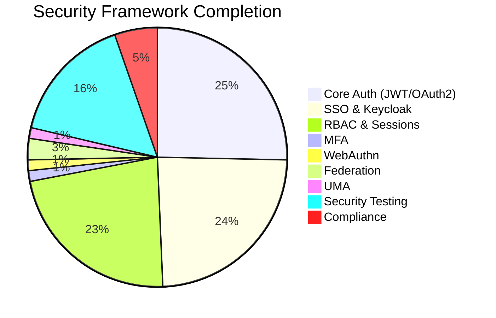
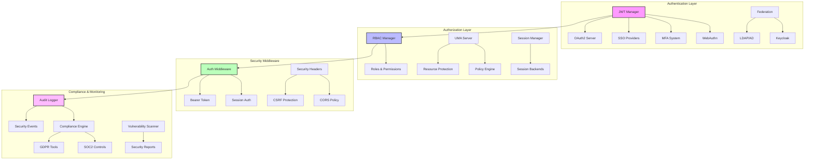
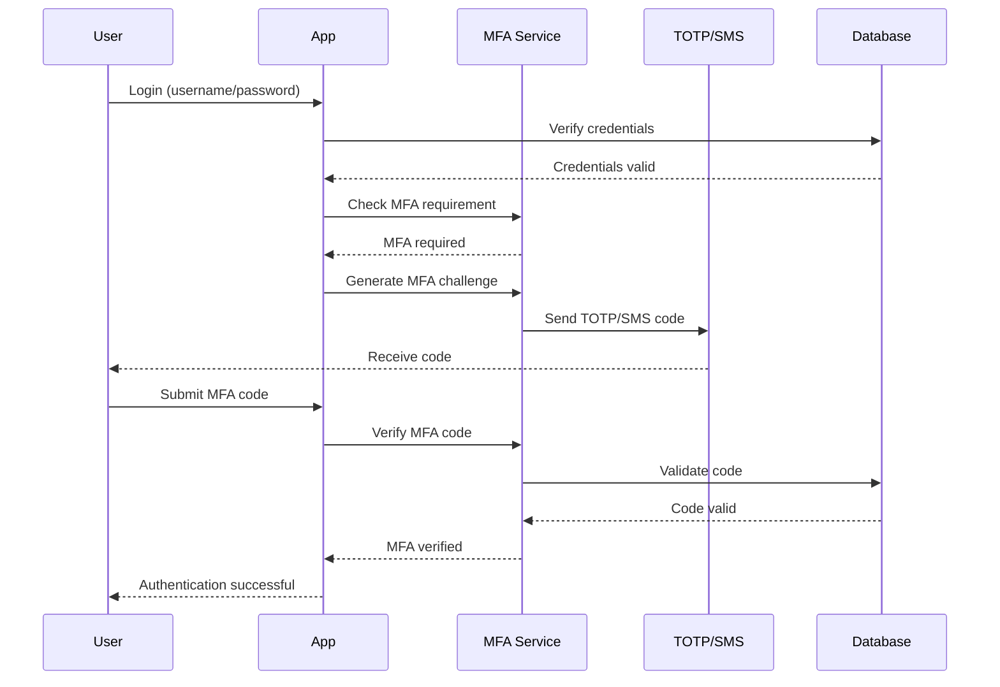
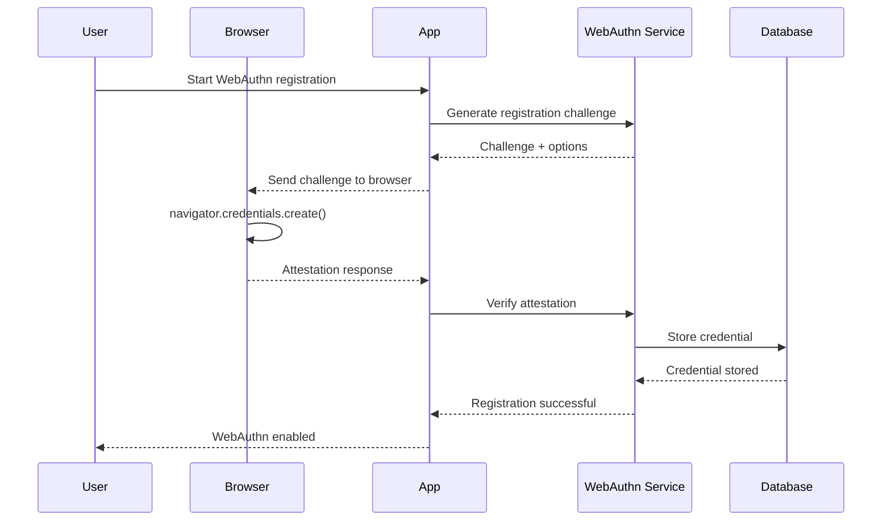

# Security & Compliance Proposal

## Executive Summary

Complete the Zephyr security framework by implementing missing authentication modules (MFA, WebAuthn, Federation, UMA), comprehensive security testing, compliance frameworks, and advanced security features. This transforms Zephyr into an enterprise-grade framework with world-class security capabilities suitable for regulated industries.

**Priority**: 🟡 **Medium**  
**Effort**: 2 weeks  
**Impact**: Medium - Enterprise security requirements

## Current State Analysis

### ✅ What Exists (Excellent Foundation)
- Complete JWT authentication system
- OAuth2 server implementation
- SSO integration (Google, GitHub, Azure)
- Keycloak integration with 116 passing tests
- Password hashing and token management
- RBAC system with role-based access control
- Session management with multiple backends
- Security middleware and decorators

### ❌ What's Missing
- Multi-Factor Authentication (MFA) implementation
- WebAuthn passwordless authentication
- User federation (LDAP/Active Directory)
- User-Managed Access (UMA) authorization
- Comprehensive security testing (400+ tests needed)
- Compliance frameworks (GDPR, SOC2, HIPAA)
- Security scanning and vulnerability management

### 📊 Completion Status


## Technical Architecture

### Complete Security Stack Overview


### MFA Authentication Flow


### WebAuthn Registration Flow


## Feature Specifications

### Must Have Features

#### 1. Multi-Factor Authentication (MFA)
```python
from zephyr.security.mfa import MFAManager, TOTPProvider, SMSProvider, EmailProvider

# MFA configuration
mfa_manager = MFAManager(
    providers={
        "totp": TOTPProvider(issuer="MyApp"),
        "sms": SMSProvider(provider="twilio", account_sid="...", auth_token="..."),
        "email": EmailProvider(smtp_config={...})
    },
    backup_codes_count=10,
    require_mfa_for_admin=True
)

# TOTP setup
@app.post("/auth/mfa/totp/setup")
async def setup_totp(user: User = Depends(get_current_user)):
    secret = await mfa_manager.generate_totp_secret(user.id)
    qr_code = await mfa_manager.generate_qr_code(user.email, secret)
    
    return {
        "secret": secret,
        "qr_code": qr_code,
        "backup_codes": await mfa_manager.generate_backup_codes(user.id)
    }

@app.post("/auth/mfa/totp/verify")
async def verify_totp(
    code: str,
    user: User = Depends(get_current_user)
):
    is_valid = await mfa_manager.verify_totp(user.id, code)
    if is_valid:
        await mfa_manager.enable_mfa(user.id, "totp")
        return {"status": "enabled"}
    raise HTTPException(status_code=400, detail="Invalid code")

# SMS MFA
@app.post("/auth/mfa/sms/send")
async def send_sms_code(user: User = Depends(get_current_user)):
    code = await mfa_manager.send_sms_code(user.id, user.phone)
    return {"status": "sent", "expires_in": 300}

@app.post("/auth/mfa/sms/verify")
async def verify_sms_code(
    code: str,
    user: User = Depends(get_current_user)
):
    is_valid = await mfa_manager.verify_sms_code(user.id, code)
    if is_valid:
        return {"status": "verified"}
    raise HTTPException(status_code=400, detail="Invalid or expired code")

# MFA enforcement middleware
@app.middleware("http")
async def mfa_enforcement_middleware(request: Request, call_next):
    if request.url.path.startswith("/admin/"):
        user = await get_current_user(request)
        if user and not await mfa_manager.is_mfa_verified(user.id):
            return JSONResponse(
                status_code=403,
                content={"detail": "MFA verification required"}
            )
    return await call_next(request)
```

#### 2. WebAuthn Passwordless Authentication
```python
from zephyr.security.webauthn import WebAuthnManager, RelyingParty

# WebAuthn configuration
webauthn_manager = WebAuthnManager(
    rp_id="example.com",
    rp_name="My Application",
    origin="https://example.com",
    require_user_verification=True,
    require_resident_key=False
)

# Registration ceremony
@app.post("/auth/webauthn/register/begin")
async def begin_registration(user: User = Depends(get_current_user)):
    options = await webauthn_manager.generate_registration_options(
        user_id=str(user.id),
        user_name=user.email,
        user_display_name=user.name
    )
    
    # Store challenge in session
    request.session["webauthn_challenge"] = options.challenge
    
    return options.dict()

@app.post("/auth/webauthn/register/complete")
async def complete_registration(
    credential: dict,
    user: User = Depends(get_current_user),
    challenge: str = Depends(get_session_challenge)
):
    verification = await webauthn_manager.verify_registration_response(
        credential=credential,
        expected_challenge=challenge,
        expected_origin="https://example.com",
        expected_rp_id="example.com"
    )
    
    if verification.verified:
        await webauthn_manager.store_credential(
            user_id=user.id,
            credential_id=verification.credential_id,
            credential_public_key=verification.credential_public_key,
            sign_count=verification.sign_count
        )
        return {"verified": True}
    
    raise HTTPException(status_code=400, detail="Registration failed")

# Authentication ceremony
@app.post("/auth/webauthn/authenticate/begin")
async def begin_authentication():
    options = await webauthn_manager.generate_authentication_options()
    request.session["webauthn_challenge"] = options.challenge
    return options.dict()

@app.post("/auth/webauthn/authenticate/complete")
async def complete_authentication(
    credential: dict,
    challenge: str = Depends(get_session_challenge)
):
    verification = await webauthn_manager.verify_authentication_response(
        credential=credential,
        expected_challenge=challenge,
        expected_origin="https://example.com",
        expected_rp_id="example.com"
    )
    
    if verification.verified:
        user = await User.get_by_credential_id(verification.credential_id)
        token = await create_access_token(user.id)
        return {"access_token": token, "token_type": "bearer"}
    
    raise HTTPException(status_code=401, detail="Authentication failed")
```

#### 3. User Federation (LDAP/Active Directory)
```python
from zephyr.security.federation import LDAPProvider, ActiveDirectoryProvider

# LDAP configuration
ldap_provider = LDAPProvider(
    server_uri="ldap://ldap.example.com:389",
    bind_dn="cn=admin,dc=example,dc=com",
    bind_password="admin_password",
    user_search_base="ou=users,dc=example,dc=com",
    user_search_filter="(uid={username})",
    group_search_base="ou=groups,dc=example,dc=com",
    group_search_filter="(member={user_dn})",
    attribute_mapping={
        "username": "uid",
        "email": "mail",
        "first_name": "givenName",
        "last_name": "sn",
        "groups": "memberOf"
    }
)

# LDAP authentication
@app.post("/auth/ldap/login")
async def ldap_login(credentials: LDAPCredentials):
    try:
        # Authenticate against LDAP
        ldap_user = await ldap_provider.authenticate(
            username=credentials.username,
            password=credentials.password
        )
        
        # Sync user to local database
        user = await sync_ldap_user(ldap_user)
        
        # Generate JWT token
        token = await create_access_token(user.id)
        
        return {
            "access_token": token,
            "token_type": "bearer",
            "user": user.dict()
        }
        
    except LDAPAuthenticationError:
        raise HTTPException(status_code=401, detail="Invalid credentials")

# User synchronization
async def sync_ldap_user(ldap_user: LDAPUser) -> User:
    """Sync LDAP user to local database."""
    user = await User.get_by_username(ldap_user.username)
    
    if not user:
        # Create new user
        user = User(
            username=ldap_user.username,
            email=ldap_user.email,
            first_name=ldap_user.first_name,
            last_name=ldap_user.last_name,
            is_ldap_user=True
        )
        await user.save()
    else:
        # Update existing user
        user.email = ldap_user.email
        user.first_name = ldap_user.first_name
        user.last_name = ldap_user.last_name
        await user.save()
    
    # Sync group memberships
    await sync_user_groups(user, ldap_user.groups)
    
    return user

# Automatic user provisioning
@app.middleware("http")
async def ldap_user_sync_middleware(request: Request, call_next):
    response = await call_next(request)
    
    # Sync LDAP users periodically
    if should_sync_ldap_users():
        await ldap_provider.sync_all_users()
    
    return response
```

#### 4. User-Managed Access (UMA) Authorization
```python
from zephyr.security.uma import UMAServer, ResourceServer, PolicyEngine

# UMA configuration
uma_server = UMAServer(
    authorization_server_url="https://auth.example.com",
    resource_server_id="my-api",
    policy_engine=PolicyEngine()
)

# Resource registration
@app.post("/uma/resources")
async def register_resource(
    resource: ResourceRegistration,
    user: User = Depends(get_current_user)
):
    resource_id = await uma_server.register_resource(
        name=resource.name,
        description=resource.description,
        scopes=resource.scopes,
        owner_id=user.id,
        resource_uri=resource.uri
    )
    
    return {"resource_id": resource_id}

# Permission ticket request
@app.post("/uma/permission-tickets")
async def request_permission_ticket(
    permission_request: PermissionRequest,
    user: User = Depends(get_current_user)
):
    ticket = await uma_server.create_permission_ticket(
        resource_id=permission_request.resource_id,
        scopes=permission_request.scopes,
        requesting_party=user.id
    )
    
    return {"ticket": ticket}

# RPT (Requesting Party Token) acquisition
@app.post("/uma/rpt")
async def get_rpt(
    rpt_request: RPTRequest,
    user: User = Depends(get_current_user)
):
    # Evaluate policies
    policy_result = await uma_server.evaluate_policies(
        resource_id=rpt_request.resource_id,
        scopes=rpt_request.scopes,
        requesting_party=user.id,
        context=rpt_request.context
    )
    
    if policy_result.granted:
        rpt = await uma_server.create_rpt(
            user_id=user.id,
            permissions=policy_result.permissions
        )
        return {"access_token": rpt, "token_type": "Bearer"}
    
    raise HTTPException(status_code=403, detail="Access denied")

# UMA protection decorator
def uma_protected(resource_id: str, scopes: list[str]):
    def decorator(func):
        async def wrapper(*args, **kwargs):
            request = kwargs.get("request")
            rpt = extract_rpt_from_request(request)
            
            if not rpt:
                raise HTTPException(
                    status_code=401,
                    detail="UMA token required",
                    headers={"WWW-Authenticate": "UMA"}
                )
            
            is_authorized = await uma_server.verify_rpt(
                rpt=rpt,
                resource_id=resource_id,
                scopes=scopes
            )
            
            if not is_authorized:
                raise HTTPException(status_code=403, detail="Insufficient permissions")
            
            return await func(*args, **kwargs)
        return wrapper
    return decorator

# Usage
@app.get("/protected-resource")
@uma_protected(resource_id="documents", scopes=["read"])
async def get_protected_resource():
    return {"data": "sensitive information"}
```

### Should Have Features

#### 1. Comprehensive Security Testing
```python
# Complete test coverage for all security modules
# Target: 400+ tests with 100% pass rate

# tests/security/test_mfa.py
class TestMFA:
    async def test_totp_generation_and_verification(self):
        secret = await mfa_manager.generate_totp_secret(user_id=1)
        assert len(secret) == 32
        
        # Generate TOTP code
        totp = pyotp.TOTP(secret)
        code = totp.now()
        
        # Verify code
        is_valid = await mfa_manager.verify_totp(user_id=1, code=code)
        assert is_valid
    
    async def test_backup_codes(self):
        codes = await mfa_manager.generate_backup_codes(user_id=1)
        assert len(codes) == 10
        
        # Use backup code
        is_valid = await mfa_manager.verify_backup_code(user_id=1, code=codes[0])
        assert is_valid
        
        # Code should be consumed
        is_valid = await mfa_manager.verify_backup_code(user_id=1, code=codes[0])
        assert not is_valid

# tests/security/test_webauthn.py
class TestWebAuthn:
    async def test_registration_options_generation(self):
        options = await webauthn_manager.generate_registration_options(
            user_id="123",
            user_name="test@example.com",
            user_display_name="Test User"
        )
        
        assert options.rp.id == "example.com"
        assert options.user.id == "123"
        assert len(options.challenge) > 0
    
    async def test_authentication_flow(self):
        # Mock credential response
        mock_credential = create_mock_webauthn_credential()
        
        verification = await webauthn_manager.verify_authentication_response(
            credential=mock_credential,
            expected_challenge="test_challenge",
            expected_origin="https://example.com",
            expected_rp_id="example.com"
        )
        
        assert verification.verified
```

#### 2. Compliance Framework
```python
from zephyr.security.compliance import GDPRCompliance, SOC2Compliance, HIPAACompliance

# GDPR compliance tools
gdpr = GDPRCompliance()

@app.post("/gdpr/data-export")
async def export_user_data(
    user_id: int,
    user: User = Depends(get_current_user)
):
    """Export all user data for GDPR compliance."""
    if user.id != user_id and not user.is_admin:
        raise HTTPException(status_code=403, detail="Access denied")
    
    data = await gdpr.export_user_data(user_id)
    return {
        "user_data": data,
        "export_date": datetime.utcnow(),
        "format": "json"
    }

@app.delete("/gdpr/data-deletion")
async def delete_user_data(
    user_id: int,
    user: User = Depends(get_current_user)
):
    """Delete user data for GDPR right to be forgotten."""
    if user.id != user_id and not user.is_admin:
        raise HTTPException(status_code=403, detail="Access denied")
    
    await gdpr.delete_user_data(user_id)
    await gdpr.log_deletion_request(user_id, requested_by=user.id)
    
    return {"status": "deleted", "user_id": user_id}

# SOC2 compliance controls
soc2 = SOC2Compliance()

@app.middleware("http")
async def soc2_audit_middleware(request: Request, call_next):
    """Log all requests for SOC2 audit trail."""
    start_time = time.time()
    
    # Log request
    await soc2.log_access_attempt(
        user_id=getattr(request.state, "user_id", None),
        ip_address=request.client.host,
        endpoint=request.url.path,
        method=request.method,
        timestamp=datetime.utcnow()
    )
    
    response = await call_next(request)
    
    # Log response
    await soc2.log_access_result(
        status_code=response.status_code,
        duration=time.time() - start_time,
        timestamp=datetime.utcnow()
    )
    
    return response

# HIPAA compliance for healthcare applications
hipaa = HIPAACompliance()

@app.post("/hipaa/audit-log")
async def get_audit_log(
    date_range: DateRange,
    admin_user: User = Depends(require_admin)
):
    """Get HIPAA audit log for compliance reporting."""
    audit_entries = await hipaa.get_audit_log(
        start_date=date_range.start,
        end_date=date_range.end,
        include_phi_access=True
    )
    
    return {
        "audit_entries": audit_entries,
        "total_count": len(audit_entries),
        "date_range": date_range.dict()
    }
```

#### 3. Security Scanning & Vulnerability Management
```python
from zephyr.security.scanning import VulnerabilityScanner, SecurityReporter

# Vulnerability scanning
scanner = VulnerabilityScanner()

@app.get("/security/scan")
async def security_scan(admin_user: User = Depends(require_admin)):
    """Run comprehensive security scan."""
    scan_results = await scanner.run_full_scan()
    
    return {
        "scan_id": scan_results.id,
        "vulnerabilities": scan_results.vulnerabilities,
        "severity_counts": scan_results.severity_counts,
        "recommendations": scan_results.recommendations
    }

# Automated security monitoring
@app.middleware("http")
async def security_monitoring_middleware(request: Request, call_next):
    """Monitor for security threats and anomalies."""
    # Check for suspicious patterns
    if await scanner.detect_suspicious_activity(request):
        await scanner.log_security_event(
            event_type="suspicious_activity",
            details={
                "ip": request.client.host,
                "user_agent": request.headers.get("user-agent"),
                "endpoint": request.url.path
            }
        )
    
    response = await call_next(request)
    return response

# Security reporting
reporter = SecurityReporter()

@app.get("/security/report")
async def security_report(
    report_type: str,
    admin_user: User = Depends(require_admin)
):
    """Generate security compliance report."""
    if report_type == "vulnerabilities":
        report = await reporter.generate_vulnerability_report()
    elif report_type == "compliance":
        report = await reporter.generate_compliance_report()
    elif report_type == "audit":
        report = await reporter.generate_audit_report()
    else:
        raise HTTPException(status_code=400, detail="Invalid report type")
    
    return report
```

### Good to Have Features

#### 1. Advanced Threat Detection
```python
from zephyr.security.threats import ThreatDetector, BehaviorAnalyzer

# AI-powered threat detection
threat_detector = ThreatDetector()

@app.middleware("http")
async def threat_detection_middleware(request: Request, call_next):
    """Detect and respond to security threats."""
    threat_score = await threat_detector.analyze_request(request)
    
    if threat_score > 0.8:  # High threat score
        await threat_detector.block_request(request)
        return JSONResponse(
            status_code=403,
            content={"detail": "Request blocked due to security threat"}
        )
    elif threat_score > 0.5:  # Medium threat score
        await threat_detector.flag_for_review(request)
    
    response = await call_next(request)
    return response

# Behavioral analysis
behavior_analyzer = BehaviorAnalyzer()

@app.middleware("http")
async def behavior_analysis_middleware(request: Request, call_next):
    """Analyze user behavior for anomalies."""
    if hasattr(request.state, "user_id"):
        user_id = request.state.user_id
        
        # Analyze behavior pattern
        is_anomalous = await behavior_analyzer.analyze_user_behavior(
            user_id=user_id,
            request=request
        )
        
        if is_anomalous:
            await behavior_analyzer.trigger_additional_verification(user_id)
    
    response = await call_next(request)
    return response
```

## Implementation Roadmap

### Phase 1: MFA & WebAuthn (Week 1)
| Task | Priority | Effort | Dependencies |
|------|----------|--------|--------------|
| MFA system implementation | Critical | 3 days | None |
| TOTP provider | Critical | 1 day | MFA system |
| SMS/Email providers | High | 1 day | MFA system |
| WebAuthn implementation | High | 2 days | None |

**Deliverables**:
- Complete MFA system with TOTP, SMS, and email
- WebAuthn passwordless authentication
- Backup codes and recovery mechanisms
- MFA enforcement middleware

### Phase 2: Federation & UMA (Week 2)
| Task | Priority | Effort | Dependencies |
|------|----------|--------|--------------|
| LDAP/AD federation | High | 3 days | None |
| User synchronization | High | 1 day | Federation |
| UMA authorization server | Medium | 2 days | None |
| Policy engine | Medium | 1 day | UMA |

**Deliverables**:
- LDAP/Active Directory integration
- Automatic user provisioning and sync
- UMA authorization server
- Policy-based access control

## Testing Strategy

### Comprehensive Security Test Suite
| Module | Target Tests | Current Tests | Gap |
|--------|--------------|---------------|-----|
| MFA | 60-80 tests | 0 | 60-80 |
| WebAuthn | 50-70 tests | 0 | 50-70 |
| Federation | 60-80 tests | 0 | 60-80 |
| UMA | 50-70 tests | 0 | 50-70 |
| Decorators | 30-40 tests | 0 | 30-40 |
| **Total** | **250-340** | **0** | **250-340** |

### Test Implementation Examples
```python
# tests/security/test_mfa_integration.py
class TestMFAIntegration:
    async def test_complete_mfa_flow(self, client, test_user):
        # 1. Login with password
        response = await client.post("/auth/login", json={
            "username": test_user.username,
            "password": "password123"
        })
        assert response.status_code == 200
        
        # 2. Setup TOTP
        response = await client.post("/auth/mfa/totp/setup")
        setup_data = response.json()
        assert "secret" in setup_data
        assert "qr_code" in setup_data
        
        # 3. Verify TOTP
        totp = pyotp.TOTP(setup_data["secret"])
        code = totp.now()
        
        response = await client.post("/auth/mfa/totp/verify", json={
            "code": code
        })
        assert response.status_code == 200
        
        # 4. Test MFA enforcement
        response = await client.get("/admin/dashboard")
        assert response.status_code == 200  # Should work with MFA

# tests/security/test_webauthn_integration.py
class TestWebAuthnIntegration:
    async def test_webauthn_registration_flow(self, client, test_user):
        # 1. Begin registration
        response = await client.post("/auth/webauthn/register/begin")
        options = response.json()
        assert "challenge" in options
        
        # 2. Mock credential creation
        mock_credential = create_mock_webauthn_credential(options["challenge"])
        
        # 3. Complete registration
        response = await client.post("/auth/webauthn/register/complete", 
                                   json=mock_credential)
        assert response.status_code == 200
        assert response.json()["verified"] == True
```

## Configuration Specifications

### Security Settings Enhancement
```python
# zephyr/conf/base.py additions
class BaseSettings(PydanticBaseSettings):
    # MFA Configuration
    MFA_ENABLED: bool = False
    MFA_REQUIRED_FOR_ADMIN: bool = True
    MFA_TOTP_ISSUER: str = "Zephyr App"
    MFA_BACKUP_CODES_COUNT: int = 10
    MFA_SMS_PROVIDER: str | None = None
    MFA_EMAIL_PROVIDER: str | None = None
    
    # WebAuthn Configuration
    WEBAUTHN_ENABLED: bool = False
    WEBAUTHN_RP_ID: str | None = None
    WEBAUTHN_RP_NAME: str = "Zephyr App"
    WEBAUTHN_ORIGIN: str | None = None
    WEBAUTHN_REQUIRE_USER_VERIFICATION: bool = True
    
    # Federation Configuration
    FEDERATION_ENABLED: bool = False
    LDAP_SERVER_URI: str | None = None
    LDAP_BIND_DN: str | None = None
    LDAP_BIND_PASSWORD: str | None = None
    LDAP_USER_SEARCH_BASE: str | None = None
    LDAP_USER_SEARCH_FILTER: str = "(uid={username})"
    
    # UMA Configuration
    UMA_ENABLED: bool = False
    UMA_AUTHORIZATION_SERVER: str | None = None
    UMA_RESOURCE_SERVER_ID: str | None = None
    
    # Compliance Configuration
    GDPR_ENABLED: bool = False
    SOC2_ENABLED: bool = False
    HIPAA_ENABLED: bool = False
    
    # Security Scanning
    SECURITY_SCANNING_ENABLED: bool = True
    VULNERABILITY_SCAN_INTERVAL: int = 86400  # 24 hours
    THREAT_DETECTION_ENABLED: bool = True
```

## Dependencies

### Required Dependencies
```toml
# pyproject.toml additions
dependencies = [
    # Existing dependencies...
    "pyotp>=2.9.0",                 # TOTP for MFA
    "qrcode>=7.4.2",                # QR code generation
    "webauthn>=1.11.0",             # WebAuthn implementation
    "ldap3>=2.9.1",                 # LDAP integration
    "cryptography>=41.0.0",         # Enhanced cryptography
]
```

### Optional Dependencies
```toml
[project.optional-dependencies]
security = [
    "twilio>=8.5.0",                # SMS provider
    "sendgrid>=6.10.0",             # Email provider
    "bandit>=1.7.5",                # Security linting
    "safety>=2.3.0",                # Vulnerability scanning
]
```

## Risk Assessment

### High Risk Items
| Risk | Impact | Probability | Mitigation |
|------|--------|-------------|------------|
| MFA bypass vulnerabilities | Critical | Low | Comprehensive testing, security review |
| WebAuthn implementation flaws | High | Medium | Use established libraries, thorough testing |
| LDAP injection attacks | High | Low | Input validation, parameterized queries |

### Medium Risk Items
| Risk | Impact | Probability | Mitigation |
|------|--------|-------------|------------|
| Compliance framework gaps | Medium | Medium | Regular compliance audits |
| Performance impact | Medium | Medium | Performance testing, optimization |
| Configuration complexity | Medium | High | Clear documentation, validation |

## Success Metrics

### Security Metrics
- ✅ 100% test pass rate for all security modules
- ✅ > 95% code coverage for security components
- ✅ Zero critical security vulnerabilities
- ✅ Compliance with GDPR, SOC2, HIPAA requirements

### Developer Experience Metrics
- ✅ < 10 minutes to enable MFA for application
- ✅ < 5 minutes to configure WebAuthn
- ✅ Clear security documentation and examples
- ✅ Automated security scanning integration

### Business Metrics
- ✅ Enterprise security certification readiness
- ✅ Reduced security incident response time
- ✅ Compliance audit preparation automation
- ✅ Security feature adoption in applications

## Next Steps

### Immediate Actions (Week 1)
1. **Implement MFA system with TOTP, SMS, and email**
2. **Build WebAuthn passwordless authentication**
3. **Create comprehensive test suite for new modules**
4. **Add MFA enforcement middleware**

### Short-term Goals (Month 1)
1. **Complete LDAP/Active Directory federation**
2. **Implement UMA authorization server**
3. **Add compliance framework tools**
4. **Create security scanning and reporting**

### Integration Points
- **Database Layer**: User credential storage and management
- **Observability**: Security event monitoring and alerting
- **CLI Tools**: Security configuration and testing commands
- **Production Infrastructure**: Security scanning in CI/CD

---

**Related Proposals**:
- [Database & ORM Layer](./database-orm-layer.md) - User and credential storage
- [Observability & Monitoring](./observability-monitoring.md) - Security event monitoring
- [Developer Experience](./developer-experience.md) - Security testing and CLI tools

---

*Last Updated: January 2024*  
*Version: 1.0*  
*Status: Ready for Implementation*


