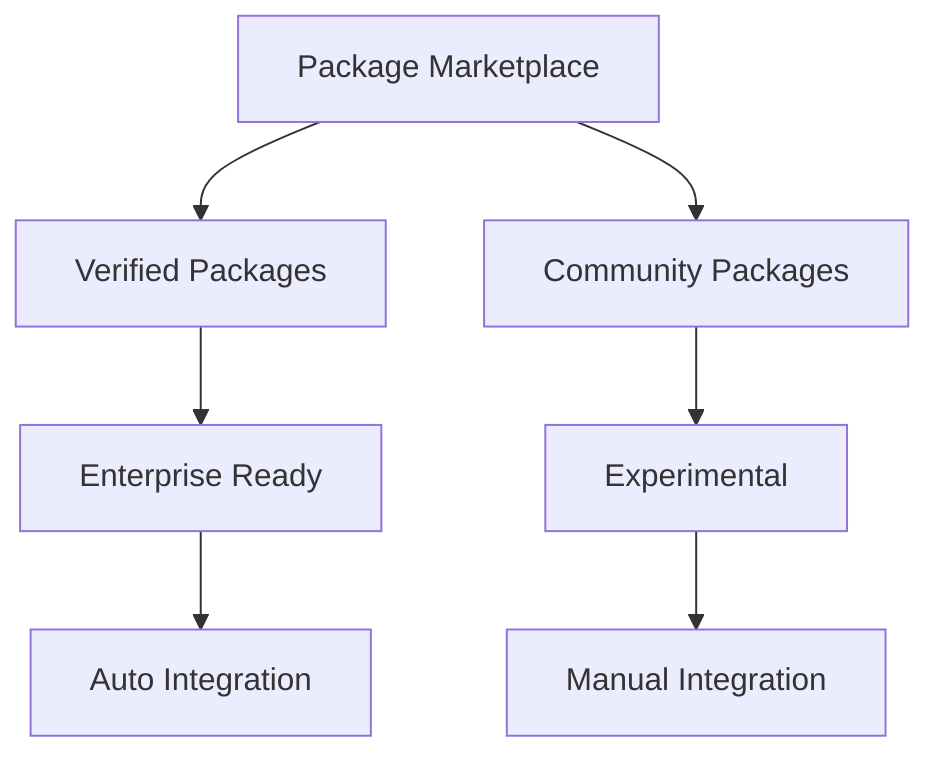
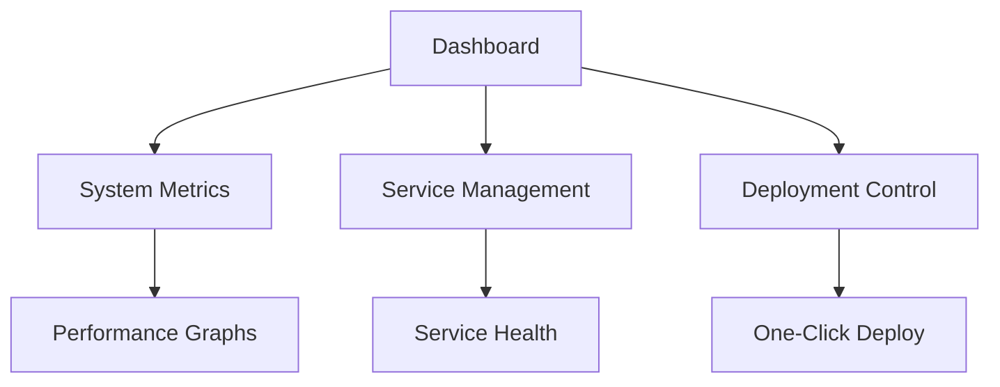

# Future Improvements and Roadmap

## 1. Enhanced Accessibility and Community Growth

### Community Development
- Create official Discord/Slack channels for real-time community support
- Implement bounty program for community contributions
- Regular hackathons and community events
- Featured case studies of successful implementations

### Learning Resources
- Interactive tutorials with live coding examples
- Video course series for different skill levels
- AI-powered documentation assistant
- Progressive learning path system

## 2. Framework Extensions

### Package Ecosystem


### Integration Features
- Django Admin/ORM compatibility layer
- FastAPI validation bridge
- Flask extension support
- Automated package compatibility checker

## 3. Development Tools

### Smart Development System
```python
class SmartDev:
    """
    AI-powered development assistance system
    Features:
    - Code analysis
    - Performance optimization suggestions
    - Best practices enforcement
    - Security vulnerability detection
    """
    pass
```

### IDE Integration
- VSCode extension
- PyCharm plugin
- Jupyter notebook integration
- Real-time optimization suggestions

## 4. Advanced Admin Interface

### ZephyrAdmin Dashboard


### Features
- Real-time performance monitoring
- Service health dashboard
- Configuration management
- User/Role management
- Database administration
- Cache control
- Queue monitoring
- Deployment management

### API Management
- API documentation
- Rate limiting configuration
- Authentication management
- Access control settings

## 5. Cloud Integration

### ZephyrCloud Platform
- One-click deployment
- Auto-scaling configuration
- Load balancing setup
- Managed database services
- Monitoring and alerts
- Cost optimization

## 6. Performance Optimization

### Auto-Optimization System
```python
class AutoOptimizer:
    """
    Automatic performance optimization system
    Features:
    - Resource usage analysis
    - Query optimization
    - Cache strategy suggestions
    - Load balancing recommendations
    """
    pass
```

### Advanced Caching
- Multi-level cache management
- Distributed cache coordination
- Cache warming strategies
- Intelligent cache invalidation

## 7. Deployment and Operations

### CI/CD Integration
- GitHub Actions templates
- GitLab CI templates
- Jenkins pipeline configurations
- Automated testing frameworks

### Container Support
- Docker optimization
- Kubernetes operators
- Service mesh integration
- Microservices templates

## Timeline and Priorities

### Phase 1 (Q2 2025)
- Launch admin interface
- Release basic IDE plugins
- Implement package marketplace

### Phase 2 (Q3 2025)
- Release cloud platform beta
- Launch community program
- Implement AI optimization system

### Phase 3 (Q4 2025)
- Full cloud platform release
- Advanced admin features
- Complete framework compatibility layer

## Contributing

We welcome contributions in the following areas:
1. Documentation improvements
2. Package development
3. Core feature enhancement
4. Testing and validation
5. Community support

See [CONTRIBUTING.md](../CONTRIBUTING.md) for guidelines.
