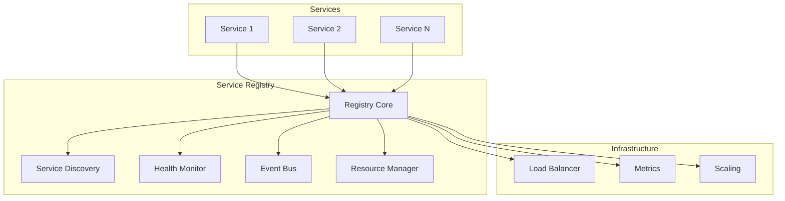
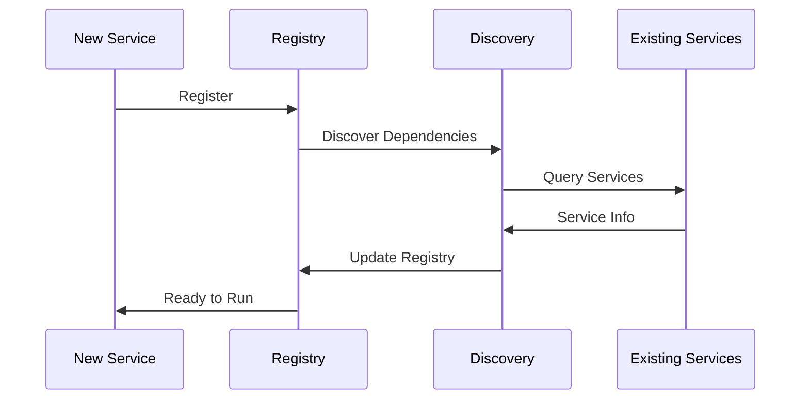
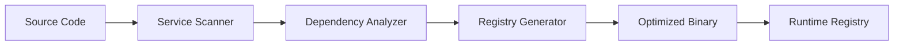
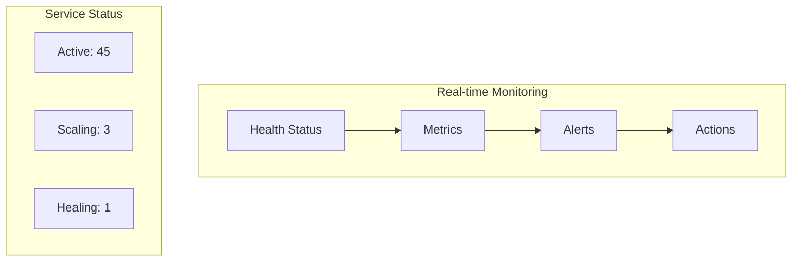

# Service Registry

## Architecture Overview



## Service Discovery Flow



## Build Time Optimization



## Monitoring Dashboard



## Registry Features
- Automatic service discovery
- Real-time health monitoring
- Dynamic scaling
- Event propagation
- Resource optimization

## Example Registry Usage

```python
# Framework handles everything automatically
@service
class PaymentService:
    async def process(self, payment):
        # Just business logic
        # Registry manages:
        # - Service discovery
        # - Health monitoring
        # - Scaling
        # - Resource management
        return await self.payments.process(payment)
```
